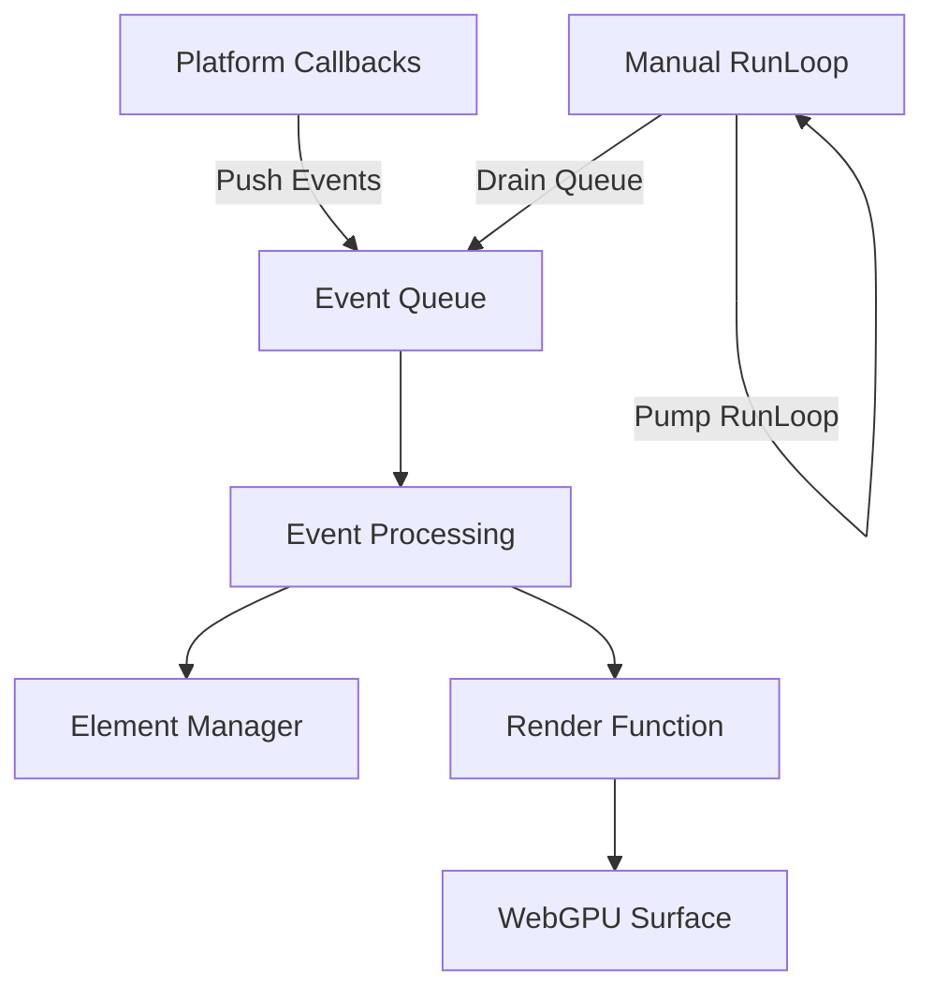
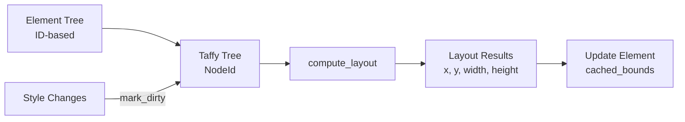
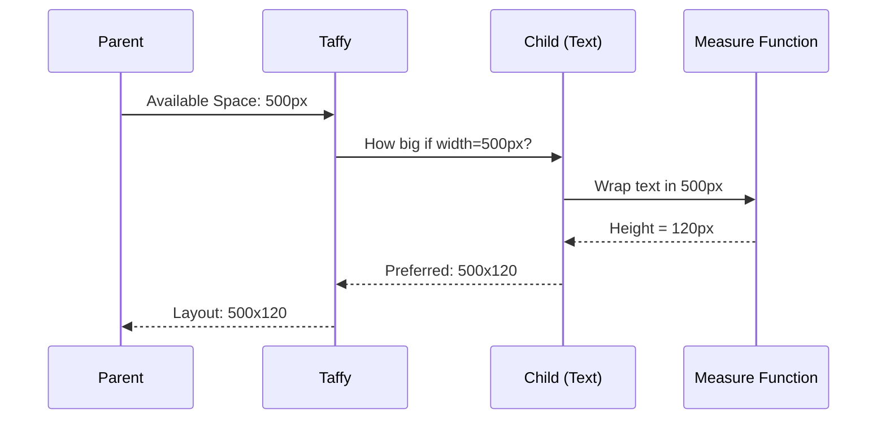
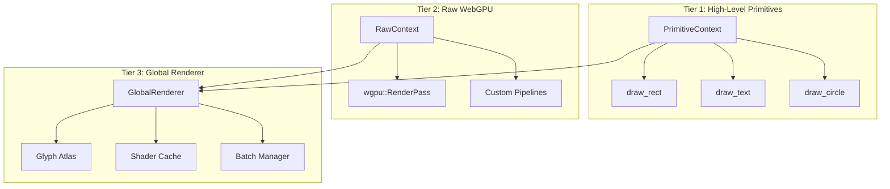
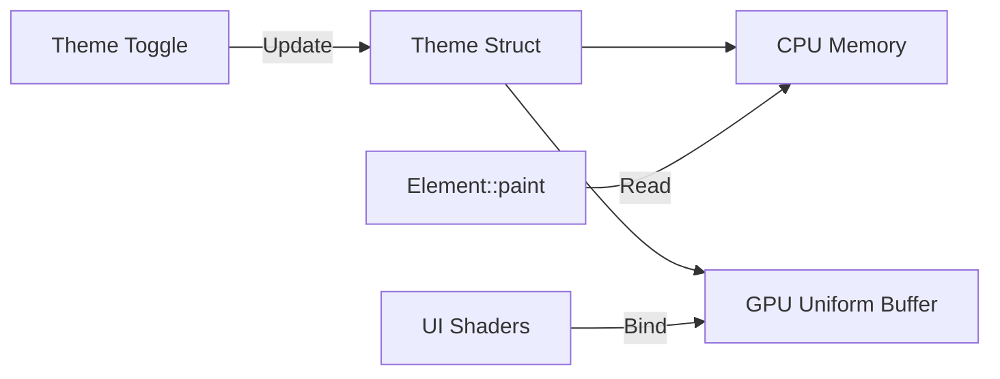
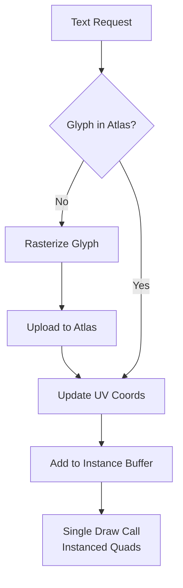

# AssortedWidgets - Technical Architecture

> **Last Updated:** 2025-12-20
> **Status:** Event Queue + Rendering Architecture Implemented, Layout System Planned

## Table of Contents

1. [Overview](#overview)
2. [Current Implementation](#current-implementation)
3. [Planned Architecture](#planned-architecture)
4. [Design Decisions](#design-decisions)
5. [Implementation Notes](#implementation-notes)

---

## Overview

AssortedWidgets is a cross-platform GUI framework for Rust with the following goals:

- **Low-level graphics access** for custom rendering (including 3D applications)
- **Retained-mode architecture** with immediate-mode rendering
- **Event queue-based** event loop (no RefCell/runtime borrow checking)
- **Flexible layout** using industry-standard Taffy (Flexbox/Grid)
- **Multi-tiered rendering** supporting both themed UI and raw WebGPU access

---

## Current Implementation

### 1. Event Loop Architecture

We implemented **Option 4: Event Queue + Manual RunLoop** for clean separation of concerns.



**Key Benefits:**
- ✅ No RefCell - compile-time borrow checking only
- ✅ Direct mutable access to state in event loop
- ✅ Platform-independent event queue model
- ✅ Full control over frame timing

**Code Flow:**
1. Platform callbacks push events to `Arc<Mutex<VecDeque<GuiEvent>>>`
2. Main loop polls NSApplication events and pumps runloop
3. Main loop drains event queue with direct mutable access
4. Render function called with `&WindowRenderer` and `&RenderContext`

### 2. Rendering Infrastructure

**WebGPU Integration:**
- `RenderContext`: Shared GPU state (instance, adapter, device, queue)
- `WindowRenderer`: Per-window surface configuration
- Platform window handles exposed via `raw-window-handle` traits

**Current Triangle Demo:**
- Creates render pipeline with WGSL shader
- Renders continuously at ~60fps
- Direct access to wgpu::RenderPass via callback

```rust
event_loop.set_render_fn(move |renderer, ctx| {
    // Direct access to WebGPU - no abstractions
    let surface_texture = renderer.get_current_texture()?;
    let mut encoder = ctx.device.create_command_encoder(...);
    // ... custom rendering
});
```

---

## Planned Architecture

### 1. Layout System (Taffy Integration)

We will use [Taffy](https://github.com/DioxusLabs/taffy) for layout calculations.



**Integration Strategy:**

1. **Syncing Trees:**
   - Each `Element` stores a `taffy::NodeId`
   - `ElementManager` creates/removes Taffy nodes alongside elements

2. **Layout Pass:**
   ```rust
   // Before rendering
   if dirty {
       taffy.compute_layout(root_id, window_size)?;
       for element in elements {
           let layout = taffy.layout(element.taffy_node)?;
           element.cached_bounds = layout.into();
       }
   }
   ```

3. **Measure Functions:**
   - Text elements provide measure functions
   - Taffy queries text renderer for intrinsic sizes
   - Handles bi-directional constraint solving

**Constraint Flow:**



### 2. Multi-Tiered Rendering System

The rendering system has **three tiers** to support both themed UI and custom graphics.



**Rendering Context API:**

```rust
pub struct PaintContext<'a> {
    /// High-level 2D primitives (batched, themed)
    pub primitives: &'a mut PrimitiveBatcher,

    /// Direct WebGPU access for custom rendering
    pub render_pass: &'a mut wgpu::RenderPass<'a>,

    /// GPU device for dynamic buffer creation
    pub device: &'a wgpu::Device,

    /// Global systems (text, atlases)
    pub renderer: &'a GlobalRenderer,
}

pub trait Element {
    fn paint(&self, ctx: &mut PaintContext, theme: &Theme);
}
```

**Example: Mixed Rendering**

```rust
impl Element for My3DWidget {
    fn paint(&self, ctx: &mut PaintContext, theme: &Theme) {
        // 1. Themed background (batched)
        ctx.primitives.draw_rect(self.bounds, theme.panel_bg);

        // 2. Custom 3D rendering (immediate)
        ctx.render_pass.set_pipeline(&self.custom_3d_pipeline);
        ctx.render_pass.set_bind_group(0, &self.scene_uniforms, &[]);
        ctx.render_pass.draw(0..self.mesh.vertex_count, 0..1);

        // 3. Themed text overlay (batched)
        ctx.primitives.draw_text(
            self.bounds.origin,
            &format!("FPS: {}", self.fps),
            theme.text_color
        );
    }
}
```

### 3. Theme System

Themes are **read-only config structs** passed to paint functions and uploaded to GPU as uniform buffers.



**Theme Structure:**

```rust
pub struct Theme {
    // Colors
    pub background: Color,
    pub foreground: Color,
    pub primary: Color,
    pub secondary: Color,
    pub accent: Color,
    pub text: Color,
    pub text_disabled: Color,

    // Typography
    pub font_family: String,
    pub font_size: f32,
    pub line_height: f32,

    // Spacing
    pub padding: f32,
    pub margin: f32,
    pub border_radius: f32,

    // Shadows
    pub shadow_color: Color,
    pub shadow_offset: Vector,
    pub shadow_blur: f32,
}

// GPU representation (std140 layout)
#[repr(C)]
pub struct ThemeUniforms {
    background: [f32; 4],
    foreground: [f32; 4],
    primary: [f32; 4],
    // ... (padded to match GPU alignment)
}
```

**Benefits:**
- Single uniform buffer update changes entire UI theme
- Elements read theme for semantic colors (not hardcoded)
- GPU shaders share theme data automatically

### 4. Text Rendering System

Text uses a **Glyph Atlas** (texture sheet) for efficient batched rendering.



**Text System Architecture:**

```rust
pub struct TextRenderer {
    /// Texture atlas containing all glyphs
    atlas: GlyphAtlas,

    /// Font database (cosmic-text or similar)
    font_system: FontSystem,

    /// Instance buffer for batched rendering
    instances: Vec<TextInstance>,

    /// Cached layout results
    shaped_cache: HashMap<TextKey, ShapedText>,
}

pub struct TextInstance {
    position: Vector,
    uv_rect: Rect,    // Position in atlas
    color: Color,
    size: f32,
}
```

**Rendering Flow:**
1. Layout pass: Taffy queries measure functions for text dimensions
2. Shaping: Text is shaped (glyph positions, advances, clusters)
3. Atlas check: New glyphs are rasterized and uploaded
4. Instance batching: All text becomes instanced quads
5. Single draw call: Entire UI text rendered in one call

---

## Design Decisions

### Why Event Queue over Callbacks?

**Rejected: RefCell/Rc Pattern (gpui's approach)**
```rust
// ❌ Requires runtime borrow checking
let renderer = Rc::new(RefCell::new(window_renderer));
let renderer_clone = renderer.clone();
callbacks.request_frame = Box::new(move || {
    let mut r = renderer_clone.borrow_mut(); // Can panic!
    render_frame(&mut r);
});
```

**Chosen: Event Queue**
```rust
// ✅ Compile-time borrow checking
callbacks.request_frame = Box::new(move || {
    event_queue.lock().unwrap().push_back(GuiEvent::RedrawRequested);
});

// Later in main loop - direct mutable access
loop {
    let event = self.event_queue.lock().unwrap().pop_front();
    // self.renderer is &mut - no RefCell needed!
}
```

### Why Taffy over Custom Layout?

- ✅ Industry standard (Bevy, Dioxus use it)
- ✅ Flexbox/Grid already implemented and tested
- ✅ Handles circular dependencies (50% parent, auto child)
- ✅ Performance optimized for deep nesting
- ❌ Writing constraint solver from scratch = months of work

### Why Multi-Tiered Rendering?

**Problem:** How to support both themed UI and custom 3D rendering?

**Rejected Alternatives:**
1. **Only high-level:** Can't do 3D (like gpui)
2. **Only low-level:** Every widget reimplements text/shadows

**Chosen Solution:** Multiple tiers with escape hatches
- Standard widgets use `PrimitiveContext` (themed, batched)
- Custom widgets access `RenderPass` directly
- Both can coexist via `PaintContext`

---

## Implementation Notes

### File Organization

```
src/
  lib.rs              # Public API exports
  main.rs             # Triangle demo
  types.rs            # Core types (WidgetId, Point, Rect, etc.)
  element.rs          # Element trait
  event.rs            # GuiEvent, OsEvent
  scene_graph.rs      # Tree structure
  connection.rs       # Signal/slot system
  element_manager.rs  # Flat hash table storage
  handle.rs           # Thread-safe GuiHandle
  event_loop.rs       # Event queue + manual runloop
  platform/
    mod.rs            # Platform abstraction
    mac/
      window.rs       # macOS window implementation
  render/
    mod.rs
    context.rs        # Shared GPU state
    window_renderer.rs # Per-window surface
  layout/            # TODO: Taffy integration
  paint/             # TODO: Multi-tiered context
  text/              # TODO: Glyph atlas
shaders/
  triangle.wgsl       # Demo shader
```

### Next Implementation Steps

1. **Taffy Integration** ([src/layout/](src/layout/))
   - Add taffy dependency
   - Create `LayoutManager` wrapping Taffy tree
   - Sync with `ElementManager` on add/remove
   - Implement measure functions for text

2. **Text Rendering** ([src/text/](src/text/))
   - Choose library: `cosmic-text` or `fontdue`
   - Implement glyph atlas with dynamic growth
   - Create text shaping cache
   - Build instanced quad renderer

3. **Paint Context** ([src/paint/](src/paint/))
   - Define `PaintContext` struct
   - Implement `PrimitiveBatcher` for high-level calls
   - Create batching system (collect → sort → draw)
   - Build shader pipeline for primitives

4. **Theme System** ([src/theme/](src/theme/))
   - Define `Theme` struct
   - Create GPU uniform buffer layout
   - Implement theme switching
   - Build default themes (Light/Dark)

### Performance Considerations

**Batching Strategy:**
- Primitives are batched by type (rects, circles, text)
- State changes minimized via sorting
- Instance buffers used where possible
- Single atlas bind for all text

**Layout Caching:**
- Only recompute on `mark_dirty`
- Incremental updates where possible
- Cache shaped text indefinitely

**Memory:**
- Atlas size starts at 512×512, grows to 4096×4096
- LRU eviction for unused glyphs
- Font fallback chain cached

---

## Appendix: Architecture Comparison

### AssortedWidgets vs gpui

| Feature | AssortedWidgets | gpui |
|---------|----------------|------|
| Event Loop | Event Queue + Manual Runloop | Callback-based + RefCell |
| Rendering | Multi-tiered (High + Raw) | DOM-based (High only) |
| Layout | Taffy (external) | Taffy (external) |
| Theme | Uniform buffer + read-only struct | Styled system |
| Custom Graphics | ✅ Direct WebGPU access | ❌ Not exposed |
| 3D Applications | ✅ Supported | ❌ Not designed for |
| Borrow Checking | Compile-time only | Runtime (RefCell) |

### When to Use What

**Use AssortedWidgets if you need:**
- Custom rendering (3D viewports, maps, games)
- Full WebGPU control
- No runtime borrow checking overhead
- Cross-platform manual event loop

**Use gpui if you need:**
- Pure 2D UI with strong theming
- Don't need custom graphics
- Prefer callback-based architecture
- Zed-like text editing features
