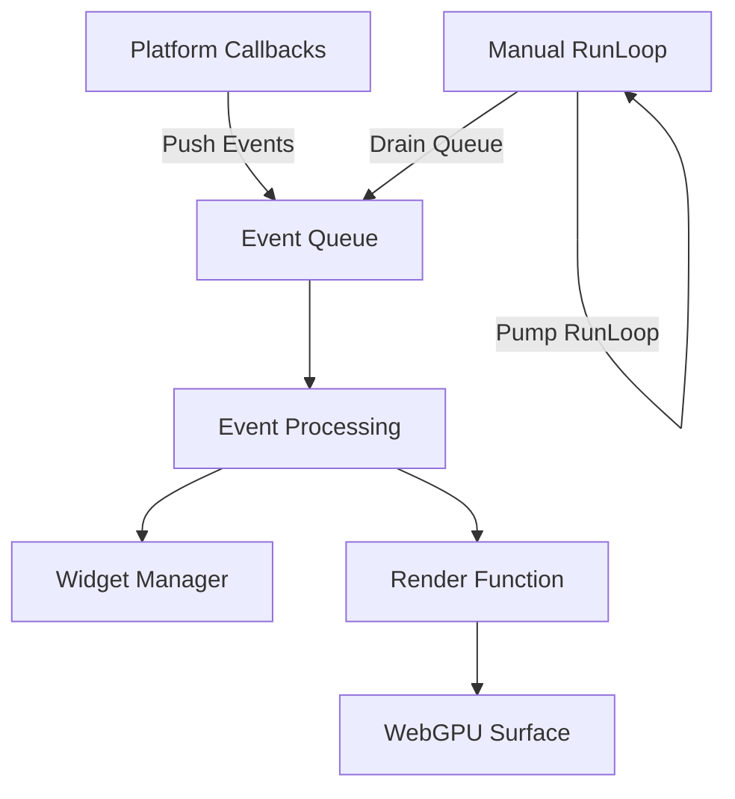
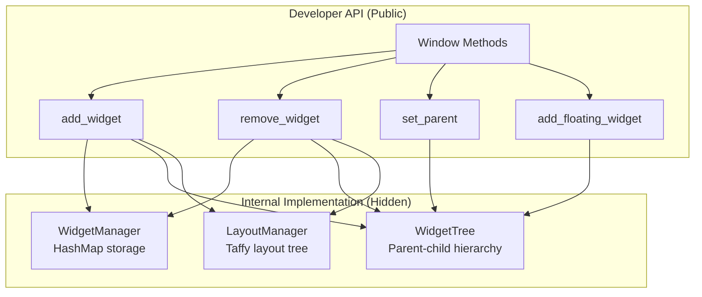
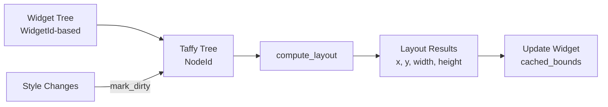
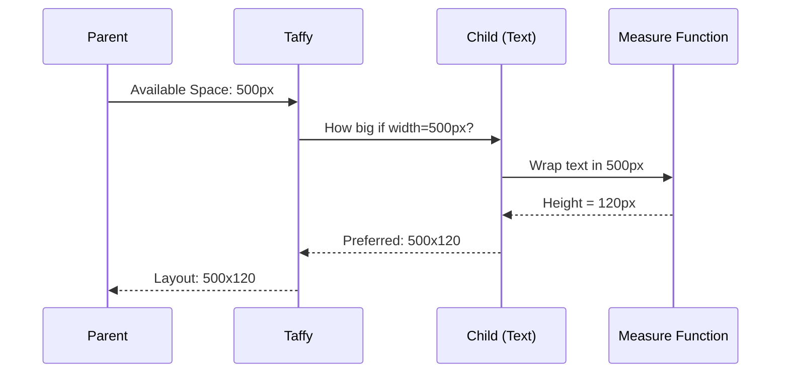
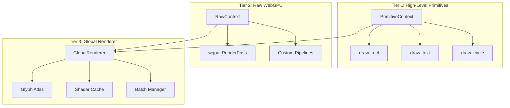
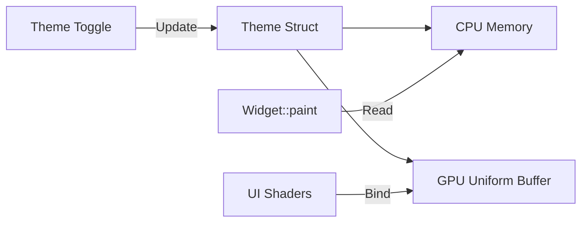
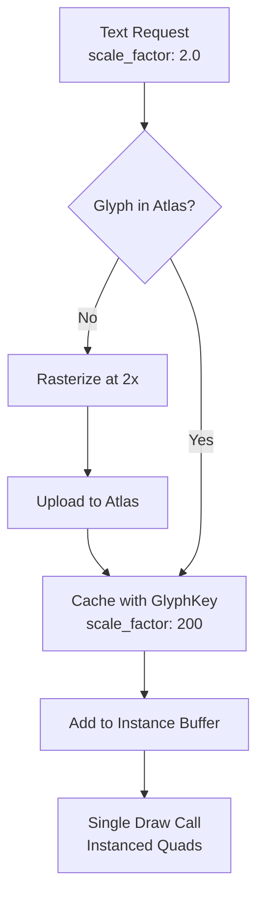

# AssortedWidgets - Technical Architecture

> **Last Updated:** 2025-12-24
> **Status:** Phase 4.0 - Architectural Refactor (Widget System Unification)

## Table of Contents

1. [Overview](#overview)
2. [Current Implementation](#current-implementation)
3. [Planned Architecture](#planned-architecture)
4. [Design Decisions](#design-decisions)
5. [Implementation Notes](#implementation-notes)

---

## Overview

AssortedWidgets is a cross-platform GUI framework for Rust with the following goals:

- **Low-level graphics access** for custom rendering (including 3D applications)
- **Retained-mode architecture** with immediate-mode rendering
- **Event queue-based** event loop (no RefCell/runtime borrow checking)
- **Flexible layout** using industry-standard Taffy (Flexbox/Grid)
- **Multi-tiered rendering** supporting both themed UI and raw WebGPU access

---

## Current Implementation

### 1. Event Loop Architecture

We implemented **Option 4: Event Queue + Manual RunLoop** for clean separation of concerns.



**Key Benefits:**
- ✅ No RefCell - compile-time borrow checking only
- ✅ Direct mutable access to state in event loop
- ✅ Platform-independent event queue model
- ✅ Full control over frame timing

**Code Flow:**
1. Platform callbacks push events to `Arc<Mutex<VecDeque<GuiEvent>>>`
2. Main loop polls NSApplication events and pumps runloop
3. Main loop drains event queue with direct mutable access
4. Render function called with `&WindowRenderer` and `&RenderContext`

### 2. Rendering Infrastructure

**WebGPU Integration:**
- `RenderContext`: Shared GPU state (instance, adapter, device, queue)
- `WindowRenderer`: Per-window surface configuration
- Platform window handles exposed via `raw-window-handle` traits

**Current Application API:**

**Ergonomic High-Level API (Recommended):**
- `Application::launch(callback)` - Entry point that hides async details
- `app.spawn_window(title, width, height, setup)` - Creates window with direct access
- `window.set_main_widget(widget)` - Convenience for single-widget windows

```rust
// ✨ Ergonomic API (recommended for most use cases)
Application::launch(|app| {
    app.spawn_window("My App", 800.0, 600.0, |window| {
        window.set_main_widget(MyWidget::new());
    });
});
```

**Low-Level API (Advanced use cases):**
- `Application::new()` - Direct async initialization
- `app.create_window(options)` - Manual window creation with full control
- `window.add_root(widget, style)` - Low-level widget management

```rust
// Low-level API (when you need fine control)
let mut app = Application::new().await?;
let window_id = app.create_window(WindowOptions { ... })?;

let window = app.window_mut(window_id)?;
window.add_root(Box::new(my_widget), style)?;

app.run();
```

### 3. Widget System Architecture (✅ Phase 4.0 Complete)

The widget system uses a **three-system architecture** that separates concerns while providing a unified developer API.



**Three Internal Systems:**

1. **WidgetManager**: Flat HashMap storage
   - Maps `WidgetId` → `Box<dyn Widget>`
   - Fast O(1) lookup by ID
   - No hierarchy information
   - Single source of truth for widget data

2. **WidgetTree**: Parent-child hierarchy
   - Maps `WidgetId` → `Vec<WidgetId>` (children)
   - Supports both normal and floating widgets
   - Used for event propagation and traversal
   - Independent of layout system

3. **LayoutManager**: Taffy integration
   - Maps `WidgetId` → `taffy::NodeId`
   - Handles layout computation (Flexbox/Grid)
   - Separate from hierarchy (floating widgets skip layout)
   - Provides measure functions for text

**Key Design Decision: WidgetId vs NodeId**

We keep `WidgetId` and `taffy::NodeId` separate for important architectural reasons:

```rust
// ✅ Current design: Separate IDs
pub struct WidgetManager {
    widgets: HashMap<WidgetId, Box<dyn Widget>>, // Our ID space
}

pub struct LayoutManager {
    taffy: Taffy,
    widget_to_node: HashMap<WidgetId, NodeId>,   // Mapping layer
    node_to_widget: HashMap<NodeId, WidgetId>,
}
```

**Why separate IDs?**
- **Floating widgets exist without layout**: Tooltips, context menus don't participate in layout
- **Conditional layout**: Widgets can be hidden (removed from Taffy) without destroying them
- **Different lifecycles**: Widget creation/destruction is independent of layout tree updates
- **Taffy is an implementation detail**: Could swap layout engines without changing WidgetId API
- **Clear separation of concerns**: Widget identity ≠ Layout node identity

**Developer API (Window Methods)**

Developers NEVER access `WidgetManager`, `WidgetTree`, or `LayoutManager` directly. All operations go through `Window` methods:

```rust
// Public API - clean and simple
impl Window {
    // Qt-style implicit root container (recommended API)
    pub fn set_root_layout(&mut self, style: Style) {
        // Configure the implicit root container's layout
    }

    pub fn add_to_root(&mut self, widget: Box<dyn Widget>, style: Style) -> Result<WidgetId, String> {
        // Add widget as child of implicit root container
        // Internally coordinates all three systems:
        // 1. Add to WidgetManager
        // 2. Add to WidgetTree hierarchy
        // 3. Create Taffy node in LayoutManager
    }

    pub fn add_child(&mut self, widget: Box<dyn Widget>, style: Style, parent_id: WidgetId) -> Result<WidgetId, String> {
        // Add widget as child of specified parent
    }

    pub fn remove_widget(&mut self, id: WidgetId) {
        // Removes from all three systems atomically
    }

    pub fn add_floating_widget(&mut self, widget: Box<dyn Widget>) -> WidgetId {
        // Adds to WidgetManager and WidgetTree, skips LayoutManager
    }

    // Low-level API (still available for advanced use)
    pub fn add_root(&mut self, widget: Box<dyn Widget>, style: Style) -> Result<WidgetId, String> {
        // Creates a new root node (bypasses implicit root container)
    }
}
```

**Benefits of This Architecture:**

- ✅ **Clean API**: Developers work with simple Window methods
- ✅ **Hidden complexity**: Internal systems are implementation details
- ✅ **Atomic operations**: Window methods keep all three systems in sync
- ✅ **Flexibility**: Can optimize/refactor internals without breaking API
- ✅ **Type safety**: WidgetId is opaque, prevents mixing with NodeId
- ✅ **Floating widgets**: Natural support for non-layout widgets
- ✅ **Performance**: HashMap lookup is O(1), tree traversal is O(children)

**Data Flow Example:**

```rust
// Developer code (Qt-style implicit root)
window.set_root_layout(taffy::Style {
    display: Display::Flex,
    flex_direction: FlexDirection::Column,
    ..Default::default()
});

let button_id = window.add_to_root(Box::new(Button::text("Click me")), button_style)?;

// What happens internally:
// 1. WidgetManager: widgets.insert(button_id, button_widget)
// 2. WidgetTree: parents.insert(button_id, root_container_id)
//                children[root_container_id].push(button_id)
// 3. LayoutManager: node_id = taffy.new_leaf(button_style)
//                   widget_to_node.insert(button_id, node_id)
//                   taffy.add_child(root_node, node_id)
```

---

## Planned Architecture

### 1. Layout System (Taffy Integration)

We use [Taffy](https://github.com/DioxusLabs/taffy) for layout calculations, integrated via `LayoutManager`.



**Integration Strategy:**

1. **Syncing Trees:**
   - `LayoutManager` maintains bidirectional `WidgetId ↔ NodeId` mapping
   - `Window::add_widget()` creates Taffy nodes alongside widgets
   - Floating widgets skip Taffy entirely (no NodeId mapping)

2. **Layout Pass:**
   ```rust
   // Before rendering (inside Window)
   if dirty {
       layout_manager.compute_layout(root_widget_id, window_size)?;
       for widget_id in widget_tree.traverse() {
           if let Some(layout) = layout_manager.get_layout(widget_id) {
               widget_manager.get_mut(widget_id).set_bounds(layout);
           }
       }
   }
   ```

3. **Measure Functions:**
   - Text widgets provide measure functions
   - Taffy queries text renderer for intrinsic sizes
   - Handles bi-directional constraint solving

**Constraint Flow:**



### 2. Multi-Tiered Rendering System

The rendering system has **three tiers** to support both themed UI and custom graphics.



**Rendering Context API:**

```rust
pub struct PaintContext {
    // Batched rendering commands
    // Internal state hidden from users
}

pub trait Widget {
    fn paint(&self, ctx: &mut PaintContext);
    // Other required methods...
}
```

**Example: Widget Rendering**

```rust
impl Widget for MyCustomWidget {
    fn paint(&self, ctx: &mut PaintContext) {
        // Styled rectangles with rounded corners, borders, shadows
        ctx.draw_styled_rect(
            self.bounds,
            ShapeStyle::solid(Color::rgb(0.2, 0.2, 0.25))
                .with_corner_radius(8.0)
                .with_border(2.0, Color::rgb(0.4, 0.4, 0.5))
                .with_shadow(4.0, Color::rgba(0.0, 0.0, 0.0, 0.5)),
        );

        // Text rendering
        ctx.draw_text(
            Point::new(20.0, 20.0),
            "Hello",
            Color::WHITE,
            16.0,
        );

        // Vector graphics
        let mut path = Path::new();
        path.move_to(Point::new(50.0, 50.0));
        path.line_to(Point::new(100.0, 100.0));
        ctx.stroke_path(path, Stroke::new(Color::RED, 2.0));
    }
}
```

### 3. Theme System

Themes are **read-only config structs** passed to paint functions and uploaded to GPU as uniform buffers.



**Theme Structure:**

```rust
pub struct Theme {
    // Colors
    pub background: Color,
    pub foreground: Color,
    pub primary: Color,
    pub secondary: Color,
    pub accent: Color,
    pub text: Color,
    pub text_disabled: Color,

    // Typography
    pub font_family: String,
    pub font_size: f32,
    pub line_height: f32,

    // Spacing
    pub padding: f32,
    pub margin: f32,
    pub border_radius: f32,

    // Shadows
    pub shadow_color: Color,
    pub shadow_offset: Vector,
    pub shadow_blur: f32,
}

// GPU representation (std140 layout)
#[repr(C)]
pub struct ThemeUniforms {
    background: [f32; 4],
    foreground: [f32; 4],
    primary: [f32; 4],
    // ... (padded to match GPU alignment)
}
```

**Benefits:**
- Single uniform buffer update changes entire UI theme
- Widgets read theme for semantic colors (not hardcoded)
- GPU shaders share theme data automatically

### 4. Text Rendering System (✅ Phase 3.2 Complete + Refactored)

Text uses a **Shared Glyph Atlas** (texture sheet) with multi-DPI support for efficient batched rendering.



**Shared Resource Architecture:**

```rust
// RenderContext: SINGLE shared resource for all windows (Arc)
pub struct RenderContext {
    // GPU Resources (Low-Level)
    pub instance: wgpu::Instance,
    pub adapter: wgpu::Adapter,
    pub device: Arc<wgpu::Device>,
    pub queue: Arc<wgpu::Queue>,

    // Shared Rendering Pipelines (Stateless, Created Once)
    pub rect_pipeline: RectPipeline,
    pub text_pipeline: TextPipeline,
    pub surface_format: wgpu::TextureFormat,

    // Rendering Resources (High-Level, Arc<Mutex<>>)
    pub glyph_atlas: Arc<Mutex<GlyphAtlas>>,
    pub font_system: Arc<Mutex<FontSystemWrapper>>,
    pub text_engine: Arc<Mutex<TextEngine>>,
}

// Per-window (merged from WindowRenderState into WindowRenderer)
pub struct WindowRenderer {
    // Surface Management
    pub surface: wgpu::Surface<'static>,
    pub config: wgpu::SurfaceConfiguration,
    pub format: wgpu::TextureFormat,

    // Per-Window Uniforms (screen size varies per window)
    rect_uniform_buffer: wgpu::Buffer,
    rect_uniform_bind_group: wgpu::BindGroup,
    text_uniform_buffer: wgpu::Buffer,
    text_uniform_bind_group: wgpu::BindGroup,

    // Dynamic Instance Buffers (reused each frame)
    rect_instance_buffer: Option<wgpu::Buffer>,
    text_instance_buffer: Option<wgpu::Buffer>,

    // Window State
    pub scale_factor: f32,
    pub render_context: Arc<RenderContext>, // Shared pipelines + atlas + fonts
}

// GlyphKey with multi-DPI support
pub struct GlyphKey {
    font_id: usize,
    size_bits: u32,
    character: char,
    subpixel_offset: u8,
    scale_factor: u8,  // ✅ 100 = 1.0x, 200 = 2.0x
}
```

**Benefits of Consolidated Architecture:**
- ✅ **Simpler:** Single `RenderContext` with all shared resources (pipelines + GPU + atlas + fonts)
- ✅ **Pipeline Sharing:** Pipelines created once, reused by all windows (5 windows = 1× pipeline creation, not 5×)
- ✅ **Memory:** Single atlas (~16MB) vs per-window (~80MB for 5 windows)
- ✅ **DPI Transitions:** Window moves 1.0x → 2.0x? Both cached, no invalidation!
- ✅ **Font System:** Initialized once, shared across windows (~10MB saved)
- ✅ **Text Shaping:** Cache reused across windows
- ✅ **Cleaner:** WindowRenderer consolidates all per-window state (surface + uniforms + instance buffers)

**Rendering Flow:**
1. Layout pass: Taffy queries measure functions for text dimensions
2. Shaping: Text is shaped (glyph positions, advances, clusters) via `TextEngine`
3. Atlas check: Lock `shared.glyph_atlas`, check with GlyphKey (includes scale_factor)
4. Rasterize: If not cached, rasterize at current DPI and upload
5. Instance batching: All text becomes instanced quads
6. Single draw call: Entire UI text rendered in one call with atlas texture binding

---

## Design Decisions

### Why Event Queue over Callbacks?

**Rejected: RefCell/Rc Pattern**
```rust
// ❌ Requires runtime borrow checking
let state = Rc::new(RefCell::new(app_state));
callbacks.on_event = Box::new(move || {
    let mut s = state.borrow_mut(); // Can panic!
    handle_event(&mut s);
});
```

**Chosen: Event Queue with Direct Access**
```rust
// ✅ Compile-time borrow checking, direct mutable access
loop {
    platform.poll_events();
    for event in event_queue.drain() {
        self.handle_event(event); // Direct &mut self access
    }
    self.render(); // No RefCell needed
}
```

### Why Taffy over Custom Layout?

- ✅ Industry standard (Bevy, Dioxus use it)
- ✅ Flexbox/Grid already implemented and tested
- ✅ Handles circular dependencies (50% parent, auto child)
- ✅ Performance optimized for deep nesting
- ❌ Writing constraint solver from scratch = months of work

### Why Multi-Tiered Rendering?

**Problem:** How to support both themed UI and custom 3D rendering?

**Rejected Alternatives:**
1. **Only high-level:** Can't do 3D (like gpui)
2. **Only low-level:** Every widget reimplements text/shadows

**Chosen Solution:** Multiple tiers with escape hatches
- Standard widgets use `PrimitiveContext` (themed, batched)
- Custom widgets access `RenderPass` directly
- Both can coexist via `PaintContext`

### Why WindowId (u64) instead of raw-window-handle?

**Problem:** How to identify windows in a HashMap?

**Rejected: Use raw-window-handle directly**
```rust
// ❌ Platform-specific types (NSWindow*, HWND, xcb_window_t)
// ❌ Not uniformly hashable across platforms
// ❌ Couples our logic to platform implementation
```

**Chosen: Simple u64 counter**
```rust
// ✅ Cross-platform uniformity
pub struct WindowId(u64);

// ✅ Trivially hashable and comparable
windows: HashMap<WindowId, Window>

// ✅ Stable identity (doesn't change during window lifetime)
// ✅ Decoupled from platform specifics
```

**Platform handles still accessible:**
- Stored in `PlatformWindowImpl`
- Accessed via `raw-window-handle` trait when needed (e.g., surface creation)
- Separation of concerns: logical ID vs platform handle

### Why Separate WidgetId and NodeId?

**Problem:** Should widgets use Taffy's `NodeId` directly as their identity?

**Rejected: Use NodeId directly**
```rust
// ❌ Couples widget identity to layout system
pub struct WidgetManager {
    widgets: HashMap<taffy::NodeId, Box<dyn Widget>>,
}

// ❌ Floating widgets (tooltips, menus) must still create dummy Taffy nodes
// ❌ Can't hide/show widgets without destroying layout nodes
// ❌ Tight coupling makes swapping layout engines impossible
```

**Chosen: Separate ID spaces with mapping layer**
```rust
// ✅ Widget identity independent of layout
pub struct WidgetManager {
    widgets: HashMap<WidgetId, Box<dyn Widget>>,
}

pub struct LayoutManager {
    taffy: Taffy,
    widget_to_node: HashMap<WidgetId, NodeId>,
    node_to_widget: HashMap<NodeId, WidgetId>,
}
```

**Benefits:**
- ✅ **Floating widgets**: Tooltips, context menus, overlays exist without layout nodes
- ✅ **Conditional layout**: Hide widgets by removing from Taffy, keeping widget alive
- ✅ **Clear separation**: Widget lifecycle ≠ Layout lifecycle
- ✅ **Swappable engines**: Could replace Taffy without changing WidgetId API
- ✅ **Type safety**: Compiler prevents mixing WidgetId with NodeId

### Why Three Systems (WidgetManager, WidgetTree, LayoutManager)?

**Problem:** How to organize widget storage, hierarchy, and layout?

**Rejected: Single monolithic system**
```rust
// ❌ Mixing concerns in one structure
pub struct WidgetSystem {
    widgets: HashMap<WidgetId, WidgetData>,  // storage
    parents: HashMap<WidgetId, WidgetId>,    // hierarchy
    children: HashMap<WidgetId, Vec<WidgetId>>, // hierarchy
    taffy: Taffy,                            // layout
    widget_to_node: HashMap<WidgetId, NodeId>, // layout
}
```

**Chosen: Three separate systems coordinated by Window**
```rust
// ✅ Each system has single responsibility
pub struct WidgetManager { /* storage only */ }
pub struct WidgetTree { /* hierarchy only */ }
pub struct LayoutManager { /* layout only */ }

pub struct Window {
    widget_manager: WidgetManager,    // internal
    widget_tree: WidgetTree,          // internal
    layout_manager: LayoutManager,    // internal
}
```

**Benefits:**
- ✅ **Single responsibility**: Each system does one thing well
- ✅ **Independent evolution**: Can optimize/refactor each system separately
- ✅ **Flexible composition**: Floating widgets use WidgetManager + WidgetTree, skip LayoutManager
- ✅ **Clean API**: Window methods hide complexity, provide atomic operations
- ✅ **Testability**: Can test each system in isolation
- ✅ **Performance**: Each system optimized for its access patterns (HashMap vs tree vs Taffy)

---

## Implementation Notes

### File Organization

```
src/
  lib.rs              # Public API exports
  types.rs            # Core types (WidgetId, Point, Rect, etc.)
  widget.rs           # Widget trait
  event.rs            # GuiEvent, OsEvent
  widget_tree.rs      # Parent-child hierarchy
  connection.rs       # Signal/slot system
  widget_manager.rs   # Flat hash table storage
  layout_manager.rs   # Taffy integration wrapper
  handle.rs           # Thread-safe GuiHandle
  application.rs      # Application and event loop
  window.rs           # Window API (hides internal systems)
  platform/
    mod.rs            # Platform abstraction
    mac/
      window.rs       # macOS window implementation
  render/
    mod.rs
    context.rs        # Shared GPU state
    window_renderer.rs # Per-window surface
    rect_pipeline.rs  # Rectangle rendering
    rect_sdf_pipeline.rs # SDF rectangles with shadows
    shadow_sdf_pipeline.rs # Analytical shadow rendering
    image_pipeline.rs # Image and icon rendering
  layout/
    mod.rs            # Layout styles (Taffy wrapper)
  paint/
    mod.rs
    context.rs        # PaintContext implementation
    batcher.rs        # Batched rendering
    types.rs          # Color, Stroke, Path, etc.
  text/
    mod.rs
    atlas.rs          # Glyph atlas
    engine.rs         # Text shaping and layout
    pipeline.rs       # Text rendering pipeline
  icon/
    mod.rs
    atlas.rs          # Icon texture atlas
  image/
    mod.rs
    atlas.rs          # Image texture atlas
shaders/
  rect.wgsl           # Rectangle shader
  rect_sdf.wgsl       # SDF rectangle shader
  shadow_sdf.wgsl     # Analytical shadow shader
  text.wgsl           # Text rendering shader
  image.wgsl          # Image rendering shader
```

### Implementation Status

**✅ Phase 1-4 Complete:**
1. **Widget System** - Three-system architecture (WidgetManager, WidgetTree, LayoutManager)
2. **Text Rendering** - Shared glyph atlas with multi-DPI support
3. **Paint Context** - Batched rendering with primitives
4. **Vector Graphics** - Lines, paths, bezier curves
5. **SDF Rendering** - Rounded rectangles with borders and analytical shadows
6. **Image/Icon Rendering** - Texture atlas-based rendering

**🚧 Next Steps:**
1. **Theme System** ([src/theme/](src/theme/))
   - Define `Theme` struct with semantic colors
   - Create GPU uniform buffer layout
   - Implement theme switching
   - Build default themes (Light/Dark)

2. **Standard Widgets** ([src/widgets/](src/widgets/))
   - Button with hover/press states
   - Label with text styling
   - TextInput with cursor and selection
   - Checkbox, Radio, Slider
   - ScrollView with scrollbars

3. **Animation Helpers**
   - Spring animations with damping
   - Easing functions (cubic, elastic, etc.)
   - Transition system for property changes

### Performance Considerations

**Batching Strategy:**
- Primitives are batched by type (rects, circles, text)
- State changes minimized via sorting
- Instance buffers used where possible
- Single atlas bind for all text

**Layout Caching:**
- Only recompute on `mark_dirty`
- Incremental updates where possible
- Cache shaped text indefinitely

**Memory:**
- Atlas size starts at 512×512, grows to 4096×4096
- LRU eviction for unused glyphs
- Font fallback chain cached

---

## Appendix: Architecture Comparison

### AssortedWidgets vs gpui

| Feature | AssortedWidgets | gpui |
|---------|----------------|------|
| Event Loop | Event Queue + Manual Runloop | Callback-based + RefCell |
| Rendering | Multi-tiered (High + Raw) | DOM-based (High only) |
| Layout | Taffy (external) | Taffy (external) |
| Theme | Uniform buffer + read-only struct | Styled system |
| Custom Graphics | ✅ Direct WebGPU access | ❌ Not exposed |
| 3D Applications | ✅ Supported | ❌ Not designed for |
| Borrow Checking | Compile-time only | Runtime (RefCell) |

### When to Use What

**Use AssortedWidgets if you need:**
- Custom rendering (3D viewports, maps, games)
- Full WebGPU control
- No runtime borrow checking overhead
- Cross-platform manual event loop

**Use gpui if you need:**
- Pure 2D UI with strong theming
- Don't need custom graphics
- Prefer callback-based architecture
- Zed-like text editing features
