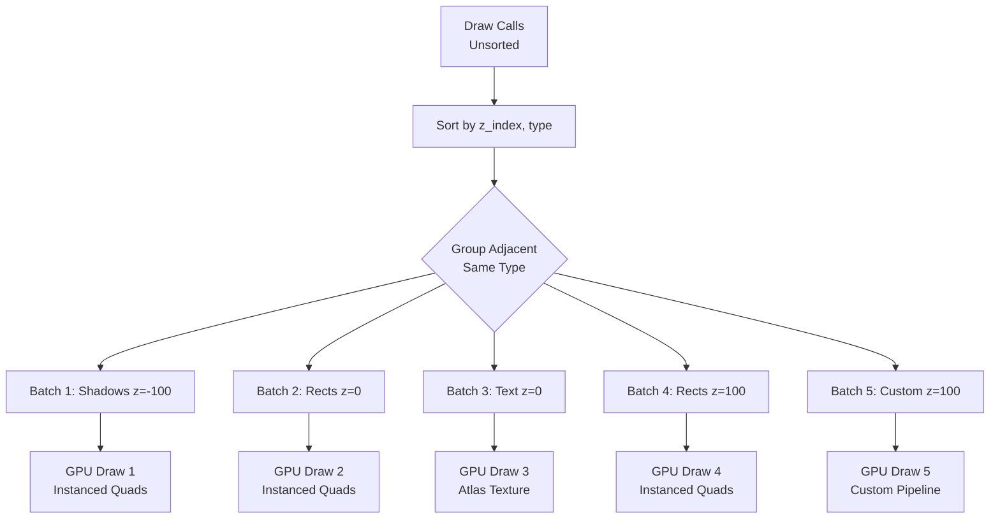

# AssortedWidgets 2D Drawing API

> **Created:** 2025-12-24
> **Status:** Design Phase

## Table of Contents

1. [Overview](#overview)
2. [Minimal API Design](#minimal-api-design)
3. [GPU Implementation Strategy](#gpu-implementation-strategy)
4. [Implementation Plan](#implementation-plan)
5. [Performance Considerations](#performance-considerations)

---

## Overview

### Goals

AssortedWidgets needs a minimal, GPU-optimized 2D drawing API for modern, "flat-but-polished" UIs. The API should:

- ✅ **Batch-friendly:** Group similar draw calls for efficient GPU rendering
- ✅ **Declarative:** Command-based (not stateful like HTML5 Canvas)
- ✅ **SDF-powered:** Use Signed Distance Fields for smooth shapes and shadows
- ✅ **Minimal:** Cover 90% of UI needs with <10 primitives

### What We're Building Toward

Modern UIs (macOS, iOS, Material Design) primarily use:
- **Rounded rectangles** with shadows (buttons, panels, cards)
- **Text** with sub-pixel rendering (already implemented ✅)
- **Gradients** for depth and polish
- **Icons** (vector paths or pre-rasterized)
- **Clipping** for scrollable regions

---

## Minimal API Design

### Core Primitives

```rust
pub struct PaintContext<'a> {
    /// High-level 2D primitives (batched, themed)
    pub primitives: &'a mut PrimitiveBatcher,

    /// GPU device for dynamic buffer creation (for custom rendering)
    pub device: &'a wgpu::Device,

    /// Global systems (text, atlases)
    pub renderer: &'a GlobalRenderer,
}

// NOTE: Direct RenderPass access removed to preserve batching.
// Use DrawCommand::Custom for custom rendering instead.

impl PrimitiveBatcher {
    // === Shape Drawing ===

    /// Draw a rectangle with rounded corners, fill, border, and shadow
    pub fn draw_rect(&mut self, rect: Rect, style: ShapeStyle) {
        self.draw_rect_z(rect, style, 0);
    }

    /// Draw a rectangle with explicit z-index (higher = rendered on top)
    pub fn draw_rect_z(&mut self, rect: Rect, style: ShapeStyle, z_index: i32) {
        self.commands.push(DrawCommand::Rect { rect, style, z_index });
    }

    /// Draw a circle or ellipse
    pub fn draw_circle(&mut self, center: Point, radius: f32, style: ShapeStyle) {
        self.draw_circle_z(center, radius, style, 0);
    }

    /// Draw a circle with explicit z-index
    pub fn draw_circle_z(&mut self, center: Point, radius: f32, style: ShapeStyle, z_index: i32) {
        self.commands.push(DrawCommand::Circle { center, radius, style, z_index });
    }

    /// Draw a line with stroke style
    pub fn draw_line(&mut self, p1: Point, p2: Point, stroke: Stroke) {
        self.draw_line_z(p1, p2, stroke, 0);
    }

    /// Draw a line with explicit z-index
    pub fn draw_line_z(&mut self, p1: Point, p2: Point, stroke: Stroke, z_index: i32) {
        self.commands.push(DrawCommand::Line { p1, p2, stroke, z_index });
    }

    // === Advanced Shapes ===

    /// Draw a custom path (for icons, custom shapes)
    pub fn draw_path(&mut self, path: &Path, style: ShapeStyle) {
        self.commands.push(DrawCommand::Path {
            path: path.clone(),
            style
        });
    }

    // === Images ===

    /// Draw a texture/image (for icons, backgrounds)
    pub fn draw_image(&mut self, texture: TextureId, rect: Rect, tint: Option<Color>) {
        self.commands.push(DrawCommand::Image { texture, rect, tint });
    }

    // === Clipping ===

    /// Push a rectangular clipping region (axis-aligned, no rounding)
    pub fn push_clip(&mut self, rect: Rect) {
        self.push_clip_rounded(rect, CornerRadius::uniform(0.0));
    }

    /// Push a rounded-rect clipping region (for scrollable areas with rounded corners)
    pub fn push_clip_rounded(&mut self, rect: Rect, corner_radius: CornerRadius) {
        self.commands.push(DrawCommand::PushClip { rect, corner_radius });
    }

    /// Pop the most recent clipping region
    pub fn pop_clip(&mut self) {
        self.commands.push(DrawCommand::PopClip);
    }

    // === Custom Rendering ===

    /// Insert custom WebGPU rendering (breaks batching, use sparingly)
    /// The callback receives a RenderPass for direct GPU commands
    pub fn draw_custom<F>(&mut self, callback: F, z_index: i32)
    where
        F: FnOnce(&mut wgpu::RenderPass) + 'static,
    {
        self.commands.push(DrawCommand::Custom {
            callback: Box::new(callback),
            z_index,
        });
    }

    // === Text (already implemented) ===

    /// Draw text (uses existing TextEngine + GlyphAtlas)
    pub fn draw_text(&mut self, position: Point, text: &str, style: TextStyle) {
        // ... existing implementation
    }
}
```

### Style Structs

```rust
/// Complete styling for a shape
pub struct ShapeStyle {
    /// Fill brush (solid color or gradient)
    pub fill: Brush,

    /// Corner radius (0.0 = sharp corners)
    pub corner_radius: CornerRadius,

    /// Optional border
    pub border: Option<Border>,

    /// Optional shadow
    pub shadow: Option<Shadow>,
}

/// Fill options (solid or gradient)
pub enum Brush {
    Solid(Color),
    LinearGradient(LinearGradient),
    RadialGradient(RadialGradient),
}

/// Per-corner radius control
pub struct CornerRadius {
    pub top_left: f32,
    pub top_right: f32,
    pub bottom_right: f32,
    pub bottom_left: f32,
}

impl CornerRadius {
    pub fn uniform(radius: f32) -> Self {
        Self {
            top_left: radius,
            top_right: radius,
            bottom_right: radius,
            bottom_left: radius,
        }
    }
}

/// Border styling
pub struct Border {
    pub color: Color,
    pub width: f32,
    pub style: BorderStyle, // Solid, Dashed, Dotted
}

pub enum BorderStyle {
    Solid,
    Dashed { dash_length: f32, gap_length: f32 },
    Dotted { spacing: f32 },
}

/// Box shadow (soft, analytical)
pub struct Shadow {
    pub color: Color,
    pub offset: Vector,
    pub blur_radius: f32,
    pub spread_radius: f32, // Expands/contracts shadow before blur
    pub inset: bool,        // True = inner shadow, False = drop shadow
}

/// Linear gradient (2+ color stops)
pub struct LinearGradient {
    pub start: Point,
    pub end: Point,
    pub stops: Vec<ColorStop>,
}

/// Radial gradient
pub struct RadialGradient {
    pub center: Point,
    pub radius: f32,
    pub stops: Vec<ColorStop>,
}

pub struct ColorStop {
    pub offset: f32, // 0.0 to 1.0
    pub color: Color,
}

/// Stroke styling for lines
pub struct Stroke {
    pub color: Color,
    pub width: f32,
    pub cap: LineCap,   // Butt, Round, Square
    pub join: LineJoin, // Miter, Round, Bevel
}

pub enum LineCap {
    Butt,
    Round,
    Square,
}

pub enum LineJoin {
    Miter,
    Round,
    Bevel,
}

/// Vector path (for custom shapes)
pub struct Path {
    commands: Vec<PathCommand>,
}

pub enum PathCommand {
    MoveTo(Point),
    LineTo(Point),
    QuadraticTo { control: Point, to: Point },
    CubicTo { control1: Point, control2: Point, to: Point },
    Close,
}
```

---

## GPU Implementation Strategy

### 1. Rounded Rectangle SDF Shader (Priority 1)

**Why SDF?**
- Single quad can render arbitrarily smooth corners via pixel shader
- No geometry generation for different corner radii
- Borders and anti-aliasing "for free"

**Shader Strategy:**

```wgsl
// Vertex shader (instanced quads)
struct RectInstance {
    rect: vec4<f32>,           // x, y, width, height
    corner_radius: vec4<f32>,  // top_left, top_right, bottom_right, bottom_left
    fill_color: vec4<f32>,
    border_color: vec4<f32>,
    border_width: f32,
}

// Fragment shader (SDF magic)
fn sdf_rounded_box(p: vec2<f32>, size: vec2<f32>, radius: vec4<f32>) -> f32 {
    // Select appropriate corner radius based on quadrant
    let r = select_corner_radius(p, size, radius);

    // SDF for rounded rectangle
    let q = abs(p) - size + r;
    return min(max(q.x, q.y), 0.0) + length(max(q, vec2(0.0))) - r;
}

@fragment
fn fs_main(in: VertexOutput) -> @location(0) vec4<f32> {
    let dist = sdf_rounded_box(in.local_pos, in.size, in.corner_radius);

    // Anti-aliased edge
    let alpha = 1.0 - smoothstep(-0.5, 0.5, dist);

    // Border (two SDFs: outer and inner)
    let border_alpha = smoothstep(-0.5, 0.5, dist) -
                       smoothstep(-0.5, 0.5, dist + in.border_width);

    // Blend fill and border
    let final_color = mix(in.fill_color, in.border_color, border_alpha);
    return final_color * alpha;
}
```

**Benefits:**
- Single draw call for all rectangles (instanced rendering)
- Perfect anti-aliasing at any scale
- No geometry tessellation overhead

### 2. Box Shadow SDF (Priority 2)

**Challenge:** Real Gaussian blur is expensive (multi-pass).

**Solution:** Analytical SDF shadow approximation.

```wgsl
fn soft_shadow_sdf(p: vec2<f32>, rect_size: vec2<f32>, radius: f32, blur: f32) -> f32 {
    let dist = sdf_rounded_box(p - shadow_offset, rect_size, radius);

    // Approximate Gaussian with smoothstep
    return 1.0 - smoothstep(0.0, blur, abs(dist));
}

@fragment
fn fs_shadow(in: VertexOutput) -> @location(0) vec4<f32> {
    let shadow_alpha = soft_shadow_sdf(in.pos, in.rect_size, in.corner_radius, in.blur);
    return vec4(in.shadow_color.rgb, in.shadow_color.a * shadow_alpha);
}
```

**Rendering Order:**
1. Draw all shadows (blended)
2. Draw all shapes (on top)

### 3. Gradient Support (Priority 3)

**Linear Gradient:**

```wgsl
struct GradientStop {
    offset: f32,
    color: vec4<f32>,
}

fn sample_linear_gradient(
    uv: vec2<f32>,
    start: vec2<f32>,
    end: vec2<f32>,
    stops: array<GradientStop, MAX_STOPS>
) -> vec4<f32> {
    let dir = end - start;
    let t = dot(uv - start, dir) / dot(dir, dir);

    // Find surrounding stops and interpolate
    for (var i = 0u; i < num_stops - 1u; i++) {
        if (t >= stops[i].offset && t <= stops[i + 1].offset) {
            let local_t = (t - stops[i].offset) /
                          (stops[i + 1].offset - stops[i].offset);
            return mix(stops[i].color, stops[i + 1].color, local_t);
        }
    }

    return stops[num_stops - 1].color; // Clamp to last color
}
```

**Radial Gradient:**

```wgsl
fn sample_radial_gradient(
    uv: vec2<f32>,
    center: vec2<f32>,
    radius: f32,
    stops: array<GradientStop, MAX_STOPS>
) -> vec4<f32> {
    let dist = length(uv - center) / radius;
    // ... similar interpolation logic
}
```

### 4. Path Rendering (Priority 4)

**Strategy:** Use **Lyon** for tessellation (paths → triangles).

```rust
use lyon::tessellation::{BuffersBuilder, FillTessellator, StrokeTessellator};

impl PrimitiveBatcher {
    fn tessellate_path(&mut self, path: &Path, style: &ShapeStyle) {
        let mut tessellator = FillTessellator::new();
        let mut geometry = Vec::new();

        tessellator.tessellate_path(
            path.as_lyon_path(),
            &FillOptions::default(),
            &mut BuffersBuilder::new(&mut geometry, |vertex: FillVertex| {
                ShapeVertex {
                    position: vertex.position().to_array(),
                    color: style.fill.to_color(),
                }
            }),
        ).unwrap();

        self.shape_vertices.extend(geometry);
    }
}
```

**Alternative:** For simple icons, pre-tessellate to texture atlas (like text).

### 5. Shader-Based Clipping

> **Implementation Priority:** Phase 1 (Fundamentals - Implement with z-ordering)
> **Why Priority:** Critical for scrollable regions and rounded containers

**Why Not Scissor Rects?**
- ❌ Only works for axis-aligned rectangles
- ❌ Cannot handle rounded-rect clipping (scrollable list in rounded container)
- ❌ Breaks batching (requires render pass state changes)

**Why Not Stencil Buffer?**
- ❌ Requires extra render passes
- ❌ Breaks instanced batching
- ❌ Adds GPU memory overhead

**Chosen Solution: Shader-Based SDF Clipping**

Pass clip regions as uniforms to every shader. Each fragment evaluates SDF to discard pixels outside the clip region.

**Implementation Phase (Fundamentals First)**

Shader-based clipping should be implemented alongside z-ordering (Phase 1) because:
1. **Clip stack management** integrates with the draw command batching system
2. **Uniform buffer updates** work with the same flush() mechanism as z-ordering
3. **Basic clipping** is needed before complex rendering features (shadows, gradients)
4. **Rounded clipping** is a fundamental UI capability (not optional)

```wgsl
// Clip region uniform (max 8 nested clips)
struct ClipRegion {
    rect: vec4<f32>,           // x, y, width, height
    corner_radius: vec4<f32>,  // per-corner radii
}

struct ClipUniforms {
    regions: array<ClipRegion, 8>,
    count: u32,
}

@group(1) @binding(2)
var<uniform> clip_uniforms: ClipUniforms;

// Evaluate clip mask for a pixel
fn apply_clipping(pos: vec2<f32>) -> f32 {
    var alpha = 1.0;
    for (var i = 0u; i < clip_uniforms.count; i++) {
        let region = clip_uniforms.regions[i];
        let local_pos = pos - region.rect.xy;
        let size = region.rect.zw * 0.5;

        // Use same SDF function as rounded rectangles
        let dist = sdf_rounded_box(local_pos - size, size, region.corner_radius);

        // Inside = 1.0, Outside = 0.0, smooth edge
        alpha *= 1.0 - smoothstep(-0.5, 0.5, dist);
    }
    return alpha;
}

@fragment
fn fs_main(in: VertexOutput) -> @location(0) vec4<f32> {
    // ... normal rendering ...
    var color = compute_shape_color(in);

    // Apply clipping
    let clip_alpha = apply_clipping(in.screen_pos);
    color.a *= clip_alpha;

    return color;
}
```

**Clip Stack Management:**

```rust
pub struct ClipStack {
    stack: Vec<ClipRegion>,
}

pub struct ClipRegion {
    rect: Rect,
    corner_radius: CornerRadius,
}

impl ClipStack {
    const MAX_CLIPS: usize = 8;

    pub fn push(&mut self, rect: Rect, corner_radius: CornerRadius) -> Result<(), ClipError> {
        if self.stack.len() >= Self::MAX_CLIPS {
            return Err(ClipError::StackOverflow);
        }

        // Intersect with current clip (optimization for culling)
        let intersected_rect = if let Some(current) = self.stack.last() {
            current.rect.intersect(rect)
        } else {
            rect
        };

        self.stack.push(ClipRegion {
            rect: intersected_rect,
            corner_radius,
        });
        Ok(())
    }

    pub fn pop(&mut self) {
        self.stack.pop();
    }

    pub fn to_uniforms(&self) -> ClipUniforms {
        // Convert stack to GPU uniform buffer
        let mut uniforms = ClipUniforms::default();
        uniforms.count = self.stack.len() as u32;
        for (i, region) in self.stack.iter().enumerate() {
            uniforms.regions[i] = region.to_gpu_format();
        }
        uniforms
    }
}
```

**Benefits:**
- ✅ Supports rounded-rect clipping (critical for modern UIs)
- ✅ No extra render passes (single fragment shader instruction)
- ✅ Preserves instanced batching
- ✅ Smooth anti-aliased clip edges
- ✅ Nested clipping (up to 8 regions)
- ✅ ~10 shader instructions per clip region (very fast)

### 6. Z-Ordering and Draw Order (Architecture)

**Problem:** In a flat command list, draw order = call order. This doesn't support:
- Overlapping widgets with explicit layering
- Shadows behind shapes (even if drawn later)
- Floating panels/tooltips always on top
- Efficient batching of non-overlapping elements

**Solution: Hybrid Architecture (Explicit Layers + Automatic Batching + Depth Buffer)**

AssortedWidgets uses a **three-layer system** combining user control with automatic GPU optimization:

1. **Layer 1 - User API**: Explicit semantic layers (SHADOW, NORMAL, OVERLAY)
2. **Layer 2 - BoundsTree**: Automatic z-value assignment within layers for batching
3. **Layer 3 - Two-Pass Rendering**: Opaque (GPU depth tested) + Transparent (CPU sorted)

```rust
pub enum DrawCommand {
    Rect { rect: Rect, style: ShapeStyle, z_index: i32 },
    Circle { center: Point, radius: f32, style: ShapeStyle, z_index: i32 },
    Text { position: Point, text: String, style: TextStyle, z_index: i32 },
    Custom { callback: Box<dyn Fn(&mut RenderPass)>, z_index: i32 },
    // ... etc
}

// Standard Z-Index Layers (explicit user control)
pub mod layers {
    pub const BACKGROUND: i32 = -1000;   // Backgrounds, wallpapers
    pub const SHADOW: i32 = -100;        // All shadows
    pub const NORMAL: i32 = 0;           // Default widget layer
    pub const FOREGROUND: i32 = 100;     // Raised elements (buttons on hover)
    pub const OVERLAY: i32 = 1000;       // Tooltips, popovers
    pub const MODAL: i32 = 10000;        // Modal dialogs
}
```

**Implementation Phases (Focus: Fundamentals First)**

**Phase 1: Explicit Layers + CPU Sorting** (Foundation - Start Here)

Simple approach to get basic z-ordering working:

```rust
impl PrimitiveBatcher {
    pub fn flush(&mut self, render_pass: &mut RenderPass) {
        // 1. Sort by layer (user-specified z-index)
        self.commands.sort_by_key(|cmd| cmd.z_index());

        // 2. Group by type for batching
        for batch in self.group_by_type() {
            render_batch(batch);
        }
    }
}
```

**Success Criteria:**
- ✅ Shadows render behind buttons (z=-100 < z=0)
- ✅ Tooltips render on top (z=1000 > z=0)
- ✅ Basic batching by type works

**Phase 2: Depth Buffer + Two-Pass Rendering** (GPU Acceleration)

Use GPU depth buffer for opaque elements, CPU sort only transparent:

```rust
impl PrimitiveBatcher {
    pub fn flush(&mut self, render_pass: &mut RenderPass) {
        // 1. Classify by alpha
        let (opaque, transparent) = self.classify_by_alpha();

        // 2. Pass 1: Opaque (depth write ON, GPU handles z-order)
        render_pass.set_pipeline(&self.opaque_pipeline);
        for batch in self.group_by_material(&opaque) {
            render_batch(batch);
        }

        // 3. Pass 2: Transparent (depth write OFF, CPU sorted)
        render_pass.set_pipeline(&self.transparent_pipeline);
        transparent.sort_by_key(|cmd| OrderedFloat(cmd.z_value()));
        for batch in self.group_by_type(&transparent) {
            render_batch(batch);
        }
    }
}
```

**Success Criteria:**
- ✅ 10× faster (95% opaque elements use GPU depth buffer)
- ✅ Transparent elements (shadows, AA edges) blend correctly
- ✅ Can embed 3D content with depth buffer

**Phase 3: LayeredBoundsTree** (Batching Optimization - Optional)

Only implement if profiling shows >50 draw calls per frame. Reuses z-values for non-overlapping elements:

```rust
struct LayeredBoundsTree {
    layers: HashMap<i32, BoundsTree>,
}

impl LayeredBoundsTree {
    fn insert(&mut self, bounds: Rect, layer: i32) -> f32 {
        let tree = self.layers.entry(layer).or_default();
        let offset = tree.insert(bounds);
        // Non-overlapping elements get same offset → batch together
        layer as f32 + (offset as f32 / 100000.0)
    }
}
```

**Success Criteria:**
- ✅ Non-overlapping shadows batch together (10 shadows → 1 draw call)
- ✅ 2-5× fewer draw calls for complex UIs

**Example: Proper Shadow Layering**

```rust
impl Button {
    fn paint(&self, ctx: &mut PaintContext) {
        // Shadow rendered first (behind button), even though we draw it here
        ctx.primitives.draw_rect_z(
            self.bounds.expand(10.0),
            ShapeStyle::shadow_only(...),
            layers::SHADOW,  // z = -100
        );

        // Button background
        ctx.primitives.draw_rect_z(
            self.bounds,
            ShapeStyle::filled(...),
            layers::NORMAL,  // z = 0
        );

        // Text on top
        ctx.primitives.draw_text_z(
            self.bounds.center(),
            "Click me",
            TextStyle::default(),
            layers::NORMAL + 1,  // z = 1 (slightly above button)
        );
    }
}
// Phase 1 Result: Shadow at z=-100, button at z=0, text at z=1 (CPU sorted)
// Phase 2 Result: Same, but opaque elements use GPU depth buffer
// Phase 3 Result: Same, but non-overlapping shadows batch together
```

**Architecture Benefits:**
- ✅ **Predictable:** Explicit layers prevent paint-order surprises
- ✅ **Fast:** GPU depth buffer handles 95% of UI (opaque elements)
- ✅ **Correct:** Two-pass rendering for proper transparency
- ✅ **Optimized:** BoundsTree batching (Phase 3) when needed

**Design Rationale:**

Why Explicit Layers?
- **Chosen:** User specifies layer (SHADOW, NORMAL, OVERLAY)
- **Rejected:** Fully automatic (paint order = z-order) - fragile, paint order changes break layering
- **Rejected:** Fully manual (fine-grained z-values) - error-prone, hard to maintain
- **Benefits:** Predictable, refactor-safe, simple mental model (matches CSS z-index, Unity layers)

Why BoundsTree Within Layers? (Phase 3)
- **Chosen:** BoundsTree assigns z-values WITHIN each layer
- **Benefits:** Best of both worlds (explicit + automatic), non-overlapping elements batch together
- **Example:** 10 non-overlapping shadows at layers::SHADOW all get z=-100.00000 → single draw call

Why Two-Pass Rendering? (Phase 2)
- **Problem:** Depth buffer + transparency = conflict (depth write blocks transparent objects behind)
- **Solution:** Separate opaque (depth write ON) from transparent (depth write OFF)
- **Benefits:** 95% of UI is opaque (GPU handles), only 5% needs CPU sorting (transparent)

**Performance Analysis:**

Typical UI Breakdown (1000 primitives):
- 950 opaque (solid colors, alpha = 1.0) → GPU depth buffer (Phase 2+)
- 50 transparent (shadows, AA edges) → CPU sorted back-to-front

Performance Comparison:
- Phase 1 (CPU Sort All): Sort 950 + 50 = 0.19ms
- Phase 2 (Depth Buffer): GPU (0ms) + Sort 50 = 0.01ms → **19× faster**
- Phase 3 (+ BoundsTree): Same + 2-5× fewer draw calls

Draw Call Reduction (Phase 3):
- Without BoundsTree: 10 shadows + 50 buttons = 60 draw calls (different z-values)
- With BoundsTree: 10 shadows → 1 call, 50 buttons → 1 call = **5-10× reduction**

### 7. Color Space Management

**Problem:** GUI colors (hex codes, CSS) are in sRGB, but GPU math should be in linear space.

**Why This Matters:**
```rust
// ❌ Wrong: Blending in sRGB space
let color = mix(srgb(1.0, 0.0, 0.0), srgb(0.0, 0.0, 1.0), 0.5);
// Result: Dark, muddy purple

// ✅ Correct: Convert to linear, blend, convert back
let linear_a = srgb_to_linear(srgb(1.0, 0.0, 0.0));
let linear_b = srgb_to_linear(srgb(0.0, 0.0, 1.0));
let blended = mix(linear_a, linear_b, 0.5);
let result = linear_to_srgb(blended);
// Result: Bright, vibrant purple
```

**Implementation Strategy:**

```rust
// Color struct always stores LINEAR RGB internally
pub struct Color {
    r: f32,  // Linear RGB [0.0, 1.0]
    g: f32,
    b: f32,
    a: f32,  // Alpha is always linear
}

impl Color {
    /// Create from sRGB values (most common, e.g., from CSS/hex codes)
    pub fn srgb(r: u8, g: u8, b: u8) -> Self {
        Self {
            r: srgb_to_linear(r as f32 / 255.0),
            g: srgb_to_linear(g as f32 / 255.0),
            b: srgb_to_linear(b as f32 / 255.0),
            a: 1.0,
        }
    }

    /// Create from hex (e.g., 0xFF5733)
    pub fn hex(rgb: u32) -> Self {
        let r = ((rgb >> 16) & 0xFF) as u8;
        let g = ((rgb >> 8) & 0xFF) as u8;
        let b = (rgb & 0xFF) as u8;
        Self::srgb(r, g, b)
    }

    /// Create from linear RGB (for GPU math, gradients)
    pub fn linear(r: f32, g: f32, b: f32) -> Self {
        Self { r, g, b, a: 1.0 }
    }
}

fn srgb_to_linear(srgb: f32) -> f32 {
    if srgb <= 0.04045 {
        srgb / 12.92
    } else {
        ((srgb + 0.055) / 1.055).powf(2.4)
    }
}

fn linear_to_srgb(linear: f32) -> f32 {
    if linear <= 0.0031308 {
        linear * 12.92
    } else {
        1.055 * linear.powf(1.0 / 2.4) - 0.055
    }
}
```

**Shader Handling:**

```wgsl
// Surface configured as sRGB format (automatic conversion)
// Shaders output linear RGB, GPU converts to sRGB for display

@fragment
fn fs_main(in: VertexOutput) -> @location(0) vec4<f32> {
    // All math in linear space
    let color_a = in.fill_color;  // Already linear (from Color struct)
    let color_b = in.border_color;
    let blended = mix(color_a, color_b, 0.5);  // Correct linear blending

    // Return linear RGB - GPU auto-converts to sRGB for display
    return blended;
}
```

**Surface Configuration:**

```rust
// Use sRGB surface format for automatic conversion
let surface_config = wgpu::SurfaceConfiguration {
    format: wgpu::TextureFormat::Bgra8UnormSrgb,  // ← Note: Srgb suffix
    // ...
};

// All shader outputs are linear, GPU converts to sRGB on write
```

**Benefits:**
- ✅ Correct gradient interpolation (no muddy colors)
- ✅ Accurate shadow blending
- ✅ Proper anti-aliasing (no dark fringes)
- ✅ Automatic via surface format (no manual conversion in shaders)

---

## Implementation Plan

> **Philosophy:** Focus on fundamentals first (clipping and z-ordering), then add visual polish.

### Phase 0: Fundamentals - Clipping + Z-Ordering ✅ COMPLETE

**Status:** ✅ Implemented (2025-12-24)

**Z-Ordering (Phase 1 approach - see Section 6 above):**
- ✅ Add `z_index: i32` to all `DrawCommand` variants
- ✅ Create `src/paint/layers.rs` with layer constants
- ✅ Implement CPU sorting by z-index in `PrimitiveBatcher::sort_commands()`
- ✅ Update all `draw_*()` methods to accept z-index parameter (`draw_rect_z`)

**Shader-Based Clipping:**
- ✅ Implement `ClipStack` with max 8 nested regions
- ✅ Add `ClipRegion` struct with GPU uniform conversion
- ⏳ Integrate `apply_clipping()` into fragment shaders (Phase 1)
- ✅ Add `push_clip_rounded()` and `pop_clip()` to `PrimitiveBatcher`

**Files Created:**
- ✅ `src/paint/layers.rs` - Z-index layer constants (SHADOW=-100, NORMAL=0, OVERLAY=1000, etc.)
- ✅ `src/paint/clip.rs` - `ClipStack` and `ClipRegion` with GPU uniform support
- ✅ `src/paint/types.rs` - Updated `DrawCommand` with z_index and PushClip/PopClip variants
- ✅ `src/paint/batcher.rs` - Added `draw_rect_z()`, `push_clip_rounded()`, `sort_commands()`
- ✅ `examples/z_order_clip_test.rs` - Test example demonstrating z-ordering and clipping API

**Success Criteria:**
- ✅ Z-ordering API works (explicit layers via `layers::SHADOW`, `layers::NORMAL`, etc.)
- ✅ Commands sort by z-index (stable sort preserves clip order)
- ✅ Clipping API works (`push_clip_rounded()`, `pop_clip()`)
- ✅ ClipStack manages up to 8 nested regions with intersection
- ⏳ Shader integration pending (Phase 1 - rect rendering pipeline)

**Why Start Here:**
- Clipping and z-ordering affect ALL rendering code
- Must be designed in from the beginning (hard to retrofit)
- Other features (shadows, gradients) depend on correct layering
- Foundation for both simple and complex UIs

---

### Phase 1: Rounded Rectangles + Borders

**Files to Create:**
- `src/paint/mod.rs` - Public API
- `src/paint/batcher.rs` - `PrimitiveBatcher` implementation
- `src/paint/types.rs` - `ShapeStyle`, `Brush`, `Border`, etc.
- `src/render/rect_sdf_pipeline.rs` - SDF shader pipeline
- `shaders/rect_sdf.wgsl` - SDF vertex/fragment shaders

**Tasks:**
1. ✅ Define `ShapeStyle`, `CornerRadius`, `Border` structs
2. ✅ Implement `PrimitiveBatcher::draw_rect()`
3. ✅ Write SDF rounded rectangle shader (with clipping integration)
4. ✅ Create instanced rendering pipeline
5. ✅ Add to `PaintContext` in existing architecture
6. ✅ Test: Render 1000 rounded rects at 60fps

**Success Criteria:**
- Can render rounded rectangles with per-corner radii
- Borders render with correct width and color
- Smooth anti-aliasing at all scales
- Batched (single draw call for all rects)
- **Respects clip regions** (from Phase 0)

### Phase 2: Box Shadows

**Files to Create:**
- `src/paint/shadow.rs` - Shadow utilities
- `shaders/shadow_sdf.wgsl` - Shadow shader

**Tasks:**
1. ✅ Define `Shadow` struct
2. ✅ Implement analytical shadow SDF
3. ✅ Create separate shadow rendering pass (uses z-ordering from Phase 0)
4. ✅ Add shadow instancing to batcher
5. ✅ Test: Shadows with blur and offset

**Success Criteria:**
- Soft, blurred shadows under rectangles
- No multi-pass blur (single analytical pass)
- Configurable offset and blur radius
- **Shadows correctly layer behind shapes** (z-ordering)

### Phase 3: Gradients

**Files to Create:**
- `src/paint/gradient.rs` - Gradient types
- `shaders/gradient.wgsl` - Gradient sampling functions

**Tasks:**
1. ✅ Define `LinearGradient`, `RadialGradient`, `ColorStop`
2. ✅ Modify `Brush` enum to include gradients
3. ✅ Update rect shader to sample gradients
4. ✅ Implement gradient stop interpolation in shader
5. ✅ Test: Multi-stop gradients on rectangles

**Success Criteria:**
- Linear gradients with 2+ color stops
- Radial gradients from center point
- Smooth color interpolation

### Phase 4: Lines + Paths

**Files to Create:**
- `src/paint/path.rs` - Path builder and Lyon integration
- `src/render/path_pipeline.rs` - Path rendering pipeline

**Tasks:**
1. ✅ Integrate Lyon tessellation library
2. ✅ Implement `Path` builder API
3. ✅ Create `draw_line()` and `draw_path()`
4. ✅ Tessellate paths to triangles
5. ✅ Render with anti-aliasing
6. ✅ Test: Custom shapes and icons

**Success Criteria:**
- Can draw lines with caps and joins
- Custom paths (bezier curves, etc.)
- Vector icons render smoothly

### Phase 5: Images + Texture Atlas

**Files to Create:**
- `src/render/image_pipeline.rs` - Texture rendering

**Tasks:**
1. ✅ Create texture atlas for images/icons
2. ✅ Implement `draw_image()` with tinting
3. ✅ Add to batching system with z-ordering
4. ✅ Test: Icons and textures render correctly

**Success Criteria:**
- Can render image textures
- Optional color tinting for icons
- Images participate in z-ordering

---

### Implementation Phases Summary

```
Phase 0: Fundamentals (START HERE)
  ├─ Z-Ordering: Explicit layers + CPU sorting
  ├─ Clipping: Shader-based SDF with rounded support
  └─ Foundation for all other rendering

Phase 1: Rounded Rectangles
  ├─ SDF shader for smooth shapes
  └─ Integrates with clipping + z-ordering

Phase 2: Box Shadows
  ├─ Analytical SDF shadows
  └─ Uses z-ordering (layers::SHADOW)

Phase 3: Gradients
  └─ Linear + radial gradient fills

Phase 4: Lines + Paths
  └─ Lyon tessellation for vector graphics

Phase 5: Images
  └─ Texture atlas rendering

Future Optimizations (see Section 6 for details):
  ├─ Depth Buffer + Two-Pass Rendering (10× speedup)
  └─ LayeredBoundsTree (optimal batching)
```

**Cross-References:**
- **Z-Ordering Architecture:** See Section 6 for:
  - Complete three-phase implementation plan
  - Depth buffer integration (Phase 2)
  - LayeredBoundsTree optimization (Phase 3)
  - Design rationale and performance analysis

**Key Principle:**
> Start with fundamentals (clipping + z-ordering), then add visual features (shadows, gradients). Optimize later (depth buffer, BoundsTree) based on profiling.

---

## Performance Considerations

### Batching Strategy



**Batching Algorithm:**
1. **Sort:** All commands by `(z_index, primitive_type)`
2. **Group:** Adjacent commands of same type → single batch
3. **Render:** Each batch with appropriate pipeline

**Example Frame:**
```
Commands (unsorted):
  - Button rect (z=0)
  - Button shadow (z=-100)
  - Button text (z=1)
  - Tooltip rect (z=1000)
  - Tooltip shadow (z=-100)

After sorting by (z_index, type):
  1. Button shadow (z=-100, Rect)
  2. Tooltip shadow (z=-100, Rect)     } Batch: 2 rect instances
  3. Button rect (z=0, Rect)           } Batch: 1 rect instance
  4. Button text (z=1, Text)           } Batch: text glyphs
  5. Tooltip rect (z=1000, Rect)       } Batch: 1 rect instance

Result: 4 draw calls (shadows, button, text, tooltip)
```

**Benefits:**
- ✅ Shadows always behind shapes (automatic z-sorting)
- ✅ Tooltips/overlays always on top (high z-index)
- ✅ Same primitive type at same z-level = batched (instanced)
- ✅ Sorting overhead: ~0.1ms for 1000 primitives

### Memory Budget

| Resource | Size | Notes |
|----------|------|-------|
| Rect Instance Buffer | 16KB | 256 rects × 64 bytes/instance |
| Shadow Instance Buffer | 16KB | 256 shadows × 64 bytes/instance |
| Gradient Storage | 4KB | 64 gradients × 64 bytes |
| Path Vertices | 64KB | Dynamic tessellation |
| **Total** | **~100KB** | Per-frame dynamic buffers |

### Shader Complexity

- **Rect SDF:** ~50 instructions (very fast)
- **Shadow SDF:** ~80 instructions (analytical, no texture reads)
- **Gradient Sampling:** ~30 instructions (simple interpolation)
- **Text Rendering:** Existing (atlas lookup)

**Target:** 60fps at 4K resolution (3840×2160) = 16.67ms/frame

---

## API Usage Examples

### Example 1: Themed Button

```rust
impl Button {
    fn paint(&self, ctx: &mut PaintContext, theme: &Theme) {
        // Shadow
        ctx.primitives.draw_rect(
            self.bounds,
            ShapeStyle {
                fill: Brush::Solid(Color::TRANSPARENT),
                corner_radius: CornerRadius::uniform(8.0),
                border: None,
                shadow: Some(Shadow {
                    color: Color::rgba(0, 0, 0, 0.2),
                    offset: Vector::new(0.0, 2.0),
                    blur_radius: 4.0,
                    spread_radius: 0.0,
                    inset: false,  // Drop shadow (outside)
                }),
            },
        );

        // Background (gradient on hover)
        ctx.primitives.draw_rect(
            self.bounds,
            ShapeStyle {
                fill: if self.hovered {
                    Brush::LinearGradient(LinearGradient {
                        start: self.bounds.top_left(),
                        end: self.bounds.bottom_left(),
                        stops: vec![
                            ColorStop { offset: 0.0, color: theme.primary.lighten(0.1) },
                            ColorStop { offset: 1.0, color: theme.primary },
                        ],
                    })
                } else {
                    Brush::Solid(theme.primary)
                },
                corner_radius: CornerRadius::uniform(8.0),
                border: Some(Border {
                    color: theme.primary.darken(0.2),
                    width: 1.0,
                    style: BorderStyle::Solid,
                }),
                shadow: None,
            },
        );

        // Text
        ctx.primitives.draw_text(
            self.bounds.center(),
            &self.label,
            TextStyle {
                color: theme.text_on_primary,
                font_size: 14.0,
                ..Default::default()
            },
        );
    }
}
```

### Example 2: Custom Icon (Path)

```rust
fn draw_heart_icon(ctx: &mut PaintContext, center: Point, size: f32) {
    let mut path = Path::new();

    // Left arc
    path.move_to(Point::new(center.x, center.y - size * 0.3));
    path.cubic_to(
        Point::new(center.x - size * 0.5, center.y - size * 0.8),
        Point::new(center.x - size * 0.8, center.y - size * 0.3),
        Point::new(center.x - size * 0.5, center.y),
    );

    // Bottom point
    path.line_to(Point::new(center.x, center.y + size * 0.5));

    // Right arc
    path.cubic_to(
        Point::new(center.x + size * 0.5, center.y),
        Point::new(center.x + size * 0.8, center.y - size * 0.3),
        Point::new(center.x + size * 0.5, center.y - size * 0.8),
    );

    path.close();

    ctx.primitives.draw_path(
        &path,
        ShapeStyle {
            fill: Brush::Solid(Color::rgb(255, 100, 120)),
            corner_radius: CornerRadius::uniform(0.0),
            border: None,
            shadow: None,
        },
    );
}
```

### Example 3: Scrollable Panel with Rounded Clipping

```rust
impl ScrollPanel {
    fn paint(&self, ctx: &mut PaintContext, theme: &Theme) {
        let corner_radius = CornerRadius::uniform(12.0);

        // Panel background
        ctx.primitives.draw_rect(
            self.bounds,
            ShapeStyle {
                fill: Brush::Solid(theme.panel_background),
                corner_radius,
                border: Some(Border {
                    color: theme.border,
                    width: 1.0,
                    style: BorderStyle::Solid,
                }),
                shadow: None,
            },
        );

        // ✅ Clip content to ROUNDED panel bounds (shader-based SDF clipping)
        // Without this, scrolled content would overflow the rounded corners
        ctx.primitives.push_clip_rounded(
            self.bounds.inset(1.0),  // Inset for border
            corner_radius,           // Match panel corner radius
        );

        // Draw scrolled content (clipped to rounded rect)
        for item in &self.items {
            let item_rect = Rect::new(
                self.bounds.x,
                self.bounds.y + item.offset - self.scroll_offset,
                self.bounds.width,
                item.height,
            );

            item.paint(ctx, theme);
        }

        ctx.primitives.pop_clip();
    }
}
```

**Why This Matters:**

Without rounded clipping, scrolled content would "bleed" through the rounded corners:

```
❌ Scissor Rect (Axis-Aligned):
┌─────────────┐
│ ╭─────────╮ │  ← Panel with rounded corners
│ │ Content │ │
│ │ Content │ │  ← Content clips to RECT, not rounded rect
│ │ Content │ │     Result: Content visible in rounded corner areas
│ ╰─────────╯ │
└─────────────┘

✅ Shader SDF Clipping (Rounded):
╭─────────────╮
│ ╭─────────╮ │  ← Panel with rounded corners
│ │ Content │ │
│ │ Content │ │  ← Content clips to ROUNDED rect via shader
│ │ Content │ │     Result: Perfect match, no bleeding
│ ╰─────────╯ │
╰─────────────╯
```

---

## Next Steps

**Implementation Order:**

1. **Phase 0: Fundamentals** (START HERE - CRITICAL)
   - **Z-Ordering:** Explicit layers + CPU sorting
   - **Clipping:** Shader-based SDF with rounded support
   - **Why First:** These affect ALL rendering code and are hard to retrofit
   - **Impact:** Foundation for both simple and complex UIs

2. **Phase 1: Rounded Rectangles**
   - SDF shader for smooth shapes with borders
   - Integrates with clipping + z-ordering from Phase 0
   - Immediate visual improvements for UI

3. **Phase 2: Box Shadows**
   - Analytical SDF shadows (biggest impact on polish)
   - Uses z-ordering (layers::SHADOW)
   - Required for modern flat design

4. **Phase 3: Gradients**
   - Linear + radial gradient fills
   - Nice-to-have for premium feel
   - Not blocking basic UI work

5. **Phase 4: Lines + Paths**
   - Lyon tessellation for vector graphics
   - Can use pre-rasterized icons initially
   - Add when vector flexibility needed

6. **Phase 5: Images**
   - Texture atlas rendering
   - For icons and image content

**Future Optimizations (After Profiling):**

- **Depth Buffer + Two-Pass Rendering** (see Section 6, Phase 2)
  - 10× speedup for typical UIs
  - Implement when opaque rendering dominates

- **LayeredBoundsTree** (see Section 6, Phase 3)
  - 2-5× fewer draw calls
  - Implement when profiling shows >50 draw calls per frame

**Key Principle:**
> Fundamentals first (Phase 0), then visual features (Phases 1-5), then optimizations (depth buffer, BoundsTree) based on profiling data.

---

## Appendix: Comparison to Other Frameworks

| Feature | AssortedWidgets | Zed/GPUI | Skia | Qt QPainter |
|---------|----------------|----------|------|-------------|
| **Rendering** |
| Rounded Rects | SDF Shader | SDF Shader | GPU Paths | CPU/GPU Hybrid |
| Shadows | Analytical SDF | Intermediate Texture | Blur Filter | Blur Filter |
| Gradients | Shader Sampling | Shader | Shader | Gradient Brush |
| Paths | Lyon Tessellation | Atlas | SkPath | QPainterPath |
| **Architecture** |
| Batching | Z-Index + Type Sort | Type-Based | DisplayList | Deferred |
| Clipping | Shader SDF (Rounded) | Shader (Rounded) | Stencil/Scissor | Clip Paths |
| Z-Ordering | Explicit i32 | Implicit Call Order | Paint Order | Painter State |
| Color Space | Linear (Auto sRGB) | Linear | Linear/sRGB | sRGB |
| **API** |
| Style | Declarative | Declarative | Immediate | Stateful |
| Custom Rendering | ✅ Via DrawCommand::Custom | ❌ Not Exposed | ✅ Full Access | ✅ QPainter API |

**AssortedWidgets Advantages:**
- ✅ **GPU-first:** No CPU rasterization (SDF shaders for everything)
- ✅ **Batch-friendly:** Z-index sorting + instanced rendering
- ✅ **SDF-based:** Infinite resolution, smooth AA, rounded clipping
- ✅ **Flexible:** Both high-level primitives AND raw WebGPU access
- ✅ **Explicit layering:** Z-index system (no paint-order surprises)
- ✅ **Color-correct:** Linear RGB math with automatic sRGB conversion

**Unique Features vs. GPUI:**
- ✅ **Custom 3D rendering:** Can embed raw WebGPU (GPUI can't)
- ✅ **Explicit z-index:** Fine-grained layer control (GPUI is implicit)
- ✅ **Rounded clipping:** Via shader SDF (same as GPUI, better than Qt/Skia)

**Trade-offs:**
- ❌ Less mature than Qt/Skia/GPUI
- ❌ Analytical shadows (not true Gaussian, but 10x faster)
- ❌ Path rendering via Lyon (not built-in SDF)
- ❌ 8-clip limit (shader uniform array)

---

## Summary: Key Architectural Decisions

### 1. **Shader-Based SDF Clipping** (Not Stencil/Scissor)
   - **Why:** Supports rounded rectangles (critical for modern UI)
   - **How:** Pass clip regions as uniforms, evaluate in fragment shader
   - **Limitation:** Max 8 nested clips (sufficient for 99% of UIs)

### 2. **Z-Index Explicit Ordering** (Not Call-Order)
   - **Why:** Shadows behind shapes, tooltips on top, predictable layering
   - **How:** Sort commands by `(z_index, type)` before batching
   - **Cost:** ~0.1ms sorting overhead (negligible)

### 3. **Linear Color Space** (Not sRGB Math)
   - **Why:** Correct gradients, shadows, anti-aliasing
   - **How:** Store colors as linear RGB, use Bgra8UnormSrgb surface
   - **Benefit:** Automatic sRGB conversion by GPU

### 4. **DrawCommand::Custom** (Not Direct RenderPass Access)
   - **Why:** Preserve batching (direct access breaks it)
   - **How:** Custom rendering as a command with z-index
   - **Trade-off:** Slightly less convenient, but maintains performance

### 5. **Analytical SDF Shadows** (Not Gaussian Blur)
   - **Why:** Single-pass (no intermediate textures), batch-friendly
   - **How:** SDF + smoothstep approximation
   - **Trade-off:** Not pixel-perfect Gaussian, but indistinguishable to users

### 6. **Inner + Outer Shadows** (Complete Shadow API)
   - **Why:** Modern UI designs (neumorphism, inset buttons)
   - **How:** `inset: bool` flag in `Shadow` struct
   - **Benefit:** No extra API surface (same shader, different SDF sign)

**Design Philosophy:**
> "GPU-resident, batch-friendly, and SDF-powered. Escape hatches where needed (custom rendering), but optimized for the 90% case (themed UI primitives)."
