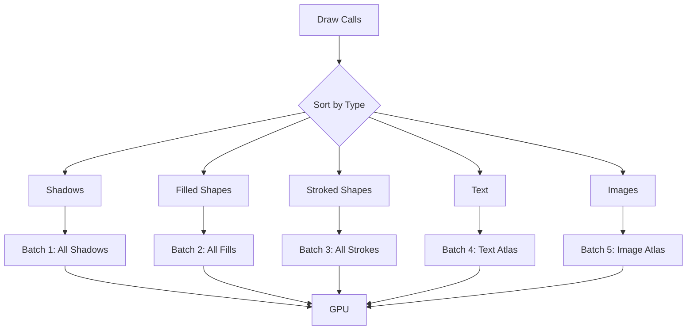

# AssortedWidgets 2D Drawing API

> **Created:** 2025-12-24
> **Status:** Design Phase

## Table of Contents

1. [Overview](#overview)
2. [Minimal API Design](#minimal-api-design)
3. [GPU Implementation Strategy](#gpu-implementation-strategy)
4. [Implementation Plan](#implementation-plan)
5. [Performance Considerations](#performance-considerations)

---

## Overview

### Goals

AssortedWidgets needs a minimal, GPU-optimized 2D drawing API for modern, "flat-but-polished" UIs. The API should:

- ✅ **Batch-friendly:** Group similar draw calls for efficient GPU rendering
- ✅ **Declarative:** Command-based (not stateful like HTML5 Canvas)
- ✅ **SDF-powered:** Use Signed Distance Fields for smooth shapes and shadows
- ✅ **Minimal:** Cover 90% of UI needs with <10 primitives

### What We're Building Toward

Modern UIs (macOS, iOS, Material Design) primarily use:
- **Rounded rectangles** with shadows (buttons, panels, cards)
- **Text** with sub-pixel rendering (already implemented ✅)
- **Gradients** for depth and polish
- **Icons** (vector paths or pre-rasterized)
- **Clipping** for scrollable regions

---

## Minimal API Design

### Core Primitives

```rust
pub struct PaintContext<'a> {
    /// High-level 2D primitives (batched, themed)
    pub primitives: &'a mut PrimitiveBatcher,

    /// Direct WebGPU access for custom rendering
    pub render_pass: &'a mut wgpu::RenderPass<'a>,

    /// GPU device for dynamic buffer creation
    pub device: &'a wgpu::Device,

    /// Global systems (text, atlases)
    pub renderer: &'a GlobalRenderer,
}

impl PrimitiveBatcher {
    // === Shape Drawing ===

    /// Draw a rectangle with rounded corners, fill, border, and shadow
    pub fn draw_rect(&mut self, rect: Rect, style: ShapeStyle) {
        self.commands.push(DrawCommand::Rect { rect, style });
    }

    /// Draw a circle or ellipse
    pub fn draw_circle(&mut self, center: Point, radius: f32, style: ShapeStyle) {
        self.commands.push(DrawCommand::Circle { center, radius, style });
    }

    /// Draw a line with stroke style
    pub fn draw_line(&mut self, p1: Point, p2: Point, stroke: Stroke) {
        self.commands.push(DrawCommand::Line { p1, p2, stroke });
    }

    // === Advanced Shapes ===

    /// Draw a custom path (for icons, custom shapes)
    pub fn draw_path(&mut self, path: &Path, style: ShapeStyle) {
        self.commands.push(DrawCommand::Path {
            path: path.clone(),
            style
        });
    }

    // === Images ===

    /// Draw a texture/image (for icons, backgrounds)
    pub fn draw_image(&mut self, texture: TextureId, rect: Rect, tint: Option<Color>) {
        self.commands.push(DrawCommand::Image { texture, rect, tint });
    }

    // === Clipping ===

    /// Push a rectangular clipping region (for scrollable areas)
    pub fn push_clip(&mut self, rect: Rect) {
        self.commands.push(DrawCommand::PushClip { rect });
    }

    /// Pop the most recent clipping region
    pub fn pop_clip(&mut self) {
        self.commands.push(DrawCommand::PopClip);
    }

    // === Text (already implemented) ===

    /// Draw text (uses existing TextEngine + GlyphAtlas)
    pub fn draw_text(&mut self, position: Point, text: &str, style: TextStyle) {
        // ... existing implementation
    }
}
```

### Style Structs

```rust
/// Complete styling for a shape
pub struct ShapeStyle {
    /// Fill brush (solid color or gradient)
    pub fill: Brush,

    /// Corner radius (0.0 = sharp corners)
    pub corner_radius: CornerRadius,

    /// Optional border
    pub border: Option<Border>,

    /// Optional shadow
    pub shadow: Option<Shadow>,
}

/// Fill options (solid or gradient)
pub enum Brush {
    Solid(Color),
    LinearGradient(LinearGradient),
    RadialGradient(RadialGradient),
}

/// Per-corner radius control
pub struct CornerRadius {
    pub top_left: f32,
    pub top_right: f32,
    pub bottom_right: f32,
    pub bottom_left: f32,
}

impl CornerRadius {
    pub fn uniform(radius: f32) -> Self {
        Self {
            top_left: radius,
            top_right: radius,
            bottom_right: radius,
            bottom_left: radius,
        }
    }
}

/// Border styling
pub struct Border {
    pub color: Color,
    pub width: f32,
    pub style: BorderStyle, // Solid, Dashed, Dotted
}

pub enum BorderStyle {
    Solid,
    Dashed { dash_length: f32, gap_length: f32 },
    Dotted { spacing: f32 },
}

/// Box shadow (soft, analytical)
pub struct Shadow {
    pub color: Color,
    pub offset: Vector,
    pub blur_radius: f32,
    pub spread_radius: f32, // Expands/contracts shadow before blur
}

/// Linear gradient (2+ color stops)
pub struct LinearGradient {
    pub start: Point,
    pub end: Point,
    pub stops: Vec<ColorStop>,
}

/// Radial gradient
pub struct RadialGradient {
    pub center: Point,
    pub radius: f32,
    pub stops: Vec<ColorStop>,
}

pub struct ColorStop {
    pub offset: f32, // 0.0 to 1.0
    pub color: Color,
}

/// Stroke styling for lines
pub struct Stroke {
    pub color: Color,
    pub width: f32,
    pub cap: LineCap,   // Butt, Round, Square
    pub join: LineJoin, // Miter, Round, Bevel
}

pub enum LineCap {
    Butt,
    Round,
    Square,
}

pub enum LineJoin {
    Miter,
    Round,
    Bevel,
}

/// Vector path (for custom shapes)
pub struct Path {
    commands: Vec<PathCommand>,
}

pub enum PathCommand {
    MoveTo(Point),
    LineTo(Point),
    QuadraticTo { control: Point, to: Point },
    CubicTo { control1: Point, control2: Point, to: Point },
    Close,
}
```

---

## GPU Implementation Strategy

### 1. Rounded Rectangle SDF Shader (Priority 1)

**Why SDF?**
- Single quad can render arbitrarily smooth corners via pixel shader
- No geometry generation for different corner radii
- Borders and anti-aliasing "for free"

**Shader Strategy:**

```wgsl
// Vertex shader (instanced quads)
struct RectInstance {
    rect: vec4<f32>,           // x, y, width, height
    corner_radius: vec4<f32>,  // top_left, top_right, bottom_right, bottom_left
    fill_color: vec4<f32>,
    border_color: vec4<f32>,
    border_width: f32,
}

// Fragment shader (SDF magic)
fn sdf_rounded_box(p: vec2<f32>, size: vec2<f32>, radius: vec4<f32>) -> f32 {
    // Select appropriate corner radius based on quadrant
    let r = select_corner_radius(p, size, radius);

    // SDF for rounded rectangle
    let q = abs(p) - size + r;
    return min(max(q.x, q.y), 0.0) + length(max(q, vec2(0.0))) - r;
}

@fragment
fn fs_main(in: VertexOutput) -> @location(0) vec4<f32> {
    let dist = sdf_rounded_box(in.local_pos, in.size, in.corner_radius);

    // Anti-aliased edge
    let alpha = 1.0 - smoothstep(-0.5, 0.5, dist);

    // Border (two SDFs: outer and inner)
    let border_alpha = smoothstep(-0.5, 0.5, dist) -
                       smoothstep(-0.5, 0.5, dist + in.border_width);

    // Blend fill and border
    let final_color = mix(in.fill_color, in.border_color, border_alpha);
    return final_color * alpha;
}
```

**Benefits:**
- Single draw call for all rectangles (instanced rendering)
- Perfect anti-aliasing at any scale
- No geometry tessellation overhead

### 2. Box Shadow SDF (Priority 2)

**Challenge:** Real Gaussian blur is expensive (multi-pass).

**Solution:** Analytical SDF shadow approximation.

```wgsl
fn soft_shadow_sdf(p: vec2<f32>, rect_size: vec2<f32>, radius: f32, blur: f32) -> f32 {
    let dist = sdf_rounded_box(p - shadow_offset, rect_size, radius);

    // Approximate Gaussian with smoothstep
    return 1.0 - smoothstep(0.0, blur, abs(dist));
}

@fragment
fn fs_shadow(in: VertexOutput) -> @location(0) vec4<f32> {
    let shadow_alpha = soft_shadow_sdf(in.pos, in.rect_size, in.corner_radius, in.blur);
    return vec4(in.shadow_color.rgb, in.shadow_color.a * shadow_alpha);
}
```

**Rendering Order:**
1. Draw all shadows (blended)
2. Draw all shapes (on top)

### 3. Gradient Support (Priority 3)

**Linear Gradient:**

```wgsl
struct GradientStop {
    offset: f32,
    color: vec4<f32>,
}

fn sample_linear_gradient(
    uv: vec2<f32>,
    start: vec2<f32>,
    end: vec2<f32>,
    stops: array<GradientStop, MAX_STOPS>
) -> vec4<f32> {
    let dir = end - start;
    let t = dot(uv - start, dir) / dot(dir, dir);

    // Find surrounding stops and interpolate
    for (var i = 0u; i < num_stops - 1u; i++) {
        if (t >= stops[i].offset && t <= stops[i + 1].offset) {
            let local_t = (t - stops[i].offset) /
                          (stops[i + 1].offset - stops[i].offset);
            return mix(stops[i].color, stops[i + 1].color, local_t);
        }
    }

    return stops[num_stops - 1].color; // Clamp to last color
}
```

**Radial Gradient:**

```wgsl
fn sample_radial_gradient(
    uv: vec2<f32>,
    center: vec2<f32>,
    radius: f32,
    stops: array<GradientStop, MAX_STOPS>
) -> vec4<f32> {
    let dist = length(uv - center) / radius;
    // ... similar interpolation logic
}
```

### 4. Path Rendering (Priority 4)

**Strategy:** Use **Lyon** for tessellation (paths → triangles).

```rust
use lyon::tessellation::{BuffersBuilder, FillTessellator, StrokeTessellator};

impl PrimitiveBatcher {
    fn tessellate_path(&mut self, path: &Path, style: &ShapeStyle) {
        let mut tessellator = FillTessellator::new();
        let mut geometry = Vec::new();

        tessellator.tessellate_path(
            path.as_lyon_path(),
            &FillOptions::default(),
            &mut BuffersBuilder::new(&mut geometry, |vertex: FillVertex| {
                ShapeVertex {
                    position: vertex.position().to_array(),
                    color: style.fill.to_color(),
                }
            }),
        ).unwrap();

        self.shape_vertices.extend(geometry);
    }
}
```

**Alternative:** For simple icons, pre-tessellate to texture atlas (like text).

### 5. Clipping (Priority 5)

**WebGPU Approach:** Use stencil buffer or scissor rectangles.

```rust
// Scissor rect (fast, axis-aligned only)
render_pass.set_scissor_rect(clip_x, clip_y, clip_width, clip_height);

// Stencil buffer (supports arbitrary shapes, slower)
// 1. Render clipping shape to stencil buffer
// 2. Enable stencil test
// 3. Render content (only where stencil = 1)
// 4. Clear stencil
```

**Stack Management:**

```rust
struct ClipStack {
    stack: Vec<Rect>,
}

impl ClipStack {
    fn push(&mut self, rect: Rect) {
        // Intersect with current clip
        let current = self.current();
        self.stack.push(current.intersect(rect));
    }

    fn pop(&mut self) {
        self.stack.pop();
    }

    fn current(&self) -> Rect {
        self.stack.last().copied().unwrap_or(Rect::INFINITE)
    }
}
```

---

## Implementation Plan

### Phase 1: Rounded Rectangles + Borders (Week 1)

**Files to Create:**
- `src/paint/mod.rs` - Public API
- `src/paint/batcher.rs` - `PrimitiveBatcher` implementation
- `src/paint/types.rs` - `ShapeStyle`, `Brush`, `Border`, etc.
- `src/render/rect_sdf_pipeline.rs` - SDF shader pipeline
- `shaders/rect_sdf.wgsl` - SDF vertex/fragment shaders

**Tasks:**
1. ✅ Define `ShapeStyle`, `CornerRadius`, `Border` structs
2. ✅ Implement `PrimitiveBatcher::draw_rect()`
3. ✅ Write SDF rounded rectangle shader
4. ✅ Create instanced rendering pipeline
5. ✅ Add to `PaintContext` in existing architecture
6. ✅ Test: Render 1000 rounded rects at 60fps

**Success Criteria:**
- Can render rounded rectangles with per-corner radii
- Borders render with correct width and color
- Smooth anti-aliasing at all scales
- Batched (single draw call for all rects)

### Phase 2: Box Shadows (Week 2)

**Files to Create:**
- `src/paint/shadow.rs` - Shadow utilities
- `shaders/shadow_sdf.wgsl` - Shadow shader

**Tasks:**
1. ✅ Define `Shadow` struct
2. ✅ Implement analytical shadow SDF
3. ✅ Create separate shadow rendering pass (before shapes)
4. ✅ Add shadow instancing to batcher
5. ✅ Test: Shadows with blur and offset

**Success Criteria:**
- Soft, blurred shadows under rectangles
- No multi-pass blur (single analytical pass)
- Configurable offset and blur radius

### Phase 3: Gradients (Week 3)

**Files to Create:**
- `src/paint/gradient.rs` - Gradient types
- `shaders/gradient.wgsl` - Gradient sampling functions

**Tasks:**
1. ✅ Define `LinearGradient`, `RadialGradient`, `ColorStop`
2. ✅ Modify `Brush` enum to include gradients
3. ✅ Update rect shader to sample gradients
4. ✅ Implement gradient stop interpolation in shader
5. ✅ Test: Multi-stop gradients on rectangles

**Success Criteria:**
- Linear gradients with 2+ color stops
- Radial gradients from center point
- Smooth color interpolation

### Phase 4: Lines + Paths (Week 4)

**Files to Create:**
- `src/paint/path.rs` - Path builder and Lyon integration
- `src/render/path_pipeline.rs` - Path rendering pipeline

**Tasks:**
1. ✅ Integrate Lyon tessellation library
2. ✅ Implement `Path` builder API
3. ✅ Create `draw_line()` and `draw_path()`
4. ✅ Tessellate paths to triangles
5. ✅ Render with anti-aliasing
6. ✅ Test: Custom shapes and icons

**Success Criteria:**
- Can draw lines with caps and joins
- Custom paths (bezier curves, etc.)
- Vector icons render smoothly

### Phase 5: Clipping + Images (Week 5)

**Files to Create:**
- `src/paint/clip.rs` - Clip stack management
- `src/render/image_pipeline.rs` - Texture rendering

**Tasks:**
1. ✅ Implement `ClipStack` with scissor rects
2. ✅ Add `push_clip()` / `pop_clip()` to batcher
3. ✅ Create texture atlas for images/icons
4. ✅ Implement `draw_image()` with tinting
5. ✅ Test: Scrollable regions with clipping

**Success Criteria:**
- Clipping regions work (content doesn't bleed)
- Can render image textures
- Optional color tinting for icons

---

## Performance Considerations

### Batching Strategy



**Batching Rules:**
1. **Shadow Pass:** Render all shadows first (back to front)
2. **Fill Pass:** Render all filled shapes (instanced)
3. **Stroke Pass:** Render all borders/lines
4. **Text Pass:** Existing text rendering
5. **Image Pass:** Textured quads

### Memory Budget

| Resource | Size | Notes |
|----------|------|-------|
| Rect Instance Buffer | 16KB | 256 rects × 64 bytes/instance |
| Shadow Instance Buffer | 16KB | 256 shadows × 64 bytes/instance |
| Gradient Storage | 4KB | 64 gradients × 64 bytes |
| Path Vertices | 64KB | Dynamic tessellation |
| **Total** | **~100KB** | Per-frame dynamic buffers |

### Shader Complexity

- **Rect SDF:** ~50 instructions (very fast)
- **Shadow SDF:** ~80 instructions (analytical, no texture reads)
- **Gradient Sampling:** ~30 instructions (simple interpolation)
- **Text Rendering:** Existing (atlas lookup)

**Target:** 60fps at 4K resolution (3840×2160) = 16.67ms/frame

---

## API Usage Examples

### Example 1: Themed Button

```rust
impl Button {
    fn paint(&self, ctx: &mut PaintContext, theme: &Theme) {
        // Shadow
        ctx.primitives.draw_rect(
            self.bounds,
            ShapeStyle {
                fill: Brush::Solid(Color::TRANSPARENT),
                corner_radius: CornerRadius::uniform(8.0),
                border: None,
                shadow: Some(Shadow {
                    color: Color::rgba(0, 0, 0, 0.2),
                    offset: Vector::new(0.0, 2.0),
                    blur_radius: 4.0,
                    spread_radius: 0.0,
                }),
            },
        );

        // Background (gradient on hover)
        ctx.primitives.draw_rect(
            self.bounds,
            ShapeStyle {
                fill: if self.hovered {
                    Brush::LinearGradient(LinearGradient {
                        start: self.bounds.top_left(),
                        end: self.bounds.bottom_left(),
                        stops: vec![
                            ColorStop { offset: 0.0, color: theme.primary.lighten(0.1) },
                            ColorStop { offset: 1.0, color: theme.primary },
                        ],
                    })
                } else {
                    Brush::Solid(theme.primary)
                },
                corner_radius: CornerRadius::uniform(8.0),
                border: Some(Border {
                    color: theme.primary.darken(0.2),
                    width: 1.0,
                    style: BorderStyle::Solid,
                }),
                shadow: None,
            },
        );

        // Text
        ctx.primitives.draw_text(
            self.bounds.center(),
            &self.label,
            TextStyle {
                color: theme.text_on_primary,
                font_size: 14.0,
                ..Default::default()
            },
        );
    }
}
```

### Example 2: Custom Icon (Path)

```rust
fn draw_heart_icon(ctx: &mut PaintContext, center: Point, size: f32) {
    let mut path = Path::new();

    // Left arc
    path.move_to(Point::new(center.x, center.y - size * 0.3));
    path.cubic_to(
        Point::new(center.x - size * 0.5, center.y - size * 0.8),
        Point::new(center.x - size * 0.8, center.y - size * 0.3),
        Point::new(center.x - size * 0.5, center.y),
    );

    // Bottom point
    path.line_to(Point::new(center.x, center.y + size * 0.5));

    // Right arc
    path.cubic_to(
        Point::new(center.x + size * 0.5, center.y),
        Point::new(center.x + size * 0.8, center.y - size * 0.3),
        Point::new(center.x + size * 0.5, center.y - size * 0.8),
    );

    path.close();

    ctx.primitives.draw_path(
        &path,
        ShapeStyle {
            fill: Brush::Solid(Color::rgb(255, 100, 120)),
            corner_radius: CornerRadius::uniform(0.0),
            border: None,
            shadow: None,
        },
    );
}
```

### Example 3: Scrollable Panel with Clipping

```rust
impl ScrollPanel {
    fn paint(&self, ctx: &mut PaintContext, theme: &Theme) {
        // Panel background
        ctx.primitives.draw_rect(
            self.bounds,
            ShapeStyle {
                fill: Brush::Solid(theme.panel_background),
                corner_radius: CornerRadius::uniform(4.0),
                border: Some(Border {
                    color: theme.border,
                    width: 1.0,
                    style: BorderStyle::Solid,
                }),
                shadow: None,
            },
        );

        // Clip content to panel bounds
        ctx.primitives.push_clip(self.bounds.inset(1.0)); // Inset for border

        // Draw scrolled content
        for item in &self.items {
            let item_rect = Rect::new(
                self.bounds.x,
                self.bounds.y + item.offset - self.scroll_offset,
                self.bounds.width,
                item.height,
            );

            item.paint(ctx, theme);
        }

        ctx.primitives.pop_clip();
    }
}
```

---

## Next Steps

1. **Start with Phase 1** (Rounded Rectangles)
   - This gives immediate visual improvements
   - Foundation for all other primitives

2. **Prioritize Shadows** (Phase 2)
   - Biggest impact on "polish"
   - Required for modern flat design

3. **Add Gradients** (Phase 3)
   - Nice-to-have for premium feel
   - Not blocking basic UI work

4. **Defer Paths** (Phase 4)
   - Can use pre-rasterized icons initially
   - Add when vector flexibility needed

5. **Clipping Last** (Phase 5)
   - Required for scrollable regions
   - Can prototype without it initially

---

## Appendix: Comparison to Other Frameworks

| Feature | AssortedWidgets | Qt QPainter | Skia | HTML5 Canvas |
|---------|----------------|-------------|------|--------------|
| Rounded Rects | SDF Shader | CPU/GPU Hybrid | GPU Paths | CPU |
| Shadows | Analytical SDF | Blur Filter | Blur Filter | Multi-pass Blur |
| Gradients | Shader Sampling | Gradient Brush | Shader | Canvas API |
| Paths | Lyon Tessellation | QPainterPath | SkPath | Path2D |
| Batching | Instanced | Deferred | DisplayList | Immediate |
| API Style | Declarative | Stateful | Immediate | Stateful |

**AssortedWidgets Advantages:**
- ✅ GPU-first (no CPU rasterization)
- ✅ Batch-friendly (minimal state changes)
- ✅ SDF-based (infinite resolution, smooth AA)
- ✅ Minimal API surface (<10 core methods)

**Trade-offs:**
- ❌ Less mature than Qt/Skia
- ❌ SDF requires learning (not traditional geometry)
- ❌ Path rendering deferred to Lyon (not built-in)
