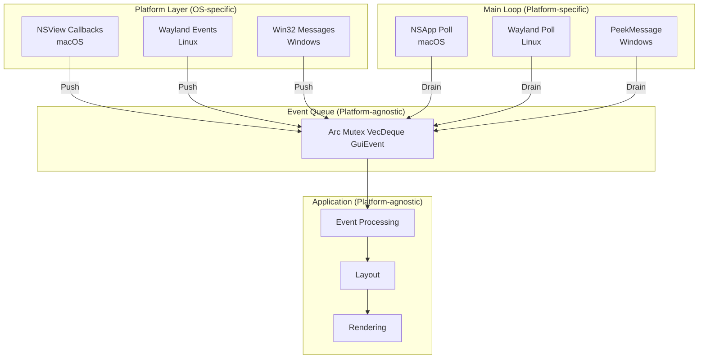
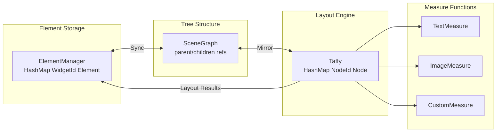
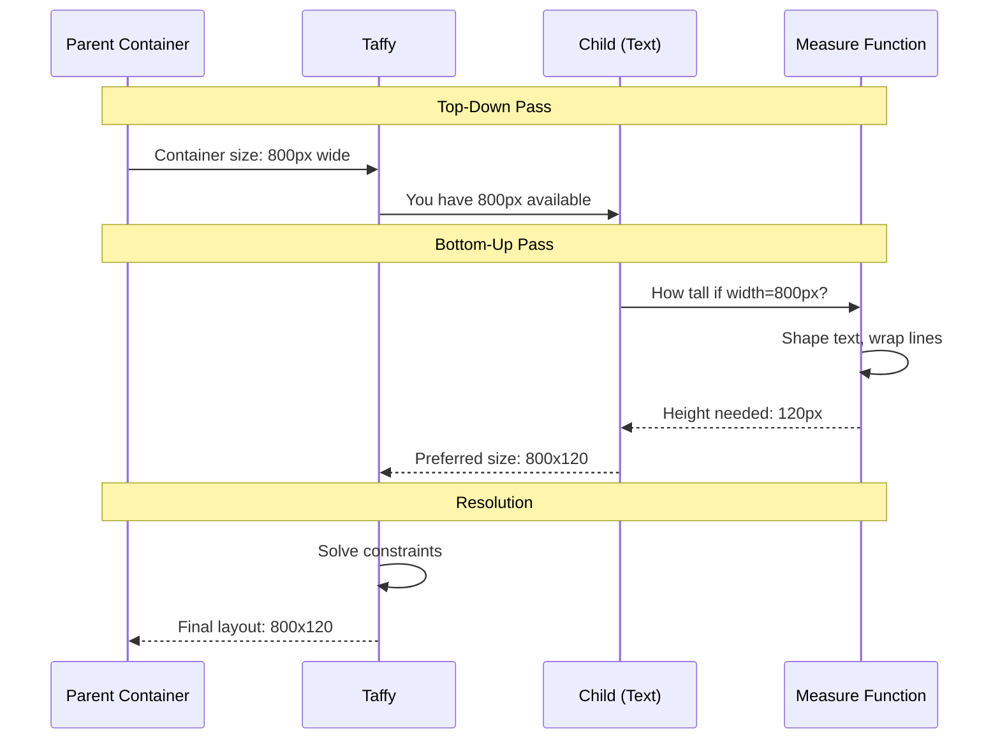
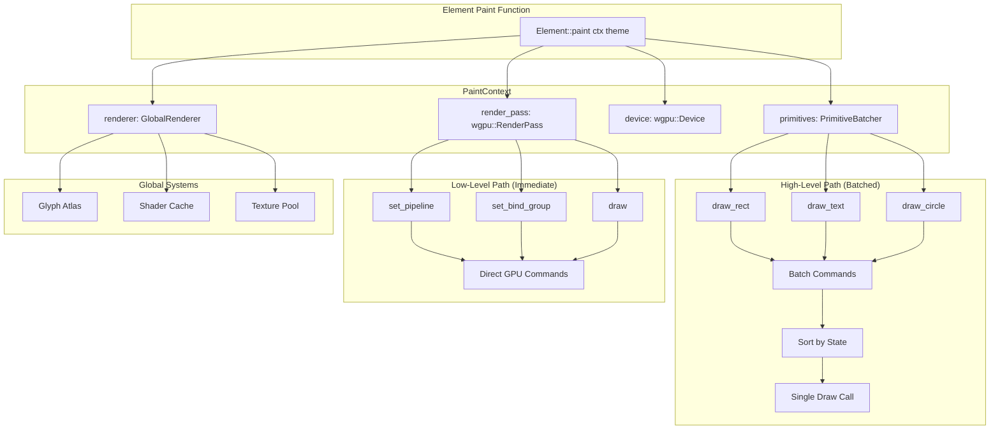
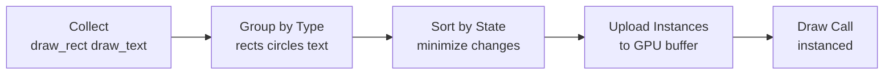
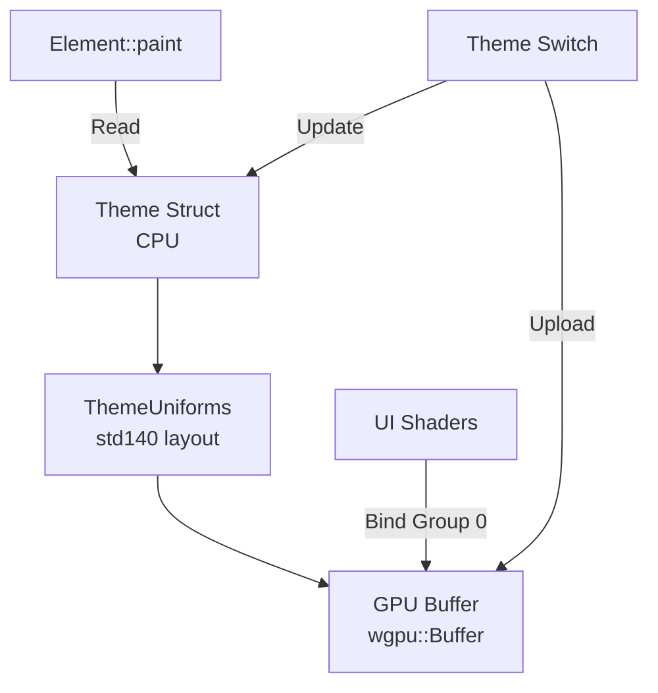
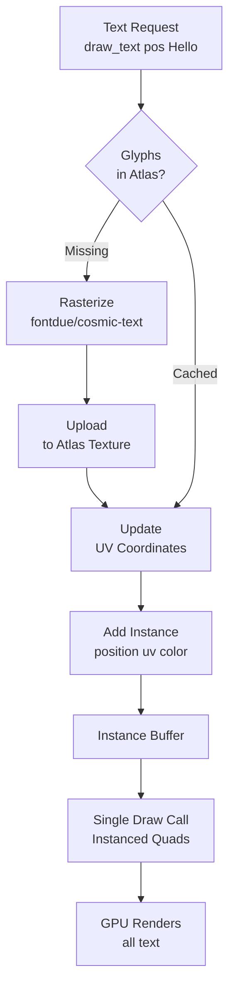

# AssortedWidgets Architecture

This document provides a detailed explanation of the architectural decisions in AssortedWidgets, the trade-offs considered, and the rationale behind each choice.

## Table of Contents

1. [Core Principles](#core-principles)
2. [Event System Architecture](#event-system-architecture)
3. [Layout System Design](#layout-system-design)
4. [Rendering Architecture](#rendering-architecture)
5. [Theme System](#theme-system)
6. [Text Rendering](#text-rendering)
7. [Memory Management](#memory-management)
8. [Performance Considerations](#performance-considerations)

---

## Core Principles

### 1. Flexibility over Convenience

**Decision:** Provide low-level access alongside high-level abstractions.

**Rationale:**
- Many GUI frameworks lock you into their rendering pipeline (e.g., gpui, egui)
- This makes it impossible to integrate custom graphics (3D viewports, games, visualizations)
- We provide escape hatches: `PaintContext` has both `primitives` and `render_pass`

**Trade-off:**
- ✅ Users can build anything (3D apps, custom renderers)
- ❌ More complex API surface
- ✅ But simple apps can ignore low-level APIs

### 2. Compile-Time Safety over Runtime Flexibility

**Decision:** Event queue with direct ownership instead of RefCell/Rc.

**Rationale:**
```rust
// Runtime borrow checking (can panic!)
let data = Rc::new(RefCell::new(state));
data.borrow_mut(); // Might panic if already borrowed

// Compile-time borrow checking
let mut data = state;
// Compiler enforces exclusive access
```

**Trade-off:**
- ✅ Impossible to panic from borrow violations
- ✅ Better performance (no runtime checks)
- ❌ Requires more careful architecture (event queue)
- ✅ But cleaner mental model

### 3. Cross-Platform Consistency

**Decision:** Manual event loop control on all platforms.

**Rationale:**
- Windows/Linux typically use polling model
- macOS uses callback model (`NSApp.run()`)
- We unify both: manual runloop + event queue works everywhere

**Trade-off:**
- ✅ Same code structure on all platforms
- ❌ Slightly more complex than native patterns
- ✅ Easier to reason about cross-platform behavior

---

## Event System Architecture

### Design: Event Queue + Manual RunLoop



### Considered Alternatives

#### Alternative 1: Callback-Based (gpui approach)

```rust
struct Window {
    renderer: Rc<RefCell<WindowRenderer>>,
}

impl Window {
    fn set_callbacks(&mut self) {
        let renderer = self.renderer.clone();
        self.callbacks.paint = Box::new(move || {
            let mut r = renderer.borrow_mut(); // Runtime check
            paint(&mut r);
        });
    }
}
```

**Why rejected:**
- Runtime borrow checking (can panic)
- Circular reference complexity
- Difficult to reason about borrowing across callbacks

#### Alternative 2: winit-style Polling

```rust
loop {
    event_loop.poll_events(|event| {
        match event {
            Event::WindowEvent { event, .. } => { ... }
        }
    });
    render();
}
```

**Why partially adopted:**
- ✅ We use similar pattern internally
- ✅ Clean ownership model
- ❌ But we add event queue layer for platform abstraction

### Implementation Details

**macOS Event Processing:**

```rust
loop {
    unsafe {
        // 1. Poll NSApplication events
        let app = NSApp();
        let until_date: id = msg_send![class!(NSDate), distantPast];

        loop {
            let event: id = msg_send![app,
                nextEventMatchingMask:0xffffffffu64
                untilDate:until_date
                inMode:NSDefaultRunLoopMode
                dequeue:1u8
            ];

            if event == nil { break; }
            let _: () = msg_send![app, sendEvent: event];
        }

        // 2. Pump runloop for timers/sources
        let run_loop: id = msg_send![class!(NSRunLoop), currentRunLoop];
        let date: id = msg_send![class!(NSDate), dateWithTimeIntervalSinceNow: 0.001f64];
        let _: () = msg_send![run_loop, runMode:NSDefaultRunLoopMode beforeDate:date];
    }

    // 3. Drain our event queue
    while let Some(event) = self.event_queue.lock().unwrap().pop_front() {
        // Direct mutable access - no RefCell!
        self.process_event(event);
    }

    // 4. Render
    if let Some(render_fn) = self.render_fn.as_mut() {
        render_fn(self.renderer.as_ref().unwrap(), &self.render_context);
    }
}
```

**Why This Works:**
- Platform callbacks run on same thread as main loop
- Callbacks push to queue and return immediately
- Main loop has exclusive access when draining queue
- No possibility of borrow conflicts

---

## Layout System Design

### Design: Taffy Integration with Flat Storage



### Why Taffy?

**Comparison of Layout Libraries:**

| Library | Algorithm | Maturity | Performance | Complexity |
|---------|-----------|----------|-------------|------------|
| **Taffy** | Flexbox, Grid, Block | ✅ Production | ✅ Optimized | Medium |
| **Morphorm** | Stack-based | ✅ Stable | ⚠️ Good | Low |
| **Cassowary** | Constraint solver | ⚠️ Experimental | ❌ Slow | High |
| **Custom** | N/A | ❌ Unproven | ❓ Unknown | Very High |

**Decision Factors:**
1. **Battle-tested:** Used by Bevy (game engine) and Dioxus (web framework)
2. **Web-standard:** Flexbox/Grid match CSS exactly
3. **Performance:** Handles 10,000+ nodes efficiently
4. **Maintenance:** Active development, good documentation

### Constraint Solving: Bi-Directional Flow

**Problem:** How do we handle both cases?
- Parent determines child size (split view: 50/50)
- Child determines parent size (auto-sizing text)



**Taffy's Algorithm:**

1. **Define Constraints:**
   ```rust
   // Parent: fixed width, auto height
   Style {
       size: Size {
           width: Dimension::Points(800.0),
           height: Dimension::Auto,
       },
   }

   // Child: auto size, measure function
   Style {
       size: Size {
           width: Dimension::Auto,
           height: Dimension::Auto,
       },
       // measure_func set to text measurer
   }
   ```

2. **First Pass (Top-Down):**
   - Parent gets 800px width from window
   - Child is given 800px available width

3. **Second Pass (Measure):**
   - Child's measure function shapes text in 800px
   - Returns intrinsic height (120px)

4. **Third Pass (Resolution):**
   - Parent sets height to fit child (120px)
   - Child gets final 800x120 box

**Circular Dependencies:**

What if child is 50% of parent, but parent is auto-sized to child?

```rust
// This creates a circular dependency!
parent_style.size.height = Auto;          // Needs child height
child_style.size.height = Percent(0.5);   // Needs parent height
```

Taffy resolves this using:
- **Default to content:** Auto becomes intrinsic size
- **Break cycles:** Percentage of Auto becomes 0
- **Warnings:** Invalid layouts logged in debug mode

### Integration Strategy

**Syncing with ElementManager:**

```rust
impl ElementManager {
    pub fn add_element(&mut self, parent: WidgetId, element: Element) -> WidgetId {
        let id = WidgetId::new();

        // 1. Add to flat storage
        self.elements.insert(id, element);

        // 2. Add to scene graph
        self.scene_graph.add_child(parent, id);

        // 3. Create Taffy node
        let taffy_node = self.taffy.new_leaf(element.style()).unwrap();
        self.taffy_nodes.insert(id, taffy_node);

        // 4. Link in Taffy tree
        let parent_taffy = self.taffy_nodes[&parent];
        self.taffy.add_child(parent_taffy, taffy_node).unwrap();

        id
    }

    pub fn compute_layout(&mut self, window_size: Size) {
        // Compute layout for entire tree
        self.taffy.compute_layout(
            self.root_taffy_node,
            taffy::Size {
                width: AvailableSpace::Definite(window_size.width),
                height: AvailableSpace::Definite(window_size.height),
            }
        ).unwrap();

        // Copy results back to elements
        for (widget_id, taffy_node) in &self.taffy_nodes {
            let layout = self.taffy.layout(*taffy_node).unwrap();
            if let Some(element) = self.elements.get_mut(widget_id) {
                element.set_bounds(Rect {
                    origin: Point::new(layout.location.x, layout.location.y),
                    size: Size::new(layout.size.width, layout.size.height),
                });
            }
        }
    }
}
```

---

## Rendering Architecture

### Design: Multi-Tiered Context

The core innovation of AssortedWidgets is the **multi-tiered rendering system** that supports both themed UI and custom graphics.



### Tier 1: High-Level Primitives

**Design Goals:**
- Simple API for common operations
- Automatic batching for performance
- Theme integration
- Minimize draw calls

**API:**

```rust
pub struct PrimitiveBatcher {
    rects: Vec<RectInstance>,
    circles: Vec<CircleInstance>,
    text: Vec<TextInstance>,
}

impl PrimitiveBatcher {
    pub fn draw_rect(&mut self, rect: Rect, color: Color) {
        self.rects.push(RectInstance { rect, color });
    }

    pub fn draw_text(&mut self, pos: Point, text: &str, color: Color) {
        // Shape text, add to glyph atlas
        let shaped = self.text_renderer.shape(text);
        for glyph in shaped.glyphs {
            self.text.push(TextInstance {
                position: pos + glyph.offset,
                uv_rect: self.atlas.get_uv(glyph.id),
                color,
            });
        }
    }

    pub fn flush(&mut self, render_pass: &mut wgpu::RenderPass) {
        // Sort by pipeline state to minimize state changes
        // Draw all rects in one call
        // Draw all circles in one call
        // Draw all text in one call
    }
}
```

**Batching Strategy:**



### Tier 2: Raw WebGPU Access

**Design Goals:**
- Zero-cost abstraction
- Full wgpu API surface
- Coexist with high-level tier

**API:**

```rust
impl Element for My3DViewport {
    fn paint(&self, ctx: &mut PaintContext, theme: &Theme) {
        // Set custom pipeline
        ctx.render_pass.set_pipeline(&self.pipeline);

        // Bind scene uniforms
        ctx.render_pass.set_bind_group(0, &self.camera_bind_group, &[]);
        ctx.render_pass.set_bind_group(1, &self.lights_bind_group, &[]);

        // Bind vertex/index buffers
        ctx.render_pass.set_vertex_buffer(0, self.vertex_buffer.slice(..));
        ctx.render_pass.set_index_buffer(self.index_buffer.slice(..), wgpu::IndexFormat::Uint32);

        // Draw mesh
        ctx.render_pass.draw_indexed(0..self.index_count, 0, 0..1);

        // Can still use high-level for UI overlay
        ctx.primitives.draw_text(self.bounds.origin, "FPS: 60", theme.text);
    }
}
```

**State Management:**

Problem: High-level batching and low-level rendering must coexist.

Solution: **Deferred Batching**

```rust
// Paint pass: collect commands
for element in elements {
    element.paint(&mut ctx, &theme);
}

// Flush pass: render in correct order
// 1. High-level batched background
primitives.flush_background(render_pass);

// 2. Custom low-level (already drawn to render_pass)
// (no-op, already executed)

// 3. High-level batched foreground (text, overlays)
primitives.flush_foreground(render_pass);
```

### Tier 3: Global Renderer

**Design Goals:**
- Shared resources (atlases, shaders)
- Lifecycle management
- Performance optimization

**Structure:**

```rust
pub struct GlobalRenderer {
    // Text rendering
    glyph_atlas: GlyphAtlas,
    text_pipeline: wgpu::RenderPipeline,
    text_bind_group: wgpu::BindGroup,

    // Primitive rendering
    rect_pipeline: wgpu::RenderPipeline,
    circle_pipeline: wgpu::RenderPipeline,

    // Shared resources
    theme_uniform: wgpu::Buffer,
    sampler: wgpu::Sampler,

    // Instance buffers (reused)
    instance_buffer: wgpu::Buffer,
    instance_capacity: usize,
}
```

### Why This Design?

**Comparison with Alternatives:**

| Approach | Flexibility | Performance | Complexity |
|----------|-------------|-------------|------------|
| **Pure Immediate** (egui) | ❌ Low | ✅ Good | ✅ Simple |
| **Pure Retained** (gpui) | ❌ Medium | ✅ Best | ⚠️ Medium |
| **Multi-Tiered** (us) | ✅ High | ✅ Best | ⚠️ Higher |

**Trade-offs:**

Pure Immediate:
- ✅ Simple API
- ❌ Can't do custom graphics
- ❌ Recomputes every frame

Pure Retained:
- ✅ Best performance
- ✅ Cache-friendly
- ❌ Locked into their rendering

Multi-Tiered:
- ✅ Best of both worlds
- ✅ Custom graphics possible
- ❌ More complex API
- ✅ But complexity is opt-in

---

## Theme System

### Design: GPU Uniform Buffer + Read-Only Struct



**Theme Structure:**

```rust
#[derive(Clone, Debug)]
pub struct Theme {
    // Semantic colors
    pub background: Color,
    pub surface: Color,
    pub primary: Color,
    pub secondary: Color,
    pub error: Color,

    // Text
    pub text: Color,
    pub text_secondary: Color,
    pub text_disabled: Color,

    // Typography
    pub font_family: String,
    pub font_size: f32,
    pub font_weight: FontWeight,
    pub line_height: f32,

    // Spacing
    pub spacing_xs: f32,  // 4px
    pub spacing_sm: f32,  // 8px
    pub spacing_md: f32,  // 16px
    pub spacing_lg: f32,  // 24px
    pub spacing_xl: f32,  // 32px

    // Borders
    pub border_radius: f32,
    pub border_width: f32,
    pub border_color: Color,

    // Shadows
    pub shadow_color: Color,
    pub shadow_offset: Vector,
    pub shadow_blur: f32,
    pub shadow_spread: f32,

    // Animation
    pub animation_duration: f32,
    pub animation_easing: EasingFunction,
}

// GPU representation (must match std140 layout)
#[repr(C)]
#[derive(Copy, Clone, bytemuck::Pod, bytemuck::Zeroable)]
pub struct ThemeUniforms {
    background: [f32; 4],
    surface: [f32; 4],
    primary: [f32; 4],
    secondary: [f32; 4],
    error: [f32; 4],
    text: [f32; 4],
    text_secondary: [f32; 4],
    text_disabled: [f32; 4],

    // Scalar uniforms (packed)
    font_size: f32,
    line_height: f32,
    spacing_md: f32,
    border_radius: f32,

    border_width: f32,
    shadow_blur: f32,
    shadow_spread: f32,
    _padding: f32,  // Align to 16 bytes

    border_color: [f32; 4],
    shadow_color: [f32; 4],
    shadow_offset: [f32; 2],
    _padding2: [f32; 2],
}
```

**Why Uniform Buffer?**

Alternative: Pass theme colors individually
```rust
// ❌ Many parameters, tedious
ctx.primitives.draw_rect(rect, theme.background, theme.border_color, theme.border_width);
```

With uniform buffer:
```rust
// ✅ Shaders read from buffer automatically
ctx.primitives.draw_rect(rect, ThemeColor::Background);

// In shader:
@group(0) @binding(0) var<uniform> theme: Theme;

fn fs_main() -> @location(0) vec4<f32> {
    return theme.background;  // Reads from GPU buffer
}
```

**Performance:**
- Single buffer update per theme change
- All shaders share same buffer (1 bind)
- No per-element overhead

---

## Text Rendering

### Design: Glyph Atlas + Instanced Rendering



**Atlas Structure:**

```rust
pub struct GlyphAtlas {
    /// GPU texture (e.g., 2048×2048 RGBA)
    texture: wgpu::Texture,
    texture_view: wgpu::TextureView,

    /// Current packing state
    allocator: etagere::AtlasAllocator,

    /// Glyph cache (font, size, char) -> UV coords
    cache: HashMap<GlyphKey, UvRect>,

    /// Needs upload this frame
    pending_uploads: Vec<(Rect, Vec<u8>)>,
}

#[derive(Hash, Eq, PartialEq)]
pub struct GlyphKey {
    font_id: FontId,
    size: u32,           // Fixed-point font size
    character: char,
    subpixel_x: u8,      // Subpixel positioning
}

pub struct UvRect {
    min: Vector,  // Top-left UV
    max: Vector,  // Bottom-right UV
}
```

**Rendering Pipeline:**

```rust
// Vertex shader
struct VertexInput {
    @builtin(vertex_index) vertex_idx: u32,
    @location(0) instance_pos: vec2<f32>,
    @location(1) instance_uv_min: vec2<f32>,
    @location(2) instance_uv_max: vec2<f32>,
    @location(3) instance_color: vec4<f32>,
}

@vertex
fn vs_main(in: VertexInput) -> VertexOutput {
    // Generate quad corners from vertex index
    let positions = array<vec2<f32>, 4>(
        vec2(0.0, 0.0), vec2(1.0, 0.0),
        vec2(0.0, 1.0), vec2(1.0, 1.0),
    );

    let local_pos = positions[in.vertex_idx];
    let world_pos = in.instance_pos + local_pos * glyph_size;

    var out: VertexOutput;
    out.position = projection * vec4(world_pos, 0.0, 1.0);
    out.uv = mix(in.instance_uv_min, in.instance_uv_max, local_pos);
    out.color = in.instance_color;
    return out;
}

// Fragment shader
@fragment
fn fs_main(in: VertexOutput) -> @location(0) vec4<f32> {
    let alpha = textureSample(atlas, atlas_sampler, in.uv).r;
    return vec4(in.color.rgb, in.color.a * alpha);
}
```

**Performance:**
- All text in UI = 1 draw call
- GPU instancing: 1 quad per glyph
- Atlas caching: Rasterize once, use forever
- Subpixel positioning for crisp text

**Atlas Growth:**

```rust
impl GlyphAtlas {
    fn ensure_capacity(&mut self, needed: Size) -> Result<()> {
        if !self.allocator.can_fit(needed) {
            // Double atlas size (512 → 1024 → 2048 → 4096)
            let new_size = self.texture.size().width * 2;

            // Create new texture
            let new_texture = device.create_texture(&wgpu::TextureDescriptor {
                size: wgpu::Extent3d { width: new_size, height: new_size, depth_or_array_layers: 1 },
                format: wgpu::TextureFormat::R8Unorm,
                usage: wgpu::TextureUsages::TEXTURE_BINDING | wgpu::TextureUsages::COPY_DST,
                ..Default::default()
            });

            // Copy old atlas to new (larger) atlas
            encoder.copy_texture_to_texture(
                self.texture.as_image_copy(),
                new_texture.as_image_copy(),
                self.texture.size(),
            );

            self.texture = new_texture;
            self.allocator = etagere::AtlasAllocator::new(etagere::Size::new(new_size, new_size));
        }

        Ok(())
    }
}
```

---

## Memory Management

### Element Storage: Flat Hash Table

```rust
pub struct ElementManager {
    /// Flat storage: O(1) lookup
    elements: HashMap<WidgetId, Box<dyn Element>>,

    /// Tree structure: parent/child relationships
    scene_graph: SceneGraph,

    /// Reverse mapping: Taffy node to widget
    taffy_nodes: HashMap<WidgetId, taffy::NodeId>,
}
```

**Why Flat Storage?**

Alternative: Tree of Boxes
```rust
// ❌ Poor cache locality
struct TreeElement {
    data: ElementData,
    children: Vec<Box<TreeElement>>,
}
```

Flat storage:
```rust
// ✅ Dense, cache-friendly
HashMap<WidgetId, Element>

// ✅ O(1) lookup by ID
// ✅ Easy to iterate all elements
// ✅ No recursive traversal needed for many operations
```

### Memory Budget

**Text Atlas:**
- Start: 512×512 × 1 byte = 256 KB
- Max: 4096×4096 × 1 byte = 16 MB
- LRU eviction if full (rare)

**Instance Buffers:**
- Start: 1000 instances × 32 bytes = 32 KB
- Grow as needed (2x when full)
- Reused every frame

**Layout Cache:**
- Taffy stores: ~200 bytes per node
- 10,000 nodes = 2 MB (negligible)

---

## Performance Considerations

### Frame Budget (60fps = 16.67ms)

```mermaid
gantt
    title Frame Timeline (60fps = 16.67ms)
    dateFormat X
    axisFormat %L ms

    section Event Processing
    Poll Platform Events: 0, 0.5ms
    Drain Event Queue: 0.5ms, 1ms

    section Layout (if dirty)
    Taffy Compute: 1ms, 3ms
    Copy Results: 3ms, 3.5ms

    section Paint
    Element Paint Calls: 3.5ms, 6ms
    Batch Commands: 6ms, 7ms

    section Render
    Upload Buffers: 7ms, 8ms
    GPU Draw Calls: 8ms, 10ms

    section GPU Wait
    Wait for Present: 10ms, 16ms
```

### Optimization Strategies

**1. Layout Caching:**
- Only compute on `mark_dirty`
- Dirty propagation: only ancestors affected
- Incremental layout where possible

**2. Text Shaping Cache:**
- Key: (text, font, size, width)
- Never evict (font changes are rare)
- Shaped runs reused across frames

**3. Render Batching:**
- Group by material/texture/state
- Minimize pipeline switches
- Instancing for repeated geometry

**4. GPU Pipelining:**
- Upload buffers while GPU renders previous frame
- Double-buffered instance buffers
- Persistent-mapped buffers where supported

**5. Profiling Hooks:**
```rust
impl GuiEventLoop {
    pub fn run_with_profiling(&mut self) {
        loop {
            let start = Instant::now();

            self.process_events();
            let event_time = start.elapsed();

            if self.needs_layout {
                self.compute_layout();
            }
            let layout_time = start.elapsed() - event_time;

            self.paint();
            let paint_time = start.elapsed() - layout_time;

            self.render();
            let render_time = start.elapsed() - paint_time;

            // Log if frame budget exceeded
            if start.elapsed() > Duration::from_millis(16) {
                warn!("Frame budget exceeded: total={:?} (event={:?}, layout={:?}, paint={:?}, render={:?})",
                    start.elapsed(), event_time, layout_time, paint_time, render_time);
            }
        }
    }
}
```

---

## Conclusion

AssortedWidgets makes specific trade-offs to achieve its goals:

**Chosen Complexity:**
- Multi-tiered rendering (to enable custom graphics)
- Event queue architecture (for compile-time safety)
- Taffy integration (for web-standard layouts)

**Achieved Benefits:**
- ✅ 3D/custom graphics support
- ✅ No runtime borrow checking
- ✅ Cross-platform consistency
- ✅ Flexible yet performant

The architecture is designed to be **flexible by default, optimized when needed**. Simple apps can ignore low-level APIs, while complex apps have escape hatches for full control.
