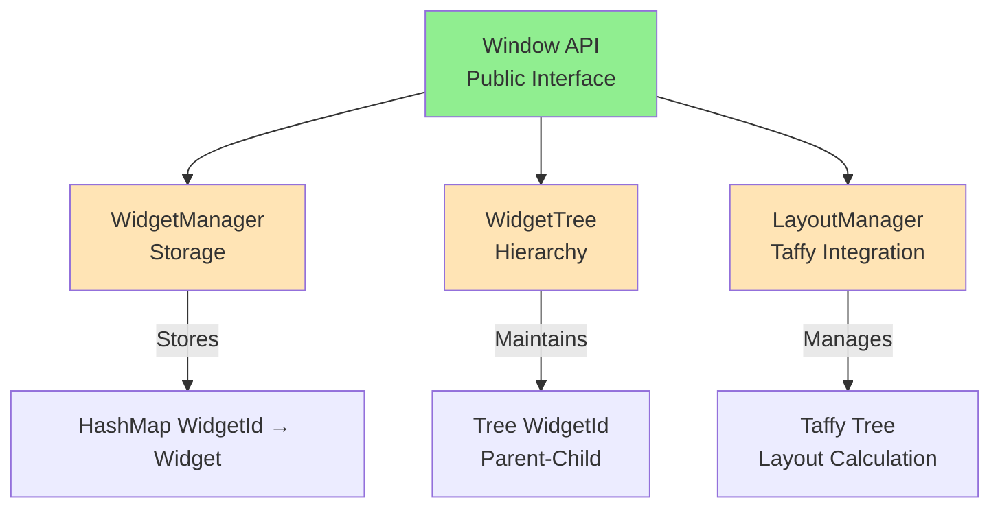
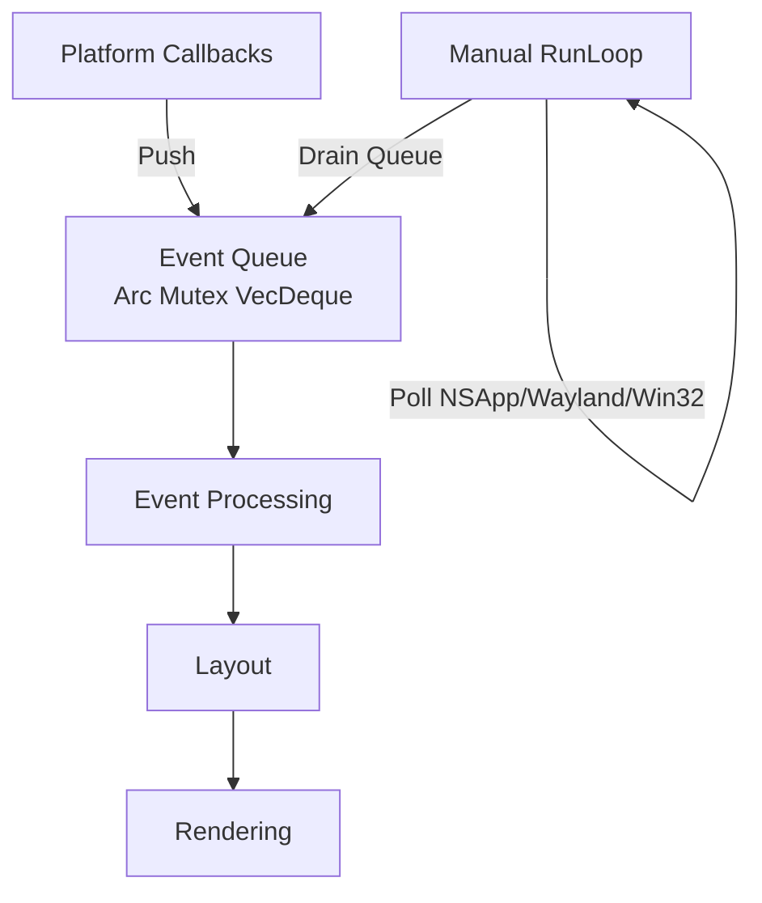

# AssortedWidgets Architecture

> **Last Updated:** 2025-12-24
> **Status:** Phase 4.0 - Architectural Refactor (Widget System Unification)

This document describes the current architecture of AssortedWidgets and planned future features.

## Table of Contents

1. [Core Principles](#core-principles)
2. [Widget System Architecture](#widget-system-architecture)
3. [Event System](#event-system)
4. [Layout System](#layout-system)
5. [Rendering Architecture](#rendering-architecture)
6. [Text Rendering](#text-rendering)
7. [Animation System](#animation-system)
8. [Theme System](#theme-system)
9. [Multi-Window Architecture](#multi-window-architecture)
10. [Memory Management](#memory-management)
11. [Performance Considerations](#performance-considerations)

---

## Core Principles

### 1. Flexibility over Convenience
Provide low-level WebGPU access alongside high-level abstractions. Simple apps use primitives, complex apps access the render pass directly.

### 2. Compile-Time Safety over Runtime Flexibility
Event queue with direct ownership instead of RefCell/Rc. No runtime borrow checking panics.

### 3. Cross-Platform Consistency
Manual event loop control works the same on macOS, Windows, and Linux.

### 4. Clean Developer API
Internal complexity hidden behind minimal, intuitive public APIs. Developers work with widgets, not internal data structures.

---

## Widget System Architecture

**Philosophy:** Developers should only work with a clean widget API. Internal data structures (WidgetManager, WidgetTree, LayoutManager) are implementation details and completely hidden.

### Three-System Architecture

AssortedWidgets maintains three coordinated systems internally:



#### 1. WidgetManager (Storage)
```rust
// Internal - not exposed to developers
struct WidgetManager {
    widgets: HashMap<WidgetId, Box<dyn Widget>>,
}
```

**Purpose:** Store widget data (O(1) lookup by ID)

#### 2. WidgetTree (Hierarchy)
```rust
// Internal - not exposed to developers
struct WidgetTree {
    root: Option<TreeNode>,
}

struct TreeNode {
    widget_id: WidgetId,
    children: Vec<TreeNode>,
}
```

**Purpose:** Maintain parent-child relationships for ALL widgets (normal + floating)

**Why needed:**
- Event bubbling (child → parent → grandparent)
- Z-order / paint order (tree traversal)
- Parent context (tooltips know their parent button)

#### 3. LayoutManager (Taffy Integration)
```rust
// Internal - not exposed to developers
struct LayoutManager {
    taffy: Taffy,
    widget_to_node: HashMap<WidgetId, NodeId>,
}
```

**Purpose:** Layout calculation for layout-participating widgets only

**Note:** Floating widgets (tooltips, modals) are NOT in Taffy, only in WidgetTree.

---

### WidgetId vs NodeId Design Decision

**Question:** Why not use Taffy's `NodeId` directly as `WidgetId`?

**Answer:** They serve different purposes and must remain separate.

#### Problems with using NodeId as WidgetId:

1. **Not Serializable**
   - `NodeId` is tied to a specific Taffy instance
   - Can't save/restore widget IDs across sessions
   - Can't share widget IDs between contexts

2. **Taffy-Owned Generation**
   - Only Taffy can create `NodeId`s
   - Can't create widgets without immediately adding to layout
   - Couples widget lifecycle to layout participation

3. **Floating Widgets**
   - Tooltips, modals, popups don't participate in layout
   - Would need fake Taffy nodes with `Display::None`
   - Awkward and error-prone

4. **Lifecycle Independence**
   - Widgets should exist before being added to layout
   - Widgets can be removed from layout but kept alive
   - Widget identity shouldn't depend on layout state

#### Benefits of separate WidgetId:

- ✅ **Decoupling:** Widget identity independent of layout system
- ✅ **Flexibility:** Create widgets before layout, remove from layout but keep alive
- ✅ **Floating elements:** Tooltips/modals don't need layout nodes
- ✅ **Serialization:** Can save/restore widget IDs
- ✅ **Simplicity:** Mapping is trivial (`HashMap<WidgetId, NodeId>`)

#### Floating Widget Support:

Taffy supports `Display::None`, but for truly floating widgets (modals, tooltips, drag previews), we simply don't create Taffy nodes for them. They exist in:
- ✅ WidgetManager (storage)
- ✅ WidgetTree (hierarchy for events)
- ❌ LayoutManager (no layout participation)

---

### Clean Developer API

**Design Principle:** Developers NEVER manipulate internal data structures directly. All operations go through a minimal Window API.

```rust
// Public API - simple and intuitive
impl Window {
    /// Add a root widget to the window
    /// Automatically registers in all three internal systems
    pub fn add_root(&mut self, widget: Box<dyn Widget>, style: Style) -> WidgetId;

    /// Add a child widget under a parent
    /// Automatically registers in all three internal systems
    pub fn add_child(&mut self, parent: WidgetId, widget: Box<dyn Widget>, style: Style) -> WidgetId;

    /// Add a floating widget (tooltip, modal, popup)
    /// Registers in WidgetManager and WidgetTree, but NOT in layout
    pub fn add_floating(&mut self, parent: WidgetId, widget: Box<dyn Widget>) -> WidgetId;

    /// Remove a widget and all its children
    /// Automatically removes from all internal systems
    pub fn remove(&mut self, widget_id: WidgetId);

    /// Get immutable widget reference
    pub fn get(&self, widget_id: WidgetId) -> Option<&dyn Widget>;

    /// Get mutable widget reference
    pub fn get_mut(&mut self, widget_id: WidgetId) -> Option<&mut dyn Widget>;
}
```

**Internal Implementation (hidden from developers):**
```rust
// Inside Window::add_child() - developers never see this
fn add_child(&mut self, parent: WidgetId, widget: Box<dyn Widget>, style: Style) -> WidgetId {
    let widget_id = widget.id();

    // 1. Add to WidgetManager (storage)
    self.widget_manager.add(widget);

    // 2. Add to WidgetTree (hierarchy)
    self.widget_tree.add_child(parent, widget_id);

    // 3. Add to LayoutManager if has layout style (Taffy)
    if style.display != Display::None {
        self.layout_manager.create_node(widget_id, style);
        self.layout_manager.add_child(parent, widget_id);
    }

    widget_id
}
```

**Key Benefits:**
- ✅ Single point of truth (Window API)
- ✅ No manual synchronization needed
- ✅ Impossible to create inconsistent state
- ✅ Compile-time safety (can't access internal structures)
- ✅ Simple mental model for developers

---

### Terminology Update

**Old naming (inconsistent):**
- `Element` trait - confusing, borrowed from HTML
- `ElementManager` - but widgets have `WidgetId` (??)
- Project called "AssortedWidgets" but no Widget concept

**New naming (consistent):**
- `Widget` trait - clear, matches domain
- `WidgetManager` - manages widgets with `WidgetId` ✅
- Aligns with "AssortedWidgets" branding ✅

**Rationale:** HTML uses "element" because it's a document model (nested `<div>`, `<span>`, etc.). We're building a GUI framework where widgets paint themselves. No need for sub-widget granularity. Widget is the atomic unit.

---

## Event System

**Architecture:** Event Queue + Manual RunLoop



**Key Components:**
- Platform callbacks push events to `Arc<Mutex<VecDeque<GuiEvent>>>`
- Main loop polls platform events and drains queue with direct mutable access
- No RefCell - compile-time borrow checking only

**Event Bubbling via WidgetTree:**
- Click on child widget → bubble to parent → bubble to grandparent
- WidgetTree provides parent-child relationships for bubbling
- Works for both normal and floating widgets (tooltips bubble to their parent)

**IME Support:**
- Marked text ranges for candidate selection
- Composition events sent to focused widget
- Platform-specific IME coordinate conversions

---

## Layout System

**Architecture:** Taffy 0.9 Integration with Measure Functions

### Bidirectional Layout Flows

**Flow 1: Window Resize (Root → Leaves)**
```
Window Resize → Taffy compute_layout() → Update Widget Bounds
```

**Flow 2: Content Change (Leaves → Root)**
```
Widget.mark_needs_layout() → Set Dirty Flag → Taffy Recompute → Update Bounds
```

### Measure Functions

Widgets with intrinsic size (text, images) implement measure functions:

```rust
fn measure(
    &self,
    known_dimensions: taffy::Size<Option<f32>>,
    available_space: taffy::Size<AvailableSpace>,
) -> Option<Size>
```

Taffy calls measure functions during layout to query content-based dimensions.

### Integration

- Each layout-participating `Widget` has a `NodeId` in LayoutManager
- `LayoutManager` wraps Taffy tree and maintains `WidgetId → NodeId` mapping
- Layout runs before rendering if dirty flag is set
- Floating widgets (tooltips, modals) don't have Taffy nodes

---

## Rendering Architecture

**Architecture:** Multi-Tiered Context

### Tier 1: High-Level Primitives
```rust
pub struct PaintContext<'a> {
    // Batched 2D primitives
    rects: Vec<RectInstance>,
    sdf_commands: Vec<DrawCommand>,
    text: Vec<TextInstance>,
    // ...
}
```

**Current Methods:**
- `draw_rect()` - filled rectangles
- `draw_styled_rect()` - rounded corners with borders (SDF)
- `draw_text()` - managed text with caching
- `draw_layout()` - manual text layout control
- `create_text_layout()` - text shaping with truncation

### Tier 2: Raw WebGPU Access (Future)
```rust
impl Widget for My3DWidget {
    fn paint(&self, ctx: &mut PaintContext) {
        // Custom rendering with direct WebGPU access (future)
        ctx.render_pass.set_pipeline(&self.custom_pipeline);
        ctx.render_pass.draw(...);
    }
}
```

### Tier 3: Global Renderer

Shared resources across all windows:
- `GlyphAtlas` - texture atlas for text rendering
- `FontSystem` - font loading and fallback
- `TextEngine` - text shaping and layout cache

### Paint Order via WidgetTree

Widgets are painted in tree traversal order:
1. Parent painted first (background)
2. Children painted on top (in order)
3. Floating widgets painted last (tooltips, modals on top)

Z-order is determined by WidgetTree hierarchy, ensuring correct overlapping.

---

## Text Rendering

**Architecture:** Two-Tier API with Shared Glyph Atlas

### Two-Tier API Design

**Tier 1: High-Level Managed API**
```rust
// Simple widgets - automatic caching
ctx.draw_text(pos, "Hello", style);
```
- TextEngine manages cache with (text, style, width) as key
- Automatic re-shaping on cache miss
- No manual lifecycle management

**Tier 2: Low-Level Manual API**
```rust
// Advanced widgets - explicit control
let layout = ctx.create_text_layout(text, style, width, truncate);
ctx.draw_layout(&layout, pos, color);
```
- Widget owns TextLayout lifecycle
- Useful for animations, hit testing, custom rendering
- Manual cache management via widget state

### Shared Glyph Atlas

**Multi-DPI Support:**
```rust
pub struct GlyphKey {
    font_id: usize,
    size_bits: u32,
    character: char,
    subpixel_offset: u8,
    scale_factor: u8,  // 100 = 1.0x, 200 = 2.0x
}
```

**Architecture:**
- Single atlas shared across all windows (Arc<Mutex<GlyphAtlas>>)
- Multi-page texture array (4096×4096 per page, RGBA8)
- Window moves between displays? Both DPIs cached, no invalidation
- Glyphs uploaded on-demand during rendering

**Benefits:**
- Memory: ~16MB for single atlas vs ~80MB for 5 per-window atlases
- DPI transitions: Smooth with no re-rasterization
- Font system: Initialized once, ~10MB saved

### Text Features

- ✅ Text shaping with kerning and ligatures (cosmic-text)
- ✅ Bidirectional text (Arabic, Hebrew)
- ✅ Emoji rendering (color glyphs)
- ✅ Multi-line text wrapping
- ✅ Font fallback for multi-language text
- ✅ Text alignment (left, center, right)
- ✅ Ellipsis truncation with binary search
- ✅ Performance benchmarking and cache stats

---

## Animation System

**Architecture:** Frame-Based Updates with Optimization

### Widget Animation API

Widgets that need animation implement:

```rust
pub trait Widget {
    /// Update widget state each frame before layout
    fn update(&mut self, frame: &FrameInfo) {
        // Default: no update logic
    }

    /// Check if this widget needs continuous frame updates
    fn needs_continuous_updates(&self) -> bool {
        false // Default: static widget
    }
}

pub struct FrameInfo {
    pub dt: f64,              // Delta time since last frame (seconds)
    pub timestamp: Instant,   // Absolute timestamp
    pub frame_number: u64,    // Frame counter
}
```

### Animation Flow


### Frame-Rate Independent Animation

```rust
impl Widget for AnimatedRect {
    fn update(&mut self, frame: &FrameInfo) {
        // Use dt for frame-rate independence
        self.rotation += self.angular_velocity * frame.dt;

        // Or use timestamp for oscillations
        let elapsed = frame.timestamp - self.start_time;
        self.scale = 1.0 + 0.2 * (elapsed.as_secs_f64() * 2.0 * PI).sin();

        // Mark layout dirty if size/position changed
        self.mark_needs_layout();
    }

    fn needs_continuous_updates(&self) -> bool {
        true // Always animating
    }
}
```

### Optimization: Selective Updates

**Performance Strategy:**
- Window only calls `update()` on widgets returning `needs_continuous_updates() = true`
- Static widgets skip update pass entirely
- Widgets can toggle `needs_continuous_updates()` for one-shot animations

### Implementation Status

- ✅ FrameInfo struct with dt, timestamp, frame_number
- ✅ Widget::update() and needs_continuous_updates() hooks
- ✅ Window calls update() before layout each frame
- ✅ AnimatedTextLabel demo showing text truncation animation
- ⏳ Transition animations (planned)
- ⏳ Physics-based animations (planned)
- ⏳ Spring animations with damping (planned)

---

## Theme System

**Architecture:** GPU Uniform Buffer + Read-Only Struct (Planned)

### Theme Struct

```rust
pub struct Theme {
    // Colors
    pub background: Color,
    pub foreground: Color,
    pub primary: Color,
    pub accent: Color,
    pub text: Color,

    // Typography
    pub font_family: String,
    pub font_size: f32,
    pub line_height: f32,

    // Spacing
    pub padding: f32,
    pub margin: f32,
    pub border_radius: f32,

    // Shadows
    pub shadow_color: Color,
    pub shadow_offset: Vector,
    pub shadow_blur: f32,
}
```

### GPU Integration

Themes uploaded to GPU as uniform buffers:

```rust
// GPU representation (std140 layout)
#[repr(C)]
pub struct ThemeUniforms {
    background: [f32; 4],
    foreground: [f32; 4],
    primary: [f32; 4],
    // ... (padded for alignment)
}
```

**Benefits:**
- Single uniform buffer update changes entire UI theme
- Shaders automatically use theme colors
- Widgets read theme for semantic colors (not hardcoded)

---

## Multi-Window Architecture

**Architecture:** Shared Resources with Per-Window State

### Shared Resources (Arc<RenderContext>)

```rust
pub struct RenderContext {
    // GPU Resources
    pub device: Arc<wgpu::Device>,
    pub queue: Arc<wgpu::Queue>,

    // Shared Rendering Pipelines (Stateless, Created Once)
    pub rect_pipeline: RectPipeline,
    pub text_pipeline: TextPipeline,
    pub rect_sdf_pipeline: RectSdfPipeline,
    pub surface_format: wgpu::TextureFormat,

    // Rendering Resources (Arc<Mutex<>>)
    pub glyph_atlas: Arc<Mutex<GlyphAtlas>>,
    pub font_system: Arc<Mutex<FontSystemWrapper>>,
    pub text_engine: Arc<Mutex<TextEngine>>,
}
```

**Shared Across All Windows:**
- Rendering pipelines (rect, text, SDF) - stateless, created once, reused by all windows
- Single glyph atlas (~16MB) vs per-window (~80MB for 5 windows)
- Font system initialized once (~10MB saved)
- Text shaping cache reused across windows

### Per-Window Resources

```rust
pub struct WindowRenderer {
    // Surface Management
    pub surface: wgpu::Surface<'static>,
    pub config: wgpu::SurfaceConfiguration,
    pub format: wgpu::TextureFormat,

    // Per-Window Uniforms (screen size varies per window)
    rect_uniform_buffer: wgpu::Buffer,
    rect_uniform_bind_group: wgpu::BindGroup,
    text_uniform_buffer: wgpu::Buffer,
    text_uniform_bind_group: wgpu::BindGroup,
    rect_sdf_uniform_buffer: wgpu::Buffer,
    rect_sdf_uniform_bind_group: wgpu::BindGroup,

    // Dynamic Instance Buffers (reused each frame)
    rect_instance_buffer: Option<wgpu::Buffer>,
    text_instance_buffer: Option<wgpu::Buffer>,

    // Window State
    pub scale_factor: f32,
    pub render_context: Arc<RenderContext>, // Shared pipelines + atlas + fonts
}
```

**Per-Window State:**
- Surface configuration (size, format)
- Uniform buffers for screen size (varies per window)
- Instance buffers for batched rendering (dynamic)
- Scale factor for DPI
- Reference to shared RenderContext (pipelines, atlas, fonts)

### Multi-Window Event Loop

```rust
loop {
    // Poll platform events
    platform.poll_events();

    // Process event queue
    while let Some(event) = event_queue.pop() {
        match event {
            GuiEvent::WindowEvent { window_id, event } => {
                if let Some(window) = windows.get_mut(&window_id) {
                    window.handle_event(event);
                }
            }
            GuiEvent::RedrawRequested(window_id) => {
                if let Some(window) = windows.get(&window_id) {
                    window.render();
                }
            }
        }
    }
}
```

---

## Memory Management

### Widget Storage

**Flat Hash Table:**
```rust
pub struct WidgetManager {
    widgets: HashMap<WidgetId, Box<dyn Widget>>,
}
```

**Separate Trees:**
- WidgetTree: Hierarchy for ALL widgets (normal + floating), events, paint order
- Taffy tree: Layout calculation for layout-participating widgets only

**Benefits:**
- Fast O(1) lookup by ID
- Trees store IDs only (cheap to clone/restructure)
- Widgets can exist in WidgetTree but not Taffy (floating widgets)
- Clean separation: storage vs hierarchy vs layout

### Memory Budget

- **Text Atlas:** ~16MB (4096×4096 RGBA8, shared)
- **Font System:** ~10MB (system fonts, fallback chains)
- **Layout Cache:** Minimal (Taffy is efficient)
- **Text Shaping Cache:** Grows with unique (text, style, width) combinations
- **WidgetTree:** Lightweight (just IDs and pointers)

---

## Performance Considerations

### Frame Budget (60fps = 16.67ms)

```
1-2ms   Event Processing
2-4ms   Layout (Taffy)
1-3ms   Text Shaping (cache misses)
8-10ms  Rendering (batched draw calls)
```

### Optimization Strategies

1. **Dirty Flag Propagation**
   - Only recompute layout when mark_dirty() called
   - Incremental updates where possible

2. **Batching**
   - Primitives batched by type (rects, SDF, text)
   - State changes minimized via sorting
   - Single atlas bind for all text

3. **Caching**
   - Text shaping cached indefinitely
   - Glyph rasterization cached in atlas
   - Layout results cached until dirty

4. **Animation Optimization**
   - Only call update() on widgets with needs_continuous_updates() = true
   - Static widgets skip update pass entirely
   - Widgets can toggle flag for one-shot animations

5. **Atlas Management**
   - Multi-page texture array (no reallocation)
   - Lazy LRU eviction for unused glyphs
   - Per-DPI caching for smooth transitions

6. **Unified Tree Traversal**
   - Single WidgetTree traversal for painting
   - Z-order determined by tree order (no sorting needed)
   - Event bubbling follows tree structure (no lookups)

---

## Conclusion

AssortedWidgets provides a flexible, performant foundation for GUI applications with:
- **Clean API:** Developers work with simple Window methods, not internal structures
- **Compile-time safety:** No RefCell panics
- **Low-level access:** WebGPU escape hatch for custom rendering
- **Industry-standard layout:** Taffy (Flexbox/Grid)
- **Efficient text rendering:** Shared atlas, multi-DPI support
- **Frame-rate independent animation system**
- **Multi-window support:** Shared resources save memory
- **Unified hierarchy:** WidgetTree handles events, painting, and parent-child relationships

**Architectural Advantages:**
- Three coordinated systems (WidgetManager, WidgetTree, LayoutManager) hidden behind clean API
- WidgetId independent of NodeId (supports floating widgets, serialization, decoupling)
- Consistent naming (Widget everywhere, not Element)
- Single point of truth (all operations through Window API)

Future work includes primitive batching optimizations, theme system GPU integration, and advanced animation helpers.
