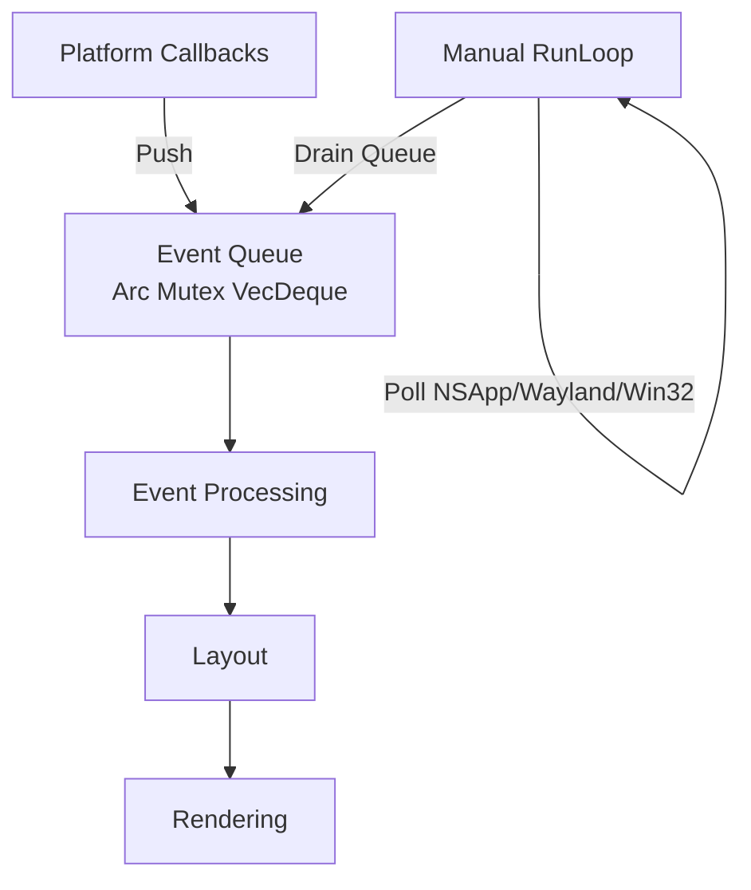
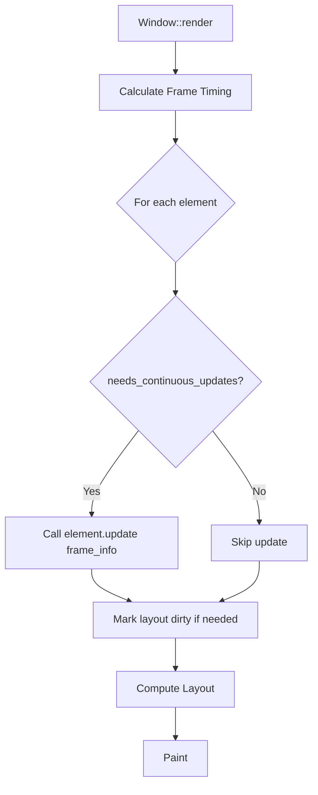

# AssortedWidgets Architecture

> **Last Updated:** 2025-12-22
> **Status:** Phase 3.3 Complete (Text Rendering + Animation System)

This document describes the current architecture of AssortedWidgets and planned future features.

## Table of Contents

1. [Core Principles](#core-principles)
2. [Event System](#event-system)
3. [Layout System](#layout-system)
4. [Rendering Architecture](#rendering-architecture)
5. [Text Rendering](#text-rendering)
6. [Animation System](#animation-system)
7. [Theme System](#theme-system)
8. [Multi-Window Architecture](#multi-window-architecture)
9. [Memory Management](#memory-management)
10. [Performance Considerations](#performance-considerations)

---

## Core Principles

### 1. Flexibility over Convenience
Provide low-level WebGPU access alongside high-level abstractions. Simple apps use primitives, complex apps access the render pass directly.

### 2. Compile-Time Safety over Runtime Flexibility
Event queue with direct ownership instead of RefCell/Rc. No runtime borrow checking panics.

### 3. Cross-Platform Consistency
Manual event loop control works the same on macOS, Windows, and Linux.

---

## Event System

**Architecture:** Event Queue + Manual RunLoop



**Key Components:**
- Platform callbacks push events to `Arc<Mutex<VecDeque<GuiEvent>>>`
- Main loop polls platform events and drains queue with direct mutable access
- No RefCell - compile-time borrow checking only

**IME Support:**
- Marked text ranges for candidate selection
- Composition events sent to focused element
- Platform-specific IME coordinate conversions

---

## Layout System

**Architecture:** Taffy 0.9 Integration with Measure Functions

### Bidirectional Layout Flows

**Flow 1: Window Resize (Root → Leaves)**
```
Window Resize → Taffy compute_layout() → Update Element Bounds
```

**Flow 2: Content Change (Leaves → Root)**
```
Element.mark_needs_layout() → Set Dirty Flag → Taffy Recompute → Update Bounds
```

### Measure Functions

Elements with intrinsic size (text, images) implement measure functions:

```rust
fn measure(
    &self,
    known_dimensions: taffy::Size<Option<f32>>,
    available_space: taffy::Size<AvailableSpace>,
) -> Option<Size>
```

Taffy calls measure functions during layout to query content-based dimensions.

### Integration

- Each `Element` stores a `taffy::NodeId`
- `LayoutManager` wraps Taffy tree and syncs with `ElementManager`
- Layout runs before rendering if dirty flag is set

---

## Rendering Architecture

**Architecture:** Multi-Tiered Context

### Tier 1: High-Level Primitives
```rust
pub struct PaintContext<'a> {
    // Batched 2D primitives (future)
    pub primitives: &'a mut PrimitiveBatcher,

    // Current implementation: direct text/rect rendering
    // ...
}
```

**Current Methods:**
- `draw_rect()` - filled rectangles
- `draw_text()` - managed text with caching
- `draw_layout()` - manual text layout control
- `create_text_layout()` - text shaping with truncation

### Tier 2: Raw WebGPU Access
```rust
impl Element for My3DWidget {
    fn paint(&self, ctx: &mut PaintContext) {
        // Custom rendering with direct WebGPU access (future)
        ctx.render_pass.set_pipeline(&self.custom_pipeline);
        ctx.render_pass.draw(...);
    }
}
```

### Tier 3: Global Renderer

Shared resources across all windows:
- `GlyphAtlas` - texture atlas for text rendering
- `FontSystem` - font loading and fallback
- `TextEngine` - text shaping and layout cache

---

## Text Rendering

**Architecture:** Two-Tier API with Shared Glyph Atlas

### Two-Tier API Design

**Tier 1: High-Level Managed API**
```rust
// Simple widgets - automatic caching
ctx.draw_text(pos, "Hello", style);
```
- TextEngine manages cache with (text, style, width) as key
- Automatic re-shaping on cache miss
- No manual lifecycle management

**Tier 2: Low-Level Manual API**
```rust
// Advanced widgets - explicit control
let layout = ctx.create_text_layout(text, style, width, truncate);
ctx.draw_layout(&layout, pos, color);
```
- Widget owns TextLayout lifecycle
- Useful for animations, hit testing, custom rendering
- Manual cache management via widget state

### Shared Glyph Atlas

**Multi-DPI Support:**
```rust
pub struct GlyphKey {
    font_id: usize,
    size_bits: u32,
    character: char,
    subpixel_offset: u8,
    scale_factor: u8,  // 100 = 1.0x, 200 = 2.0x
}
```

**Architecture:**
- Single atlas shared across all windows (Arc<Mutex<GlyphAtlas>>)
- Multi-page texture array (4096×4096 per page, RGBA8)
- Window moves between displays? Both DPIs cached, no invalidation
- Glyphs uploaded on-demand during rendering

**Benefits:**
- Memory: ~16MB for single atlas vs ~80MB for 5 per-window atlases
- DPI transitions: Smooth with no re-rasterization
- Font system: Initialized once, ~10MB saved

### Text Features

- ✅ Text shaping with kerning and ligatures (cosmic-text)
- ✅ Bidirectional text (Arabic, Hebrew)
- ✅ Emoji rendering (color glyphs)
- ✅ Multi-line text wrapping
- ✅ Font fallback for multi-language text
- ✅ Text alignment (left, center, right)
- ✅ Ellipsis truncation with binary search
- ✅ Performance benchmarking and cache stats

---

## Animation System

**Architecture:** Frame-Based Updates with Optimization

### Element Animation API

Elements that need animation implement:

```rust
pub trait Element {
    /// Update element state each frame before layout
    fn update(&mut self, frame: &FrameInfo) {
        // Default: no update logic
    }

    /// Check if this element needs continuous frame updates
    fn needs_continuous_updates(&self) -> bool {
        false // Default: static element
    }
}

pub struct FrameInfo {
    pub dt: f64,              // Delta time since last frame (seconds)
    pub timestamp: Instant,   // Absolute timestamp
    pub frame_number: u64,    // Frame counter
}
```

### Animation Flow



### Frame-Rate Independent Animation

```rust
impl Element for AnimatedRect {
    fn update(&mut self, frame: &FrameInfo) {
        // Use dt for frame-rate independence
        self.rotation += self.angular_velocity * frame.dt;

        // Or use timestamp for oscillations
        let elapsed = frame.timestamp - self.start_time;
        self.scale = 1.0 + 0.2 * (elapsed.as_secs_f64() * 2.0 * PI).sin();

        // Mark layout dirty if size/position changed
        self.mark_needs_layout();
    }

    fn needs_continuous_updates(&self) -> bool {
        true // Always animating
    }
}
```

### Optimization: Selective Updates

**Performance Strategy:**
- Window only calls `update()` on elements that return `needs_continuous_updates() = true`
- Static elements skip update pass entirely
- Elements can toggle `needs_continuous_updates()` for one-shot animations:

```rust
impl Element for PopupAnimation {
    fn update(&mut self, frame: &FrameInfo) {
        if self.animation_progress >= 1.0 {
            self.animating = false; // Stop continuous updates
            return;
        }
        self.animation_progress += frame.dt / self.duration;
        self.mark_needs_layout();
    }

    fn needs_continuous_updates(&self) -> bool {
        self.animating
    }
}
```

### Animation vs Window Resize

**Update Flow (Time-Based):**
- Triggered by frame timer (60fps)
- Animations, physics, time-based state changes
- Elements call `mark_needs_layout()` if intrinsic size changes

**Resize Flow (Space-Based):**
- Triggered by window resize event
- Taffy recomputes layout with new available space
- No update() calls - layout drives changes

These flows are independent and complementary.

### Implementation Status

- ✅ FrameInfo struct with dt, timestamp, frame_number
- ✅ Element::update() and needs_continuous_updates() hooks
- ✅ Window calls update() before layout each frame
- ✅ AnimatedTextLabel demo showing text truncation animation
- ⏳ Transition animations (planned)
- ⏳ Physics-based animations (planned)
- ⏳ Spring animations with damping (planned)

### AnimationManager (Future Optimization - Optional)

**Current Implementation:**
The Window iterates through all elements and calls `update()` only on those returning `needs_continuous_updates() = true`.

```rust
// Current: O(n) where n = all elements
for widget_id in widget_ids {
    if let Some(element) = self.element_manager.get_mut(widget_id) {
        if element.needs_continuous_updates() {  // Fast check
            element.update(&frame_info);
        }
    }
}
```

**Potential Optimization: AnimationManager**

A dedicated AnimationManager could track which widgets need updates, avoiding iteration over static elements:

```rust
pub struct AnimationManager {
    /// WidgetIds that need continuous updates
    animating_widgets: HashSet<WidgetId>,
}

// Optimized: O(m) where m = animating elements only
for widget_id in animation_manager.animating_widgets() {
    if let Some(element) = self.element_manager.get_mut(widget_id) {
        element.update(&frame_info);
    }
}
```

**Trade-offs:**

| Aspect | Current (No Manager) | With AnimationManager |
|--------|---------------------|----------------------|
| **Iteration** | O(n) all elements | O(m) animating only |
| **Check Cost** | Virtual call per element | HashSet lookup |
| **Maintenance** | Zero overhead | Add/remove on animation start/stop |
| **Complexity** | Simple, no tracking | Need to sync with element lifecycle |
| **Memory** | Zero | HashSet storage (~8 bytes per animating widget) |

**When AnimationManager Makes Sense:**
- UI has >1000 elements with <10 animating (rare)
- Profile shows update() iteration is a bottleneck (unlikely)

**When Current Approach Is Better:**
- Most UIs have <100 elements (current approach is negligible)
- `needs_continuous_updates()` is a fast bool check (no allocation)
- Simpler code, fewer bugs

**Recommendation:**
Keep the current simple approach unless profiling shows it's a bottleneck. The virtual call overhead for `needs_continuous_updates()` is minimal compared to actual animation work.

**Future Enhancement:**
If we add an AnimationManager later, it could provide:
- Easing functions (ease-in, ease-out, cubic-bezier)
- Spring physics (damping, stiffness)
- Animation sequencing (play A, then B)
- Pause/resume all animations

---

## Theme System

**Architecture:** GPU Uniform Buffer + Read-Only Struct (Planned)

### Theme Struct

```rust
pub struct Theme {
    // Colors
    pub background: Color,
    pub foreground: Color,
    pub primary: Color,
    pub accent: Color,
    pub text: Color,

    // Typography
    pub font_family: String,
    pub font_size: f32,
    pub line_height: f32,

    // Spacing
    pub padding: f32,
    pub margin: f32,
    pub border_radius: f32,

    // Shadows
    pub shadow_color: Color,
    pub shadow_offset: Vector,
    pub shadow_blur: f32,
}
```

### GPU Integration

Themes uploaded to GPU as uniform buffers:

```rust
// GPU representation (std140 layout)
#[repr(C)]
pub struct ThemeUniforms {
    background: [f32; 4],
    foreground: [f32; 4],
    primary: [f32; 4],
    // ... (padded for alignment)
}
```

**Benefits:**
- Single uniform buffer update changes entire UI theme
- Shaders automatically use theme colors
- Elements read theme for semantic colors (not hardcoded)

---

## Multi-Window Architecture

**Architecture:** Shared Resources with Per-Window State

### Shared Resources (Arc<RenderContext>)

```rust
pub struct RenderContext {
    // GPU Resources
    pub device: Arc<wgpu::Device>,
    pub queue: Arc<wgpu::Queue>,

    // Rendering Resources (Arc<Mutex<>>)
    pub glyph_atlas: Arc<Mutex<GlyphAtlas>>,
    pub font_system: Arc<Mutex<FontSystemWrapper>>,
    pub text_engine: Arc<Mutex<TextEngine>>,
}
```

**Shared Across All Windows:**
- Single glyph atlas (~16MB) vs per-window (~80MB for 5 windows)
- Font system initialized once (~10MB saved)
- Text shaping cache reused across windows

### Per-Window Resources

```rust
pub struct WindowRenderState {
    pub renderer: WindowRenderer,     // Window surface
    pub rect_renderer: RectRenderer,  // Stateless
    pub text_renderer: TextRenderer,  // Stateless
    pub scale_factor: f32,            // 1.0x, 2.0x, etc.
    pub render_context: Arc<RenderContext>, // Cheap Arc clone
}
```

**Per-Window State:**
- Surface configuration (size, format)
- Scale factor for DPI
- Stateless renderers (reference shared atlas)

### Multi-Window Event Loop

```rust
loop {
    // Poll platform events
    platform.poll_events();

    // Process event queue
    while let Some(event) = event_queue.pop() {
        match event {
            GuiEvent::WindowEvent { window_id, event } => {
                if let Some(window) = windows.get_mut(&window_id) {
                    window.handle_event(event);
                }
            }
            GuiEvent::RedrawRequested(window_id) => {
                if let Some(window) = windows.get(&window_id) {
                    window.render();
                }
            }
        }
    }
}
```

---

## Memory Management

### Element Storage

**Flat Hash Table:**
```rust
pub struct ElementManager {
    elements: HashMap<WidgetId, Box<dyn Element>>,
}
```

**Separate Trees:**
- Scene graph: Rendering hierarchy (Z-order, clipping)
- Layout tree: Taffy nodes (Flexbox/Grid)

**Benefits:**
- Fast O(1) lookup by ID
- Trees store IDs only (cheap to clone/restructure)
- Elements can exist in multiple trees

### Memory Budget

- **Text Atlas:** ~16MB (4096×4096 RGBA8, shared)
- **Font System:** ~10MB (system fonts, fallback chains)
- **Layout Cache:** Minimal (Taffy is efficient)
- **Text Shaping Cache:** Grows with unique (text, style, width) combinations

---

## Performance Considerations

### Frame Budget (60fps = 16.67ms)

```
1-2ms   Event Processing
2-4ms   Layout (Taffy)
1-3ms   Text Shaping (cache misses)
8-10ms  Rendering (batched draw calls)
```

### Optimization Strategies

1. **Dirty Flag Propagation**
   - Only recompute layout when mark_dirty() called
   - Incremental updates where possible

2. **Batching**
   - Primitives batched by type (rects, text)
   - State changes minimized via sorting
   - Single atlas bind for all text

3. **Caching**
   - Text shaping cached indefinitely
   - Glyph rasterization cached in atlas
   - Layout results cached until dirty

4. **Animation Optimization**
   - Only call update() on elements with needs_continuous_updates() = true
   - Static elements skip update pass entirely
   - Elements can toggle flag for one-shot animations

5. **Atlas Management**
   - Multi-page texture array (no reallocation)
   - Lazy LRU eviction for unused glyphs
   - Per-DPI caching for smooth transitions

---

## Conclusion

AssortedWidgets provides a flexible, performant foundation for GUI applications with:
- Compile-time safety (no RefCell panics)
- Low-level access (WebGPU escape hatch)
- Industry-standard layout (Taffy)
- Efficient text rendering (shared atlas, multi-DPI)
- Frame-rate independent animation system
- Multi-window support with shared resources

Future work includes primitive batching, theme system GPU integration, and advanced animation helpers.
