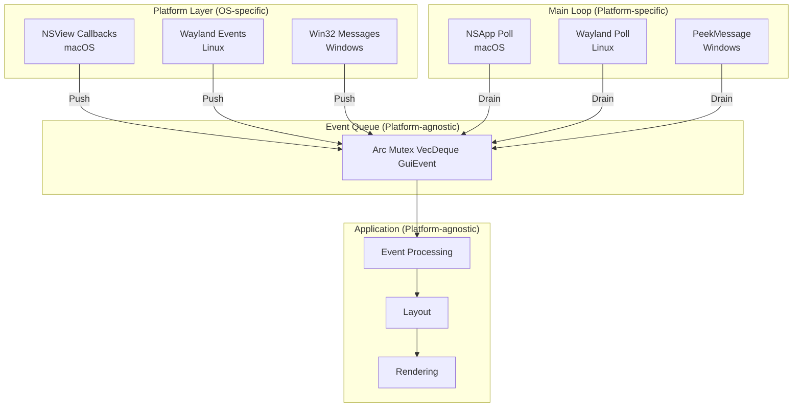
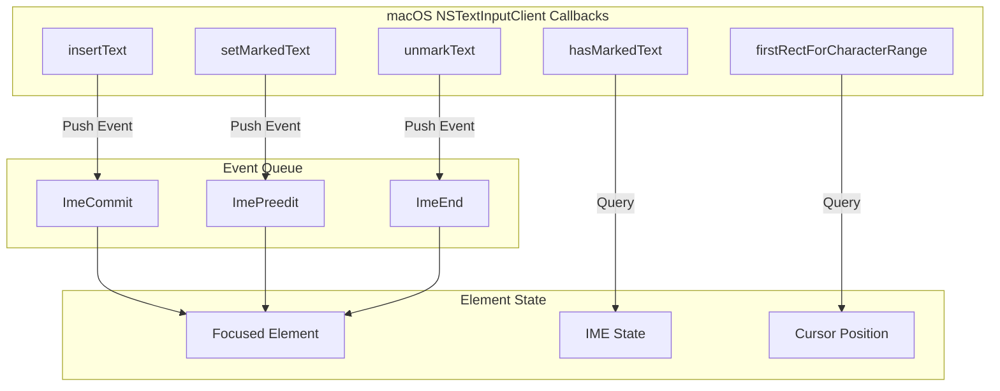
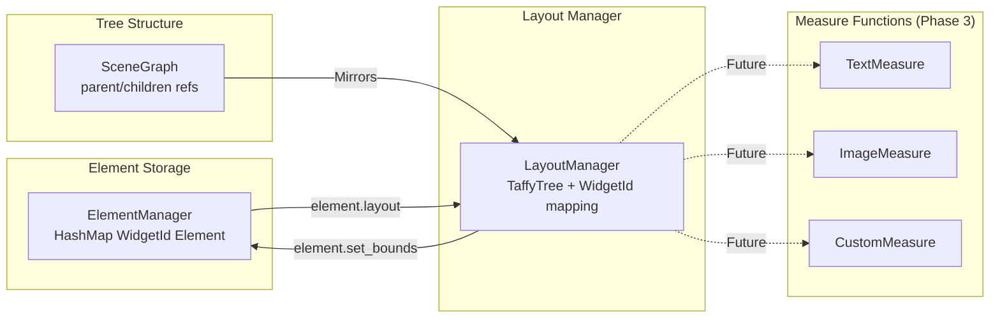
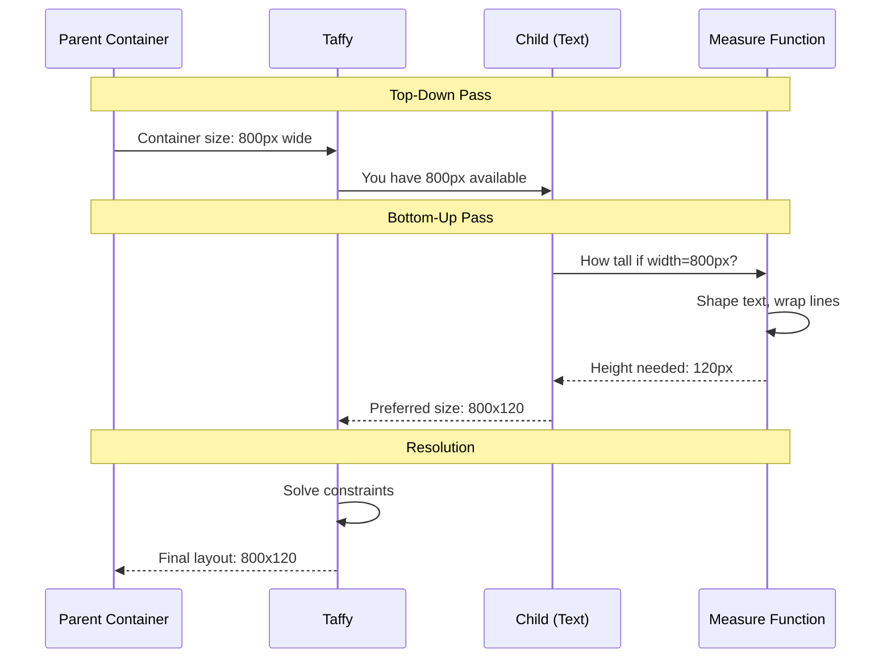
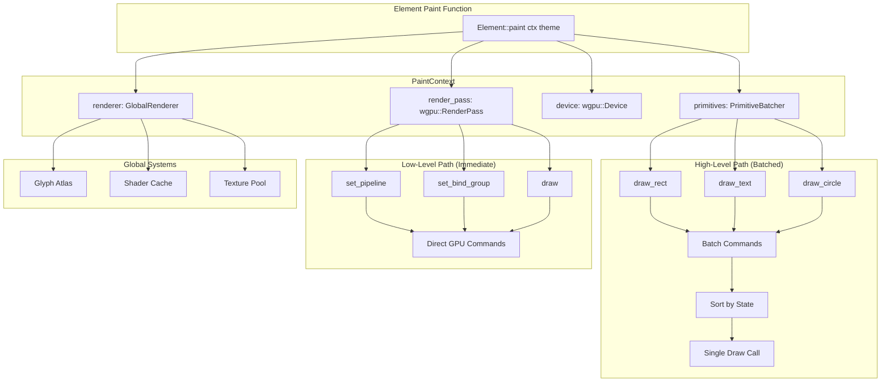
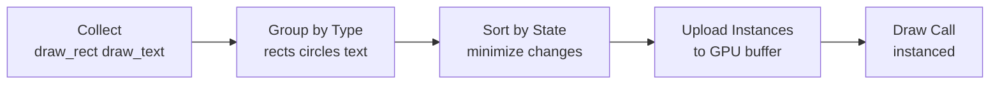
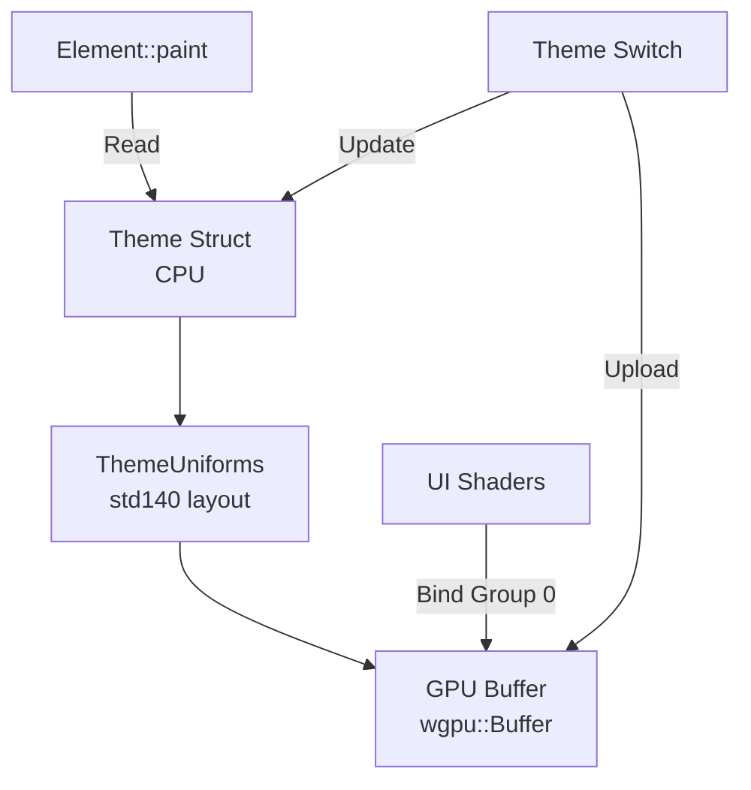
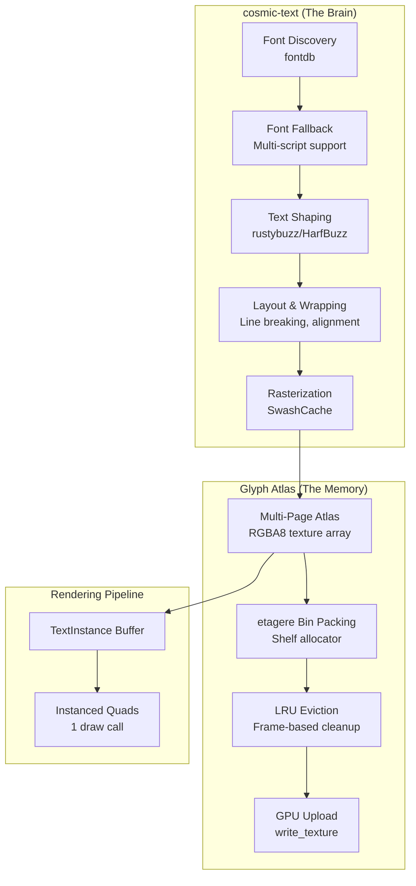

# AssortedWidgets Architecture

This document provides a detailed explanation of the architectural decisions in AssortedWidgets, the trade-offs considered, and the rationale behind each choice.

## Table of Contents

1. [Core Principles](#core-principles)
2. [Event System Architecture](#event-system-architecture)
3. [Layout System Design](#layout-system-design)
4. [Rendering Architecture](#rendering-architecture)
5. [Theme System](#theme-system)
6. [Text Rendering](#text-rendering)
7. [Memory Management](#memory-management)
8. [Performance Considerations](#performance-considerations)

---

## Core Principles

### 1. Flexibility over Convenience

**Decision:** Provide low-level access alongside high-level abstractions.

**Rationale:**
- Many GUI frameworks lock you into their rendering pipeline (e.g., gpui, egui)
- This makes it impossible to integrate custom graphics (3D viewports, games, visualizations)
- We provide escape hatches: `PaintContext` has both `primitives` and `render_pass`

**Trade-off:**
- ✅ Users can build anything (3D apps, custom renderers)
- ❌ More complex API surface
- ✅ But simple apps can ignore low-level APIs

### 2. Compile-Time Safety over Runtime Flexibility

**Decision:** Event queue with direct ownership instead of RefCell/Rc.

**Rationale:**
```rust
// Runtime borrow checking (can panic!)
let data = Rc::new(RefCell::new(state));
data.borrow_mut(); // Might panic if already borrowed

// Compile-time borrow checking
let mut data = state;
// Compiler enforces exclusive access
```

**Trade-off:**
- ✅ Impossible to panic from borrow violations
- ✅ Better performance (no runtime checks)
- ❌ Requires more careful architecture (event queue)
- ✅ But cleaner mental model

### 3. Cross-Platform Consistency

**Decision:** Manual event loop control on all platforms.

**Rationale:**
- Windows/Linux typically use polling model
- macOS uses callback model (`NSApp.run()`)
- We unify both: manual runloop + event queue works everywhere

**Trade-off:**
- ✅ Same code structure on all platforms
- ❌ Slightly more complex than native patterns
- ✅ Easier to reason about cross-platform behavior

---

## Event System Architecture

### Design: Event Queue + Manual RunLoop



### Considered Alternatives

#### Alternative 1: Callback-Based (gpui approach)

```rust
struct Window {
    renderer: Rc<RefCell<WindowRenderer>>,
}

impl Window {
    fn set_callbacks(&mut self) {
        let renderer = self.renderer.clone();
        self.callbacks.paint = Box::new(move || {
            let mut r = renderer.borrow_mut(); // Runtime check
            paint(&mut r);
        });
    }
}
```

**Why rejected:**
- Runtime borrow checking (can panic)
- Circular reference complexity
- Difficult to reason about borrowing across callbacks

#### Alternative 2: winit-style Polling

```rust
loop {
    event_loop.poll_events(|event| {
        match event {
            Event::WindowEvent { event, .. } => { ... }
        }
    });
    render();
}
```

**Why partially adopted:**
- ✅ We use similar pattern internally
- ✅ Clean ownership model
- ❌ But we add event queue layer for platform abstraction

### Implementation Details

**macOS Event Processing:**

```rust
loop {
    unsafe {
        // 1. Poll NSApplication events
        let app = NSApp();
        let until_date: id = msg_send![class!(NSDate), distantPast];

        loop {
            let event: id = msg_send![app,
                nextEventMatchingMask:0xffffffffu64
                untilDate:until_date
                inMode:NSDefaultRunLoopMode
                dequeue:1u8
            ];

            if event == nil { break; }
            let _: () = msg_send![app, sendEvent: event];
        }

        // 2. Pump runloop for timers/sources
        let run_loop: id = msg_send![class!(NSRunLoop), currentRunLoop];
        let date: id = msg_send![class!(NSDate), dateWithTimeIntervalSinceNow: 0.001f64];
        let _: () = msg_send![run_loop, runMode:NSDefaultRunLoopMode beforeDate:date];
    }

    // 3. Drain our event queue
    while let Some(event) = self.event_queue.lock().unwrap().pop_front() {
        // Direct mutable access - no RefCell!
        self.process_event(event);
    }

    // 4. Render
    if let Some(render_fn) = self.render_fn.as_mut() {
        render_fn(self.renderer.as_ref().unwrap(), &self.render_context);
    }
}
```

**Why This Works:**
- Platform callbacks run on same thread as main loop
- Callbacks push to queue and return immediately
- Main loop has exclusive access when draining queue
- No possibility of borrow conflicts

### IME (Input Method Editor) Support

**Question:** Does our polling-based event loop conflict with IME requirements?

**Answer:** No! IME works perfectly with our architecture.

**The Challenge:**

IME on macOS requires implementing the `NSTextInputClient` protocol, which has:
- **Event callbacks:** `insertText`, `setMarkedText`, `unmarkText` (composition events)
- **Query callbacks:** `hasMarkedText`, `markedRange`, `firstRectForCharacterRange` (state queries)
- **Internal state:** Composition text, cursor position, candidate window positioning

**Our Solution:**



**Implementation Strategy:**

1. **Event Callbacks → Queue** (Asynchronous, fine for IME)
```rust
impl NSTextInputClient for WindowView {
    fn insertText(&mut self, text: NSString, range: NSRange) {
        // IME composition committed (user selected candidate)
        self.event_queue.lock().unwrap().push_back(
            GuiEvent::Ime(ImeEvent::Commit {
                text: text.to_string(),
                replacement_range: Some(range),
            })
        );
    }

    fn setMarkedText(&mut self, text: NSString, selected: NSRange, replacement: NSRange) {
        // IME composition in progress (showing candidates)
        self.event_queue.lock().unwrap().push_back(
            GuiEvent::Ime(ImeEvent::Preedit {
                text: text.to_string(),
                cursor_range: Some(selected),
                replacement_range: Some(replacement),
            })
        );
    }

    fn unmarkText(&mut self) {
        // IME composition ended
        self.event_queue.lock().unwrap().push_back(
            GuiEvent::Ime(ImeEvent::End)
        );
    }
}
```

2. **Query Callbacks → Direct Access** (Synchronous, required by OS)
```rust
impl NSTextInputClient for WindowView {
    fn hasMarkedText(&self) -> bool {
        // OS queries if composition is active
        // Must answer immediately (can't queue this!)
        if let Some(focused_id) = self.focused_widget {
            self.element_manager.get(focused_id)
                .and_then(|e| e.ime_state())
                .map(|state| state.has_marked_text)
                .unwrap_or(false)
        } else {
            false
        }
    }

    fn firstRectForCharacterRange(&self, range: NSRange) -> NSRect {
        // OS needs cursor position to place candidate window
        // Must answer immediately with screen coordinates
        if let Some(focused_id) = self.focused_widget {
            self.element_manager.get(focused_id)
                .and_then(|e| e.ime_cursor_rect())
                .map(|rect| rect.to_nsrect())
                .unwrap_or_default()
        } else {
            NSRect::zero()
        }
    }

    fn markedRange(&self) -> NSRange {
        // OS queries the range of composition text
        if let Some(focused_id) = self.focused_widget {
            self.element_manager.get(focused_id)
                .and_then(|e| e.ime_state())
                .map(|state| state.marked_range)
                .unwrap_or(NSRange::NOT_FOUND)
        } else {
            NSRange::NOT_FOUND
        }
    }
}
```

3. **Element IME State** (Stored in focused element)
```rust
pub struct ImeState {
    pub has_marked_text: bool,
    pub preedit_text: String,  // Composition text (e.g., "zhong" before selecting "中")
    pub preedit_cursor: usize,  // Cursor position in composition
    pub marked_range: NSRange,  // Range being replaced
}

pub trait Element {
    // ... existing methods ...

    /// Get IME state (for query callbacks)
    fn ime_state(&self) -> Option<&ImeState> {
        None  // Default: no IME support
    }

    /// Get cursor rect for candidate window positioning
    fn ime_cursor_rect(&self) -> Option<Rect> {
        None
    }

    /// Handle IME events
    fn on_ime_event(&mut self, event: &ImeEvent) -> Vec<DeferredCommand> {
        Vec::new()  // Default: no IME support
    }
}

impl Element for TextInput {
    fn ime_state(&self) -> Option<&ImeState> {
        Some(&self.ime_state)
    }

    fn ime_cursor_rect(&self) -> Option<Rect> {
        // Calculate cursor position in screen coordinates
        Some(self.cursor_screen_rect())
    }

    fn on_ime_event(&mut self, event: &ImeEvent) -> Vec<DeferredCommand> {
        match event {
            ImeEvent::Preedit { text, cursor_range, .. } => {
                self.ime_state.has_marked_text = true;
                self.ime_state.preedit_text = text.clone();
                self.ime_state.preedit_cursor = cursor_range.location;
                // Render preedit text with underline
            }
            ImeEvent::Commit { text, .. } => {
                self.ime_state.has_marked_text = false;
                self.insert_text(text);
                // Insert final text into buffer
            }
            ImeEvent::End => {
                self.ime_state.has_marked_text = false;
                self.ime_state.preedit_text.clear();
            }
        }
        vec![DeferredCommand::RequestRedraw]
    }
}
```

**Why This Works:**

1. **Event flow is async**: IME composition events go through queue (microsecond delay is fine)
2. **Queries are sync**: OS queries about state are answered immediately from element
3. **State is local**: Each text input element maintains its own IME state
4. **No conflict**: Polling model doesn't interfere with IME callbacks

**Comparison with Winit:**

Winit handles IME similarly and it works perfectly with polling:
```rust
// Winit's approach (also event-based)
match event {
    Event::WindowEvent { event: WindowEvent::Ime(ime), .. } => {
        match ime {
            Ime::Enabled => { /* IME activated */ }
            Ime::Preedit(text, cursor) => { /* Show composition */ }
            Ime::Commit(text) => { /* Insert final text */ }
            Ime::Disabled => { /* IME deactivated */ }
        }
    }
}
```

**Decision: Event Queue + Direct Query Access**
- ✅ IME events → Queue (matches our architecture)
- ✅ IME queries → Direct element access (synchronous, as required)
- ✅ State management → Per-element IME state
- ✅ No architectural changes needed
- ✅ Polling model works perfectly for IME

**Implementation Timeline:** Phase 4 (after text rendering is working)

---

## Layout System Design

**Implementation Status:** ✅ Phase 2 Complete (Taffy 0.9 with measure function support)

### Design: Taffy 0.9 Integration with Measure Functions



### Why Taffy?

**Comparison of Layout Libraries:**

| Library | Algorithm | Maturity | Performance | Complexity |
|---------|-----------|----------|-------------|------------|
| **Taffy** | Flexbox, Grid, Block | ✅ Production | ✅ Optimized | Medium |
| **Morphorm** | Stack-based | ✅ Stable | ⚠️ Good | Low |
| **Cassowary** | Constraint solver | ⚠️ Experimental | ❌ Slow | High |
| **Custom** | N/A | ❌ Unproven | ❓ Unknown | Very High |

**Decision Factors:**
1. **Battle-tested:** Used by Bevy (game engine) and Dioxus (web framework)
2. **Web-standard:** Flexbox/Grid match CSS exactly
3. **Performance:** Handles 10,000+ nodes efficiently
4. **Maintenance:** Active development, good documentation

### Measure Functions: Taffy 0.9 Implementation

**Current Status:** ✅ Implemented with Taffy 0.9's context-based measure system

**What Measure Functions Enable:**
- Text elements that size to content
- Images with intrinsic dimensions
- Custom widgets with complex sizing logic
- Parent containers that auto-size to children

**How Taffy 0.9 Measure Functions Work:**

Taffy 0.9 uses a **context-based system** where:
1. Each node stores a `MeasureContext` with the data needed for measurement
2. A global measure function is provided to `compute_layout_with_measure()`
3. The global function dispatches based on node context

**Implementation:**

1. **Element Trait with Measure Method:**
```rust
pub trait Element {
    // ... existing methods ...

    /// Measure the element's intrinsic size given available space
    fn measure(
        &self,
        known_dimensions: taffy::Size<Option<f32>>,
        available_space: taffy::Size<AvailableSpace>,
    ) -> Option<Size> {
        None  // Default: no custom measurement
    }

    /// Check if this element needs a measure function
    fn needs_measure(&self) -> bool {
        false  // Default: static sizing
    }

    /// Mark this element as needing layout recalculation
    fn mark_needs_layout(&mut self) {
        self.set_dirty(true);
    }
}
```

2. **Layout Manager with MeasureContext:**
```rust
/// Context data stored per-node for measure functions
#[derive(Default, Clone)]
pub struct MeasureContext {
    pub widget_id: WidgetId,
    pub needs_measure: bool,
}

impl LayoutManager {
    /// Create a measurable node (for elements like text)
    pub fn create_measurable_node(&mut self, widget_id: WidgetId, style: Style) -> Result<(), String> {
        let context = MeasureContext { widget_id, needs_measure: true };
        let node = self.taffy.new_leaf_with_context(style, context)?;
        self.nodes.insert(widget_id, node);
        Ok(())
    }

    /// Compute layout with a measure function
    pub fn compute_layout_with_measure<F>(&mut self, available_size: Size, measure_fn: F) -> Result<(), String>
    where
        F: FnMut(taffy::Size<Option<f32>>, taffy::Size<AvailableSpace>, NodeId, Option<&mut MeasureContext>, &Style) -> taffy::Size<f32>,
    {
        self.taffy.compute_layout_with_measure(root, available_size, measure_fn)?;
        self.cache_layouts();
        Ok(())
    }

    /// Mark a node dirty (for content changes)
    pub fn mark_dirty(&mut self, widget_id: WidgetId) -> Result<(), String> {
        let node = self.nodes.get(&widget_id)?;
        self.taffy.mark_dirty(*node)?;
        Ok(())
    }
}
```

3. **Element Content Change Flow (Leaves → Root):**
```rust
// Example: Text element content changes
impl TextLabel {
    pub fn set_text(&mut self, new_text: String) {
        if self.text != new_text {
            self.text = new_text;
            self.mark_needs_layout();  // Sets dirty flag
        }
    }
}

// In the event loop:
// 1. Element content changes
label.set_text("New longer text that needs more space");

// 2. Element is marked dirty (via mark_needs_layout)
layout_manager.mark_dirty(label.id())?;

// 3. Next layout pass propagates changes upward
// Taffy automatically recomputes from the dirty node up to root
```

4. **GuiEventLoop Integration with Measure Function:**
```rust
impl GuiEventLoop {
    fn render_frame_internal(&mut self) {
        if self.needs_layout {
            // Compute layout with measure function
            self.layout_manager.compute_layout_with_measure(
                self.window_size,
                |known, available, _node_id, context, _style| {
                    // Dispatch to element's measure method
                    if let Some(ctx) = context {
                        if ctx.needs_measure {
                            if let Some(element) = self.element_manager.get(ctx.widget_id) {
                                if let Some(size) = element.measure(known, available) {
                                    return taffy::Size {
                                        width: size.width as f32,
                                        height: size.height as f32,
                                    };
                                }
                            }
                        }
                    }
                    taffy::Size::ZERO
                },
            )?;

            // Apply layout results to elements
            for widget_id in self.element_manager.widget_ids() {
                if let Some(bounds) = self.layout_manager.get_layout(widget_id) {
                    if let Some(element) = self.element_manager.get_mut(widget_id) {
                        element.set_bounds(bounds);
                    }
                }
            }
        }
    }
}
```

**Advantages of Taffy 0.9's Approach:**
- ✅ No ownership issues - context is copyable data, not closures
- ✅ Single global measure function - simple dispatch logic
- ✅ Efficient - measure functions can borrow external resources (like font registries)
- ✅ Flexible - easy to add new measurable types

### Constraint Solving: Bi-Directional Flow

**Problem:** How do we handle both cases?
- Parent determines child size (split view: 50/50)
- Child determines parent size (auto-sizing text)



**Taffy's Algorithm:**

1. **Define Constraints:**
   ```rust
   // Parent: fixed width, auto height
   Style {
       size: Size {
           width: Dimension::Points(800.0),
           height: Dimension::Auto,
       },
   }

   // Child: auto size, measure function
   Style {
       size: Size {
           width: Dimension::Auto,
           height: Dimension::Auto,
       },
       // measure_func set to text measurer
   }
   ```

2. **First Pass (Top-Down):**
   - Parent gets 800px width from window
   - Child is given 800px available width

3. **Second Pass (Measure):**
   - Child's measure function shapes text in 800px
   - Returns intrinsic height (120px)

4. **Third Pass (Resolution):**
   - Parent sets height to fit child (120px)
   - Child gets final 800x120 box

**Circular Dependencies:**

What if child is 50% of parent, but parent is auto-sized to child?

```rust
// This creates a circular dependency!
parent_style.size.height = Auto;          // Needs child height
child_style.size.height = Percent(0.5);   // Needs parent height
```

Taffy resolves this using:
- **Default to content:** Auto becomes intrinsic size
- **Break cycles:** Percentage of Auto becomes 0
- **Warnings:** Invalid layouts logged in debug mode

---

## Bidirectional Layout Flows

The layout system handles two primary update flows: **window resizes** (root to leaves) and **content changes** (leaves to root).

### Flow 1: Window Resize (Root → Leaves)

When the window resizes, layout must be recalculated from the root downward.

**Trigger:** User resizes the window or container

**Flow:**
```rust
// 1. Window resize event
GuiEvent::Resize(new_bounds) => {
    self.window_size = new_bounds.size;
    self.needs_layout = true;
}

// 2. Next frame: recompute layout from root
if self.needs_layout {
    // Root node gets new window size as constraint
    self.layout_manager.compute_layout(self.window_size)?;

    // Results propagate down: each element gets new bounds
    for widget_id in self.element_manager.widget_ids() {
        if let Some(bounds) = self.layout_manager.get_layout(widget_id) {
            element.set_bounds(bounds);
        }
    }

    self.needs_layout = false;
}
```

**Process:**
1. **Root receives new size** - Window dimensions become root constraints
2. **Taffy DFS traversal** - Depth-first search computes each node
3. **Parent constrains children** - Each parent passes `AvailableSpace` to children
4. **Children calculate size** - Based on parent constraints and their Style
5. **Results bubble up** - Final sizes are cached in LayoutManager
6. **Bounds applied** - Each element gets updated bounds via `set_bounds()`

**Example:**
```rust
// Window: 1024x768 → 1280x800
// Root container: size = 100%
// Child panels: 50% width each

// Before resize:
left_panel.bounds = Rect { x: 0, y: 0, width: 512, height: 768 }
right_panel.bounds = Rect { x: 512, y: 0, width: 512, height: 768 }

// After resize:
left_panel.bounds = Rect { x: 0, y: 0, width: 640, height: 800 }
right_panel.bounds = Rect { x: 640, y: 0, width: 640, height: 800 }
```

---

### Flow 2: Content Change (Leaves → Root)

When an element's content changes (like text growing), layout recalculates from that node upward.

**Trigger:** Element content/data changes

**Flow:**
```rust
// 1. Element content changes
impl TextLabel {
    pub fn set_text(&mut self, new_text: String) {
        if self.text != new_text {
            self.text = new_text;

            // Mark this node as needing re-measurement
            self.mark_needs_layout();
        }
    }
}

// 2. Mark node dirty in layout tree
layout_manager.mark_dirty(label_id)?;

// 3. Next frame: Taffy recomputes from dirty node
// Taffy automatically propagates changes upward:
// - Dirty node remeasured
// - Parent resizes if needed (if parent is auto-sized)
// - Grandparent resizes if needed
// - Stops when fixed-size ancestor is reached
self.layout_manager.compute_layout_with_measure(self.window_size, measure_fn)?;
```

**Process:**
1. **Content changes** - Element modifies its data (text, image, etc.)
2. **mark_dirty called** - Element calls `layout_manager.mark_dirty(id)`
3. **Taffy marks node** - Node flagged for re-measurement
4. **Next layout pass** - `compute_layout_with_measure()` called
5. **Measure function runs** - Element's `measure()` method calculates new size
6. **Parent recalculates** - If parent is auto-sized, it grows/shrinks to fit
7. **Propagation stops** - When fixed-size ancestor is reached

**Example:**
```rust
// Label with text: "Hi" → "Hello World, this is a very long text"
// Parent container: width = auto (fits content)
// Grandparent: width = 800px (fixed)

// Before text change:
label.measure() → Size { width: 20, height: 16 }
parent.bounds → Rect { width: 24, height: 20 }  // 20 + 4px padding
grandparent.bounds → Rect { width: 800, height: 600 }  // Fixed

// After text change:
label.mark_dirty()  // Mark for remeasurement
// Next layout:
label.measure() → Size { width: 300, height: 16 }  // Text wrapped
parent.bounds → Rect { width: 304, height: 20 }  // Grows to fit
grandparent.bounds → Rect { width: 800, height: 600 }  // Unchanged (fixed size)
```

---

### When to Use Each Flow

| Scenario | Flow | Method | Notes |
|----------|------|--------|-------|
| Window resize | Root → Leaves | `compute_layout()` | Entire tree recomputed |
| Container resize | Root → Leaves | `compute_layout()` | Entire tree recomputed |
| Text content change | Leaves → Root | `mark_dirty()` + `compute_layout_with_measure()` | Only dirty subtree recomputed |
| Image loaded | Leaves → Root | `mark_dirty()` + `compute_layout_with_measure()` | Only dirty subtree recomputed |
| Style change | Depends | `set_style()` + `mark_dirty()` | May affect parent or children |

---

### Optimization: Dirty Flag Propagation

Taffy is smart about what to recompute:

```rust
// Scenario: 1000-element tree, one label text changes

// Naive approach: Recompute entire tree
// Cost: O(N) where N = 1000 elements

// Taffy's approach: Only recompute dirty path
// Cost: O(log N) where log N ≈ depth to root (typically 5-10 levels)

// Example tree:
//   Root (clean)
//   ├─ Panel A (clean)
//   │  ├─ Button 1 (clean)
//   │  └─ Button 2 (clean)
//   └─ Panel B (DIRTY - child changed)
//      ├─ Label (DIRTY - text changed) ← Only this node marked dirty
//      └─ Icon (clean)

// Taffy recomputes:
// 1. Label (dirty) - remeasures text
// 2. Panel B (parent of dirty) - may resize to fit
// 3. Root (grandparent of dirty) - may resize to fit
// 4. Skips Panel A and its children (clean subtree)
```

**Performance Benefits:**
- ✅ Text edits only recompute ~5-10 nodes (not 1000s)
- ✅ Window resize still recomputes all (necessary)
- ✅ Responsive UI even with complex trees

---

### Integration Strategy (Phase 2 Complete)

**LayoutManager Structure:**

```rust
// src/layout/manager.rs
pub struct LayoutManager {
    /// The Taffy layout engine
    taffy: TaffyTree,

    /// Mapping from our WidgetId to Taffy's NodeId
    nodes: HashMap<WidgetId, NodeId>,

    /// Reverse mapping for cleanup
    widget_ids: HashMap<NodeId, WidgetId>,

    /// Cached layout results (updated after compute_layout)
    layouts: HashMap<WidgetId, Rect>,

    /// Root node (represents the window)
    root: Option<NodeId>,
}
```

**Creating Layout Nodes:**

```rust
impl LayoutManager {
    pub fn create_node(&mut self, widget_id: WidgetId, style: Style) -> Result<(), String> {
        // Create Taffy leaf node
        let node_id = self.taffy.new_leaf(style)
            .map_err(|e| format!("Failed to create node: {:?}", e))?;

        // Store bidirectional mapping
        self.nodes.insert(widget_id, node_id);
        self.widget_ids.insert(node_id, widget_id);

        Ok(())
    }

    pub fn add_child(&mut self, parent_id: WidgetId, child_id: WidgetId) -> Result<(), String> {
        let parent_node = self.nodes.get(&parent_id)
            .ok_or_else(|| format!("Parent widget {:?} not found", parent_id))?;
        let child_node = self.nodes.get(&child_id)
            .ok_or_else(|| format!("Child widget {:?} not found", child_id))?;

        // Link in Taffy tree
        self.taffy.add_child(*parent_node, *child_node)
            .map_err(|e| format!("Failed to add child: {:?}", e))?;

        Ok(())
    }

    pub fn set_root(&mut self, widget_id: WidgetId) -> Result<(), String> {
        let node = self.nodes.get(&widget_id)
            .ok_or_else(|| format!("Widget {:?} not found", widget_id))?;
        self.root = Some(*node);
        Ok(())
    }
}
```

**Computing Layout:**

```rust
impl LayoutManager {
    pub fn compute_layout(&mut self, available_size: Size) -> Result<(), String> {
        let root = self.root
            .ok_or_else(|| "No root node set".to_string())?;

        // Compute layout starting from root (f64 → f32 conversion)
        self.taffy.compute_layout(
            root,
            taffy::Size {
                width: AvailableSpace::Definite(available_size.width as f32),
                height: AvailableSpace::Definite(available_size.height as f32),
            }
        ).map_err(|e| format!("Failed to compute layout: {:?}", e))?;

        // Cache results for fast lookup
        self.cache_layouts();

        Ok(())
    }

    /// Cache layout results from Taffy
    fn cache_layouts(&mut self) {
        self.layouts.clear();

        for (widget_id, node_id) in &self.nodes {
            if let Ok(layout) = self.taffy.layout(*node_id) {
                // f32 → f64 conversion for our types
                self.layouts.insert(*widget_id, Rect {
                    origin: Point::new(layout.location.x as f64, layout.location.y as f64),
                    size: Size::new(layout.size.width as f64, layout.size.height as f64),
                });
            }
        }
    }

    /// Get the cached layout for a widget
    pub fn get_layout(&self, widget_id: WidgetId) -> Option<Rect> {
        self.layouts.get(&widget_id).copied()
    }
}
```

**GuiEventLoop Integration:**

The layout system integrates into the event loop's render cycle:

```rust
impl GuiEventLoop {
    fn render_frame_internal(&mut self) {
        // 1. Compute layout if needed
        if self.needs_layout {
            self.layout_manager.compute_layout(self.window_size).unwrap();

            // Apply layout results to elements
            // Note: Uses flat iteration (arbitrary order is fine for setting bounds)
            let widget_ids: Vec<_> = self.element_manager.widget_ids().collect();
            for widget_id in widget_ids {
                if let Some(bounds) = self.layout_manager.get_layout(widget_id) {
                    if let Some(element) = self.element_manager.get_mut(widget_id) {
                        element.set_bounds(bounds);
                    }
                }
            }

            self.needs_layout = false;
        }

        // 2. Paint elements in tree order (collect draw commands)
        // IMPORTANT: Uses scene graph traversal for correct rendering order
        let mut paint_ctx = PaintContext::new(self.window_size);
        if let Some(root) = self.scene_graph.root() {
            root.traverse(&mut |widget_id| {
                if let Some(element) = self.element_manager.get(widget_id) {
                    element.paint(&mut paint_ctx);
                }
            });
        }

        // 3. Render batched primitives
        self.rect_renderer.render(&self.render_context, &mut render_pass, paint_ctx.rect_instances());
    }
}
```

**Key Design Points:**

1. **Separation of Concerns:** LayoutManager handles only layout computation, not element storage
2. **Caching:** Layout results are cached for O(1) lookup after computation
3. **Type Conversions:** Careful f32 ↔ f64 conversions between Taffy (f32) and our types (f64)
4. **Error Handling:** All Taffy operations return `Result` for robustness
5. **No Duplication:** ElementManager stores elements, LayoutManager stores only layout state
6. **Two Tree Structures:**
   - **LayoutManager** (Taffy tree): Computes element positions via Flexbox/Grid
   - **SceneGraph** (our tree): Determines rendering order via depth-first traversal
   - Both mirror the same hierarchy but serve different purposes

**Layout Invalidation Flow:**

```rust
// 1. Event triggers layout invalidation
GuiEvent::Resize(bounds) => {
    self.window_size = bounds.size;
    self.needs_layout = true;  // Mark dirty
}

// 2. Next frame checks flag
if self.needs_layout {
    // Recompute all positions
    self.layout_manager.compute_layout(self.window_size)?;

    // Apply to elements (order doesn't matter)
    for widget_id in self.element_manager.widget_ids() {
        element.set_bounds(layout_manager.get_layout(widget_id));
    }
}

// 3. Paint uses scene graph traversal (order matters!)
self.scene_graph.root().traverse(|widget_id| {
    element_manager.get(widget_id).paint(&mut ctx);
});
```

---

## Rendering Architecture

**Implementation Status:** ✅ Phase 1 Complete (Rectangle batching, no theme system or text yet)

### Design: Multi-Tiered Context

The core innovation of AssortedWidgets is the **multi-tiered rendering system** that supports both themed UI and custom graphics.

**Phase 1 Implementation:** Basic batched rectangle rendering with instancing. Theme system and text rendering are planned for future phases.



### Phase 1: Basic Batched Rendering

**Current Implementation:**

Phase 1 implements a simplified version of the multi-tiered system focusing on batched rectangle rendering:

```rust
// src/paint/context.rs
pub struct PaintContext {
    rects: Vec<RectInstance>,
    window_size: Size,
}

impl PaintContext {
    pub fn new(window_size: Size) -> Self {
        PaintContext {
            rects: Vec::new(),
            window_size,
        }
    }

    /// Collect rectangle draw command
    pub fn draw_rect(&mut self, rect: Rect, color: Color) {
        self.rects.push(RectInstance::new(rect, color));
    }

    /// Get all collected rectangles for rendering
    pub fn rect_instances(&self) -> &[RectInstance] {
        &self.rects
    }

    pub fn clear(&mut self) {
        self.rects.clear();
    }
}
```

**RectRenderer: GPU Instanced Rendering**

```rust
// src/paint/rect_renderer.rs
pub struct RectRenderer {
    pipeline: wgpu::RenderPipeline,
    uniform_buffer: wgpu::Buffer,
    uniform_bind_group: wgpu::BindGroup,
    instance_buffer: Option<wgpu::Buffer>,
    instance_capacity: usize,
}

impl RectRenderer {
    pub fn render(
        &mut self,
        context: &RenderContext,
        render_pass: &mut wgpu::RenderPass,
        instances: &[RectInstance],
    ) {
        if instances.is_empty() {
            return;
        }

        // Create or resize instance buffer if needed
        let needed_capacity = instances.len();
        if self.instance_buffer.is_none() || needed_capacity > self.instance_capacity {
            self.instance_capacity = needed_capacity.max(128);
            self.instance_buffer = Some(device.create_buffer(&wgpu::BufferDescriptor {
                label: Some("Rect Instance Buffer"),
                size: (self.instance_capacity * std::mem::size_of::<RectInstance>()) as u64,
                usage: wgpu::BufferUsages::VERTEX | wgpu::BufferUsages::COPY_DST,
                mapped_at_creation: false,
            }));
        }

        // Upload instance data
        let instance_buffer = self.instance_buffer.as_ref().unwrap();
        context.queue().write_buffer(
            instance_buffer,
            0,
            bytemuck::cast_slice(instances),
        );

        // Render all rectangles in one draw call
        render_pass.set_pipeline(&self.pipeline);
        render_pass.set_bind_group(0, &self.uniform_bind_group, &[]);
        render_pass.set_vertex_buffer(0, instance_buffer.slice(..));
        render_pass.draw(0..4, 0..instances.len() as u32);  // 4 vertices per quad, N instances
    }
}
```

**GPU Shader (WGSL):**

```wgsl
// shaders/rect.wgsl
struct VertexInput {
    @builtin(vertex_index) vertex_idx: u32,
    @location(0) rect: vec4<f32>,     // x, y, width, height (per instance)
    @location(1) color: vec4<f32>,    // r, g, b, a (per instance)
}

@vertex
fn vs_main(in: VertexInput) -> VertexOutput {
    // Generate quad corners from vertex index (0, 1, 2, 3)
    let positions = array<vec2<f32>, 4>(
        vec2(0.0, 0.0),  // Top-left
        vec2(1.0, 0.0),  // Top-right
        vec2(0.0, 1.0),  // Bottom-left
        vec2(1.0, 1.0),  // Bottom-right
    );

    let local_pos = positions[in.vertex_idx];

    // Transform to world space using instance data
    let world_pos = vec2(
        in.rect.x + local_pos.x * in.rect.z,
        in.rect.y + local_pos.y * in.rect.w,
    );

    // Convert to clip space (-1 to 1)
    let clip_pos = vec2(
        (world_pos.x / uniforms.screen_size.x) * 2.0 - 1.0,
        1.0 - (world_pos.y / uniforms.screen_size.y) * 2.0,  // Y-flip
    );

    var out: VertexOutput;
    out.position = vec4(clip_pos, 0.0, 1.0);
    out.color = in.color;
    return out;
}

@fragment
fn fs_main(in: VertexOutput) -> @location(0) vec4<f32> {
    return in.color;
}
```

**Performance Benefits:**

- ✅ **Instancing:** All rectangles rendered in single draw call
- ✅ **GPU-side quad generation:** No vertex buffer needed, 4 vertices generated per instance in shader
- ✅ **Dynamic buffer resizing:** Grows capacity as needed (starts at 128, doubles when full)
- ✅ **Minimal CPU overhead:** Simple Vec collection during paint pass
- ✅ **Alpha blending:** Built-in support for transparent rectangles

**Rendering Order Implementation:**

To ensure proper parent→child rendering order, we traverse the scene graph instead of iterating the flat HashMap:

```rust
// ❌ WRONG: Arbitrary HashMap iteration order
for widget_id in element_manager.widget_ids() {
    element_manager.get(widget_id).paint(&mut ctx);  // Random order!
}

// ✅ CORRECT: Scene graph depth-first traversal
scene_graph.root().traverse(&mut |widget_id| {
    element_manager.get(widget_id).paint(&mut ctx);  // Tree order!
});
```

**ElementManager API Design:**

Early iterations attempted to expose iterators over `(&WidgetId, &mut dyn Element)` but hit Rust lifetime issues with trait objects. The final design uses simple ID-based lookup:

```rust
// Simplified API (no lifetime hell)
impl ElementManager {
    pub fn get(&self, id: WidgetId) -> Option<&dyn Element>;
    pub fn get_mut(&mut self, id: WidgetId) -> Option<&mut (dyn Element + '_)>;
    pub fn widget_ids(&self) -> impl Iterator<Item = WidgetId> + '_;
}

// Usage pattern: iterate IDs, lookup elements
for widget_id in element_manager.widget_ids() {
    if let Some(element) = element_manager.get_mut(widget_id) {
        element.set_bounds(bounds);
    }
}
```

**Limitations (To be addressed in Phase 2):**

- ❌ No clipping support (scrollable areas not yet possible)
- ❌ No explicit z-ordering (relies on tree traversal order)
- ❌ Only rectangles (no circles, rounded rects, lines, text)
- ❌ No theme system integration

### Tier 1: High-Level Primitives (Future Design)

**Design Goals:**
- Simple API for common operations
- Automatic batching for performance
- Theme integration
- Minimize draw calls

**API:**

```rust
pub struct PrimitiveBatcher {
    rects: Vec<RectInstance>,
    circles: Vec<CircleInstance>,
    text: Vec<TextInstance>,
}

impl PrimitiveBatcher {
    pub fn draw_rect(&mut self, rect: Rect, color: Color) {
        self.rects.push(RectInstance { rect, color });
    }

    pub fn draw_text(&mut self, pos: Point, text: &str, color: Color) {
        // Shape text, add to glyph atlas
        let shaped = self.text_renderer.shape(text);
        for glyph in shaped.glyphs {
            self.text.push(TextInstance {
                position: pos + glyph.offset,
                uv_rect: self.atlas.get_uv(glyph.id),
                color,
            });
        }
    }

    pub fn flush(&mut self, render_pass: &mut wgpu::RenderPass) {
        // Sort by pipeline state to minimize state changes
        // Draw all rects in one call
        // Draw all circles in one call
        // Draw all text in one call
    }
}
```

**Batching Strategy:**



### Tier 2: Raw WebGPU Access

**Design Goals:**
- Zero-cost abstraction
- Full wgpu API surface
- Coexist with high-level tier

**API:**

```rust
impl Element for My3DViewport {
    fn paint(&self, ctx: &mut PaintContext, theme: &Theme) {
        // Set custom pipeline
        ctx.render_pass.set_pipeline(&self.pipeline);

        // Bind scene uniforms
        ctx.render_pass.set_bind_group(0, &self.camera_bind_group, &[]);
        ctx.render_pass.set_bind_group(1, &self.lights_bind_group, &[]);

        // Bind vertex/index buffers
        ctx.render_pass.set_vertex_buffer(0, self.vertex_buffer.slice(..));
        ctx.render_pass.set_index_buffer(self.index_buffer.slice(..), wgpu::IndexFormat::Uint32);

        // Draw mesh
        ctx.render_pass.draw_indexed(0..self.index_count, 0, 0..1);

        // Can still use high-level for UI overlay
        ctx.primitives.draw_text(self.bounds.origin, "FPS: 60", theme.text);
    }
}
```

**State Management:**

Problem: High-level batching and low-level rendering must coexist.

Solution: **Deferred Batching**

```rust
// Paint pass: collect commands
for element in elements {
    element.paint(&mut ctx, &theme);
}

// Flush pass: render in correct order
// 1. High-level batched background
primitives.flush_background(render_pass);

// 2. Custom low-level (already drawn to render_pass)
// (no-op, already executed)

// 3. High-level batched foreground (text, overlays)
primitives.flush_foreground(render_pass);
```

### Tier 3: Global Renderer

**Design Goals:**
- Shared resources (atlases, shaders)
- Lifecycle management
- Performance optimization

**Structure:**

```rust
pub struct GlobalRenderer {
    // Text rendering
    glyph_atlas: GlyphAtlas,
    text_pipeline: wgpu::RenderPipeline,
    text_bind_group: wgpu::BindGroup,

    // Primitive rendering
    rect_pipeline: wgpu::RenderPipeline,
    circle_pipeline: wgpu::RenderPipeline,

    // Shared resources
    theme_uniform: wgpu::Buffer,
    sampler: wgpu::Sampler,

    // Instance buffers (reused)
    instance_buffer: wgpu::Buffer,
    instance_capacity: usize,
}
```

### Why This Design?

**Comparison with Alternatives:**

| Approach | Flexibility | Performance | Complexity |
|----------|-------------|-------------|------------|
| **Pure Immediate** (egui) | ❌ Low | ✅ Good | ✅ Simple |
| **Pure Retained** (gpui) | ❌ Medium | ✅ Best | ⚠️ Medium |
| **Multi-Tiered** (us) | ✅ High | ✅ Best | ⚠️ Higher |

**Trade-offs:**

Pure Immediate:
- ✅ Simple API
- ❌ Can't do custom graphics
- ❌ Recomputes every frame

Pure Retained:
- ✅ Best performance
- ✅ Cache-friendly
- ❌ Locked into their rendering

Multi-Tiered:
- ✅ Best of both worlds
- ✅ Custom graphics possible
- ❌ More complex API
- ✅ But complexity is opt-in

---

## Theme System

### Design: GPU Uniform Buffer + Read-Only Struct



**Theme Structure:**

```rust
#[derive(Clone, Debug)]
pub struct Theme {
    // Semantic colors
    pub background: Color,
    pub surface: Color,
    pub primary: Color,
    pub secondary: Color,
    pub error: Color,

    // Text
    pub text: Color,
    pub text_secondary: Color,
    pub text_disabled: Color,

    // Typography
    pub font_family: String,
    pub font_size: f32,
    pub font_weight: FontWeight,
    pub line_height: f32,

    // Spacing
    pub spacing_xs: f32,  // 4px
    pub spacing_sm: f32,  // 8px
    pub spacing_md: f32,  // 16px
    pub spacing_lg: f32,  // 24px
    pub spacing_xl: f32,  // 32px

    // Borders
    pub border_radius: f32,
    pub border_width: f32,
    pub border_color: Color,

    // Shadows
    pub shadow_color: Color,
    pub shadow_offset: Vector,
    pub shadow_blur: f32,
    pub shadow_spread: f32,

    // Animation
    pub animation_duration: f32,
    pub animation_easing: EasingFunction,
}

// GPU representation (must match std140 layout)
#[repr(C)]
#[derive(Copy, Clone, bytemuck::Pod, bytemuck::Zeroable)]
pub struct ThemeUniforms {
    background: [f32; 4],
    surface: [f32; 4],
    primary: [f32; 4],
    secondary: [f32; 4],
    error: [f32; 4],
    text: [f32; 4],
    text_secondary: [f32; 4],
    text_disabled: [f32; 4],

    // Scalar uniforms (packed)
    font_size: f32,
    line_height: f32,
    spacing_md: f32,
    border_radius: f32,

    border_width: f32,
    shadow_blur: f32,
    shadow_spread: f32,
    _padding: f32,  // Align to 16 bytes

    border_color: [f32; 4],
    shadow_color: [f32; 4],
    shadow_offset: [f32; 2],
    _padding2: [f32; 2],
}
```

**Why Uniform Buffer?**

Alternative: Pass theme colors individually
```rust
// ❌ Many parameters, tedious
ctx.primitives.draw_rect(rect, theme.background, theme.border_color, theme.border_width);
```

With uniform buffer:
```rust
// ✅ Shaders read from buffer automatically
ctx.primitives.draw_rect(rect, ThemeColor::Background);

// In shader:
@group(0) @binding(0) var<uniform> theme: Theme;

fn fs_main() -> @location(0) vec4<f32> {
    return theme.background;  // Reads from GPU buffer
}
```

**Performance:**
- Single buffer update per theme change
- All shaders share same buffer (1 bind)
- No per-element overhead

---

## Text Rendering

### Design Overview: Two-Tier API Architecture

AssortedWidgets provides **two complementary APIs** for text rendering to serve different use cases:

1. **High-Level Managed API**: For simple widgets (buttons, labels) with automatic caching
2. **Low-Level Manual API**: For advanced widgets (editors, terminals) with explicit control

This dual-layer approach matches how professional graphics engines (Skia, DirectWrite, Core Text) are designed.

#### cosmic-text + Multi-Page Glyph Atlas

AssortedWidgets uses **cosmic-text** as the "brain" for text handling (font discovery, fallback, shaping, wrapping) and a custom **multi-page glyph atlas** as the "memory" (GPU texture cache).



**Division of Responsibilities:**

| Component | Responsibility | Why |
|-----------|---------------|-----|
| **cosmic-text** | Font discovery, fallback, shaping, layout, rasterization | Headless library, works with any renderer |
| **GlyphAtlas** | GPU texture management, bin packing, eviction | Renderer-specific (WebGPU in our case) |
| **TextEngine** | API dispatch, LRU cache management, TextLayout creation | Bridges cosmic-text and rendering |
| **PaintContext** | Batching glyph instances for rendering | Part of our rendering tier system |

---

### Two-Tier API Design

**The Problem:** Different widgets have fundamentally different text rendering needs:

- **Simple Widgets** (buttons, checkboxes, tooltips): Display static text that rarely changes. Want convenience, don't care about caching details.
- **Advanced Widgets** (editors, terminals): Display thousands of lines, most of which never change. Need precise control over when text is shaped.

**The Solution:** Provide two levels of abstraction.

---

#### Tier 1: High-Level Managed API (For Simple Widgets)

**Use Case:** Buttons, labels, menus, tooltips, status bars.

**API:**
```rust
impl PaintContext<'_> {
    /// Draw text with automatic caching (transparently managed)
    pub fn draw_text(
        &mut self,
        text: &str,
        style: &TextStyle,
        position: Point,
        max_width: Option<f32>
    ) {
        // 1. Generate cache key from (text, style, max_width)
        // 2. Check global LRU cache
        // 3. If miss: shape text, store in cache
        // 4. Render the cached layout
    }
}
```

**Widget Developer Experience:**
```rust
impl Element for Button {
    fn paint(&self, ctx: &mut PaintContext) {
        // Zero concern for shaping or caching
        ctx.draw_text(
            &self.label,
            &TextStyle::default().size(14.0),
            self.bounds.origin,
            Some(self.bounds.width())
        );
    }
}
```

**How It Works Internally:**

1. **Cache Key Generation:**
   ```rust
   #[derive(Hash, PartialEq, Eq)]
   struct TextCacheKey {
       text: String,
       font_size_bits: u32,   // Fixed-point to avoid float hash issues
       max_width_bits: u32,
       // NOT widget ID - this allows deduplication!
   }
   ```

2. **Transparent Caching:**
   ```rust
   pub struct TextEngine {
       font_system: FontSystem,
       swash_cache: SwashCache,

       /// Global LRU cache shared by all simple widgets
       managed_cache: HashMap<TextCacheKey, CachedTextLayout>,

       /// Frame counter for generational eviction
       current_frame: u64,
   }

   struct CachedTextLayout {
       layout: TextLayout,
       last_used_frame: u64,
   }
   ```

3. **Generational Eviction:**
   ```rust
   impl TextEngine {
       /// Called every frame by event loop
       pub fn begin_frame(&mut self) {
           self.current_frame += 1;

           // Every 60 frames, clean up stale entries
           if self.current_frame % 60 == 0 {
               self.managed_cache.retain(|_, cached| {
                   self.current_frame - cached.last_used_frame < 120
               });
           }
       }

       fn get_or_create_layout(&mut self, key: TextCacheKey, text: &str) -> &TextLayout {
           self.managed_cache.entry(key)
               .or_insert_with(|| CachedTextLayout {
                   layout: self.shape_text_internal(text),
                   last_used_frame: self.current_frame,
               })
               .last_used_frame = self.current_frame;

           &self.managed_cache[&key].layout
       }
   }
   ```

**Benefits:**
- ✅ **Deduplication**: If 100 folder icons all say "Folder", it's shaped once and cached once
- ✅ **Automatic Memory Management**: Unused text disappears after 2 seconds (120 frames at 60fps)
- ✅ **Zero Developer Overhead**: Widget authors don't think about caching at all
- ✅ **Performance**: Most UI text is static, so 99% cache hits

**Trade-offs:**
- ❌ Not suitable for editors with 100,000 unique lines (would thrash the cache)
- ❌ Small hashing overhead per frame (negligible for <1000 strings)

---

#### Tier 2: Low-Level Manual API (For Advanced Widgets)

**Use Case:** Text editors, terminals, log viewers, file browsers with thousands of items.

**API:**
```rust
impl TextEngine {
    /// Shape text and return a layout object (widget owns it)
    pub fn create_layout(
        &mut self,
        text: &str,
        style: &TextStyle,
        max_width: Option<f32>,
        max_lines: Option<usize>,
    ) -> TextLayout {
        // Shapes the text and returns ownership to the caller
        // No caching - widget manages the lifecycle
    }
}

impl PaintContext<'_> {
    /// Render a pre-shaped TextLayout object
    pub fn draw_layout(
        &mut self,
        layout: &TextLayout,
        position: Point,
        color: Color,
    ) {
        // Just pushes existing glyphs to GPU batch
        // Zero shaping cost
    }
}
```

**Widget Developer Experience:**
```rust
pub struct EditorLine {
    text: String,
    /// Widget owns the shaped layout
    layout: TextLayout,
}

impl EditorWidget {
    /// Called ONLY when text changes
    pub fn update_line(&mut self, line_idx: usize, new_text: String, engine: &mut TextEngine) {
        self.lines[line_idx].text = new_text;
        self.lines[line_idx].layout = engine.create_layout(
            &self.lines[line_idx].text,
            &self.style,
            Some(self.viewport_width),
            None,
        );
    }
}

impl Element for EditorWidget {
    fn paint(&self, ctx: &mut PaintContext) {
        // Render pre-shaped layouts (zero shaping cost per frame)
        for (idx, line) in self.visible_lines() {
            ctx.draw_layout(
                &line.layout,
                Point::new(0.0, idx as f64 * self.line_height),
                self.text_color,
            );
        }
    }
}
```

**How It Works:**

1. **Widget-Owned Storage:**
   - Editor stores `Vec<EditorLine>` where each line owns a `TextLayout`
   - Terminal stores a ring buffer of `TerminalLine` with pre-shaped text
   - File browser stores `Vec<FileItem>` with cached filename layouts

2. **Precise Invalidation:**
   - When user types on line 42, only line 42's `TextLayout` is recreated
   - All other lines remain as GPU-ready primitives
   - No cache lookup overhead (widget already has the pointer)

3. **Virtualization Support:**
   - Editor only creates `TextLayout` for visible lines + small buffer
   - As user scrolls, drop off-screen layouts and create new ones
   - Sublime Text uses this exact pattern for million-line files

**Benefits:**
- ✅ **Zero Cache Contention**: Editor's data doesn't pollute the UI cache
- ✅ **Perfect Performance**: No hashing, no lookups, just render
- ✅ **Precise Control**: Widget decides exactly when to re-shape
- ✅ **Supports Virtualization**: Only shape what's visible

**Trade-offs:**
- ❌ More complex to use (widget must manage lifecycle)
- ❌ Requires understanding of when to invalidate

---

#### The TextLayout Object

**Definition:**
```rust
pub struct TextLayout {
    /// The cosmic-text buffer (holds shaped glyphs)
    buffer: cosmic_text::Buffer,

    /// Cached size for Taffy integration
    size: Size<f32>,

    /// Truncation mode (None, Clip, Ellipsis)
    truncate: Option<Truncate>,
}

impl TextLayout {
    /// Get the intrinsic size of the shaped text
    pub fn size(&self) -> Size<f32> {
        self.size
    }

    /// Hit-test: Find character index at a pixel position
    pub fn hit_test(&self, position: Point) -> Option<usize> {
        // For editor cursor positioning
    }

    /// Get the pixel rectangle for a character index
    pub fn cursor_rect(&self, index: usize) -> Option<Rect> {
        // For rendering the blinking cursor
    }

    /// Get selection rectangles (can span multiple lines)
    pub fn selection_rects(&self, start: usize, end: usize) -> Vec<Rect> {
        // For highlighting selected text
    }

    /// Access the underlying cosmic-text buffer (for advanced use)
    pub fn buffer(&self) -> &cosmic_text::Buffer {
        &self.buffer
    }
}
```

**Why This Object Exists:**

1. **Separates Shaping from Rendering**: Expensive work (shaping) happens once, cheap work (rendering) happens every frame.
2. **Editor Support**: Provides geometric queries (hit-test, cursor position) needed for text editing.
3. **Encapsulation**: The rest of the UI doesn't need to know about cosmic-text internals.

---

#### Truncation and Ellipsis

cosmic-text has built-in support via `Buffer::set_truncate`:

```rust
pub enum Truncate {
    /// Just clip the text
    Clip,
    /// Replace last visible characters with "..."
    End,
}

impl TextEngine {
    pub fn create_layout(&mut self, ..., truncate: Option<Truncate>) -> TextLayout {
        let mut buffer = Buffer::new(...);
        buffer.set_text(...);

        if let Some(mode) = truncate {
            buffer.set_truncate(&mut self.font_system, max_width, mode);
        }

        buffer.shape_until_scroll(&mut self.font_system);

        TextLayout { buffer, ... }
    }
}
```

---

#### Cache Eviction Strategy Comparison

| Strategy | Use Case | Pros | Cons |
|----------|----------|------|------|
| **Generational (Frame-Based)** | High-level managed API | Automatic, invisible to developer | Stale entries linger for ~2 sec |
| **Widget-Owned (Arc/Drop)** | Low-level manual API | Precise, immediate cleanup | Developer must manage lifecycle |
| **Manual Clear** | Screen transitions | Simple for apps with distinct screens | Not suitable for scrolling UIs |

**Recommendation:** Use both strategies for their respective tiers.

---

#### Why Not Just Use Widget IDs in Cache Keys?

**Rejected Alternative:**
```rust
struct TextCacheKey {
    widget_id: WidgetId,  // ❌ Bad idea
    text: String,
    style: TextStyle,
}
```

**Why This Is Wrong:**

If you have 1,000 folder icons in a file browser, and each has the label "Folder", using `widget_id` in the key means:
- You shape the word "Folder" **1,000 times**
- You store "Folder" **1,000 times** in memory

With content-addressable caching (no `widget_id`):
- You shape "Folder" **once**
- Every folder widget points to the same cached layout
- **999x less memory usage**

**The Trade-off:** You can't eagerly delete cache entries when a widget dies. Solution: Use generational eviction (it disappears automatically when unused).

---

### Summary: When to Use Which API

| Widget Type | API Tier | Caching Strategy | Example |
|-------------|----------|------------------|---------|
| **Button, Label, Menu** | High-Level Managed | Global LRU, frame-based eviction | `ctx.draw_text("Save", ...)` |
| **Editor, Terminal** | Low-Level Manual | Widget owns `Vec<TextLayout>` | `ctx.draw_layout(&line.layout, ...)` |
| **Tooltip, Status Bar** | High-Level Managed | Global LRU | `ctx.draw_text(&self.message, ...)` |
| **File Browser (1000+ items)** | Low-Level Manual | `Vec<FileItem>` with cached layouts | Virtualize visible items |
| **Log Viewer** | Low-Level Manual | Ring buffer of `TextLayout` | Drop old logs, keep recent |

---

### Glyph Atlas Architecture

#### Design Decision: RGBA8 for Both Text and Emoji

**Question:** Should we use separate textures for monochrome text (R8) and color emoji (RGBA8)?

**Answer:** Use a single **RGBA8 texture array** for both.

**Rationale:**
- **Uniformity:** To batch text and emoji in one draw call, they must share the same bind group
- **Trade-off:** Monochrome glyphs waste 75% of channels (only use Alpha), but:
  - Simplifies bin packing (no channel tracking)
  - Simplifies shader (single texture sampler)
  - VRAM is cheap (2048×2048 RGBA8 = 16MB)
  - Future: Can use RGB channels for MSDF (multi-channel signed distance fields) for better quality

**Alternative Considered (Rejected):**
- **Channel Packing:** Store 4 monochrome glyphs in R, G, B, A channels
  - ❌ Bin packing becomes 4D (x, y, width, height, channel)
  - ❌ Shader must branch to select correct channel
  - ❌ Can't mix with emoji

**Texture Format:**
```rust
wgpu::TextureFormat::Rgba8Unorm
```

**Shader Handling:**
```wgsl
// Instance data includes glyph type flag
struct TextInstance {
    position: vec2<f32>,
    uv_min: vec2<f32>,
    uv_max: vec2<f32>,
    color: vec4<f32>,
    glyph_type: u32,  // 0 = monochrome, 1 = color emoji
}

@fragment
fn fs_main(in: VertexOutput) -> @location(0) vec4<f32> {
    let sampled = textureSample(atlas, atlas_sampler, in.uv);

    if (in.glyph_type == 0u) {
        // Monochrome text: use alpha channel, apply color
        return vec4(in.color.rgb, in.color.a * sampled.a);
    } else {
        // Color emoji: use RGB directly, multiply alpha
        return vec4(sampled.rgb, sampled.a * in.color.a);
    }
}
```

---

#### Multi-Page Atlas with Generational Cleanup

**Problem:** Single large texture wastes memory when fragmented and can't be evicted if one glyph is still in use.

**Solution:** Multi-page atlas where each "page" is a texture layer in a `TEXTURE_2D_ARRAY`.

```rust
pub struct GlyphAtlas {
    /// Texture array (each layer is 2048×2048 RGBA8)
    texture: wgpu::Texture,
    texture_view: wgpu::TextureView,

    /// One allocator per page
    pages: Vec<GlyphPage>,

    /// Cache: (font, size, char) -> (page_index, uv_rect)
    cache: HashMap<GlyphKey, GlyphLocation>,

    /// Frame counter for LRU eviction
    current_frame: u64,
}

pub struct GlyphPage {
    /// Bin packer for this page
    allocator: etagere::BucketedAtlasAllocator,

    /// Page index in texture array
    layer_index: u32,

    /// Last frame any glyph on this page was used
    last_used_frame: u64,

    /// Number of active glyphs
    active_glyph_count: usize,
}

#[derive(Hash, Eq, PartialEq)]
pub struct GlyphKey {
    font_id: FontId,
    size_bits: u32,      // Fixed-point font size (e.g., 16.0 = 16384)
    character: char,
    subpixel_offset: u8, // 0-3 for subpixel positioning
}

pub struct GlyphLocation {
    page_index: u32,
    uv_rect: UvRect,
    last_used_frame: u64,
}
```

**Why `etagere::BucketedAtlasAllocator`?**
- Designed by Mozilla for WebRender (used in Firefox)
- **Shelf packing algorithm:** Optimized for glyphs (similar heights)
- Extremely fast (O(1) for typical cases)
- Handles thousands of allocations efficiently

**Page Lifecycle:**

1. **Creation:** Start with Page 0 (2048×2048)
2. **Filling:** As glyphs are added, `etagere` finds space
3. **90% Full:** Create Page 1 (new layer in texture array)
4. **Fragmentation:** If Page 0 has <10% active glyphs, mark for compaction
5. **Compaction:** Copy active glyphs to newer page, update UVs
6. **Eviction:** Delete old page entirely

**Memory Budget:**
- **Start:** 1 page × 2048×2048 × 4 bytes = 16 MB
- **Typical:** 2-3 pages = 48 MB (supports thousands of glyphs)
- **Max:** 8 pages = 128 MB (very large UIs with CJK text)

---

#### Eviction Strategy: Lazy LRU

**Approach:** Track last-used frame per glyph, evict Least Recently Used when space is needed.

**Why Not Ref Counting?**
- Too expensive to increment/decrement for every glyph every frame
- Doesn't handle "zombie" glyphs well (never freed if count never reaches 0)

**Frame-Based Tracking:**

```rust
impl GlyphAtlas {
    /// Called every frame by event loop
    pub fn begin_frame(&mut self) {
        self.current_frame += 1;
    }

    /// Called when a glyph is actually used in rendering
    pub fn mark_glyph_used(&mut self, key: &GlyphKey) {
        if let Some(location) = self.cache.get_mut(key) {
            location.last_used_frame = self.current_frame;

            // Update page's last-used frame
            if let Some(page) = self.pages.get_mut(location.page_index as usize) {
                page.last_used_frame = self.current_frame;
            }
        }
    }

    /// Lazy cleanup: only when we need space
    fn ensure_space(&mut self, needed: Size) -> Result<u32> {
        // Try to find space in existing pages
        for (i, page) in self.pages.iter_mut().enumerate() {
            if let Some(allocation) = page.allocator.allocate(needed) {
                return Ok(i as u32);
            }
        }

        // All pages full - check if we can compact
        if let Some(victim_page) = self.find_compactable_page() {
            self.compact_page(victim_page)?;
            return self.ensure_space(needed); // Retry
        }

        // Create new page
        self.add_new_page()
    }

    fn find_compactable_page(&self) -> Option<usize> {
        const MIN_AGE_FRAMES: u64 = 300; // ~5 seconds at 60fps
        const MAX_UTILIZATION: f32 = 0.1; // <10% active

        self.pages.iter()
            .enumerate()
            .filter(|(_, page)| {
                let age = self.current_frame - page.last_used_frame;
                let utilization = page.active_glyph_count as f32 / page.allocator.capacity() as f32;
                age > MIN_AGE_FRAMES && utilization < MAX_UTILIZATION
            })
            .map(|(i, _)| i)
            .next()
    }

    fn compact_page(&mut self, page_index: usize) {
        // 1. Find all glyphs on this page
        let glyphs_to_migrate: Vec<_> = self.cache.iter()
            .filter(|(_, loc)| loc.page_index == page_index as u32)
            .map(|(key, _)| key.clone())
            .collect();

        // 2. Migrate to newer pages
        for key in glyphs_to_migrate {
            // Re-rasterize and allocate on a different page
            self.evict_glyph(&key);
            // Next draw will re-cache it on a new page
        }

        // 3. Clear the old page (could reuse or delete)
        self.pages[page_index].allocator.clear();
        self.pages[page_index].active_glyph_count = 0;
    }
}
```

**Alternative Strategy (Simpler, Used in Phase 3.1):**
For the initial implementation, we can use a simpler approach:
- Start with one page
- When full, create a new page
- Never evict (rely on texture array growth)
- Defer compaction to Phase 3.2+

---

### cosmic-text Integration

**cosmic-text's Role:**

1. **Font Discovery:** Uses `fontdb` to find system fonts
2. **Font Fallback:** Automatically finds fonts for characters not in primary font
3. **Text Shaping:** Uses `rustybuzz` (HarfBuzz) for complex scripts (Arabic, Indic, ligatures)
4. **Layout:** Handles line breaking, word wrapping, alignment
5. **Rasterization:** `SwashCache` converts vector fonts to bitmaps

**What We Implement:**

1. **Atlas Management:** GPU texture allocation via `etagere`
2. **GPU Upload:** `wgpu::Queue::write_texture`
3. **UV Mapping:** Store texture coordinates for each glyph
4. **Batching:** Collect all glyphs into instance buffer
5. **Rendering:** Single draw call for all text

**The Bridge: SwashCache**

```rust
use cosmic_text::{FontSystem, SwashCache, Buffer, Attrs};

pub struct TextRenderer {
    /// cosmic-text systems
    font_system: FontSystem,
    swash_cache: SwashCache,

    /// Our GPU atlas
    glyph_atlas: GlyphAtlas,

    /// Batched instances
    instances: Vec<TextInstance>,
}

impl TextRenderer {
    pub fn draw_text(&mut self, buffer: &Buffer, x: f32, y: f32, color: Color) {
        // 1. Iterate through shaped glyphs from cosmic-text
        for run in buffer.layout_runs() {
            for glyph in run.glyphs {
                let key = GlyphKey {
                    font_id: glyph.font_id,
                    size_bits: glyph.font_size.to_bits(),
                    character: glyph.character,
                    subpixel_offset: (glyph.x_offset.fract() * 4.0) as u8,
                };

                // 2. Check if glyph is in atlas
                let location = match self.glyph_atlas.get(&key) {
                    Some(loc) => {
                        self.glyph_atlas.mark_glyph_used(&key);
                        loc
                    },
                    None => {
                        // 3. Rasterize using SwashCache
                        let image = self.swash_cache.get_image(
                            &self.font_system,
                            glyph.cache_key
                        )?;

                        // 4. Upload to atlas
                        let location = self.glyph_atlas.insert(
                            &key,
                            &image.data,
                            image.placement.width,
                            image.placement.height,
                            image.content == SwashContent::Color, // emoji flag
                        )?;

                        location
                    }
                };

                // 5. Add instance for rendering
                self.instances.push(TextInstance {
                    position: [x + glyph.x, y + glyph.y],
                    uv_min: [location.uv_rect.min.x, location.uv_rect.min.y],
                    uv_max: [location.uv_rect.max.x, location.uv_rect.max.y],
                    color: color.to_array(),
                    glyph_type: if location.is_color { 1 } else { 0 },
                });
            }
        }
    }

    pub fn flush(&mut self, render_pass: &mut wgpu::RenderPass) {
        // Upload instance buffer and draw all text in one call
        // ... (similar to RectRenderer pattern)
    }
}
```

---

### Rendering Pipeline

**Instance Format:**

```rust
#[repr(C)]
#[derive(Copy, Clone, Debug, bytemuck::Pod, bytemuck::Zeroable)]
pub struct TextInstance {
    pub position: [f32; 2],      // World-space position
    pub glyph_size: [f32; 2],    // Width and height in pixels
    pub uv_min: [f32; 2],        // Top-left UV in atlas
    pub uv_max: [f32; 2],        // Bottom-right UV in atlas
    pub color: [f32; 4],         // RGBA color
    pub page_index: u32,         // Which layer in texture array
    pub glyph_type: u32,         // 0 = mono, 1 = color
    pub clip_rect: [f32; 4],     // For clipping
}
```

**Shader (WGSL):**

```wgsl
// Vertex shader
struct VertexInput {
    @builtin(vertex_index) vertex_idx: u32,
    @location(0) position: vec2<f32>,
    @location(1) glyph_size: vec2<f32>,
    @location(2) uv_min: vec2<f32>,
    @location(3) uv_max: vec2<f32>,
    @location(4) color: vec4<f32>,
    @location(5) page_index: u32,
    @location(6) glyph_type: u32,
    @location(7) clip_rect: vec4<f32>,
}

struct VertexOutput {
    @builtin(position) position: vec4<f32>,
    @location(0) uv: vec2<f32>,
    @location(1) color: vec4<f32>,
    @location(2) page_index: u32,
    @location(3) glyph_type: u32,
    @location(4) world_pos: vec2<f32>,
    @location(5) clip_rect: vec4<f32>,
}

@group(0) @binding(0) var<uniform> uniforms: Uniforms;
@group(1) @binding(0) var atlas: texture_2d_array<f32>;
@group(1) @binding(1) var atlas_sampler: sampler;

@vertex
fn vs_main(in: VertexInput) -> VertexOutput {
    // Generate quad (0,0), (1,0), (0,1), (1,1)
    let corners = array<vec2<f32>, 4>(
        vec2(0.0, 0.0), vec2(1.0, 0.0),
        vec2(0.0, 1.0), vec2(1.0, 1.0),
    );
    let corner = corners[in.vertex_idx];

    // World position
    let world_pos = in.position + corner * in.glyph_size;

    // Clip space
    let clip_pos = vec2(
        (world_pos.x / uniforms.screen_size.x) * 2.0 - 1.0,
        1.0 - (world_pos.y / uniforms.screen_size.y) * 2.0,
    );

    var out: VertexOutput;
    out.position = vec4(clip_pos, 0.0, 1.0);
    out.uv = mix(in.uv_min, in.uv_max, corner);
    out.color = in.color;
    out.page_index = in.page_index;
    out.glyph_type = in.glyph_type;
    out.world_pos = world_pos;
    out.clip_rect = in.clip_rect;
    return out;
}

@fragment
fn fs_main(in: VertexOutput) -> @location(0) vec4<f32> {
    // Clipping test
    let clip_min = in.clip_rect.xy;
    let clip_max = in.clip_rect.xy + in.clip_rect.zw;
    if (in.world_pos.x < clip_min.x || in.world_pos.x > clip_max.x ||
        in.world_pos.y < clip_min.y || in.world_pos.y > clip_max.y) {
        discard;
    }

    // Sample atlas (texture array layer = page_index)
    let sampled = textureSample(atlas, atlas_sampler, in.uv, in.page_index);

    // Different handling for monochrome vs color
    if (in.glyph_type == 0u) {
        // Monochrome: use alpha channel, apply color
        return vec4(in.color.rgb, in.color.a * sampled.a);
    } else {
        // Color emoji: use RGB, multiply alpha
        return vec4(sampled.rgb, sampled.a * in.color.a);
    }
}
```

**Performance:**
- ✅ All text in UI = 1 draw call (instanced rendering)
- ✅ GPU-side quad generation (no vertex buffer)
- ✅ Texture array allows text + emoji without rebinding
- ✅ Atlas caching: rasterize once, reuse forever
- ✅ Subpixel positioning for crisp rendering

---

### Implementation Phases

The text rendering system will be implemented in three phases:

#### Phase 3.1: Character Sheet Foundation (1-2 weeks)
**Goal:** Render individual characters with font discovery and fallback

**Deliverables:**
- `GlyphAtlas` with single-page RGBA8 texture
- `etagere` bin packing integration
- `cosmic-text` font system setup
- Simple glyph rasterization (no shaping yet)
- TextRenderer with instanced quad rendering
- Can draw "Hello" with each character positioned manually

**No Layout/Shaping:** Just draw individual glyphs at specified positions

#### Phase 3.2: Text Shaping (1 week) - ✅ COMPLETE + REFACTORED

**Goal:** Proper text layout with ligatures, kerning, complex scripts

**Deliverables:**
- ✅ Integrate `cosmic-text` shaping (`Buffer` + `LayoutRun`)
- ✅ Handle ligatures (e.g., "ff", "fi", "=>")
- ✅ Support complex scripts (Arabic joining, Indic conjuncts)
- ✅ Bidirectional text (mix LTR/RTL)
- ✅ Multi-font fallback (automatic for emoji, CJK, etc.)

**Result:** Can draw shaped text strings with proper rendering

**Architecture Refactor (Dec 2025):**
After initial implementation, refactored to shared resource model:
- ✅ Added `scale_factor` to `GlyphKey` for multi-DPI support
- ✅ Created `SharedRenderState` with Arc<Mutex<>> for atlas/fonts/text engine
- ✅ Updated `WindowRenderState` to reference shared resources
- ✅ Benefits: ~80MB memory savings for 5 windows, seamless DPI transitions

#### Phase 3.3: Text Measurement & Wrapping (1 week)
**Goal:** Integrate with layout system, dynamic sizing

**Deliverables:**
- Implement `Element::measure()` for text elements
- Text wrapping based on available width
- Line breaking (word boundaries, hyphenation)
- Text truncation with ellipsis
- Multi-line text support
- `TextLabel` element that auto-sizes

**Result:** Text elements that properly integrate with Taffy layout

---

### Open Questions for Phase 3

1. **MSDF (Multi-channel Signed Distance Fields)?**
   - **Pro:** Scalable text (no blur at high DPI)
   - **Con:** More complex shader, harder to debug
   - **Decision:** Defer to Phase 4, use bitmap for Phase 3

2. **Subpixel Antialiasing?**
   - **Pro:** Crisper text on LCD screens
   - **Con:** Platform-specific, doesn't work with transparency
   - **Decision:** Support greyscale AA only, subpixel is Phase 4+

3. **Font Hinting?**
   - **Pro:** Better alignment to pixel grid at small sizes
   - **Con:** Inconsistent across platforms
   - **Decision:** Let `swash` handle it (default behavior)

4. **Text Selection & Editing?**
   - **Out of scope** for Phase 3 (rendering only)
   - Phase 5+ will add `TextInput` element with editing

---

## Memory Management

### Element Storage: Flat Hash Table + Separate Trees

AssortedWidgets uses a **data-oriented design** with three separate structures:

```rust
pub struct ElementManager {
    /// Flat storage: O(1) lookup
    elements: HashMap<WidgetId, Box<dyn Element>>,
    // ...
}

pub struct SceneGraph {
    /// Tree for rendering order
    root: Option<SceneNode>,
}

pub struct LayoutManager {
    /// Taffy tree for layout computation
    taffy: TaffyTree,
    nodes: HashMap<WidgetId, NodeId>,
    // ...
}
```

**Why Flat Storage?**

Alternative: Tree of Boxes
```rust
// ❌ Poor cache locality
struct TreeElement {
    data: ElementData,
    children: Vec<Box<TreeElement>>,
}
```

Flat storage:
```rust
// ✅ Dense, cache-friendly
HashMap<WidgetId, Element>

// ✅ O(1) lookup by ID
// ✅ Easy to iterate all elements
// ✅ No recursive traversal needed for many operations
// ✅ Multiple tree structures can reference same elements
```

**Why Separate Trees?**

Each tree serves a different purpose:

1. **ElementManager** (flat HashMap): Element storage and state
   - Fast lookup: `O(1)` by WidgetId
   - Used for: Message dispatch, property updates, bounds setting

2. **SceneGraph** (lightweight tree): Rendering order
   - Pre-order traversal: Parent → Children
   - Used for: Painting in correct z-order

3. **LayoutManager** (Taffy tree): Position computation
   - Flexbox/Grid constraint solving
   - Used for: Computing element bounds

**Benefits:**
- ✅ Each system optimized for its use case
- ✅ No need to store redundant data in tree nodes
- ✅ Easy to add new tree structures (e.g., accessibility tree)
- ✅ Separation of concerns

### Memory Budget

**Text Atlas:**
- Start: 512×512 × 1 byte = 256 KB
- Max: 4096×4096 × 1 byte = 16 MB
- LRU eviction if full (rare)

**Instance Buffers:**
- Start: 1000 instances × 32 bytes = 32 KB
- Grow as needed (2x when full)
- Reused every frame

**Layout Cache:**
- Taffy stores: ~200 bytes per node
- 10,000 nodes = 2 MB (negligible)

---

## Performance Considerations

### Frame Budget (60fps = 16.67ms)

```mermaid
gantt
    title Frame Timeline (60fps = 16.67ms)
    dateFormat X
    axisFormat %L ms

    section Event Processing
    Poll Platform Events: 0, 0.5ms
    Drain Event Queue: 0.5ms, 1ms

    section Layout (if dirty)
    Taffy Compute: 1ms, 3ms
    Copy Results: 3ms, 3.5ms

    section Paint
    Element Paint Calls: 3.5ms, 6ms
    Batch Commands: 6ms, 7ms

    section Render
    Upload Buffers: 7ms, 8ms
    GPU Draw Calls: 8ms, 10ms

    section GPU Wait
    Wait for Present: 10ms, 16ms
```

### Optimization Strategies

**1. Layout Caching:**
- Only compute on `mark_dirty`
- Dirty propagation: only ancestors affected
- Incremental layout where possible

**2. Text Shaping Cache:**
- Key: (text, font, size, width)
- Never evict (font changes are rare)
- Shaped runs reused across frames

**3. Render Batching:**
- Group by material/texture/state
- Minimize pipeline switches
- Instancing for repeated geometry

**4. GPU Pipelining:**
- Upload buffers while GPU renders previous frame
- Double-buffered instance buffers
- Persistent-mapped buffers where supported

**5. Profiling Hooks:**
```rust
impl GuiEventLoop {
    pub fn run_with_profiling(&mut self) {
        loop {
            let start = Instant::now();

            self.process_events();
            let event_time = start.elapsed();

            if self.needs_layout {
                self.compute_layout();
            }
            let layout_time = start.elapsed() - event_time;

            self.paint();
            let paint_time = start.elapsed() - layout_time;

            self.render();
            let render_time = start.elapsed() - paint_time;

            // Log if frame budget exceeded
            if start.elapsed() > Duration::from_millis(16) {
                warn!("Frame budget exceeded: total={:?} (event={:?}, layout={:?}, paint={:?}, render={:?})",
                    start.elapsed(), event_time, layout_time, paint_time, render_time);
            }
        }
    }
}
```

---

## Conclusion

AssortedWidgets makes specific trade-offs to achieve its goals:

**Chosen Complexity:**
- Multi-tiered rendering (to enable custom graphics)
- Event queue architecture (for compile-time safety)
- Taffy integration (for web-standard layouts)

**Achieved Benefits:**
- ✅ 3D/custom graphics support
- ✅ No runtime borrow checking
- ✅ Cross-platform consistency
- ✅ Flexible yet performant

The architecture is designed to be **flexible by default, optimized when needed**. Simple apps can ignore low-level APIs, while complex apps have escape hatches for full control.

---

## Per-Window Architecture (Updated 2025-12-22)

### Problem Statement

**Original Issues:**
1. ✅ FIXED: Layout recalculation every frame (now only when dirty)
2. ✅ FIXED: `GuiEventLoop` owns rendering resources → Now bundled in `WindowRenderState`
3. ✅ FIXED: No clear separation → Now has `WindowRenderState` (rendering) vs event handling
4. ⚠️ PARTIAL: `window_size` per-window (OK for now, will clarify with GuiApplication wrapper)
5. ✅ FIXED: Rendering resources mixed with orchestration → Clean separation achieved

### Clean Architecture Design

**Target Architecture (Phase 2):**
```
GuiApplication (Process-wide)
├── render_context: Arc<RenderContext>     // Shared GPU (device, queue, adapter)
└── windows: HashMap<WindowId, WindowEventLoop>

WindowEventLoop (Per-window)
├── Window Management
│   ├── window: PlatformWindowImpl
│   ├── window_size: Size
│   └── event_queue: VecDeque<GuiEvent>
│
├── UI State
│   ├── element_manager: ElementManager
│   ├── scene_graph: SceneGraph
│   ├── layout_manager: LayoutManager
│   └── needs_layout: bool
│
└── render_state: WindowRenderState       // ✅ NOW BUNDLED!

WindowRenderState (Per-window + Shared resources)
├── renderer: WindowRenderer              // Surface management (per-window)
├── rect_renderer: RectRenderer           // Stateless renderer (per-window)
├── text_renderer: TextRenderer           // Stateless renderer (per-window)
├── scale_factor: f32                     // Current DPI scale (1.0x, 2.0x)
└── shared: Arc<SharedRenderState>        // Reference to shared resources

SharedRenderState (Shared across all windows via Arc<Mutex<>>)
├── glyph_atlas: GlyphAtlas              // Single atlas with multi-DPI support
├── font_system: FontSystemWrapper        // Font discovery + rasterization
└── text_engine: TextEngine               // Dual-mode caching
```

**Current Implementation (Phase 3.2 - ✅ REFACTORED):**
```
GuiEventLoop (Currently per-window, will rename to WindowEventLoop)
├── Event Handling & UI State
│   ├── element_manager: ElementManager
│   ├── scene_graph: SceneGraph
│   ├── layout_manager: LayoutManager
│   ├── window_size: Size
│   └── needs_layout: bool
│
├── Rendering (Per-Window) - BUNDLED ✅
│   └── render_state: WindowRenderState
│
├── Shared Resources - ✅ NEW ARCHITECTURE
│   ├── render_context: Arc<RenderContext>        // GPU device/queue
│   ├── shared_render_state: Arc<SharedRenderState>  // Atlas, fonts, text
│   └── event_queue: Arc<Mutex<VecDeque<GuiEvent>>>
│
└── Platform Window
    └── window: PlatformWindowImpl
```

### Key Principles

#### 1. Shared Resources (Arc<Mutex<>>)

**Why shared (✅ UPDATED ARCHITECTURE):**
- **GlyphAtlas:** Single texture cache for all windows
  - `scale_factor` added to GlyphKey → single atlas supports 1.0x and 2.0x glyphs
  - Avoids ~16MB duplication per window (5 windows = 80MB saved!)
  - Window moves between Retina/non-Retina? Both cached, no invalidation!
- **FontSystem:** Font database is expensive (~10MB)
  - All windows typically use the same fonts
  - Shared across windows = single initialization
- **TextEngine:** Shaped text results can be reused
  - Same text in multiple windows? Single shaping cache

**DPI Handling:**
```rust
// GlyphKey now includes scale_factor
pub struct GlyphKey {
    font_id: usize,
    size_bits: u32,
    character: char,
    subpixel_offset: u8,
    scale_factor: u8,  // ✅ NEW: 100 = 1.0x, 200 = 2.0x
}

// Single atlas can hold both 1x and 2x glyphs!
atlas.get(GlyphKey { ..., scale_factor: 100 });  // 1.0x
atlas.get(GlyphKey { ..., scale_factor: 200 });  // 2.0x
```

**Trade-offs:**
- ✅ Massive memory savings (single atlas vs per-window duplication)
- ✅ DPI transitions seamless (both scales cached simultaneously)
- ✅ Font system initialized once, not per-window
- ⚠️ Requires Arc<Mutex<>> (thread-safety overhead)
- ✅ Locks held briefly during frame (minimal contention)

#### 2. Per-Window Resources

**Why per-window:**
- **WindowRenderer:** Each window has its own surface
- **RectRenderer/TextRenderer:** Stateless (just pipelines/shaders)
  - No projection matrix embedded (passed as parameter)
  - Can be shared in future optimization
- **scale_factor:** Tracks current DPI for this window
- **ElementManager/SceneGraph:** Independent UI state

#### 3. Shared GPU Resources

**RenderContext (Arc):**
- GPU device, queue, adapter
- Truly global - one per process
- Wrapped in Arc for cheap cloning
- Never needs mutation after creation

#### 3. Layout Dirty Tracking

**Fixed Implementation:**
```rust
// OLD (WRONG): Unconditional recalculation
self.needs_layout = true;  // ❌ Every frame!

// NEW (CORRECT): Only when elements are dirty
let has_dirty_elements = self.element_manager.widget_ids()
    .filter_map(|id| self.element_manager.get(id))
    .any(|element| element.is_dirty());

if has_dirty_elements {
    self.needs_layout = true;
}

// After layout, clear dirty flags
element.set_dirty(false);
```

### Window Lifecycle

```rust
// Create application
let app = GuiApplication::new().await?;

// Create window
let window_id = app.create_window(WindowOptions {
    bounds: Rect::new(Point::new(100.0, 100.0), Size::new(800.0, 600.0)),
    title: "My Window".to_string(),
    titlebar: None,
})?;

// Add elements to specific window
let demo = TextDemoElement::new(WidgetId::new(1));
app.window_mut(window_id)?.element_manager_mut().add_element(Box::new(demo));

// Run event loop (handles all windows)
app.run();
```

### Multi-Window Event Loop

```rust
impl GuiApplication {
    pub fn run(&mut self) {
        loop {
            // Poll platform events for all windows
            platform::poll_events();

            // Process events per window
            for (window_id, window_loop) in &mut self.windows {
                // Each window processes its own events
                window_loop.process_events();

                // Each window renders independently
                if window_loop.needs_render() {
                    window_loop.render(&self.render_context);
                }
            }

            // Remove closed windows
            self.windows.retain(|_, w| !w.is_closed());

            if self.windows.is_empty() {
                break;  // Quit when all windows closed
            }
        }
    }
}
```

### Migration Path

#### Phase 1: Rename and Restructure (No behavior change)
1. Rename `GuiEventLoop` → `WindowEventLoop`
2. Create `GuiApplication` wrapper around `WindowEventLoop`
3. Move `render_context` to `GuiApplication`
4. Keep single-window support working

#### Phase 2: Multi-Window Support
1. Add `windows: HashMap<WindowId, WindowEventLoop>` to `GuiApplication`
2. Implement per-window event routing
3. Support multiple `create_window()` calls
4. Update platform layer for multi-window events

#### Phase 3: Optimization (Optional)
1. Consider sharing `font_system` across windows (memory savings)
2. Consider shared glyph atlas with per-window views
3. Add parallel rendering for multiple windows (future)

### Current Status (Updated 2025-12-22)

**Completed (Phase 1 - Clean Separation):**
- ✅ Fixed layout recalculation (only when dirty)
- ✅ Elements clear dirty flag after layout
- ✅ **NEW:** Created `WindowRenderState` struct bundling per-window rendering resources
- ✅ **NEW:** Moved rendering resources from `GuiEventLoop` to `WindowRenderState`
- ✅ **NEW:** Clean separation: event handling vs rendering
- ✅ **NEW:** Updated `create_window()` to initialize `WindowRenderState`
- ✅ **NEW:** Updated `render_frame_internal()` to use `WindowRenderState`
- ✅ **NEW:** Validated single-window behavior works correctly

**Architecture Implemented:**
```rust
// src/window_render_state.rs - NEW FILE
pub struct WindowRenderState {
    pub renderer: WindowRenderer,        // Surface management
    pub rect_renderer: RectRenderer,     // Rectangle batching
    pub text_renderer: TextRenderer,     // Text instanced rendering
    pub glyph_atlas: GlyphAtlas,         // Multi-page glyph atlas
    pub font_system: FontSystemWrapper,  // Font discovery + rasterization
    pub text_engine: TextEngine,         // Dual-mode caching
}

// src/event_loop.rs - REFACTORED
pub struct GuiEventLoop {
    // Event Handling & UI State
    element_manager: ElementManager,
    scene_graph: SceneGraph,
    layout_manager: LayoutManager,
    window_size: Size,
    needs_layout: bool,

    // Rendering (Per-Window) - NOW BUNDLED!
    render_state: Option<WindowRenderState>,  // ✅ Clean separation

    // Shared Resources
    render_context: Arc<RenderContext>,
    event_queue: Arc<Mutex<VecDeque<GuiEvent>>>,
    window: Option<PlatformWindowImpl>,
}
```

**Key Changes:**
1. **New Module:** `src/window_render_state.rs`
   - Bundles all per-window rendering resources
   - Provides `begin_frame()` method for cache management
   - Clear documentation of ownership model

2. **Refactored Event Loop:**
   - Removed individual renderer fields (`rect_renderer`, `text_renderer`, etc.)
   - Added single `render_state: Option<WindowRenderState>`
   - Updated `create_window()` to create and bundle rendering resources
   - Updated `render_frame_internal()` to access resources through `render_state`
   - Updated resize handler to use `render_state`

3. **Public API:**
   - Added `render_state()` and `render_state_mut()` accessors
   - Removed individual renderer accessors (now accessed via `render_state`)
   - Maintains backward compatibility for single-window usage

**Pending (Phase 2 - Multi-Window):**
- ⬜ Rename `GuiEventLoop` → `WindowEventLoop`
- ⬜ Create `GuiApplication` wrapper with `HashMap<WindowId, WindowEventLoop>`
- ⬜ Add multi-window event routing
- ⬜ Support multiple `create_window()` calls

**Next Steps:**
1. ~~Implement Phase 1 migration (clean separation)~~ ✅ DONE
2. ~~Validate single-window behavior still works~~ ✅ DONE
3. Begin Phase 2: Multi-window support (rename + GuiApplication wrapper)
