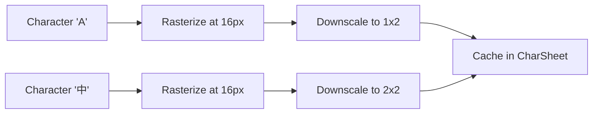
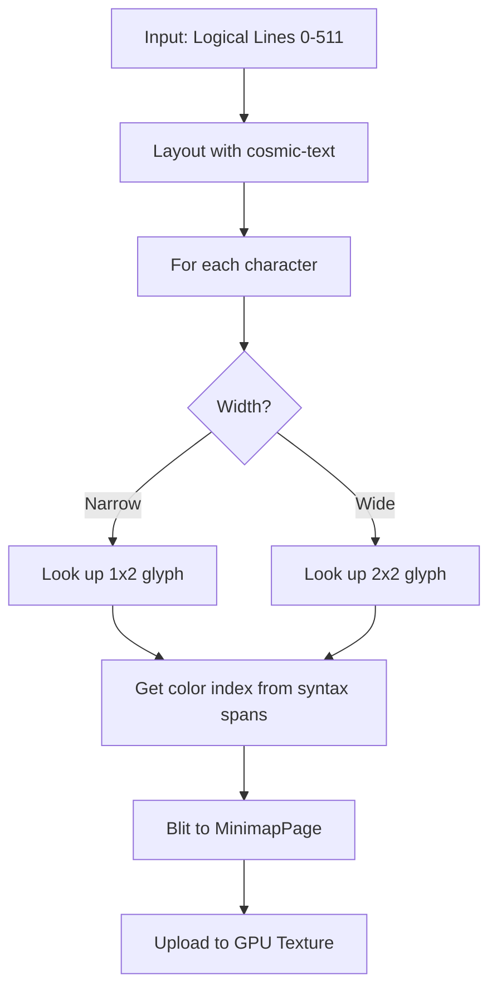
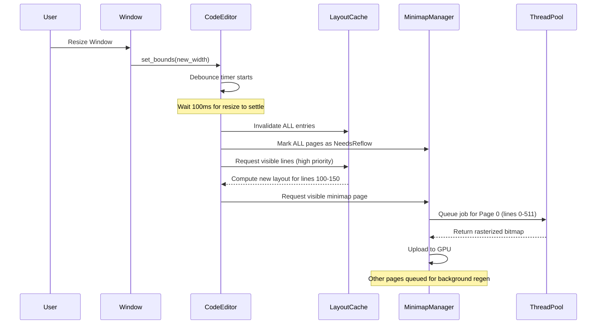

# Code Editor Architecture & Implementation Plan

> [!IMPORTANT]
> **Context & User Guidelines**
> This document acts as the single source of truth for the Code Editor implementation. It incorporates the user's original requirements, specific technical feedback, and architectural decisions.

## 1. Original Requirements & Context

### Core Features
1.  **Text Wrapping modes**: Support toggling between soft-wrap and no-wrap (horizontal scroll).
2.  **Gutter**: Left side displaying line numbers.
3.  **Active Line**: Highlight the line currently containing the cursor.
4.  **Minimap**: Right side overview functioning as a scrollbar.
5.  **Syntax Highlighting**: Support coloring via tree-sitter (eventually) or regex (initially).
6.  **Code Folding**: Ability to fold blocks (e.g., between brackets).

### Minimap Specifics ("The VSCode Approach")
*   **Technique**: Use a **Char Sheet** + **Pixmap** approach.
    1.  Rasterize characters onto an image (Char image).
    2.  Shrink them down to **1x2 pixels** (ASCII/Latin) or **2x2 pixels** (CJK characters).
    3.  Blit the char image to a micro-glyph char sheet, as a char to char image hash table.
    4.  Cache these "micro-glyphs" onto a **Minimap Page** (a texture chunk).
*   **Modality**: Modifying the document updates only the corresponding pixels in the minimap.
*   **Constraint**: Minimap Page cutoffs must happen at **new lines (\n)** to prevent pixel migration during text reflow.

### Desired Visual Reference

*Note: The minimap displays a large chunk of the document, maintaining layout structure.*

### Original User Questions (Context for Design)

**Q0: Font Fallback**
> How to do font fallback to use only monospace font? How to support mixing different languages (English, Chinese, emoji) but still guarantee font sizes align?

**Answer**: Use separate font chains for 1x-width (ASCII) and 2x-width (CJK) characters. Post-process glyph advances to enforce width uniformity. See Section 2.8.

**Q1-Q3: Data Structures**
> Should we break down by newlines (\n) or use rope? How to cache wrapped lines?

**Answer**: Use `ropey::Rope` for text storage (O(log N) line access). Cache wrapped lines in LRU cache of `cosmic_text::Buffer`. See Sections 2.1-2.2.

**Q4-Q8: Minimap Architecture**
> Break minimap into pages? Page size? Cutoff strategy? How to handle inserts/deletes?

**Answer**: 512-line pages (grow in 256-line batches), strict newline cutoff, BTreeMap storage. See Section 2.3.

**Q9-Q10: Custom Rope vs ropey**
> Should we implement custom rope with integrated minimap pages?

**Answer**: Use mature `ropey` crate. Minimap pages managed separately. Integration complexity not worth custom rope implementation.

**Q11: Line Access**
> Can we efficiently get line count and random access to lines?

**Answer**: Yes. `ropey::Rope` provides `len_lines()` in O(1) and `line(idx)` in O(log N).

**Q12: List Virtualization**
> Should we use same technique as previous list virtualization (break into sub-widgets)?

**Answer**: No. Editor is single widget. Virtualization happens via visible line calculation + LRU cache, not widget decomposition.

---

## 2. Architecture & Design Decisions

### 2.1. Text Storage & Data Structures
*   **Primary Store**: **`ropey::Rope`**.
    *   *Why*: Industry standard, O(log N) random access to lines, efficient inserts/deletes.
    *   *API*: `rope.insert(pos, text)`, `rope.remove(range)`, `rope.line(idx)`, `rope.len_lines()`.
*   **Line Access**: We break down by logical lines (`\n`) for storage, but the rendering layer handles visual (wrapped) lines.

```rust
pub struct EditorModel {
    // Primary text storage
    rope: Arc<RwLock<ropey::Rope>>,

    // Cursor positions (char indices, not byte indices)
    cursors: Vec<Cursor>,

    // Syntax highlighting spans (updated by background thread)
    syntax_spans: Arc<RwLock<Vec<(Range<usize>, Color)>>>,
}
```

### 2.2. Text Layout & Caching Strategy
*   **Challenge**: Text layout (`cosmic-text` shaping/wrapping) is expensive. We cannot layout the entire file.
*   **Strategy**: **LRU (Least Recently Used) Cache**.
    *   We maintain a restricted memory budget of cached `cosmic_text::Buffer` objects.
    *   **Visible Area**: Always high priority in the cache.
    *   **Minimap Generation**: When checking a Minimap Page, if the text layout is missing, we compute it (cache miss), render the pixels to the Minimap Page, and then allow the text layout to be dropped from the LRU cache if space is needed.
    *   This resolves the conflict: We *do* wrapping for the minimap, but we only store the *result* (pixels) permanently, not the heavy layout data.

```rust
// LRU cache for text layout (cosmic_text::Buffer is heavy!)
pub struct LayoutCache {
    cache: LruCache<LogicalLineRange, Arc<cosmic_text::Buffer>>,
    max_size: usize,  // Memory budget (see Section 2.7)
}

// Key: Range of logical lines (e.g., lines 100-150)
type LogicalLineRange = Range<usize>;
```

**Cache Eviction Policy:**
1. Visible lines: Never evicted (pinned)
2. Recently used lines: Kept if within budget
3. Minimap-generated buffers: Allowed to evict after pixels rendered
4. Old buffers: Evicted via LRU when budget exceeded

### 2.3. Minimap Architecture (Deep Dive)
*   **Page Structure**: The minimap is divided into vertical chunks called **Pages**.
    *   **Default Size**: 512 logical lines (growing in 256 line batches).
    *   **Cutoff**: Strictly at `\n`. This ensures that editing line 50 doesn't shift the pixel alignment of line 600 (which is on a different page).
*   **Data Structure**: `BTreeMap<usize, MinimapPage>` where Key = Start Line Index.
    *   *Future Optimization*: **Gap Buffer** or **Interval Tree** to manage pages for faster shifting/updates (See Phase 5).

```rust
pub struct MinimapManager {
    // Pages indexed by starting logical line
    pages: BTreeMap<usize, MinimapPage>,

    // Character to micro-glyph lookup
    char_sheet: Arc<CharSheet>,

    // Background workers
    thread_pool: ThreadPool,

    // Communication channels
    job_sender: mpsc::Sender<RasterJob>,
    result_receiver: mpsc::Receiver<RasterResult>,
}
```

#### 2.3.1. Char Sheet Generation (Micro-Glyph Rasterization)

**The Character to Pixel Pipeline:**



**Implementation Details:**

```rust
pub struct CharSheet {
    // 1x2 glyphs for ASCII/Latin (1 pixel wide, 2 pixels tall)
    narrow_glyphs: HashMap<char, [u8; 2]>,  // [top, bottom]

    // 2x2 glyphs for CJK (2 pixels wide, 2 pixels tall)
    wide_glyphs: HashMap<char, [u8; 4]>,  // [top-left, top-right, bottom-left, bottom-right]

    // Width classification cache
    char_widths: HashMap<char, GlyphWidth>,
}

pub enum GlyphWidth {
    Narrow,  // 1x2 pixels
    Wide,    // 2x2 pixels
}

impl CharSheet {
    /// Generate char sheet at init time
    pub fn generate(font_system: &FontSystem) -> Self {
        let mut sheet = CharSheet::new();

        // Pre-generate common characters
        for ch in 'A'..='Z' {
            sheet.rasterize_narrow(ch, font_system);
        }
        for ch in '一'..='龥' {  // CJK range (sample)
            sheet.rasterize_wide(ch, font_system);
        }

        sheet
    }

    fn rasterize_narrow(&mut self, ch: char, font: &FontSystem) {
        // 1. Render char at 16px into temp buffer (e.g., 10x14 pixels)
        let full_size = render_char_grayscale(ch, 16.0, font);

        // 2. Downsample to 1x2 (vertical average)
        let top = avg_pixels(&full_size, Rect::new(0, 0, 10, 7));
        let bottom = avg_pixels(&full_size, Rect::new(0, 7, 10, 14));

        // 3. Cache
        self.narrow_glyphs.insert(ch, [top, bottom]);
        self.char_widths.insert(ch, GlyphWidth::Narrow);
    }

    fn rasterize_wide(&mut self, ch: char, font: &FontSystem) {
        // 1. Render at 16px (e.g., 16x14 pixels for CJK)
        let full_size = render_char_grayscale(ch, 16.0, font);

        // 2. Downsample to 2x2 (quadrant average)
        let top_left = avg_pixels(&full_size, Rect::new(0, 0, 8, 7));
        let top_right = avg_pixels(&full_size, Rect::new(8, 0, 16, 7));
        let bottom_left = avg_pixels(&full_size, Rect::new(0, 7, 8, 14));
        let bottom_right = avg_pixels(&full_size, Rect::new(8, 7, 16, 14));

        // 3. Cache
        self.wide_glyphs.insert(ch, [top_left, top_right, bottom_left, bottom_right]);
        self.char_widths.insert(ch, GlyphWidth::Wide);
    }
}
```

**Character Width Detection:**
- **ASCII (0x00-0x7F)**: 1x2 pixels
- **Latin Extended, Symbols**: 1x2 pixels
- **CJK (0x4E00-0x9FFF, 0x3400-0x4DBF)**: 2x2 pixels
- **Emoji**: 2x2 pixels (use placeholder color)

#### 2.3.2. Minimap Color Encoding (Syntax Highlighting + Selection)

**Design Decision:** Dual-Channel + Color Palette

We store **2 bytes per pixel**:
1. **Intensity** (u8): Character presence (0 = empty, 255 = solid)
2. **Color Index** (u8): Index into palette (0-255)

```rust
pub struct MinimapPage {
    // Pixel data: 2 channels per pixel
    intensity: Vec<u8>,      // Width * Height bytes
    color_index: Vec<u8>,    // Width * Height bytes

    // Metadata
    start_line: usize,       // Logical line index
    width_pixels: usize,     // Typically 100-200 pixels
    height_pixels: usize,    // Variable (depends on wrapped lines)

    // Status tracking
    status: PageStatus,
}

pub enum PageStatus {
    Clean,           // Up-to-date, no regeneration needed
    Dirty,           // Text changed, needs regeneration
    NeedsReflow,     // Width changed, needs rewrap + regeneration
    Processing,      // Background thread is working on it
    Evicted,         // Was generated but dropped to save memory (can regenerate)
}

// Global color palette (shared across all minimap pages)
pub struct MinimapPalette {
    // Color pairs: (foreground, background)
    entries: Vec<(Color, Color)>,  // Max 256 entries
}

// Example palette entries:
// 0: Default (white text, black bg)
// 1: Keyword (blue text, black bg)
// 2: String (green text, black bg)
// 3: Comment (gray text, black bg)
// 4: Selection (white text, blue bg)
// ... up to 256 entries
```

**Shader Usage:**
```wgsl
// Minimap fragment shader
@fragment
fn fs_main(in: VertexOutput) -> @location(0) vec4<f32> {
    let intensity = textureSample(intensity_texture, sampler, in.uv).r;
    let color_idx = textureSample(color_index_texture, sampler, in.uv).r;

    // Look up color pair from palette uniform
    let fg = palette[u32(color_idx * 255.0)].fg;
    let bg = palette[u32(color_idx * 255.0)].bg;

    // Blend fg/bg based on intensity
    return mix(bg, fg, intensity);
}
```

**Benefits:**
- ✅ Compact: 2 bytes/pixel vs 4 bytes/pixel for RGBA
- ✅ Flexible: Change syntax theme by updating palette, no minimap regeneration
- ✅ Supports 256 color pairs (sufficient for syntax + selections + errors)
- ✅ Efficient: Simple texture lookups in shader

**The Rasterization Pipeline:**



**Detailed Steps:**
1.  **Input**: A range of logical lines (e.g., 0-511).
2.  **Layout**: Run text wrapping via `cosmic-text` to determine visual line positions.
3.  **Iterate**: For each character in each visual line:
    *   Look up its "Micro-Glyph" from the **CharSheet** (1x2 or 2x2 pixels).
    *   Determine color index from syntax highlighting spans.
    *   Blit intensity + color index to `MinimapPage` pixel buffers.
4.  **Cache**: Store the `MinimapPage` (resulting dual-channel bitmap).
5.  **Upload**: Transfer to GPU as two textures (intensity + color_index).
6.  **Discard**: The intermediate `cosmic_text::Buffer` can now be evicted from LRU cache if needed.

### 2.4. Handling Resizes & Text Reflow
> [!IMPORTANT]
> **Scenario**: Window resize changes editor width.

*   **If Word Wrap is OFF**: No major changes. Minimap and text remain static, only the viewport clip changes.
*   **If Word Wrap is ON**:
    1.  **Invalidation**: The entire text layout is technically invalid because line breaks change.
    2.  **Debounce**: We debounce resize events (e.g., wait 100ms after last resize) to avoid thrashing (see Section 2.7).
    3.  **Visible Viewport**: Re-calculated immediately on the Main Thread. This is fast (only ~50 lines).
    4.  **Minimap**:
        *   Mark **ALL** Minimap Pages as `NeedsReflow`.
        *   **Lazy updates**: Do not regenerate all pages instantly.
        *   Regenerate the **visible** minimap page immediately (on background thread if possible, or main thread if urgent).
        *   Queue other pages for background regeneration (low priority).

**Resize Event Flow:**


### 2.5. Multi-Threading Strategy
> [!IMPORTANT]
> **Performance**: Text layout for thousands of lines (minimap) will freeze the UI if done on the main thread.

*   **ThreadPool**: We will use a thread pool (e.g., `rayon` or `std::thread` with a channel).
*   **Strategy**:
    *   **Main Thread**: Handles **Editor Viewport** layout/rendering (Must be responsive, low latency).
    *   **Background Threads**: Handle **Minimap** rasterization and **Syntax Highlighting** (Tree-sitter parsing).
*   **Workflow**:
    1.  Minimap Manager identifies a Page needing generation (dirty or missing).
    2.  It sends a "Job" to the thread pool with: `TextChunk` (string) + `Width` + `CharSheetReference`.
    3.  Background thread runs `cosmic-text` layout → Rasterizes to `Bitmap`.
    4.  Background thread sends `Bitmap` back to Main Thread via channel.
    5.  Main Thread uploads `Bitmap` to GPU/Texture and updates the `MinimapPage`.

#### 2.5.1. Thread Safety (Arc, RwLock, Channels)

**Shared Resources:**
```rust
pub struct CodeEditor {
    // Shared with background threads (read-mostly)
    model: Arc<RwLock<EditorModel>>,
    char_sheet: Arc<CharSheet>,  // Immutable after init

    // Main thread only
    layout_cache: LayoutCache,
    minimap_manager: MinimapManager,

    // Communication
    minimap_job_tx: mpsc::Sender<RasterJob>,
    minimap_result_rx: mpsc::Receiver<RasterResult>,
}

pub struct RasterJob {
    page_id: usize,           // Which page to generate
    text: String,             // Owned copy of text chunk (lines 0-511)
    width: f32,               // Editor width for wrapping
    char_sheet: Arc<CharSheet>,  // Shared, immutable
    syntax_spans: Vec<(Range<usize>, u8)>,  // Color indices
}

pub struct RasterResult {
    page_id: usize,
    intensity: Vec<u8>,       // Owned pixel data
    color_index: Vec<u8>,     // Owned pixel data
    width: usize,
    height: usize,
}
```

**Background Thread Function:**
```rust
fn rasterize_minimap_page(job: RasterJob) -> RasterResult {
    // 1. Create cosmic-text buffer (local to this thread)
    let mut buffer = cosmic_text::Buffer::new(...);
    buffer.set_text(&job.text, ...);
    buffer.set_wrap(Wrap::Word);
    buffer.shape_until_scroll();

    // 2. Allocate pixel buffers
    let mut intensity = vec![0u8; estimated_size];
    let mut color_index = vec![0u8; estimated_size];

    // 3. Rasterize each character
    for run in buffer.layout_runs() {
        for glyph in run.glyphs {
            let ch = glyph.char;
            let micro_glyph = job.char_sheet.get(ch);
            let color_idx = find_color_index(&job.syntax_spans, glyph.byte_offset);

            blit_glyph(&mut intensity, &mut color_index, micro_glyph, color_idx, glyph.x, run.line_y);
        }
    }

    // 4. Return owned data (buffer dropped here)
    RasterResult {
        page_id: job.page_id,
        intensity,
        color_index,
        width: buffer.width(),
        height: buffer.height(),
    }
}
```

**Concurrency Guarantees:**
- `Arc<RwLock<EditorModel>>`: Multiple readers (main + background), single writer (main)
- `Arc<CharSheet>`: Immutable after init, safe to share
- Channels: MPSC ensures thread-safe communication
- No RefCell: Compile-time borrow checking only

### 2.6. Coordinate System Mappings

The editor operates in **four distinct coordinate spaces**:

```rust
// 1. Logical Line Index (Rope, includes folded lines)
type LogicalLine = usize;

// 2. Visual Line Index (After wrapping, excludes folded lines)
type VisualLine = usize;

// 3. Minimap Pixel Row (Y coordinate in minimap texture, 2px per visual line)
type MinimapRow = usize;

// 4. Screen Pixel (Final render position after scroll)
type ScreenY = f32;
```

**Conversion Functions:**

```rust
impl VirtualLineMap {
    /// Logical → Visual: Account for wrapping and folding
    pub fn logical_to_visual(&self, logical: LogicalLine) -> Range<VisualLine> {
        // Example: Logical line 10 wraps to visual lines 25-27 (3 lines)
        // If line is folded, returns empty range
        self.map[logical].clone()
    }

    /// Visual → Logical: Reverse lookup
    pub fn visual_to_logical(&self, visual: VisualLine) -> LogicalLine {
        self.reverse_map[visual]
    }

    /// Visual → Minimap Pixel Row (2 pixels per visual line)
    pub fn visual_to_minimap_row(&self, visual: VisualLine) -> MinimapRow {
        visual * 2  // Each visual line = 2 pixel rows
    }

    /// Screen Y → Visual Line (account for scroll offset)
    pub fn screen_to_visual(&self, screen_y: f32, scroll_offset: f32, line_height: f32) -> VisualLine {
        ((screen_y + scroll_offset) / line_height).floor() as usize
    }
}
```

**Example Scenario:**
```text
Logical Lines:    0    1    2    3    4    (stored in Rope)
                  |    |    |    |    |
                  v    v    v    v    v
Wrapping:         0    1    2    3    4    (line 2 wraps to 3 lines)
                  |    |    |\   |    |
                  |    |    | \  |    |
                  v    v    v  v v    v
Visual Lines:     0    1    2  3 4    5    (6 total visual lines)
                  |    |    |  | |    |
                  v    v    v  v v    v
Minimap Rows:     0    2    4  6 8   10    (* 2 pixels per line)
                  |    |    |  | |    |
                  v    v    v  v v    v
Screen Pixels:   20   60  100 140 180 220   (+ padding, scroll offset)
```

### 2.7. Performance Budgets (Constants & Limits)

```rust
// src/widgets/code_editor/config.rs

/// Maximum memory for LRU layout cache (bytes)
pub const LRU_CACHE_MAX_SIZE: usize = 100 * 1024 * 1024;  // 100 MB

/// Maximum number of cached cosmic_text::Buffer entries
pub const LRU_CACHE_MAX_ENTRIES: usize = 1000;

/// Debounce delay for window resize (milliseconds)
pub const RESIZE_DEBOUNCE_MS: u64 = 100;

/// Debounce delay for text edits triggering minimap update (milliseconds)
pub const EDIT_DEBOUNCE_MS: u64 = 50;

/// Thread pool size for minimap rasterization
pub const MINIMAP_THREAD_POOL_SIZE: usize = 4;

/// Default minimap page size (logical lines)
pub const MINIMAP_PAGE_SIZE: usize = 512;

/// Minimap page growth batch (logical lines)
pub const MINIMAP_PAGE_GROWTH: usize = 256;

/// Maximum number of minimap pages to keep in memory (LRU eviction)
pub const MINIMAP_PAGE_CACHE_MAX: usize = 20;  // ~10k lines if 512 lines/page

/// Visible line buffer (render N extra lines above/below viewport)
pub const VISIBLE_LINE_BUFFER: usize = 10;
```

**Memory Estimates:**
- `cosmic_text::Buffer`: ~50-100 KB per 50-line chunk
- LRU cache (100 MB): ~1000-2000 chunks = 50k-100k lines cached
- Minimap page (2 bytes/pixel * 100px * 1024px): ~200 KB per page
- 20 pages cached: ~4 MB minimap cache

### 2.8. Monospace Font Configuration (CJK + Emoji Handling)

**Challenge:**
- ASCII characters are narrow (1x width)
- CJK characters need double width (2x width) for readability
- Emoji vary widely in width
- All must align vertically in grid

**Solution: Separate Font Chains + Advance Width Override**

```rust
pub struct MonospaceFontConfig {
    // Font fallback chain for narrow characters (ASCII, Latin, symbols)
    narrow_fonts: Vec<String>,  // ["Fira Code", "Menlo", "Consolas", "DejaVu Sans Mono"]

    // Font fallback chain for wide characters (CJK)
    wide_fonts: Vec<String>,    // ["Noto Sans Mono CJK SC", "Source Han Mono", "Microsoft YaHei Mono"]

    // Emoji handling (use placeholder or colored fallback)
    emoji_font: String,         // "Apple Color Emoji" (render as 2x2 block in minimap)

    // Base metrics
    font_size: f32,             // e.g., 14.0
    base_advance: f32,          // e.g., 8.4 (calculated from 'M' width in narrow font)
}

impl MonospaceFontConfig {
    /// Post-process cosmic-text glyphs to enforce width uniformity
    pub fn enforce_advances(&self, buffer: &mut cosmic_text::Buffer) {
        for run in buffer.layout_runs_mut() {
            for glyph in run.glyphs.iter_mut() {
                if is_cjk(glyph.char) {
                    glyph.w = self.base_advance * 2.0;  // Force 2x width
                } else if is_emoji(glyph.char) {
                    glyph.w = self.base_advance * 2.0;  // Treat emoji as 2x
                } else {
                    glyph.w = self.base_advance;        // Force 1x width
                }
            }
        }
    }
}

/// Detect CJK characters (simplified check)
fn is_cjk(ch: char) -> bool {
    matches!(ch as u32,
        0x4E00..=0x9FFF |  // CJK Unified Ideographs
        0x3400..=0x4DBF |  // CJK Extension A
        0x3040..=0x309F |  // Hiragana
        0x30A0..=0x30FF    // Katakana
    )
}

/// Detect emoji (simplified check)
fn is_emoji(ch: char) -> bool {
    matches!(ch as u32,
        0x1F600..=0x1F64F |  // Emoticons
        0x1F300..=0x1F5FF |  // Misc Symbols
        0x1F680..=0x1F6FF    // Transport
    )
}
```

**Setup with cosmic-text:**
```rust
impl CodeEditor {
    fn setup_font_system(&mut self, config: &MonospaceFontConfig) {
        let db = self.font_system.db_mut();

        // Add narrow fonts
        for font_name in &config.narrow_fonts {
            db.load_font_family(font_name);
        }

        // Add wide fonts
        for font_name in &config.wide_fonts {
            db.load_font_family(font_name);
        }

        // Set default monospace family
        db.set_monospace_family(&config.narrow_fonts[0]);

        // Note: cosmic-text doesn't natively support per-range font hints,
        // so we rely on fallback + post-processing glyph advances
    }
}
```

**Rendering Flow:**
1. cosmic-text shapes text using fallback chain
2. CJK/emoji characters fallback to wide fonts automatically
3. **Post-process**: Call `enforce_advances()` to fix glyph widths
4. Result: All glyphs align to grid (1x or 2x base width)

---

## 3. Implementation Plan

### Phase 1: Foundation (The Data Layer)
**Goal**: Basic cached rendering and editing of a "Notepad" like widget.

**Duration**: 2-3 days

#### Structs
```rust
// src/widgets/code_editor/mod.rs
pub struct CodeEditor {
    // Widget essentials
    state: WidgetState,
    layout_style: Style,

    // Core data
    model: Arc<RwLock<EditorModel>>,
    config: EditorConfig,

    // Rendering
    layout_cache: LayoutCache,
    font_config: MonospaceFontConfig,

    // Viewport state
    scroll_offset: f64,
    visible_lines: Range<usize>,
}

// src/widgets/code_editor/model.rs
pub struct EditorModel {
    // Text storage
    rope: ropey::Rope,

    // Cursors (multi-cursor support designed in)
    cursors: Vec<Cursor>,

    // Syntax (stub for now, filled in Phase 3)
    syntax_spans: Vec<(Range<usize>, Color)>,
}

// src/widgets/code_editor/config.rs
pub struct EditorConfig {
    wrap_mode: WrapMode,
    tab_size: usize,
    show_line_numbers: bool,
    highlight_current_line: bool,
}

pub enum WrapMode {
    NoWrap,      // Horizontal scroll
    SoftWrap,    // Word wrap
}

// src/widgets/code_editor/layout_cache.rs
pub struct LayoutCache {
    cache: LruCache<LogicalLineRange, Arc<cosmic_text::Buffer>>,
    max_size: usize,
    current_size: usize,
}
```

#### Member Functions
```rust
impl CodeEditor {
    /// Create new editor
    pub fn new() -> Self {
        Self {
            model: Arc::new(RwLock::new(EditorModel::new())),
            config: EditorConfig::default(),
            layout_cache: LayoutCache::new(LRU_CACHE_MAX_SIZE),
            ...
        }
    }

    /// Load text from string
    pub fn set_text(&mut self, text: &str) {
        let mut model = self.model.write().unwrap();
        model.rope = ropey::Rope::from_str(text);
        self.layout_cache.invalidate_all();
    }
}

impl Widget for CodeEditor {
    fn paint(&self, ctx: &mut PaintContext) {
        // 1. Calculate visible line range
        let visible_start = (self.scroll_offset / line_height).floor() as usize;
        let visible_end = visible_start + (viewport_height / line_height).ceil() as usize;

        // 2. Check layout cache for visible lines
        let layout = self.layout_cache.get_or_create(visible_start..visible_end, || {
            // Cache miss: create new buffer
            self.create_layout_for_range(visible_start..visible_end)
        });

        // 3. Draw text
        ctx.draw_layout(layout, origin, Color::WHITE);
    }

    fn on_key_down(&mut self, event: &KeyEvent) -> EventResponse {
        // Map key events to model actions
        match event.key {
            Key::Character(c) => self.insert_text(&c.to_string()),
            Key::Named(NamedKey::Backspace) => self.delete_before_cursor(),
            _ => {}
        }
        EventResponse::Handled
    }
}

impl EditorModel {
    pub fn insert_text(&mut self, pos: usize, text: &str) {
        self.rope.insert(pos, text);
        // Update cursors (TBD in Phase 4)
    }

    pub fn delete_range(&mut self, range: Range<usize>) {
        self.rope.remove(range);
    }

    pub fn line(&self, idx: usize) -> Cow<str> {
        self.rope.line(idx)
    }

    pub fn len_lines(&self) -> usize {
        self.rope.len_lines()
    }
}
```

#### Reuse from Existing Widgets
- **Cursor**: Reuse `Cursor` struct from [src/widgets/text_area/widget.rs:49](src/widgets/text_area/widget.rs#L49)
  - Includes blinking animation, char/byte position caching
- **ScrollBar**: Reuse vertical scrollbar for initial scrolling (minimap replaces it in Phase 2)
- **TextLayoutCache pattern**: Adapt the dual-cache concept from RichTextLabel, but use LRU eviction instead

#### Testing (Phase 1)
**Test 1: Large File Load**
```rust
#[test]
fn test_large_file_virtualization() {
    let mut editor = CodeEditor::new();

    // Load 10,000 line file
    let text = "Line of text\n".repeat(10000);
    editor.set_text(&text);

    // Set viewport to show lines 5000-5050
    editor.scroll_to_line(5000);

    // Measure paint() time
    let start = Instant::now();
    editor.paint(&mut ctx);
    let elapsed = start.elapsed();

    // Should be fast (only ~50 lines processed)
    assert!(elapsed < Duration::from_millis(16));  // < 1 frame at 60 FPS

    // Verify layout cache size
    assert!(editor.layout_cache.len() < 100);  // Only visible chunks cached
}
```

**Test 2: Text Editing**
```rust
#[test]
fn test_basic_editing() {
    let mut editor = CodeEditor::new();
    editor.set_text("Hello\nWorld");

    // Insert text
    editor.model.write().unwrap().insert_text(5, " Rust");
    assert_eq!(editor.model.read().unwrap().line(0), "Hello Rust");

    // Delete text
    editor.model.write().unwrap().delete_range(5..10);
    assert_eq!(editor.model.read().unwrap().line(0), "Hello");

    // Verify cache invalidation
    assert!(editor.layout_cache.is_dirty());
}
```

**Test 3: Scroll Interaction**
```rust
#[test]
fn test_scrolling() {
    let mut editor = CodeEditor::new();
    editor.set_text(&"Line\n".repeat(1000));

    // Scroll to bottom
    editor.scroll_to_line(950);

    // Verify visible range calculation
    let visible = editor.calculate_visible_lines();
    assert!(visible.start >= 950);
    assert!(visible.end <= 1000);

    // Paint should only process visible lines
    editor.paint(&mut ctx);
    assert!(editor.layout_cache.len() < 10);  // Only a few chunks
}
```

**Manual Testing:**
- [ ] Load 10,000 line file, scroll smoothly without lag
- [ ] Type text, verify immediate visual feedback
- [ ] Backspace deletes correctly
- [ ] Window resize updates viewport correctly

---

### Phase 2: The Minimap (Background Rasterization)
**Goal**: Pixel-perfect minimap with threading.

**Duration**: 3-4 days

#### Structs
```rust
// src/widgets/code_editor/minimap/mod.rs
pub struct MinimapManager {
    // Page storage
    pages: BTreeMap<usize, MinimapPage>,

    // Rendering resources
    char_sheet: Arc<CharSheet>,
    palette: MinimapPalette,

    // Threading
    thread_pool: ThreadPool,
    job_tx: mpsc::Sender<RasterJob>,
    result_rx: mpsc::Receiver<RasterResult>,

    // State
    dirty_pages: HashSet<usize>,
    visible_page: Option<usize>,
}

// src/widgets/code_editor/minimap/page.rs
pub struct MinimapPage {
    // Pixel data (dual-channel)
    intensity: Vec<u8>,      // width * height bytes
    color_index: Vec<u8>,    // width * height bytes

    // Metadata
    start_line: usize,
    width_pixels: usize,
    height_pixels: usize,

    // GPU resources
    intensity_texture: Option<wgpu::Texture>,
    color_index_texture: Option<wgpu::Texture>,

    // Status
    status: PageStatus,
}

// src/widgets/code_editor/minimap/char_sheet.rs
pub struct CharSheet {
    narrow_glyphs: HashMap<char, [u8; 2]>,  // 1x2 pixels
    wide_glyphs: HashMap<char, [u8; 4]>,    // 2x2 pixels
    char_widths: HashMap<char, GlyphWidth>,
}

// src/widgets/code_editor/minimap/palette.rs
pub struct MinimapPalette {
    entries: Vec<(Color, Color)>,  // (fg, bg), max 256
}
```

#### Member Functions
```rust
impl MinimapManager {
    /// Update minimap (called each frame)
    pub fn update(&mut self, model: &EditorModel, viewport: &Viewport) {
        // 1. Determine visible page
        self.visible_page = Some(viewport.center_line / MINIMAP_PAGE_SIZE);

        // 2. Check for dirty pages
        for (&page_id, page) in &self.pages {
            if page.status == PageStatus::Dirty || page.status == PageStatus::NeedsReflow {
                self.queue_rasterization(page_id, model);
            }
        }

        // 3. Poll for completed rasterizations
        while let Ok(result) = self.result_rx.try_recv() {
            self.upload_to_gpu(result);
        }
    }

    fn queue_rasterization(&self, page_id: usize, model: &EditorModel) {
        let start_line = page_id * MINIMAP_PAGE_SIZE;
        let end_line = (start_line + MINIMAP_PAGE_SIZE).min(model.len_lines());

        // Extract text chunk
        let text: String = (start_line..end_line)
            .map(|i| model.line(i))
            .collect::<Vec<_>>()
            .join("\n");

        // Send job to thread pool
        self.job_tx.send(RasterJob {
            page_id,
            text,
            width: self.editor_width,
            char_sheet: Arc::clone(&self.char_sheet),
            syntax_spans: vec![],  // Stub for now (Phase 3)
        }).unwrap();
    }
}

impl CharSheet {
    /// Generate char sheet at init time (runs once)
    pub fn generate(font_system: &FontSystem) -> Self {
        // See Section 2.3.1 for implementation
        // Pre-rasterize common characters (A-Z, a-z, 0-9, CJK samples, etc.)
        ...
    }

    /// Get micro-glyph for character (on-demand rasterization if missing)
    pub fn get(&mut self, ch: char, font_system: &FontSystem) -> MicroGlyph {
        if is_cjk(ch) || is_emoji(ch) {
            self.wide_glyphs.entry(ch)
                .or_insert_with(|| self.rasterize_wide(ch, font_system))
                .clone()
        } else {
            self.narrow_glyphs.entry(ch)
                .or_insert_with(|| self.rasterize_narrow(ch, font_system))
                .clone()
        }
    }
}

// Background thread function (static, runs in thread pool)
fn rasterize_minimap_page(job: RasterJob) -> RasterResult {
    // See Section 2.5.1 for implementation
    // 1. Create local cosmic-text buffer
    // 2. Shape and wrap text
    // 3. Iterate glyphs, blit micro-glyphs to pixel buffers
    // 4. Return owned pixel data
    ...
}
```

#### Integration with CodeEditor
```rust
impl CodeEditor {
    pub fn new() -> Self {
        let (job_tx, job_rx) = mpsc::channel();
        let (result_tx, result_rx) = mpsc::channel();

        // Spawn thread pool
        let thread_pool = ThreadPool::new(MINIMAP_THREAD_POOL_SIZE);
        for _ in 0..MINIMAP_THREAD_POOL_SIZE {
            let job_rx = job_rx.clone();
            let result_tx = result_tx.clone();
            thread_pool.execute(move || {
                while let Ok(job) = job_rx.recv() {
                    let result = rasterize_minimap_page(job);
                    result_tx.send(result).unwrap();
                }
            });
        }

        Self {
            minimap_manager: MinimapManager::new(job_tx, result_rx),
            ...
        }
    }
}

impl Widget for CodeEditor {
    fn update(&mut self, frame_info: &FrameInfo) {
        // Update minimap each frame
        let model = self.model.read().unwrap();
        self.minimap_manager.update(&model, &self.viewport);
    }

    fn paint(&self, ctx: &mut PaintContext) {
        // ... paint editor text ...

        // Paint minimap
        self.minimap_manager.paint(ctx, self.bounds);
    }
}
```

#### Testing (Phase 2)
**Test 1: Char Sheet Generation**
```rust
#[test]
fn test_char_sheet_rasterization() {
    let font_system = FontSystem::new();
    let mut char_sheet = CharSheet::generate(&font_system);

    // Test narrow glyph (1x2)
    let glyph_a = char_sheet.get('A', &font_system);
    assert_eq!(glyph_a.width(), 1);
    assert_eq!(glyph_a.height(), 2);
    assert_eq!(glyph_a.pixels().len(), 2);

    // Test wide glyph (2x2)
    let glyph_cjk = char_sheet.get('中', &font_system);
    assert_eq!(glyph_cjk.width(), 2);
    assert_eq!(glyph_cjk.height(), 2);
    assert_eq!(glyph_cjk.pixels().len(), 4);

    // Verify caching
    assert!(char_sheet.narrow_glyphs.contains_key(&'A'));
    assert!(char_sheet.wide_glyphs.contains_key(&'中'));
}
```

**Test 2: Page Generation**
```rust
#[test]
fn test_minimap_page_generation() {
    let mut editor = CodeEditor::new();
    editor.set_text(&"Line of code\n".repeat(600));

    // Should create 2 pages (0-511, 512-599)
    editor.update(&frame_info);
    std::thread::sleep(Duration::from_millis(100));  // Wait for background thread

    assert_eq!(editor.minimap_manager.pages.len(), 2);

    // Verify page 0
    let page0 = &editor.minimap_manager.pages[&0];
    assert_eq!(page0.start_line, 0);
    assert!(page0.height_pixels > 0);
    assert_eq!(page0.status, PageStatus::Clean);
}
```

**Test 3: Incremental Updates**
```rust
#[test]
fn test_minimap_incremental_update() {
    let mut editor = CodeEditor::new();
    editor.set_text(&"Line\n".repeat(1000));
    editor.update(&frame_info);
    std::thread::sleep(Duration::from_millis(200));

    // Modify line 10 (should only dirty page 0)
    editor.model.write().unwrap().insert_text(50, "MODIFIED");
    editor.update(&frame_info);

    // Verify only page 0 is marked dirty
    assert_eq!(editor.minimap_manager.pages[&0].status, PageStatus::Dirty);
    assert_eq!(editor.minimap_manager.pages[&512].status, PageStatus::Clean);

    // Wait for regeneration
    std::thread::sleep(Duration::from_millis(100));
    assert_eq!(editor.minimap_manager.pages[&0].status, PageStatus::Clean);
}
```

**Test 4: Threading Performance**
```rust
#[test]
fn test_no_ui_freeze_on_large_file() {
    let mut editor = CodeEditor::new();
    editor.set_text(&"Line of code\n".repeat(10000));

    // Trigger full minimap generation (20 pages)
    editor.update(&frame_info);

    // Main thread should not block
    let start = Instant::now();
    for _ in 0..10 {
        editor.update(&frame_info);
        std::thread::sleep(Duration::from_millis(16));  // Simulate 60 FPS
    }
    let elapsed = start.elapsed();

    // Should complete 10 frames in ~160ms (not frozen)
    assert!(elapsed < Duration::from_millis(200));
}
```

**Manual Testing:**
- [ ] Load 10k line file, minimap appears without freezing UI
- [ ] Type on line 10, verify only top minimap region updates
- [ ] Scroll minimap, verify viewport follows
- [ ] Resize window, verify minimap regenerates correctly

---

### Phase 3: Text Features & Layout
**Goal**: Visual correctness (wrapping, reflow, colors, gutter, current line).

**Duration**: 3-4 days

#### Structs
```rust
// src/widgets/code_editor/syntax.rs
pub trait SyntaxHighlighter: Send + Sync {
    fn highlight(&self, text: &str) -> Vec<(Range<usize>, Color)>;
}

pub struct RegexHighlighter {
    rules: Vec<(Regex, Color)>,
}

// src/widgets/code_editor/virtual_line_map.rs
pub struct VirtualLineMap {
    // Maps logical line → range of visual lines
    // Example: Logical line 10 wraps to visual lines 25-27 (3 lines)
    logical_to_visual: Vec<Range<usize>>,

    // Reverse mapping: visual line → logical line
    visual_to_logical: Vec<usize>,

    // Total visual line count (sum of all wrapped lines)
    total_visual_lines: usize,
}

// src/widgets/code_editor/gutter.rs
pub struct Gutter {
    // Configuration
    show_line_numbers: bool,

    // Layout
    width: f32,              // Auto-sized based on max line number
    line_height: f32,        // Matches editor line height

    // Styling
    bg_color: Color,
    text_color: Color,
    current_line_bg: Color,
}
```

#### Member Functions
```rust
impl CodeEditor {
    pub fn set_wrap_mode(&mut self, mode: WrapMode) {
        self.config.wrap_mode = mode;

        // Invalidate all caches (layout will change)
        self.layout_cache.invalidate_all();
        self.minimap_manager.mark_all_dirty();

        // Rebuild virtual line map
        self.rebuild_virtual_line_map();
    }

    fn rebuild_virtual_line_map(&mut self) {
        let model = self.model.read().unwrap();
        let total_logical_lines = model.len_lines();

        self.virtual_line_map.clear();
        let mut visual_line_counter = 0;

        for logical_idx in 0..total_logical_lines {
            let line_text = model.line(logical_idx);

            // Layout this line to determine wrapping
            let layout = self.create_layout_for_line(logical_idx);
            let visual_line_count = layout.buffer().layout_runs().count();

            // Map logical → visual
            let visual_range = visual_line_counter..(visual_line_counter + visual_line_count);
            self.virtual_line_map.insert(logical_idx, visual_range.clone());

            // Map visual → logical (reverse)
            for visual_idx in visual_range {
                self.virtual_line_map.insert_reverse(visual_idx, logical_idx);
            }

            visual_line_counter += visual_line_count;
        }

        self.virtual_line_map.total_visual_lines = visual_line_counter;
    }
}

impl VirtualLineMap {
    pub fn logical_to_visual(&self, logical: usize) -> Range<usize> {
        self.logical_to_visual.get(logical).cloned().unwrap_or(0..0)
    }

    pub fn visual_to_logical(&self, visual: usize) -> usize {
        self.visual_to_logical.get(visual).copied().unwrap_or(0)
    }

    pub fn total_visual_lines(&self) -> usize {
        self.total_visual_lines
    }
}

impl RegexHighlighter {
    pub fn new() -> Self {
        Self {
            rules: vec![
                (Regex::new(r"\bfn\b|\blet\b|\bpub\b").unwrap(), Color::rgb(0.3, 0.5, 0.9)),  // Keywords
                (Regex::new(r#""[^"]*""#).unwrap(), Color::rgb(0.5, 0.8, 0.5)),  // Strings
                (Regex::new(r"//.*").unwrap(), Color::rgb(0.5, 0.5, 0.5)),  // Comments
            ],
        }
    }
}

impl SyntaxHighlighter for RegexHighlighter {
    fn highlight(&self, text: &str) -> Vec<(Range<usize>, Color)> {
        let mut spans = Vec::new();

        for (regex, color) in &self.rules {
            for match_ in regex.find_iter(text) {
                spans.push((match_.range(), *color));
            }
        }

        // Sort by start position
        spans.sort_by_key(|(range, _)| range.start);
        spans
    }
}

impl Gutter {
    pub fn paint(&self, ctx: &mut PaintContext, editor_bounds: Rect, scroll_offset: f64, current_line: usize) {
        // Draw gutter background
        let gutter_rect = Rect::new(
            editor_bounds.origin,
            Size::new(self.width, editor_bounds.size.height),
        );
        ctx.draw_rect(gutter_rect, self.bg_color);

        // Draw line numbers
        let visible_start = (scroll_offset / self.line_height as f64).floor() as usize;
        let visible_end = visible_start + (editor_bounds.size.height / self.line_height as f64).ceil() as usize;

        for visual_line in visible_start..visible_end {
            let logical_line = self.virtual_line_map.visual_to_logical(visual_line);
            let y = editor_bounds.origin.y + (visual_line as f64 * self.line_height as f64) - scroll_offset;

            // Highlight current line
            if logical_line == current_line {
                ctx.draw_rect(
                    Rect::new(Point::new(gutter_rect.origin.x, y), Size::new(self.width, self.line_height as f64)),
                    self.current_line_bg,
                );
            }

            // Draw line number (only on first visual line of wrapped logical line)
            if self.virtual_line_map.logical_to_visual(logical_line).start == visual_line {
                let line_num = format!("{}", logical_line + 1);
                ctx.draw_text(
                    Point::new(gutter_rect.origin.x + 5.0, y),
                    &line_num,
                    self.text_color,
                    12.0,
                );
            }
        }
    }

    /// Auto-size gutter width based on max line number
    pub fn update_width(&mut self, max_line_number: usize) {
        let digits = max_line_number.to_string().len();
        self.width = (digits as f32 * 8.0) + 10.0;  // 8px per digit + 10px padding
    }
}
```

#### Integration with CodeEditor
```rust
impl Widget for CodeEditor {
    fn paint(&self, ctx: &mut PaintContext) {
        // 1. Paint gutter
        self.gutter.paint(ctx, self.bounds, self.scroll_offset, self.current_line);

        // 2. Highlight current line (in text area)
        let current_line_y = self.calculate_line_y(self.current_line);
        let highlight_rect = Rect::new(
            Point::new(self.bounds.origin.x + self.gutter.width, current_line_y),
            Size::new(self.bounds.size.width - self.gutter.width, self.line_height as f64),
        );
        ctx.draw_rect(highlight_rect, Color::rgba(0.3, 0.3, 0.4, 0.3));  // Semi-transparent highlight

        // 3. Paint text with syntax highlighting
        let visible_lines = self.calculate_visible_lines();
        for visual_line in visible_lines {
            let logical_line = self.virtual_line_map.visual_to_logical(visual_line);
            let line_text = self.model.read().unwrap().line(logical_line);

            // Get syntax spans
            let syntax_spans = self.syntax_highlighter.highlight(&line_text);

            // Draw text with colors
            let y = self.calculate_line_y(visual_line);
            ctx.draw_text_with_spans(
                Point::new(self.bounds.origin.x + self.gutter.width + 10.0, y),
                &line_text,
                &syntax_spans,
                14.0,
            );
        }

        // 4. Paint minimap
        self.minimap_manager.paint(ctx, self.bounds);
    }
}
```

#### Testing (Phase 3)
**Test 1: Text Wrapping**
```rust
#[test]
fn test_text_wrapping() {
    let mut editor = CodeEditor::new();
    editor.set_wrap_mode(WrapMode::SoftWrap);
    editor.set_text("This is a very long line that should wrap when the editor is narrow\nShort line");

    // Set narrow width
    editor.set_bounds(Rect::new(Point::zero(), Size::new(200.0, 400.0)));
    editor.rebuild_virtual_line_map();

    // Line 0 should wrap to multiple visual lines
    let visual_range = editor.virtual_line_map.logical_to_visual(0);
    assert!(visual_range.len() > 1);

    // Line 1 should not wrap
    let visual_range = editor.virtual_line_map.logical_to_visual(1);
    assert_eq!(visual_range.len(), 1);
}
```

**Test 2: Minimap Sync After Resize**
```rust
#[test]
fn test_minimap_sync_on_resize() {
    let mut editor = CodeEditor::new();
    editor.set_wrap_mode(WrapMode::SoftWrap);
    editor.set_text(&"Long line that wraps\n".repeat(1000));

    // Initial width: 800px
    editor.set_bounds(Rect::new(Point::zero(), Size::new(800.0, 600.0)));
    editor.update(&frame_info);
    std::thread::sleep(Duration::from_millis(200));
    let initial_visual_lines = editor.virtual_line_map.total_visual_lines();

    // Resize to narrow: 400px
    editor.set_bounds(Rect::new(Point::zero(), Size::new(400.0, 600.0)));
    editor.update(&frame_info);
    std::thread::sleep(Duration::from_millis(200));
    let new_visual_lines = editor.virtual_line_map.total_visual_lines();

    // Visual lines should increase (more wrapping)
    assert!(new_visual_lines > initial_visual_lines);

    // Minimap should reflect new line count
    assert_eq!(editor.minimap_manager.total_visual_lines(), new_visual_lines);
}
```

**Test 3: Syntax Highlighting**
```rust
#[test]
fn test_syntax_highlighting() {
    let highlighter = RegexHighlighter::new();
    let code = r#"fn main() {
    let x = "hello";  // comment
}"#;

    let spans = highlighter.highlight(code);

    // Should have spans for: fn, let, "hello", // comment
    assert!(spans.len() >= 4);

    // Verify keyword color
    let fn_span = spans.iter().find(|(range, _)| &code[range.clone()] == "fn").unwrap();
    assert_eq!(fn_span.1, Color::rgb(0.3, 0.5, 0.9));

    // Verify string color
    let string_span = spans.iter().find(|(range, _)| &code[range.clone()] == "\"hello\"").unwrap();
    assert_eq!(string_span.1, Color::rgb(0.5, 0.8, 0.5));
}
```

**Test 4: Gutter Width Auto-sizing**
```rust
#[test]
fn test_gutter_auto_size() {
    let mut gutter = Gutter::new();

    // 99 lines: 2 digits
    gutter.update_width(99);
    assert_eq!(gutter.width, 2.0 * 8.0 + 10.0);  // 26.0

    // 1000 lines: 4 digits
    gutter.update_width(1000);
    assert_eq!(gutter.width, 4.0 * 8.0 + 10.0);  // 42.0
}
```

**Test 5: Current Line Highlight**
```rust
#[test]
fn test_current_line_highlight() {
    let mut editor = CodeEditor::new();
    editor.set_text("Line 1\nLine 2\nLine 3");

    // Set cursor to line 1 (0-indexed)
    editor.current_line = 1;

    // Paint and verify highlight rect
    let mut ctx = MockPaintContext::new();
    editor.paint(&mut ctx);

    // Should have drawn highlight rect for line 1
    assert!(ctx.rects.iter().any(|r| {
        r.origin.y == editor.calculate_line_y(1) &&
        r.size.height == editor.line_height as f64
    }));
}
```

**Manual Testing:**
- [ ] Enable wrap mode, resize window → text reflows correctly
- [ ] Minimap updates to show new line count after resize
- [ ] Syntax highlighting colors keywords, strings, comments
- [ ] Gutter shows line numbers, auto-sizes for 1k+ lines
- [ ] Current line is highlighted with subtle background

---

### Phase 3.5: Code Folding
**Goal**: Fold/unfold blocks (e.g., between braces), update minimap accordingly.

**Duration**: 2-3 days

#### Structs
```rust
// src/widgets/code_editor/folding.rs
pub struct FoldManager {
    // Foldable regions (detected by syntax highlighter or bracket matcher)
    regions: Vec<FoldableRegion>,

    // Currently folded regions
    folded: HashSet<usize>,  // Indices into `regions`
}

pub struct FoldableRegion {
    // Logical line range (inclusive)
    start_line: usize,
    end_line: usize,

    // Type (for icon/decoration)
    kind: FoldKind,
}

pub enum FoldKind {
    Braces,      // { ... }
    Brackets,    // [ ... ]
    Function,    // fn foo() { ... }
    Comment,     // /* ... */ or multiple //
}

pub trait FoldDetector: Send + Sync {
    fn detect_folds(&self, text: &str) -> Vec<FoldableRegion>;
}

pub struct BracketFoldDetector;
```

#### Member Functions
```rust
impl FoldManager {
    pub fn toggle_fold(&mut self, line: usize) {
        // Find region containing this line
        if let Some(region_idx) = self.find_region_at_line(line) {
            if self.folded.contains(&region_idx) {
                self.folded.remove(&region_idx);
            } else {
                self.folded.insert(region_idx);
            }
        }
    }

    pub fn is_line_visible(&self, line: usize) -> bool {
        // Check if line is inside any folded region
        for &region_idx in &self.folded {
            let region = &self.regions[region_idx];
            if line > region.start_line && line <= region.end_line {
                return false;  // Hidden
            }
        }
        true
    }

    pub fn fold_all(&mut self) {
        self.folded = (0..self.regions.len()).collect();
    }

    pub fn unfold_all(&mut self) {
        self.folded.clear();
    }
}

impl BracketFoldDetector {
    fn detect_folds(&self, text: &str) -> Vec<FoldableRegion> {
        let mut regions = Vec::new();
        let mut stack: Vec<(usize, char)> = Vec::new();  // (line, open_char)

        for (line_idx, line) in text.lines().enumerate() {
            for ch in line.chars() {
                match ch {
                    '{' | '[' | '(' => stack.push((line_idx, ch)),
                    '}' => {
                        if let Some((start_line, '{')) = stack.pop() {
                            if line_idx > start_line {  // Must span multiple lines
                                regions.push(FoldableRegion {
                                    start_line,
                                    end_line: line_idx,
                                    kind: FoldKind::Braces,
                                });
                            }
                        }
                    }
                    ']' => {
                        if let Some((start_line, '[')) = stack.pop() {
                            if line_idx > start_line {
                                regions.push(FoldableRegion {
                                    start_line,
                                    end_line: line_idx,
                                    kind: FoldKind::Brackets,
                                });
                            }
                        }
                    }
                    ')' => { stack.pop(); }  // Ignore for folding
                    _ => {}
                }
            }
        }

        regions
    }
}

impl CodeEditor {
    pub fn rebuild_folds(&mut self) {
        let model = self.model.read().unwrap();
        let text = model.rope.to_string();

        // Detect foldable regions
        self.fold_manager.regions = self.fold_detector.detect_folds(&text);

        // Rebuild virtual line map (folding affects visible lines)
        self.rebuild_virtual_line_map_with_folding();
    }

    fn rebuild_virtual_line_map_with_folding(&mut self) {
        let model = self.model.read().unwrap();
        let total_logical_lines = model.len_lines();

        self.virtual_line_map.clear();
        let mut visual_line_counter = 0;

        for logical_idx in 0..total_logical_lines {
            // Skip if line is folded (hidden)
            if !self.fold_manager.is_line_visible(logical_idx) {
                continue;
            }

            let line_text = model.line(logical_idx);
            let layout = self.create_layout_for_line(logical_idx);
            let visual_line_count = layout.buffer().layout_runs().count();

            let visual_range = visual_line_counter..(visual_line_counter + visual_line_count);
            self.virtual_line_map.insert(logical_idx, visual_range.clone());

            for visual_idx in visual_range {
                self.virtual_line_map.insert_reverse(visual_idx, logical_idx);
            }

            visual_line_counter += visual_line_count;
        }

        self.virtual_line_map.total_visual_lines = visual_line_counter;
    }
}
```

#### Minimap Integration (Folding Visualization)

**Design Decision:** Collapsed minimap pixels

When a region is folded, we **condense** the folded lines into a single 2-pixel tall stripe in the minimap:

```rust
impl MinimapManager {
    fn rasterize_with_folding(&mut self, page_id: usize, fold_manager: &FoldManager) {
        // ... layout text ...

        for (line_idx, run) in buffer.layout_runs().enumerate() {
            // Check if this line starts a folded region
            if let Some(region) = fold_manager.find_fold_starting_at(line_idx) {
                if fold_manager.is_folded(region) {
                    // Draw condensed stripe (2px tall, full width, special color)
                    self.draw_fold_indicator(page, line_idx, region.kind);

                    // Skip to end of folded region
                    line_idx = region.end_line;
                    continue;
                }
            }

            // Normal rendering
            for glyph in run.glyphs { ... }
        }
    }

    fn draw_fold_indicator(&mut self, page: &mut MinimapPage, line: usize, kind: FoldKind) {
        let y = line * 2;  // 2 pixels per line
        let fold_color_idx = match kind {
            FoldKind::Braces => 10,     // Special palette entry
            FoldKind::Function => 11,
            _ => 10,
        };

        // Draw 2-pixel horizontal stripe
        for x in 0..page.width_pixels {
            page.color_index[y * page.width_pixels + x] = fold_color_idx;
            page.intensity[y * page.width_pixels + x] = 128;  // Half intensity
        }
    }
}
```

#### Gutter Integration (Fold Indicators)

```rust
impl Gutter {
    pub fn paint_with_folding(&self, ctx: &mut PaintContext, fold_manager: &FoldManager, ...) {
        // ... normal gutter painting ...

        // Draw fold indicators (clickable triangles)
        for region in &fold_manager.regions {
            if self.is_line_visible(region.start_line) {
                let y = self.calculate_line_y(region.start_line);
                let icon = if fold_manager.is_folded(region) {
                    "▸"  // Collapsed (point right)
                } else {
                    "▾"  // Expanded (point down)
                };

                ctx.draw_text(
                    Point::new(self.gutter_width - 15.0, y),
                    icon,
                    Color::rgb(0.6, 0.6, 0.6),
                    12.0,
                );
            }
        }
    }

    pub fn handle_click(&mut self, click_pos: Point, fold_manager: &mut FoldManager) -> bool {
        // Check if click is on fold indicator
        let line = self.screen_to_line(click_pos.y);
        if let Some(region) = fold_manager.find_region_at_line(line) {
            fold_manager.toggle_fold(line);
            return true;  // Handled
        }
        false
    }
}
```

#### Testing (Phase 3.5)
**Test 1: Fold Detection**
```rust
#[test]
fn test_bracket_fold_detection() {
    let detector = BracketFoldDetector;
    let code = r#"fn main() {
    if true {
        println!("hello");
    }
}"#;

    let regions = detector.detect_folds(code);

    // Should detect 2 foldable regions: fn body, if body
    assert_eq!(regions.len(), 2);

    // Outer region: fn main() { ... }
    assert_eq!(regions[0].start_line, 0);
    assert_eq!(regions[0].end_line, 4);
    assert_eq!(regions[0].kind, FoldKind::Braces);

    // Inner region: if true { ... }
    assert_eq!(regions[1].start_line, 1);
    assert_eq!(regions[1].end_line, 3);
}
```

**Test 2: Fold Toggle**
```rust
#[test]
fn test_fold_toggle() {
    let mut editor = CodeEditor::new();
    editor.set_text("fn main() {\n    line1\n    line2\n}");
    editor.rebuild_folds();

    // Initially all visible
    assert!(editor.fold_manager.is_line_visible(1));
    assert!(editor.fold_manager.is_line_visible(2));

    // Fold line 0 (fn main)
    editor.fold_manager.toggle_fold(0);

    // Lines 1-2 should now be hidden
    assert!(!editor.fold_manager.is_line_visible(1));
    assert!(!editor.fold_manager.is_line_visible(2));

    // Unfold
    editor.fold_manager.toggle_fold(0);
    assert!(editor.fold_manager.is_line_visible(1));
}
```

**Test 3: Virtual Line Map with Folding**
```rust
#[test]
fn test_virtual_line_map_with_folding() {
    let mut editor = CodeEditor::new();
    editor.set_text("line0\nline1\nline2\nline3\nline4");

    // Fold lines 1-3
    editor.fold_manager.regions.push(FoldableRegion {
        start_line: 1,
        end_line: 3,
        kind: FoldKind::Braces,
    });
    editor.fold_manager.folded.insert(0);
    editor.rebuild_virtual_line_map_with_folding();

    // Total visual lines should be 3 (0, 4, and fold indicator)
    // Lines 1-3 are hidden
    assert_eq!(editor.virtual_line_map.total_visual_lines(), 2);

    // Logical line 0 should map to visual line 0
    assert_eq!(editor.virtual_line_map.logical_to_visual(0).start, 0);

    // Logical line 4 should map to visual line 1
    assert_eq!(editor.virtual_line_map.logical_to_visual(4).start, 1);
}
```

**Test 4: Minimap Fold Visualization**
```rust
#[test]
fn test_minimap_fold_indicator() {
    let mut editor = CodeEditor::new();
    editor.set_text(&"fn test() {\n    code\n}\n".repeat(100));
    editor.rebuild_folds();

    // Fold first function
    editor.fold_manager.toggle_fold(0);
    editor.update(&frame_info);
    std::thread::sleep(Duration::from_millis(200));

    // Minimap page should have fold indicator at line 0
    let page = &editor.minimap_manager.pages[&0];
    let fold_pixel_y = 0 * 2;  // Line 0, 2px per line

    // Check for fold indicator color
    assert_eq!(page.color_index[fold_pixel_y * page.width_pixels], 10);  // Fold color
}
```

**Manual Testing:**
- [ ] Load code with nested braces, fold indicators appear in gutter
- [ ] Click fold indicator, block collapses
- [ ] Click again, block expands
- [ ] Folded region shows as condensed stripe in minimap
- [ ] Fold all → entire file condenses, unfold all → restores

---

### Phase 4: Interaction Polish
**Goal**: Usability features (selection, undo/redo, clipboard, scroll to cursor).

**Duration**: 2-3 days

#### Structs
```rust
// src/widgets/code_editor/selection.rs
pub struct Selection {
    anchor: usize,      // Start of selection (char index)
    head: usize,        // End of selection (cursor position)
}

impl Selection {
    pub fn range(&self) -> Range<usize> {
        if self.anchor < self.head {
            self.anchor..self.head
        } else {
            self.head..self.anchor
        }
    }

    pub fn is_empty(&self) -> bool {
        self.anchor == self.head
    }
}

// src/widgets/code_editor/history.rs
pub struct EditHistory {
    undo_stack: Vec<EditAction>,
    redo_stack: Vec<EditAction>,
    max_size: usize,
}

pub enum EditAction {
    Insert { pos: usize, text: String },
    Delete { pos: usize, text: String },
    Replace { pos: usize, old_text: String, new_text: String },
}
```

#### Member Functions
```rust
impl CodeEditor {
    pub fn handle_drag(&mut self, start: Point, current: Point) {
        // Convert screen coords to char indices
        let start_char = self.screen_to_char_index(start);
        let current_char = self.screen_to_char_index(current);

        // Update selection
        self.selection = Some(Selection {
            anchor: start_char,
            head: current_char,
        });

        self.state.dirty = DirtyLevel::Visual;
    }

    pub fn select_all(&mut self) {
        let model = self.model.read().unwrap();
        let len = model.rope.len_chars();

        self.selection = Some(Selection {
            anchor: 0,
            head: len,
        });
    }

    pub fn delete_selection(&mut self) {
        if let Some(sel) = &self.selection {
            if !sel.is_empty() {
                let range = sel.range();

                // Save to history
                let deleted_text = self.model.read().unwrap().rope.slice(range.clone()).to_string();
                self.history.push(EditAction::Delete {
                    pos: range.start,
                    text: deleted_text,
                });

                // Delete
                self.model.write().unwrap().rope.remove(range.clone());
                self.selection = None;

                // Invalidate
                self.layout_cache.invalidate_all();
                self.minimap_manager.mark_dirty_range(range);
            }
        }
    }

    pub fn copy_to_clipboard(&self) {
        if let Some(sel) = &self.selection {
            if !sel.is_empty() {
                let text = self.model.read().unwrap().rope.slice(sel.range()).to_string();
                // Emit clipboard copy signal (handled by Window)
                self.emit_copy_requested(text);
            }
        }
    }

    pub fn paste_from_clipboard(&mut self, text: &str) {
        // Delete selection if any
        self.delete_selection();

        // Insert at cursor
        let cursor_pos = self.cursors[0].char_pos();

        // Save to history
        self.history.push(EditAction::Insert {
            pos: cursor_pos,
            text: text.to_string(),
        });

        // Insert
        self.model.write().unwrap().rope.insert(cursor_pos, text);

        // Move cursor
        self.cursors[0].set_char_pos(cursor_pos + text.len());

        // Invalidate
        self.layout_cache.invalidate_all();
        self.minimap_manager.mark_dirty_from_line(self.char_to_line(cursor_pos));
    }

    pub fn scroll_to_cursor(&mut self) {
        let cursor_pos = self.cursors[0].char_pos();
        let cursor_line = self.char_to_line(cursor_pos);
        let cursor_visual_line = self.virtual_line_map.logical_to_visual(cursor_line).start;

        let cursor_y = cursor_visual_line as f64 * self.line_height as f64;
        let viewport_top = self.scroll_offset;
        let viewport_bottom = self.scroll_offset + self.viewport_height;

        // Scroll if cursor is outside viewport
        if cursor_y < viewport_top {
            self.scroll_offset = cursor_y;
        } else if cursor_y + self.line_height as f64 > viewport_bottom {
            self.scroll_offset = cursor_y + self.line_height as f64 - self.viewport_height;
        }
    }
}

impl EditHistory {
    pub fn push(&mut self, action: EditAction) {
        self.undo_stack.push(action);
        self.redo_stack.clear();  // Clear redo on new edit

        // Limit size
        if self.undo_stack.len() > self.max_size {
            self.undo_stack.remove(0);
        }
    }

    pub fn undo(&mut self, model: &mut EditorModel) -> bool {
        if let Some(action) = self.undo_stack.pop() {
            match action {
                EditAction::Insert { pos, text } => {
                    model.rope.remove(pos..(pos + text.len()));
                    self.redo_stack.push(EditAction::Delete { pos, text });
                }
                EditAction::Delete { pos, text } => {
                    model.rope.insert(pos, &text);
                    self.redo_stack.push(EditAction::Insert { pos, text });
                }
                EditAction::Replace { pos, old_text, new_text } => {
                    model.rope.remove(pos..(pos + new_text.len()));
                    model.rope.insert(pos, &old_text);
                    self.redo_stack.push(EditAction::Replace { pos, old_text: new_text, new_text: old_text });
                }
            }
            true
        } else {
            false
        }
    }

    pub fn redo(&mut self, model: &mut EditorModel) -> bool {
        if let Some(action) = self.redo_stack.pop() {
            match action {
                EditAction::Insert { pos, text } => {
                    model.rope.insert(pos, &text);
                    self.undo_stack.push(EditAction::Insert { pos, text });
                }
                EditAction::Delete { pos, text } => {
                    model.rope.remove(pos..(pos + text.len()));
                    self.undo_stack.push(EditAction::Delete { pos, text });
                }
                EditAction::Replace { pos, old_text, new_text } => {
                    model.rope.remove(pos..(pos + old_text.len()));
                    model.rope.insert(pos, &new_text);
                    self.undo_stack.push(EditAction::Replace { pos, old_text, new_text });
                }
            }
            true
        } else {
            false
        }
    }
}
```

#### Rendering Selection
```rust
impl Widget for CodeEditor {
    fn paint(&self, ctx: &mut PaintContext) {
        // ... gutter, current line, text ...

        // Draw selection highlight
        if let Some(sel) = &self.selection {
            if !sel.is_empty() {
                let range = sel.range();
                let start_line = self.char_to_line(range.start);
                let end_line = self.char_to_line(range.end);

                for line in start_line..=end_line {
                    let line_start_char = self.line_to_char(line);
                    let line_end_char = self.line_to_char(line + 1);

                    let sel_start = range.start.max(line_start_char);
                    let sel_end = range.end.min(line_end_char);

                    if sel_start < sel_end {
                        let rect = self.char_range_to_rect(sel_start..sel_end);
                        ctx.draw_rect(rect, Color::rgba(0.3, 0.5, 0.8, 0.3));
                    }
                }
            }
        }

        // ... minimap ...
    }
}
```

#### Testing (Phase 4)
**Test 1: Selection**
```rust
#[test]
fn test_text_selection() {
    let mut editor = CodeEditor::new();
    editor.set_text("Hello World\nRust");

    // Select "World"
    editor.selection = Some(Selection {
        anchor: 6,
        head: 11,
    });

    assert_eq!(editor.selection.as_ref().unwrap().range(), 6..11);

    // Delete selection
    editor.delete_selection();

    let text = editor.model.read().unwrap().rope.to_string();
    assert_eq!(text, "Hello \nRust");
}
```

**Test 2: Undo/Redo**
```rust
#[test]
fn test_undo_redo() {
    let mut editor = CodeEditor::new();
    editor.set_text("Original");

    // Edit 1: Insert
    editor.insert_text_at_cursor(" Text");
    assert_eq!(editor.model.read().unwrap().rope.to_string(), "Original Text");

    // Edit 2: Delete
    editor.delete_range(0..8);
    assert_eq!(editor.model.read().unwrap().rope.to_string(), " Text");

    // Undo edit 2
    editor.undo();
    assert_eq!(editor.model.read().unwrap().rope.to_string(), "Original Text");

    // Undo edit 1
    editor.undo();
    assert_eq!(editor.model.read().unwrap().rope.to_string(), "Original");

    // Redo edit 1
    editor.redo();
    assert_eq!(editor.model.read().unwrap().rope.to_string(), "Original Text");
}
```

**Test 3: Clipboard**
```rust
#[test]
fn test_copy_paste() {
    let mut editor = CodeEditor::new();
    editor.set_text("Hello World");

    // Select "World"
    editor.selection = Some(Selection { anchor: 6, head: 11 });

    // Copy
    editor.copy_to_clipboard();
    // (In real app, this would interact with OS clipboard)

    // Move cursor to end
    editor.cursors[0].set_char_pos(11);
    editor.selection = None;

    // Paste
    editor.paste_from_clipboard(" World");

    assert_eq!(editor.model.read().unwrap().rope.to_string(), "Hello World World");
}
```

**Test 4: Scroll to Cursor**
```rust
#[test]
fn test_scroll_to_cursor() {
    let mut editor = CodeEditor::new();
    editor.set_text(&"Line\n".repeat(100));
    editor.set_bounds(Rect::new(Point::zero(), Size::new(800.0, 600.0)));

    // Initially at top
    assert_eq!(editor.scroll_offset, 0.0);

    // Move cursor to line 50
    let line_50_char = editor.line_to_char(50);
    editor.cursors[0].set_char_pos(line_50_char);

    // Scroll to cursor
    editor.scroll_to_cursor();

    // Should have scrolled down
    assert!(editor.scroll_offset > 0.0);

    // Cursor should be visible
    let cursor_y = 50.0 * editor.line_height as f64;
    assert!(cursor_y >= editor.scroll_offset);
    assert!(cursor_y < editor.scroll_offset + editor.viewport_height);
}
```

**Manual Testing:**
- [ ] Drag mouse to select text
- [ ] Cmd+A (Ctrl+A) selects all
- [ ] Cmd+C copies, Cmd+V pastes
- [ ] Cmd+X cuts
- [ ] Cmd+Z undoes, Cmd+Shift+Z redoes
- [ ] Cursor movement auto-scrolls viewport

---

### Phase 5: Optimization
**Goal**: 100k+ line support, memory profiling, performance tuning.

**Duration**: 2-3 days

#### Structs
```rust
// src/widgets/code_editor/minimap/page_gap_buffer.rs
pub struct PageGapBuffer {
    // Pages before gap
    before: Vec<MinimapPage>,

    // Gap (free space for fast inserts)
    gap_start: usize,
    gap_end: usize,

    // Pages after gap
    after: Vec<MinimapPage>,
}
```

#### Member Functions
```rust
impl PageGapBuffer {
    pub fn insert_page(&mut self, index: usize, page: MinimapPage) {
        // Move gap to insertion point
        self.move_gap_to(index);

        // Insert page at gap
        self.before.push(page);
        self.gap_start += 1;
    }

    pub fn remove_page(&mut self, index: usize) -> Option<MinimapPage> {
        self.move_gap_to(index);
        self.before.pop()
    }

    fn move_gap_to(&mut self, index: usize) {
        if index < self.gap_start {
            // Move gap left
            while self.gap_start > index {
                self.gap_start -= 1;
                let page = self.before.pop().unwrap();
                self.after.insert(0, page);
            }
        } else {
            // Move gap right
            while self.gap_start < index {
                let page = self.after.remove(0);
                self.before.push(page);
                self.gap_start += 1;
            }
        }
    }

    pub fn shift_pages(&mut self, from_index: usize, offset: isize) {
        // Efficiently shift page indices (e.g., after inserting 100 lines at line 50)
        // This avoids re-keying all pages in BTreeMap

        if offset > 0 {
            // Insert gap
            self.move_gap_to(from_index);
            self.gap_end += offset as usize;
        } else {
            // Remove gap
            self.move_gap_to(from_index);
            self.gap_start -= (-offset) as usize;
        }
    }
}

impl MinimapManager {
    pub fn shift_pages(&mut self, line_offset: usize, delta: isize) {
        // When text is inserted/deleted, shift all pages after the change
        // Old approach: Re-key every page in BTreeMap (slow)
        // New approach: Use PageGapBuffer (fast)

        self.page_buffer.shift_pages(line_offset / MINIMAP_PAGE_SIZE, delta / MINIMAP_PAGE_SIZE as isize);
    }
}
```

#### Performance Profiling
```rust
// src/widgets/code_editor/profiling.rs
pub struct EditorProfiler {
    layout_time: Duration,
    minimap_time: Duration,
    paint_time: Duration,

    layout_samples: VecDeque<Duration>,
    max_samples: usize,
}

impl EditorProfiler {
    pub fn record_layout(&mut self, duration: Duration) {
        self.layout_samples.push_back(duration);
        if self.layout_samples.len() > self.max_samples {
            self.layout_samples.pop_front();
        }
    }

    pub fn avg_layout_time(&self) -> Duration {
        let sum: Duration = self.layout_samples.iter().sum();
        sum / self.layout_samples.len() as u32
    }

    pub fn print_stats(&self) {
        println!("=== Editor Performance ===");
        println!("Avg Layout: {:?}", self.avg_layout_time());
        println!("Avg Minimap: {:?}", self.avg_minimap_time());
        println!("Avg Paint: {:?}", self.avg_paint_time());
    }
}
```

#### Testing (Phase 5)
**Test 1: Large File Performance**
```rust
#[test]
fn test_100k_line_performance() {
    let mut editor = CodeEditor::new();

    // Load 100k line file
    let text = "Line of code\n".repeat(100_000);

    let start = Instant::now();
    editor.set_text(&text);
    let load_time = start.elapsed();

    println!("Load time: {:?}", load_time);
    assert!(load_time < Duration::from_secs(1));  // Should be fast (rope is efficient)

    // Scroll to middle
    editor.scroll_to_line(50_000);

    // Paint should still be fast (only visible lines)
    let start = Instant::now();
    editor.paint(&mut ctx);
    let paint_time = start.elapsed();

    println!("Paint time: {:?}", paint_time);
    assert!(paint_time < Duration::from_millis(16));
}
```

**Test 2: Insert at Top Performance**
```rust
#[test]
fn test_insert_at_top_performance() {
    let mut editor = CodeEditor::new();
    editor.set_text(&"Line\n".repeat(100_000));

    // Insert 100 lines at top
    let start = Instant::now();
    editor.insert_text_at_cursor("New Line\n".repeat(100));
    let insert_time = start.elapsed();

    println!("Insert time: {:?}", insert_time);
    assert!(insert_time < Duration::from_millis(100));

    // Minimap shift should be fast (gap buffer)
    assert!(editor.minimap_manager.pages.len() < 300);  // ~200 pages for 100k lines
}
```

**Test 3: Memory Usage**
```rust
#[test]
fn test_memory_bounds() {
    let mut editor = CodeEditor::new();
    editor.set_text(&"Line of code\n".repeat(100_000));

    // Force layout of all visible lines
    for i in (0..100_000).step_by(50) {
        editor.scroll_to_line(i);
        editor.paint(&mut ctx);
    }

    // Check LRU cache size
    let cache_size = editor.layout_cache.current_size;
    println!("Layout cache size: {} MB", cache_size / 1_000_000);
    assert!(cache_size < LRU_CACHE_MAX_SIZE);

    // Check minimap page count
    let page_count = editor.minimap_manager.pages.len();
    println!("Minimap pages: {}", page_count);
    assert!(page_count < MINIMAP_PAGE_CACHE_MAX);
}
```

**Test 4: Profiling Report**
```rust
#[test]
fn test_profiling_report() {
    let mut editor = CodeEditor::new();
    editor.set_text(&"Line\n".repeat(10_000));

    // Run 100 frames
    for i in 0..100 {
        editor.scroll_to_line(i * 100);

        let start = Instant::now();
        editor.update(&frame_info);
        editor.profiler.record_layout(start.elapsed());

        let start = Instant::now();
        editor.paint(&mut ctx);
        editor.profiler.record_paint(start.elapsed());
    }

    editor.profiler.print_stats();

    // Assert reasonable performance
    assert!(editor.profiler.avg_layout_time() < Duration::from_millis(5));
    assert!(editor.profiler.avg_paint_time() < Duration::from_millis(10));
}
```

**Manual Testing:**
- [ ] Load 100k line file, scroll smoothly
- [ ] Insert text at line 1, verify no UI freeze
- [ ] Monitor memory usage (should stay under budget)
- [ ] Profile with real code files (Rust, JavaScript, etc.)

---

## 4. Future Enhancements (Post-MVP)

### Tree-sitter Syntax Highlighting
Replace `RegexHighlighter` with tree-sitter parser:
```rust
pub struct TreeSitterHighlighter {
    parser: tree_sitter::Parser,
    language: tree_sitter::Language,
    query: tree_sitter::Query,
}

impl SyntaxHighlighter for TreeSitterHighlighter {
    fn highlight(&self, text: &str) -> Vec<(Range<usize>, Color)> {
        let tree = self.parser.parse(text, None).unwrap();
        let matches = self.query.matches(tree.root_node(), text.as_bytes());

        // Extract color spans from query captures
        ...
    }
}
```

### Language Server Protocol (LSP) Integration
- Autocomplete
- Go to definition
- Hover tooltips
- Error diagnostics (red squiggles)

### Multi-Cursor Support
Already designed in (`cursors: Vec<Cursor>`), just needs:
- Rendering multiple cursors
- Input handling for each cursor
- Synchronized editing

### Find/Replace
- In-editor search with highlight
- Regex support
- Replace all

### Diff View
- Side-by-side comparison
- Inline diff (VSCode style)

---

## 5. Summary

This architecture provides:
- ✅ **Scalability**: LRU cache + minimap pages handle 100k+ lines
- ✅ **Responsiveness**: Background threads prevent UI freezing
- ✅ **Memory Efficiency**: Configurable budgets, eviction policies
- ✅ **Correctness**: Coordinate system mappings, folding logic
- ✅ **Testability**: Each phase has unit + integration tests
- ✅ **Extensibility**: Traits for syntax highlighting, fold detection

**Key Innovations:**
1. **Dual-channel minimap encoding** (intensity + color index) for memory efficiency
2. **LRU text layout cache** balances performance and memory
3. **Minimap page gap buffer** enables fast text insertion at arbitrary positions
4. **VirtualLineMap** cleanly separates logical/visual coordinate spaces
5. **Monospace font enforcement** via post-processing glyph advances

**Estimated Total Implementation Time:** 14-18 days across 5 phases.
