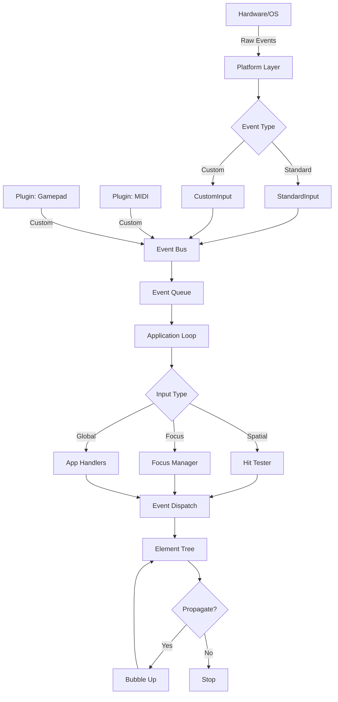

# Event Handling System - Design Document

> **Status:** Design Phase
> **Last Updated:** 2025-12-23
> **Related:** CLAUDE.md (Main Architecture)

## Table of Contents

1. [Overview](#overview)
2. [Design Goals](#design-goals)
3. [Architecture](#architecture)
4. [Core Components](#core-components)
5. [Event Flow](#event-flow)
6. [Extensibility](#extensibility)
7. [Implementation Plan](#implementation-plan)

---

## Overview

This document describes the event handling system for AssortedWidgets. The system is designed to support:

- **Standard input**: Mouse, keyboard, touchpad, trackpad
- **Advanced input**: Stylus (pressure, tilt, hover), multi-touch gestures
- **Custom hardware**: MIDI controllers, game pads, 3D mice, foot pedals, etc.
- **Extensibility**: Third-party plugins can add new input devices without modifying framework code

### Design Philosophy

1. **Decoupling**: The GUI framework doesn't know about specific hardware
2. **Extensibility**: New input devices can be added via plugins
3. **Performance**: Hit testing and event dispatch are optimized for complex UIs
4. **Developer Experience**: Simple for common cases, powerful for advanced use

---

## Design Goals

### 1. Hardware Extensibility

**Problem**: Current architecture ties event types to the platform layer. Adding MIDI support requires modifying `PlatformInput` enum.

**Solution**: Introduce a **Generic Event Bus** with custom event support.

### 2. Event Propagation

**Problem**: No mechanism for widgets to stop event bubbling or prevent default behavior.

**Solution**: Implement **Mutable Event** pattern (like JavaScript's `Event` object).

### 3. Focus Management

**Problem**: No keyboard focus tracking or IME positioning.

**Solution**: Add **Focus Manager** with IME cursor rect support.

### 4. Hit Testing

**Problem**: No hit testing implementation. Need efficient spatial queries for mouse events.

**Solution**: Implement **Z-order traversal** with optional **Spatial Hash** optimization.

### 5. Performance

**Problem**: High-frequency input (1000Hz stylus) can overwhelm the event loop.

**Solution**: Implement **Event Coalescing** and **Throttling**.

---

## Architecture

### Event Flow Diagram



### Three-Tier Event System

| Tier | Purpose | Examples |
|------|---------|----------|
| **Tier 1: Raw Events** | Platform/hardware-specific events | `NSEvent`, `XEvent`, MIDI messages |
| **Tier 2: Input Events** | Framework-normalized events | `MouseEvent`, `KeyEvent`, `StylusEvent` |
| **Tier 3: UI Events** | High-level semantic events | `Click`, `DoubleClick`, `Scroll`, `Gesture` |

---

## Core Components

### 1. Input Event System

#### Base Event Trait

All input events implement this trait for common behavior:

```rust
/// Base trait for all input events
pub trait InputEvent: Any + Send {
    /// Check if event propagation should continue
    fn should_propagate(&self) -> bool;

    /// Stop event from bubbling up the tree
    fn stop_propagation(&mut self);

    /// Check if default behavior should be prevented
    fn is_default_prevented(&self) -> bool;

    /// Prevent the default behavior
    fn prevent_default(&mut self);

    /// Mark event as handled (implies stop propagation)
    fn consume(&mut self) {
        self.stop_propagation();
        self.prevent_default();
    }

    /// Get event timestamp
    fn timestamp(&self) -> Instant;

    /// Downcast to concrete type
    fn as_any(&self) -> &dyn Any;
    fn as_any_mut(&mut self) -> &mut dyn Any;
}
```

#### Standard Input Events

```rust
/// Mouse button event
pub struct MouseEvent {
    pub position: Point,
    pub button: MouseButton,
    pub modifiers: Modifiers,
    pub click_count: u8, // For double/triple click detection
    pub timestamp: Instant,

    // Event state
    propagate: bool,
    default_prevented: bool,
}

/// Keyboard event
pub struct KeyEvent {
    pub key: Key,
    pub modifiers: Modifiers,
    pub timestamp: Instant,
    pub is_repeat: bool,

    // Event state
    propagate: bool,
    default_prevented: bool,
}

/// Stylus event (extends mouse with pressure/tilt)
pub struct StylusEvent {
    pub position: Point,
    pub button: MouseButton,
    pub modifiers: Modifiers,

    // Stylus-specific
    pub pressure: f32,      // 0.0 to 1.0
    pub tilt: Vector,       // X/Y tilt in radians
    pub distance: f32,      // Hover distance (0.0 = touching)
    pub rotation: f32,      // Barrel rotation
    pub timestamp: Instant,

    // Event state
    propagate: bool,
    default_prevented: bool,
}

/// Mouse wheel / trackpad scroll
pub struct ScrollEvent {
    pub delta: Vector,
    pub phase: ScrollPhase, // Begin, Update, End (for momentum)
    pub modifiers: Modifiers,
    pub timestamp: Instant,

    // Event state
    propagate: bool,
    default_prevented: bool,
}

#[derive(Debug, Clone, Copy, PartialEq)]
pub enum ScrollPhase {
    Begin,      // User started scrolling
    Update,     // Scrolling continues
    End,        // User stopped (finger lifted)
    Momentum,   // Inertial scrolling after release
}
```

#### Custom Events

```rust
/// Generic container for custom hardware events
pub struct CustomEvent {
    /// Type identifier (e.g., "midi", "gamepad", "footpedal")
    pub event_type: String,

    /// Event data (plugin-defined)
    pub data: Arc<dyn Any + Send + Sync>,

    pub timestamp: Instant,

    // Event state
    propagate: bool,
    default_prevented: bool,
}

// Example: MIDI plugin defines this struct
pub struct MidiEvent {
    pub channel: u8,
    pub note: u8,
    pub velocity: u8,
    pub message_type: MidiMessageType,
}

#[derive(Debug, Clone, Copy)]
pub enum MidiMessageType {
    NoteOn,
    NoteOff,
    ControlChange,
    PitchBend,
}
```

### 2. Event Dispatch System

#### Hit Testing

**Z-Order: Shared Between Rendering and Hit Testing**

Z-order (draw order) should be unified across rendering and hit testing. When a widget is painted "on top" visually, it should also be "on top" for mouse clicks.

**Approach (inspired by gpui):**
1. **Rendering assigns z-order**: During the paint pass, use `BoundsTree` to assign z-order to each painted primitive
2. **Hit testing uses same z-order**: Query elements in reverse z-order (top to bottom)
3. **Non-overlapping elements share z-order**: Saves draw calls and memory

See [gpui's BoundsTree Analysis](#appendix-gpuis-boundstree-analysis) for detailed implementation insights.

```rust
/// Hit tester for spatial event routing (mouse, touch, stylus)
pub struct HitTester {
    /// Cache of interactive element bounds with z-order from rendering
    /// Sorted by z_order (lowest to highest)
    interactive_rects: Vec<(WidgetId, Rect, u32)>, // (id, bounds, z_order)
}

impl HitTester {
    /// Find the topmost widget at the given position
    pub fn hit_test(&self, position: Point) -> Option<WidgetId> {
        // Iterate from highest to lowest z-order (reverse = top to bottom)
        self.interactive_rects
            .iter()
            .rev()
            .find(|(_, rect, _)| rect.contains(position))
            .map(|(id, _, _)| *id)
    }

    /// Rebuild hit test cache from rendering scene
    ///
    /// This should be called after the paint pass, when z-orders are assigned.
    /// The z_order comes from the BoundsTree during rendering.
    pub fn rebuild(&mut self, element_manager: &ElementManager, scene: &Scene) {
        self.interactive_rects.clear();

        for widget_id in element_manager.widget_ids() {
            if let Some(element) = element_manager.get(widget_id) {
                // Only cache interactive elements
                if element.is_interactive() {
                    if let Some((bounds, z_order)) = scene.get_element_bounds_and_order(widget_id) {
                        self.interactive_rects.push((widget_id, bounds, z_order));
                    }
                }
            }
        }

        // Sort by z-order (lowest to highest)
        self.interactive_rects.sort_by_key(|(_, _, z)| *z);
    }
}
```

#### Focus Management

```rust
/// Manages keyboard focus and IME positioning
pub struct FocusManager {
    /// Currently focused widget (receives keyboard events)
    focused_id: Option<WidgetId>,

    /// List of focusable widgets (for Tab navigation)
    focusable_widgets: Vec<WidgetId>,

    /// Current focus index in focusable_widgets
    focus_index: usize,
}

impl FocusManager {
    /// Set focus to a specific widget
    pub fn set_focus(&mut self, widget_id: Option<WidgetId>) {
        self.focused_id = widget_id;

        // Update focus_index
        if let Some(id) = widget_id {
            self.focus_index = self.focusable_widgets
                .iter()
                .position(|w| *w == id)
                .unwrap_or(0);
        }
    }

    /// Move focus to next focusable widget (Tab key)
    pub fn focus_next(&mut self) -> Option<WidgetId> {
        if self.focusable_widgets.is_empty() {
            return None;
        }

        self.focus_index = (self.focus_index + 1) % self.focusable_widgets.len();
        self.focused_id = Some(self.focusable_widgets[self.focus_index]);
        self.focused_id
    }

    /// Move focus to previous focusable widget (Shift+Tab)
    pub fn focus_previous(&mut self) -> Option<WidgetId> {
        if self.focusable_widgets.is_empty() {
            return None;
        }

        self.focus_index = if self.focus_index == 0 {
            self.focusable_widgets.len() - 1
        } else {
            self.focus_index - 1
        };

        self.focused_id = Some(self.focusable_widgets[self.focus_index]);
        self.focused_id
    }

    /// Get IME cursor position from focused widget
    pub fn get_ime_cursor_rect(&self, element_manager: &ElementManager) -> Option<Rect> {
        let focused_id = self.focused_id?;

        element_manager.get(focused_id)
            .and_then(|element| element.ime_cursor_rect())
    }

    /// Rebuild focusable widget list from element tree
    pub fn rebuild(&mut self, element_manager: &ElementManager) {
        self.focusable_widgets.clear();

        for widget_id in element_manager.widget_ids() {
            if let Some(element) = element_manager.get(widget_id) {
                if element.is_focusable() {
                    self.focusable_widgets.push(widget_id);
                }
            }
        }
    }
}
```

### 3. Input Handlers

Widgets opt-in to handling specific input types:

```rust
/// Optional trait for widgets that handle mouse input
pub trait MouseHandler {
    fn on_mouse_down(&mut self, event: &mut MouseEvent) -> EventResponse;
    fn on_mouse_up(&mut self, event: &mut MouseEvent) -> EventResponse;
    fn on_mouse_move(&mut self, event: &mut MouseEvent) -> EventResponse;
    fn on_mouse_enter(&mut self) -> EventResponse { EventResponse::Ignored }
    fn on_mouse_leave(&mut self) -> EventResponse { EventResponse::Ignored }
}

/// Optional trait for widgets that handle keyboard input
pub trait KeyboardHandler {
    fn on_key_down(&mut self, event: &mut KeyEvent) -> EventResponse;
    fn on_key_up(&mut self, event: &mut KeyEvent) -> EventResponse;
}

/// Optional trait for widgets that handle scroll input
pub trait ScrollHandler {
    fn on_scroll(&mut self, event: &mut ScrollEvent) -> EventResponse;
}

/// Optional trait for widgets that handle stylus input
pub trait StylusHandler {
    fn on_stylus_down(&mut self, event: &mut StylusEvent) -> EventResponse;
    fn on_stylus_up(&mut self, event: &mut StylusEvent) -> EventResponse;
    fn on_stylus_move(&mut self, event: &mut StylusEvent) -> EventResponse;
}

/// Optional trait for widgets that handle custom hardware
pub trait CustomInputHandler {
    /// Return event types this handler cares about (e.g., "midi", "gamepad")
    fn handled_event_types(&self) -> &[&str];

    /// Handle a custom event
    fn on_custom_event(&mut self, event: &mut CustomEvent) -> EventResponse;
}

/// Response from event handlers
#[derive(Debug, Clone, Copy, PartialEq)]
pub enum EventResponse {
    /// Event was handled, stop propagation
    Handled,

    /// Event was handled but continue propagation
    PassThrough,

    /// Event was not handled
    Ignored,
}
```

### 4. Action Mapping Layer

**What is the Action System?**

The action system is NOT about UI menus with shortcuts. It's an **abstraction layer** that decouples "what hardware event happened" from "what should happen in the UI."

**Without actions:**
```rust
// Widget must know about ALL hardware types
impl Widget for Player {
    fn on_key(&mut self, key: Key) {
        if key == Key::Space { self.jump(); }
    }
    fn on_gamepad(&mut self, button: GamepadButton) {
        if button == GamepadButton::A { self.jump(); }
    }
    fn on_midi(&mut self, midi: MidiEvent) {
        if midi.note == 60 { self.jump(); }
    }
}
```

**With actions:**
```rust
// Widget only knows about logical actions
impl ActionHandler for Player {
    fn on_action(&mut self, action: Action) -> EventResponse {
        match action {
            Action::Jump => { self.jump(); EventResponse::Handled }
            _ => EventResponse::Ignored
        }
    }
}

// Config file maps hardware to actions:
// Space → Jump
// Gamepad A → Jump
// MIDI Note 60 → Jump
```

**Benefits:**
- Widget code doesn't need to know about MIDI, gamepad, etc.
- Users can remap inputs without code changes
- Accessibility: voice commands can trigger same actions
- Consistency: same action works across all input methods

---

Decouple hardware from UI logic:

```rust
/// High-level actions that widgets respond to
#[derive(Debug, Clone, Copy, PartialEq, Eq, Hash)]
pub enum Action {
    // Navigation
    MoveUp,
    MoveDown,
    MoveLeft,
    MoveRight,

    // Editing
    Delete,
    Backspace,
    Undo,
    Redo,
    Copy,
    Paste,
    Cut,

    // Selection
    SelectAll,
    ExtendSelection,

    // Custom actions (app/plugin-defined)
    Custom(&'static str),
}

/// Maps hardware input to actions
pub struct ActionMapper {
    /// Keyboard bindings (key + modifiers -> action)
    key_bindings: HashMap<(Key, Modifiers), Action>,

    /// Gamepad bindings (button -> action)
    gamepad_bindings: HashMap<GamepadButton, Action>,

    /// MIDI bindings (note/CC -> action)
    midi_bindings: HashMap<(u8, u8), Action>, // (channel, note/CC)

    /// Custom hardware bindings
    custom_bindings: HashMap<String, Action>, // event_type -> action
}

impl ActionMapper {
    /// Try to map a key event to an action
    pub fn map_key(&self, event: &KeyEvent) -> Option<Action> {
        self.key_bindings.get(&(event.key, event.modifiers)).copied()
    }

    /// Try to map a custom event to an action
    pub fn map_custom(&self, event: &CustomEvent) -> Option<Action> {
        self.custom_bindings.get(&event.event_type).copied()
    }

    /// Load bindings from config file (TOML/JSON)
    pub fn load_from_config(&mut self, path: &Path) -> Result<(), String> {
        // Implementation: Parse config and populate binding tables
        todo!()
    }
}

/// Optional trait for widgets that respond to actions
pub trait ActionHandler {
    /// Handle a high-level action
    fn on_action(&mut self, action: Action) -> EventResponse;
}
```

### 5. Event Coalescing

Optimize high-frequency input (stylus, mouse move):

```rust
/// Coalesces high-frequency events to prevent overwhelming the UI
pub struct EventCoalescer {
    /// Pending mouse move events (only keep latest)
    pending_mouse_move: Option<MouseEvent>,

    /// Pending stylus move events
    pending_stylus_move: Option<StylusEvent>,

    /// Pending scroll events (accumulate delta)
    pending_scroll: Option<ScrollEvent>,
}

impl EventCoalescer {
    /// Add an event to the coalescer
    pub fn add(&mut self, event: InputEventEnum) {
        match event {
            InputEventEnum::MouseMove(e) => {
                // Only keep the latest mouse position
                self.pending_mouse_move = Some(e);
            }
            InputEventEnum::StylusMove(e) => {
                self.pending_stylus_move = Some(e);
            }
            InputEventEnum::Scroll(e) => {
                // Accumulate scroll delta
                if let Some(pending) = &mut self.pending_scroll {
                    pending.delta += e.delta;
                } else {
                    self.pending_scroll = Some(e);
                }
            }
            _ => {
                // Don't coalesce other events
            }
        }
    }

    /// Drain coalesced events
    pub fn drain(&mut self) -> Vec<InputEventEnum> {
        let mut events = Vec::new();

        if let Some(e) = self.pending_mouse_move.take() {
            events.push(InputEventEnum::MouseMove(e));
        }
        if let Some(e) = self.pending_stylus_move.take() {
            events.push(InputEventEnum::StylusMove(e));
        }
        if let Some(e) = self.pending_scroll.take() {
            events.push(InputEventEnum::Scroll(e));
        }

        events
    }
}
```

---

## Event Flow

### 1. Event Capture (Platform → Event Bus)

```rust
// Platform layer receives OS event
fn platform_input_callback(platform_event: NSEvent) {
    // Convert to framework event
    let input_event = match platform_event.type {
        NSEventType::LeftMouseDown => {
            InputEventEnum::MouseDown(MouseEvent {
                position: platform_event.location,
                button: MouseButton::Left,
                // ... other fields
            })
        }
        // ... other conversions
    };

    // Post to event bus
    event_bus.post(input_event);
}

// Plugin posts custom event
fn midi_plugin_callback(midi_message: MidiMessage) {
    let custom_event = CustomEvent {
        event_type: "midi".to_string(),
        data: Arc::new(MidiEvent {
            channel: midi_message.channel,
            note: midi_message.note,
            // ... other fields
        }),
        timestamp: Instant::now(),
        propagate: true,
        default_prevented: false,
    };

    event_bus.post(InputEventEnum::Custom(custom_event));
}
```

### 2. Event Routing (Hit Test / Focus)

```rust
// In application event loop
fn process_input_event(&mut self, event: InputEventEnum) {
    // Coalesce high-frequency events
    if should_coalesce(&event) {
        self.coalescer.add(event);
        return;
    }

    // Route based on event type
    match event {
        // Spatial events -> hit test
        InputEventEnum::MouseDown(mut e) |
        InputEventEnum::MouseUp(mut e) => {
            if let Some(target_id) = self.hit_tester.hit_test(e.position) {
                self.dispatch_to_widget(target_id, &mut e);
            }
        }

        // Focus events -> focused widget
        InputEventEnum::KeyDown(mut e) |
        InputEventEnum::KeyUp(mut e) => {
            if let Some(focused_id) = self.focus_manager.focused_id() {
                self.dispatch_to_widget(focused_id, &mut e);
            } else {
                // No focus, try action mapping for global shortcuts
                if let Some(action) = self.action_mapper.map_key(&e) {
                    self.dispatch_action(action);
                }
            }
        }

        // Custom events -> try action mapping, then broadcast
        InputEventEnum::Custom(mut e) => {
            if let Some(action) = self.action_mapper.map_custom(&e) {
                self.dispatch_action(action);
            } else {
                // Broadcast to widgets that handle this event type
                self.broadcast_custom_event(&mut e);
            }
        }
    }
}
```

### 3. Event Dispatch (Bubble Up)

```rust
fn dispatch_to_widget(&mut self, target_id: WidgetId, event: &mut dyn InputEvent) {
    // Build propagation path (leaf to root)
    let path = self.element_manager.build_ancestor_path(target_id);

    // Dispatch to each widget in path (bubble up)
    for widget_id in path {
        if !event.should_propagate() {
            break; // Stop propagation
        }

        if let Some(element) = self.element_manager.get_mut(widget_id) {
            // Try to handle the event based on its type
            let response = if let Some(mouse_event) = event.as_any_mut().downcast_mut::<MouseEvent>() {
                if let Some(handler) = element.as_any_mut().downcast_mut::<dyn MouseHandler>() {
                    handler.on_mouse_down(mouse_event)
                } else {
                    EventResponse::Ignored
                }
            } else if let Some(key_event) = event.as_any_mut().downcast_mut::<KeyEvent>() {
                if let Some(handler) = element.as_any_mut().downcast_mut::<dyn KeyboardHandler>() {
                    handler.on_key_down(key_event)
                } else {
                    EventResponse::Ignored
                }
            } else {
                EventResponse::Ignored
            };

            // Handle response
            match response {
                EventResponse::Handled => {
                    event.stop_propagation();
                    break;
                }
                EventResponse::PassThrough => {
                    // Continue bubbling
                }
                EventResponse::Ignored => {
                    // Continue bubbling
                }
            }
        }
    }
}
```

### 4. IME Support

```rust
// Update IME cursor position each frame
fn update_ime_position(&mut self) {
    if let Some(cursor_rect) = self.focus_manager.get_ime_cursor_rect(&self.element_manager) {
        // Convert to screen coordinates
        let screen_rect = self.local_to_screen(cursor_rect);

        // Tell the OS where to position the IME window
        #[cfg(target_os = "macos")]
        self.platform_window.set_ime_cursor_area(
            PhysicalPosition::new(screen_rect.origin.x, screen_rect.origin.y),
            PhysicalSize::new(screen_rect.size.width, screen_rect.size.height),
        );
    }
}
```

---

## Extensibility

### Plugin Architecture

Third-party developers can add custom hardware support without modifying the framework:

```rust
// Example: MIDI plugin

pub struct MidiPlugin {
    /// MIDI input connection
    midi_input: MidiInput,

    /// Connection to GUI event bus
    event_bus: Arc<Mutex<EventBus>>,
}

impl MidiPlugin {
    pub fn new(event_bus: Arc<Mutex<EventBus>>) -> Result<Self, String> {
        let midi_input = MidiInput::new("AssortedWidgets MIDI")?;

        Ok(MidiPlugin {
            midi_input,
            event_bus,
        })
    }

    /// Start listening to MIDI device
    pub fn connect(&mut self, port_index: usize) -> Result<(), String> {
        let event_bus = self.event_bus.clone();

        // Spawn background thread to listen for MIDI
        self.midi_input.connect(port_index, "midi-input", move |_timestamp, message, _| {
            // Parse MIDI message
            if let Some(midi_event) = parse_midi_message(message) {
                // Post to GUI event bus
                let custom_event = CustomEvent {
                    event_type: "midi".to_string(),
                    data: Arc::new(midi_event),
                    timestamp: Instant::now(),
                    propagate: true,
                    default_prevented: false,
                };

                event_bus.lock().unwrap().post(InputEventEnum::Custom(custom_event));
            }
        }, ())?;

        Ok(())
    }
}

// Widget that responds to MIDI
impl CustomInputHandler for SynthSlider {
    fn handled_event_types(&self) -> &[&str] {
        &["midi"]
    }

    fn on_custom_event(&mut self, event: &mut CustomEvent) -> EventResponse {
        if event.event_type == "midi" {
            if let Some(midi) = event.data.downcast_ref::<MidiEvent>() {
                // Map MIDI CC to slider value
                if midi.message_type == MidiMessageType::ControlChange && midi.note == self.cc_number {
                    self.value = midi.velocity as f32 / 127.0;
                    return EventResponse::Handled;
                }
            }
        }
        EventResponse::Ignored
    }
}
```

### Configuration-Driven Bindings

Users can remap any hardware to any action without code changes:

```toml
# config/input_bindings.toml

[keyboard]
# Format: "key+modifiers" = "action"
"Space" = "Jump"
"Escape" = "Cancel"
"Cmd+C" = "Copy"
"Cmd+V" = "Paste"

[gamepad]
# Format: button_name = "action"
"ButtonA" = "Jump"
"ButtonB" = "Cancel"
"DPadUp" = "MoveUp"

[midi]
# Format: "channel:note_or_cc" = "action"
"1:64" = "Jump"        # Channel 1, CC 64
"1:60" = "MoveUp"      # Channel 1, Note 60 (Middle C)

[custom.footpedal]
# Custom device bindings
"left" = "Undo"
"right" = "Redo"
```

---

## Implementation Plan

### Phase 1: Core Event System (Week 1) - 80% COMPLETE

**Goal**: Replace current stub event handling with proper routing.

#### Tasks:

1. **Event Types** (`src/event/input.rs`) - ✅ COMPLETE
   - ✅ Define `InputEvent` trait with propagation/preventDefault
   - ✅ Implement `MouseEvent` with button, position, modifiers, click_count
   - ✅ Implement `KeyEvent` with Key enum (Character/Named)
   - ✅ Implement `WheelEvent` with delta, phase (Begin/Update/End/Momentum)
   - ✅ Add `EventResponse` enum (Handled/PassThrough/Ignored)

2. **Event Enum** (`src/event/mod.rs`) - ✅ COMPLETE
   - ✅ Create `InputEventEnum` wrapper for all event types
   - ✅ Add `GuiEvent::InputEvent` variant
   - ✅ Keep legacy `GuiEvent::Input(PlatformInput)` for backward compatibility

3. **Element Trait Updates** (`src/element.rs` + `src/event/handlers.rs`) - ✅ COMPLETE
   - ✅ Create `MouseHandler` trait (on_mouse_down/up/move/enter/leave)
   - ✅ Create `KeyboardHandler` trait (on_key_down/up)
   - ✅ Create `WheelHandler` trait (on_wheel) - renamed from ScrollHandler
   - ✅ Add `is_interactive()` method (default: false)
   - ✅ Add `is_focusable()` method (default: false)
   - ✅ Add `ime_cursor_rect()` for IME positioning
   - ✅ Deprecate old `on_event(OsEvent)` method

4. **Platform Conversion** (`src/platform/mac/window.rs`) - ✅ COMPLETE
   - ✅ `convert_to_mouse_event()` - NSEvent → MouseEvent (with click_count for double-click)
   - ✅ `convert_to_wheel_event()` - NSEvent → WheelEvent (with momentum phases)
   - ✅ `convert_to_key_event()` - NSEvent → KeyEvent (full keyboard mapping)
   - ✅ `convert_modifiers()` - NSEventModifierFlags → Modifiers
   - ✅ `convert_key()` - macOS key codes → Key enum (arrows, function keys, etc.)
   - 🚧 Wire up to post InputEventEnum (instead of PlatformInput)

5. **Basic Dispatch** (`src/window.rs`) - TODO
   - Wire up event dispatch in render loop
   - Implement simple bubbling (without hit test yet)

**Completed Deliverables**:
- ✅ Event type system with propagation control
- ✅ Handler trait pattern for opt-in event handling
- ✅ Interactive/focusable widget metadata
- ✅ IME cursor positioning support

**Remaining Work**:
- Platform event conversion (NSEvent → InputEventEnum)
- Event dispatch wiring in window render loop
- Simple event bubbling implementation
- Test with button widget

**Test**:
- Create a button widget with MouseHandler
- Click should print "Button clicked" and stop propagation
- Click on background should print "Background clicked"

---

### Phase 2: Hit Testing & Focus (Week 2)

**Goal**: Spatial and focus-based event routing.

#### Tasks:

1. **Hit Tester** (`src/event/hit_test.rs`)
   - Implement `HitTester::hit_test(position) -> Option<WidgetId>`
   - Build interactive rect cache from layout
   - Support z-index ordering

2. **Focus Manager** (`src/event/focus.rs`)
   - Implement `FocusManager`
   - Track `focused_id: Option<WidgetId>`
   - Implement Tab/Shift+Tab cycling
   - Rebuild focusable list from element tree

3. **Integration** (`src/window.rs`)
   - Add `hit_tester` and `focus_manager` to `Window`
   - Rebuild hit test cache after layout
   - Route mouse events via hit test
   - Route keyboard events via focus

4. **IME Support** (`src/element.rs` + `src/window.rs`)
   - Add `ime_cursor_rect()` to Element trait
   - Query focused widget for IME rect
   - Update platform window IME position each frame

**Deliverables**:
- Click on any widget routes event correctly
- Tab cycles through focusable widgets
- Typing goes to focused widget
- IME window appears at cursor (for text input)

**Test**:
- Create 3 text input widgets
- Tab should cycle focus between them
- Typing should only go to focused input
- IME should appear at cursor position

---

### Phase 3: Custom Events & Extensibility (Week 3)

**Goal**: Support non-standard hardware via plugins.

#### Tasks:

1. **Custom Event Type** (`src/event/custom.rs`)
   - Implement `CustomEvent` struct
   - Add to `InputEventEnum`

2. **Event Bus** (`src/event/bus.rs`)
   - Create thread-safe event bus for posting from background threads
   - Replace direct queue access in platform callbacks

3. **Custom Input Handler** (`src/event/handlers.rs`)
   - Define `CustomInputHandler` trait
   - Add `handled_event_types()` method
   - Implement broadcast dispatch for custom events

4. **Plugin Example** (`examples/midi_plugin.rs`)
   - Create MIDI plugin using `midir` crate
   - Post MIDI events to event bus
   - Create widget that responds to MIDI CC

**Deliverables**:
- MIDI plugin can send events to GUI
- Widgets can opt-in to custom event types
- Background threads can post events safely

**Test**:
- MIDI knob controls slider value in GUI
- Multiple widgets can respond to same MIDI event
- Unplugging MIDI device doesn't crash GUI

---

### Phase 4: Action Mapping (Week 4)

**Goal**: Decouple hardware from UI logic.

#### Tasks:

1. **Action System** (`src/event/action.rs`)
   - Define `Action` enum
   - Implement `ActionMapper`
   - Add `ActionHandler` trait

2. **Config Loader** (`src/event/config.rs`)
   - Parse TOML config file
   - Load keyboard/gamepad/MIDI bindings
   - Hot-reload on config change

3. **Integration** (`src/window.rs`)
   - Add action mapper to event dispatch
   - Try action mapping before widget dispatch
   - Support global shortcuts

4. **UI for Remapping** (`examples/input_config.rs`)
   - Build a settings UI for remapping keys
   - "Press any key" capture mode
   - Save to config file

**Deliverables**:
- Config file defines all input bindings
- Users can remap any key without code changes
- Multiple hardware types can trigger same action

**Test**:
- Remap "Space" to "Undo" action
- Connect MIDI controller, map CC to "Undo"
- Both should trigger same widget behavior

---

### Phase 5: Performance Optimizations (Week 5)

**Goal**: Handle high-frequency input smoothly.

#### Tasks:

1. **Event Coalescing** (`src/event/coalesce.rs`)
   - Implement `EventCoalescer`
   - Coalesce mouse move, scroll, stylus move
   - Drain coalesced events once per frame

2. **Spatial Hash** (`src/event/spatial_hash.rs`)
   - Implement 2D spatial hash for hit testing
   - Use grid-based acceleration structure
   - Benchmark against linear search

3. **Stylus Support** (`src/event/input.rs`)
   - Add `StylusEvent` with pressure/tilt
   - Convert platform stylus events
   - Create painting widget demo

4. **Continuous vs Reactive Rendering** (`src/window.rs`)
   - Add `request_continuous_redraw` flag
   - Only redraw on events if no animations
   - Switch to 144Hz mode if 3D viewport visible

**Deliverables**:
- 1000Hz stylus input doesn't lag UI
- Complex UIs (1000+ widgets) hit test efficiently
- Battery life improved when idle (no animations)

**Test**:
- Drawing app with stylus at 1000Hz
- Pressure controls line width smoothly
- UI remains responsive during drawing

---

### Phase 6: Advanced Features (Week 6)

**Goal**: Polish and advanced use cases.

#### Tasks:

1. **Mouse Capture** (`src/event/capture.rs`)
   - Implement mouse capture for drag operations
   - Events continue to captured widget even outside window
   - Release on mouse up

2. **Gesture Recognition** (`src/event/gestures.rs`)
   - Detect double-click, long-press, drag
   - Multi-touch gestures (pinch, rotate)
   - Configure gesture parameters

3. **Accessibility** (`src/event/accessibility.rs`)
   - Screen reader support (announce focused widget)
   - Keyboard-only navigation
   - High-contrast mode detection

4. **DevTools** (`src/event/debug.rs`)
   - Event inspector (log all events)
   - Hit test visualizer (show interactive rects)
   - Focus visualizer (highlight focused widget)

**Deliverables**:
- Scrollbar dragging works outside window bounds
- Double-click detected reliably
- Full keyboard navigation support
- Debug overlay shows event flow

**Test**:
- Scrollbar: Click, drag outside window, release
- Double-click detection within 300ms
- Tab navigation reaches all focusable widgets
- Event inspector shows all mouse moves

---

## Success Criteria

### Functional Requirements

- ✅ Mouse clicks route to correct widget via hit test
- ✅ Keyboard events route to focused widget
- ✅ Tab cycles through focusable widgets
- ✅ IME window appears at cursor position
- ✅ Event propagation can be stopped
- ✅ Custom hardware (MIDI) can send events
- ✅ Input bindings configurable via file
- ✅ High-frequency input doesn't lag UI

### Performance Requirements

- ✅ Hit test on 10,000 widgets: < 1ms
- ✅ Event dispatch (with bubbling): < 0.1ms
- ✅ 1000Hz stylus input: < 1% frame drops
- ✅ Config reload: < 10ms

### Code Quality

- ✅ No `unsafe` in event system (except platform FFI)
- ✅ No `RefCell` (compile-time borrow checking only)
- ✅ Extensible without modifying framework code
- ✅ Well-documented with examples

---

## Future Considerations

### Multi-Touch

Add `TouchEvent` with support for:
- Multiple simultaneous touch points
- Touch ID tracking (for gestures)
- Force touch (3D Touch)

### Haptic Feedback

Add `HapticFeedback` API:
- Trigger vibration on touch/stylus events
- Configure intensity/duration
- Platform-specific implementations

### Network Input

Support remote control:
- WebSocket-based input streaming
- Network latency compensation
- Security considerations

### Voice Input

Add `VoiceEvent`:
- Speech recognition integration
- Voice commands mapped to actions
- Accessibility feature

---

## Appendix: Example Use Cases

### Use Case 1: Text Editor

```rust
struct TextEditor {
    id: WidgetId,
    text: String,
    cursor_pos: usize,
    selection: Option<Range<usize>>,
}

impl KeyboardHandler for TextEditor {
    fn on_key_down(&mut self, event: &mut KeyEvent) -> EventResponse {
        match event.key {
            Key::Character(c) => {
                self.text.insert(self.cursor_pos, c);
                self.cursor_pos += 1;
                EventResponse::Handled
            }
            Key::Backspace => {
                if self.cursor_pos > 0 {
                    self.text.remove(self.cursor_pos - 1);
                    self.cursor_pos -= 1;
                }
                EventResponse::Handled
            }
            _ => EventResponse::Ignored
        }
    }
}

impl Element for TextEditor {
    fn is_focusable(&self) -> bool { true }

    fn ime_cursor_rect(&self) -> Option<Rect> {
        // Calculate cursor position from text layout
        let x = self.measure_text_width(&self.text[..self.cursor_pos]);
        Some(Rect::new(
            Point::new(self.bounds.origin.x + x, self.bounds.origin.y),
            Size::new(2.0, self.bounds.size.height),
        ))
    }
}
```

### Use Case 2: MIDI Synthesizer

```rust
struct MidiKnob {
    id: WidgetId,
    cc_number: u8,  // MIDI CC number (0-127)
    value: f32,     // 0.0 to 1.0
}

impl CustomInputHandler for MidiKnob {
    fn handled_event_types(&self) -> &[&str] {
        &["midi"]
    }

    fn on_custom_event(&mut self, event: &mut CustomEvent) -> EventResponse {
        if let Some(midi) = event.data.downcast_ref::<MidiEvent>() {
            if midi.message_type == MidiMessageType::ControlChange
                && midi.note == self.cc_number {
                self.value = midi.velocity as f32 / 127.0;
                return EventResponse::Handled;
            }
        }
        EventResponse::Ignored
    }
}

// Also handle mouse for users without MIDI
impl MouseHandler for MidiKnob {
    fn on_mouse_down(&mut self, event: &mut MouseEvent) -> EventResponse {
        // Drag to change value
        EventResponse::Handled
    }
}
```

### Use Case 3: 3D Viewport with Stylus

```rust
struct Viewport3D {
    id: WidgetId,
    camera: Camera,
    brush_size: f32,
}

impl StylusHandler for Viewport3D {
    fn on_stylus_move(&mut self, event: &mut StylusEvent) -> EventResponse {
        // Use pressure to control brush size
        self.brush_size = 5.0 + event.pressure * 45.0; // 5-50 pixels

        // Use tilt for brush angle
        let angle = event.tilt.x.atan2(event.tilt.y);

        // Paint at cursor position
        self.paint_at(event.position, self.brush_size, angle);

        EventResponse::Handled
    }
}

impl Element for Viewport3D {
    fn is_interactive(&self) -> bool { true }

    fn needs_continuous_updates(&self) -> bool {
        true // Always redraw for 3D rendering
    }
}
```

---

## Appendix: gpui's BoundsTree Analysis

### Overview

We analyzed gpui's `BoundsTree` implementation (from the Zed editor codebase) to understand their approach to z-order assignment and hit testing.

**Source**: `zed/crates/gpui/src/bounds_tree.rs` (commit: 0facdfa5)

### What is BoundsTree?

BoundsTree is an **R-tree variant** specifically optimized for assigning z-order to overlapping UI elements. It's NOT a general-purpose spatial index, but rather a specialized structure for the question: "What z-order should this new element have?"

### Key Insights

#### 1. Automatic Z-Order Assignment

```rust
// From gpui/src/scene.rs
pub fn insert_primitive(&mut self, primitive: impl Into<Primitive>) {
    let clipped_bounds = primitive.bounds().intersect(&primitive.content_mask().bounds);

    // BoundsTree automatically assigns z-order
    let order = self.primitive_bounds.insert(clipped_bounds);

    // All primitives with same z-order can be batched
    primitive.order = order;
    self.quads.push(primitive);
}
```

**How it works:**
1. When inserting bounds, BoundsTree finds the maximum z-order of all intersecting bounds
2. Assigns `new_order = max_intersecting_order + 1`
3. Returns the assigned order

**Example:**
```
Insert bounds A at (0,0,10,10)  → order = 1 (no intersections)
Insert bounds B at (5,5,15,15)  → order = 2 (intersects A)
Insert bounds C at (20,20,30,30) → order = 1 (doesn't intersect A or B, can reuse order!)
```

#### 2. Non-Overlapping Elements Share Z-Order

This is a **huge optimization** for GPU rendering:
- Elements with the same z-order can be batched in a single draw call
- Reduces state changes and improves cache efficiency
- Typical UI has many non-overlapping elements (sidebar, toolbar, content area)

```rust
// Example scene:
// Toolbar    (order=1, bounds=[0,0,100,30])
// Sidebar    (order=1, bounds=[0,30,20,100])  ← Same order! No overlap
// Content    (order=1, bounds=[20,30,100,100]) ← Same order! No overlap
// Tooltip    (order=2, bounds=[50,50,70,60])  ← Overlaps content, needs higher order
```

#### 3. R-Tree Structure with Aggressive Pruning

```rust
/// Find maximum ordering among all bounds that intersect with the query
fn find_max_ordering(&mut self, query: &Bounds) -> u32 {
    // FAST PATH: Check if the global max-ordering leaf intersects
    if let Some(max_idx) = self.max_leaf {
        if query.intersects(&self.nodes[max_idx].bounds) {
            return self.nodes[max_idx].max_order;  // O(1) lookup!
        }
    }

    // SLOW PATH: Traverse tree with two types of pruning
    while let Some(node_idx) = search_stack.pop() {
        let node = &self.nodes[node_idx];

        // Pruning #1: If this subtree's max_order ≤ current best, skip
        if node.max_order <= max_found { continue; }

        // Pruning #2: If bounds don't intersect, skip
        if !query.intersects(&node.bounds) { continue; }

        // ... continue search
    }
}
```

**Key optimizations:**
- **Max leaf tracking**: O(1) fast path for common case (new element overlaps current top element)
- **Order-based pruning**: Skip entire subtrees that can't improve result
- **Spatial pruning**: Skip non-intersecting subtrees
- **High branching factor** (12 children per node): Lower tree height = fewer cache misses

#### 4. Integration with Rendering

**gpui's Scene struct:**
```rust
pub struct Scene {
    primitive_bounds: BoundsTree<ScaledPixels>,  // ← Z-order assignment
    layer_stack: Vec<DrawOrder>,                 // ← Layer nesting
    quads: Vec<Quad>,                            // ← All primitives tagged with order
    // ... other primitives
}

// After scene construction:
pub fn finish(&mut self) {
    // Sort all primitives by z-order for GPU upload
    self.quads.sort_by_key(|quad| quad.order);
    self.shadows.sort_by_key(|shadow| shadow.order);
    // ...
}
```

**Benefits:**
- Render pipeline sorts primitives once by z-order
- GPU draws front-to-back (early z-culling) or back-to-front (alpha blending)
- Batching by z-order reduces draw calls

#### 5. Hit Testing Does NOT Use BoundsTree

Surprisingly, gpui does **simple linear scan** for hit testing:

```rust
// From gpui/src/window.rs
pub(crate) fn hit_test(&self, position: Point<Pixels>) -> HitTest {
    let mut hit_test = HitTest::default();

    // Reverse iteration = top to bottom (last painted = on top)
    for hitbox in self.hitboxes.iter().rev() {
        if hitbox.bounds.contains(&position) {
            hit_test.ids.push(hitbox.id);

            // Check behavior (BlockMouse, BlockMouseExceptScroll, etc.)
            if hitbox.behavior == HitboxBehavior::BlockMouse {
                break;  // Stop, this hitbox blocks
            }
        }
    }
    hit_test
}
```

**Why not use BoundsTree for hit testing?**
- Hit testing needs to return ALL overlapping elements (for event bubbling)
- Linear scan through ~100-1000 hitboxes is fast enough (< 0.1ms)
- BoundsTree is optimized for "max order" queries, not "all intersecting" queries

**However, for complex UIs (10,000+ interactive elements), a spatial hash might help.**

### Recommendations for AssortedWidgets

#### Phase 1-2: Simple Approach

For initial implementation, use simple approaches:

```rust
// Hit Testing: Linear scan (good enough for <1000 interactive elements)
pub struct HitTester {
    hitboxes: Vec<(WidgetId, Rect)>,  // Sorted by paint order
}

impl HitTester {
    fn hit_test(&self, position: Point) -> Option<WidgetId> {
        // Reverse = top to bottom
        self.hitboxes.iter().rev()
            .find(|(_, rect)| rect.contains(position))
            .map(|(id, _)| *id)
    }
}

// Z-Order: Manual assignment during paint
pub trait Element {
    fn paint(&self, ctx: &mut PaintContext) {
        // Explicitly set z-order (or let parent manage it)
        ctx.draw_rect(self.bounds, z_order: self.z_index);
    }
}
```

#### Phase 5: Optimization with BoundsTree

If/when performance becomes an issue:

```rust
// Port gpui's BoundsTree for z-order assignment
pub struct Scene {
    bounds_tree: BoundsTree<f64>,  // Automatic z-order
    primitives: Vec<Primitive>,
}

impl Scene {
    pub fn draw_rect(&mut self, bounds: Rect, color: Color) {
        let order = self.bounds_tree.insert(bounds);  // Automatic!
        self.primitives.push(Primitive::Rect { bounds, color, order });
    }

    pub fn finish(&mut self) {
        // Sort for GPU (enables batching)
        self.primitives.sort_by_key(|p| p.order);
    }
}

// Hit testing: Still linear scan (fast enough)
// OR: Add spatial hash if needed (10,000+ elements)
```

### BoundsTree Source Code Highlights

**Key algorithm (simplified):**
```rust
impl BoundsTree {
    /// Insert bounds and get assigned z-order
    pub fn insert(&mut self, new_bounds: Bounds) -> u32 {
        // Step 1: Find max z-order of intersecting bounds
        let max_intersecting = self.find_max_ordering(&new_bounds);

        // Step 2: Assign new order (one higher than max)
        let ordering = max_intersecting + 1;

        // Step 3: Insert into R-tree
        self.insert_leaf(new_bounds, ordering);

        ordering
    }

    /// Fast path: O(1) for common case (intersects top element)
    /// Slow path: O(log n) R-tree search with aggressive pruning
    fn find_max_ordering(&self, query: &Bounds) -> u32 {
        // Check global max first
        if self.max_leaf.intersects(query) {
            return self.max_leaf.order;  // Done!
        }

        // Tree search with pruning...
    }
}
```

**Performance characteristics:**
- **Insert**: O(log n) average, O(n) worst case (requires tree rebalancing)
- **Find max**: O(1) common case, O(log n) with pruning
- **Memory**: ~32 bytes per node (compact!)
- **Cache efficiency**: Contiguous node storage, high branching factor

### When to Use BoundsTree

**Good for:**
- ✅ Complex UIs with many overlapping elements
- ✅ GPU rendering (batching by z-order)
- ✅ Automatic z-order management (no manual assignment)
- ✅ Minimizing draw calls (non-overlapping elements share order)

**Not needed if:**
- ❌ Simple UIs (< 1000 elements)
- ❌ Manually managing z-order is acceptable
- ❌ No overlapping elements (everything can use order=1)
- ❌ Immediate mode GUI (rebuild scene every frame anyway)

### Implementation Checklist

If we decide to adopt BoundsTree:

- [ ] Port BoundsTree struct from gpui (MIT licensed)
- [ ] Adapt for our Rect/Point types (currently uses euclid)
- [ ] Integrate into Scene/PaintContext
- [ ] Benchmark vs simple approach (linear assignment)
- [ ] Consider spatial hash for hit testing if needed

**Initial recommendation: Skip BoundsTree for Phase 1-2, revisit in Phase 5 if performance issues arise.**

---

---

## Implementation Status

### Phase 1: Core Event System - 80% Complete

**Completed (4/5 tasks):**
- ✅ Event types module (input.rs)
  - InputEvent trait, MouseEvent, KeyEvent, WheelEvent
  - EventResponse enum, Modifiers struct
  - Propagation and preventDefault support
- ✅ InputEventEnum wrapper (mod.rs)
  - Unified wrapper for all event types
  - GuiEvent integration
- ✅ Element trait updates (element.rs, handlers.rs)
  - MouseHandler, KeyboardHandler, WheelHandler traits
  - is_interactive(), is_focusable(), ime_cursor_rect() methods
  - Deprecated old on_event(OsEvent) method
- ✅ Platform event conversion methods (platform/mac/window.rs)
  - NSEvent → MouseEvent (with double-click support via clickCount)
  - NSEvent → WheelEvent (with trackpad momentum phases)
  - NSEvent → KeyEvent (full keyboard mapping including F-keys, arrows)
  - Modifier key extraction (shift/control/alt/command)

**In Progress:**
- Wire up platform conversions to event queue
- Basic event dispatch in window

**Next Steps:**
- Complete Phase 1 (wire up conversions + basic dispatch)
- Begin Phase 2 (Hit Testing & Focus Management)

### Commits

1. `ad14133` - Add event input types module (Phase 1.1)
2. `d9596a2` - Add InputEventEnum wrapper and update GuiEvent (Phase 1.2)
3. `50d5d5b` - Add event handler traits and update Element trait (Phase 1.3)
4. `4bc9ac5` - Rename ScrollEvent to WheelEvent (feedback: "wheel" more accurate)
5. `4a0e33d` - Add platform event conversion methods (Phase 1.4a)

---

## References

- [Web API: Event Interface](https://developer.mozilla.org/en-US/docs/Web/API/Event)
- [Building a MIDI GUI in Rust](https://ntietz.com/blog/beginning-rust-midi-gui/)
- [Iced Event Handling](https://github.com/iced-rs/iced)
- [egui Input Handling](https://github.com/emilk/egui)
- [Flutter Gesture Detection](https://docs.flutter.dev/ui/interactivity/gestures)
- [gpui BoundsTree (Zed Editor)](https://github.com/zed-industries/zed/blob/main/crates/gpui/src/bounds_tree.rs) - R-tree for z-order assignment
- [R-tree (Wikipedia)](https://en.wikipedia.org/wiki/R-tree) - Spatial data structure background
