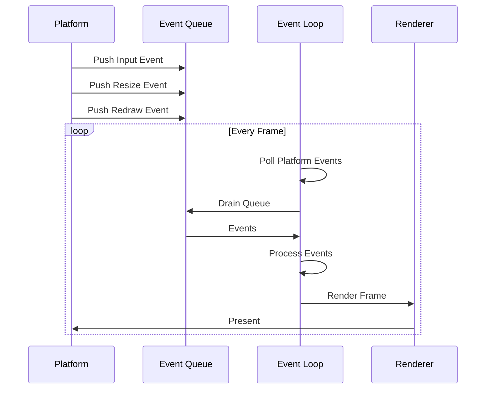

# AssortedWidgets


A cross-platform GUI framework for Rust with first-class support for custom graphics and WebGPU rendering.

## Features

- 🎨 **Multi-Tiered Rendering**: High-level themed UI primitives + low-level WebGPU access
- 📐 **Flexible Layout**: Industry-standard Flexbox/Grid via [Taffy](https://github.com/DioxusLabs/taffy)
- 🎮 **3D Application Support**: Direct WebGPU RenderPass access for custom graphics
- 🔄 **Event Queue Architecture**: Clean event handling without RefCell overhead
- 🎭 **GPU-Accelerated Themes**: Entire UI theme updates via single uniform buffer
- 📝 **Efficient Text Rendering**: Shared glyph atlas with multi-DPI support and batched instanced rendering
- 🖥️ **Cross-Platform**: macOS, Linux, Windows (macOS implemented)

## Quick Start

### Prerequisites

- Rust 1.70+
- macOS 10.15+ (other platforms coming soon)

### Installation

Add to your `Cargo.toml`:

```toml
[dependencies]
assorted_widgets = "0.1"
```

### Hello Triangle

```rust
use assorted_widgets::{GuiEventLoop, WindowOptions};

fn main() {
    let mut event_loop = pollster::block_on(async {
        GuiEventLoop::new_with_window(WindowOptions {
            title: "Hello Triangle".to_string(),
            ..Default::default()
        })
        .await
    })
    .expect("Failed to initialize");

    // Create render pipeline
    let pipeline = create_triangle_pipeline(&event_loop);

    // Set render function (called every frame)
    event_loop.set_render_fn(move |renderer, ctx| {
        let surface_texture = renderer.get_current_texture().unwrap();
        let view = surface_texture.texture.create_view(&Default::default());

        let mut encoder = ctx.device.create_command_encoder(&Default::default());
        {
            let mut render_pass = encoder.begin_render_pass(&wgpu::RenderPassDescriptor {
                color_attachments: &[Some(wgpu::RenderPassColorAttachment {
                    view: &view,
                    resolve_target: None,
                    ops: wgpu::Operations {
                        load: wgpu::LoadOp::Clear(wgpu::Color::BLACK),
                        store: wgpu::StoreOp::Store,
                    },
                })],
                ..Default::default()
            });

            render_pass.set_pipeline(&pipeline);
            render_pass.draw(0..3, 0..1);
        }

        ctx.queue.submit([encoder.finish()]);
        surface_texture.present();
    });

    // Run event loop (never returns)
    event_loop.run();
}
```

## Architecture Overview


## Key Concepts

### Multi-Tiered Rendering

AssortedWidgets supports both high-level themed UI and low-level custom graphics:

```rust
impl Element for MyWidget {
    fn paint(&self, ctx: &mut PaintContext, theme: &Theme) {
        // High-level: Themed background (batched)
        ctx.primitives.draw_rect(self.bounds, theme.panel_bg);

        // Low-level: Custom 3D rendering (immediate)
        ctx.render_pass.set_pipeline(&self.custom_pipeline);
        ctx.render_pass.draw(...);

        // High-level: Themed text overlay (batched)
        ctx.primitives.draw_text(pos, "Hello", theme.text_color);
    }
}
```

### Event Queue Architecture

Unlike callback-based systems, AssortedWidgets uses an event queue for clean separation:



### Layout System

Layout is handled by [Taffy](https://github.com/DioxusLabs/taffy), supporting Flexbox and CSS Grid:

```rust
// Parent determines child size (split view)
let parent_style = Style {
    display: Display::Flex,
    size: Size { width: 800px, height: 600px },
    ..Default::default()
};

let child_style = Style {
    flex_grow: 1.0,
    flex_basis: Dimension::Points(0.0),
    ..Default::default()
};

// Child determines parent size (auto-sizing text)
let text_style = Style {
    size: Size { width: Auto, height: Auto },
    ..Default::default()
};
// Measure function provides intrinsic text size
```

### Shared Resource Architecture

AssortedWidgets uses a smart resource sharing model to optimize memory and performance:

```rust
// Shared across all windows (Arc<Mutex<>>)
pub struct SharedRenderState {
    glyph_atlas: Arc<Mutex<GlyphAtlas>>,      // Single atlas for all windows
    font_system: Arc<Mutex<FontSystemWrapper>>, // Font loading
    text_engine: Arc<Mutex<TextEngine>>,       // Text shaping cache
}

// GlyphKey includes scale_factor for multi-DPI support
pub struct GlyphKey {
    font_id: usize,
    size_bits: u32,
    character: char,
    scale_factor: u8,  // 100 = 1.0x, 200 = 2.0x (Retina)
}

// Benefits:
// - Single atlas (~16MB) instead of per-window duplication (~80MB for 5 windows)
// - Window moves between displays? Both 1x and 2x glyphs cached simultaneously
// - Font system initialized once, shared across all windows
```

### Theme System

Themes are read-only configuration structs uploaded to GPU:

```rust
pub struct Theme {
    pub background: Color,
    pub foreground: Color,
    pub primary: Color,
    pub text: Color,
    pub font_size: f32,
    pub padding: f32,
    // ...
}

// Toggle theme = single uniform buffer update
// All shaders + UI elements update automatically
```

## Examples

See the `examples/` directory:

- `triangle.rs` - Basic WebGPU rendering
- `layout.rs` - Flexbox layout demonstration
- `themed_ui.rs` - Standard UI widgets with theming
- `3d_viewport.rs` - Custom 3D rendering in a widget
- `text_editor.rs` - Advanced text rendering

## Documentation

- [Architecture Guide](ARCHITECTURE.md) - Detailed design decisions
- [API Documentation](https://docs.rs/assorted_widgets) - Full API reference
- [Developer Guide](.claude/CLAUDE.md) - Implementation notes

## Platform Support

| Platform | Status | Notes |
|----------|--------|-------|
| macOS | ✅ Implemented | 10.15+, Metal backend |
| Linux | 🚧 Planned | Wayland + X11 |
| Windows | 🚧 Planned | Win32 API |
| Web | 🔮 Future | WASM + WebGPU |

## Comparison

### vs egui

- **egui**: Immediate mode, no layout engine, portable
- **AssortedWidgets**: Retained mode, Flexbox/Grid, WebGPU-first

### vs iced

- **iced**: High-level only, Elm architecture
- **AssortedWidgets**: Multi-tiered rendering, direct WebGPU access

### vs gpui (Zed)

- **gpui**: Callback-based, theme-focused, 2D only
- **AssortedWidgets**: Event queue, supports 3D/custom graphics

## Roadmap

- [x] Event queue architecture
- [x] WebGPU integration
- [x] Manual runloop (macOS)
- [x] Text rendering (cosmic-text with shared atlas)
- [x] Paint context implementation
- [ ] Taffy layout integration (partial - LayoutManager exists)
- [ ] Theme system
- [ ] Standard widgets (Button, Label, etc.)
- [ ] Linux support (Wayland)
- [ ] Windows support

### Recent Updates (Dec 2025)

**Phase 3.2 Complete - Text Rendering Refactor:**
- ✅ Shared resource architecture for glyph atlas, fonts, and text engine
- ✅ Multi-DPI support via `scale_factor` in GlyphKey
- ✅ Massive memory savings: Single 16MB atlas vs ~80MB for 5 windows
- ✅ Seamless DPI transitions: Window moves between Retina/non-Retina? Both cached!

## Contributing

Contributions welcome! See [CONTRIBUTING.md](CONTRIBUTING.md) for guidelines.

## License

MIT OR Apache-2.0

## Acknowledgments

- [Taffy](https://github.com/DioxusLabs/taffy) - Layout engine
- [wgpu](https://github.com/gfx-rs/wgpu) - WebGPU implementation
- [gpui](https://github.com/zed-industries/zed) - Architectural inspiration
