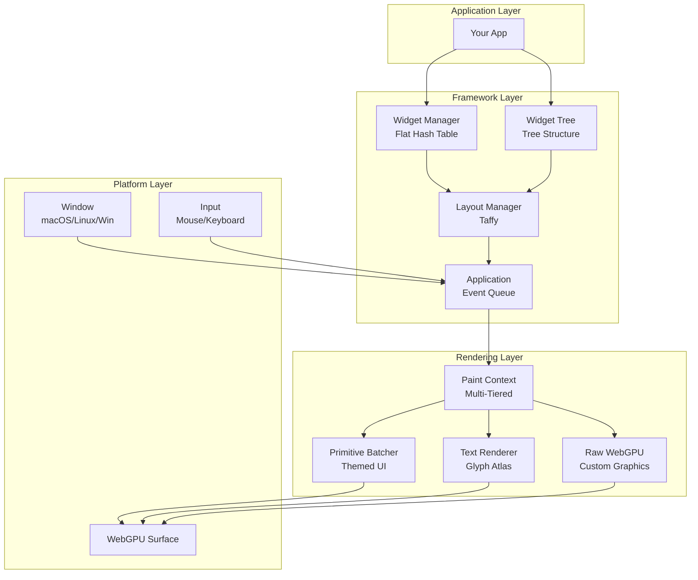

# AssortedWidgets


A cross-platform GUI framework for Rust with first-class support for custom graphics and WebGPU rendering.

## Features

- 🎨 **Multi-Tiered Rendering**: High-level themed UI primitives + low-level WebGPU access
- 📐 **Flexible Layout**: Industry-standard Flexbox/Grid via [Taffy](https://github.com/DioxusLabs/taffy)
- 🎮 **3D Application Support**: Direct WebGPU RenderPass access for custom graphics
- 🔄 **Event Queue Architecture**: Clean event handling without RefCell overhead
- 🎭 **GPU-Accelerated Themes**: Entire UI theme updates via single uniform buffer
- 📝 **Efficient Text Rendering**: Shared glyph atlas with multi-DPI support and batched instanced rendering
- 🖥️ **Cross-Platform**: macOS, Linux, Windows (macOS implemented)

## Quick Start

### Prerequisites

- Rust 1.70+
- macOS 10.15+ (other platforms coming soon)

### Installation

Add to your `Cargo.toml`:

```toml
[dependencies]
assorted_widgets = "0.1"
```

### Hello Widget

```rust
use assorted_widgets::{Application, Widget};
use assorted_widgets::paint::{Color, ShapeStyle};
use assorted_widgets::text::TextStyle;
use assorted_widgets::types::{Point, Rect, Size, WidgetId};

struct MyWidget {
    id: WidgetId,
    bounds: Rect,
}

impl Widget for MyWidget {
    // Use the macro to implement boilerplate methods
    assorted_widgets::impl_widget_essentials!();

    fn paint(&self, ctx: &mut assorted_widgets::paint::PaintContext) {
        // Draw a rectangle
        ctx.draw_styled_rect(
            self.bounds,
            ShapeStyle::solid(Color::rgb(0.2, 0.4, 0.8)),
        );

        // Draw some text
        let text_style = TextStyle::new()
            .size(16.0)
            .color(Color::WHITE);
        ctx.draw_text(
            "Hello, AssortedWidgets!",
            &text_style,
            Point::new(20.0, 20.0),
            None,
        );
    }
}

fn main() {
    // ✨ Clean ergonomic API - no pollster, no window ID juggling!
    Application::launch(|app| {
        app.spawn_window("Hello Widget", 800.0, 600.0, |window| {
            let widget = MyWidget {
                id: WidgetId::new(1),
                bounds: Rect::new(Point::ZERO, Size::new(800.0, 600.0)),
            };
            window.set_main_widget(widget);
        });
    });
}
```

## Architecture Overview



## Key Concepts

### Multi-Tiered Rendering

AssortedWidgets supports high-level themed UI primitives:

```rust
impl Widget for MyWidget {
    fn paint(&self, ctx: &mut PaintContext) {
        // Solid and styled rectangles
        ctx.draw_styled_rect(
            self.bounds,
            ShapeStyle::solid(Color::rgb(0.2, 0.2, 0.25))
                .with_corner_radius(8.0)
                .with_border(2.0, Color::rgb(0.4, 0.4, 0.5)),
        );

        // Text rendering
        ctx.draw_text(pos, "Hello", Color::WHITE, 16.0);

        // Vector paths
        ctx.draw_line(start, end, Stroke::new(Color::RED, 2.0));
        ctx.fill_path(path, Color::BLUE);
    }
}
```

### Widget System

AssortedWidgets uses a three-system architecture internally:

- **WidgetManager**: Flat HashMap for O(1) widget lookup
- **WidgetTree**: Parent-child hierarchy for event propagation and paint order
- **LayoutManager**: Taffy integration for Flexbox/Grid layout

All three systems are hidden behind a clean Window API:

```rust
// Qt-style implicit root container (recommended)
window.set_root_layout(taffy::Style {
    display: Display::Flex,
    flex_direction: FlexDirection::Column,
    gap: taffy::Size {
        width: taffy::LengthPercentage::length(10.0),
        height: taffy::LengthPercentage::length(10.0),
    },
    ..Default::default()
});

// Add widgets as children of the root container
let widget_id = window.add_to_root(widget, style)?;

// Or add as child of another widget
let child_id = window.add_child(widget, style, parent_id)?;

// Floating widgets (tooltips, modals) skip layout
let tooltip_id = window.add_floating(parent_id, tooltip_widget)?;
```

### Layout System

Layout is handled by [Taffy](https://github.com/DioxusLabs/taffy), supporting Flexbox and CSS Grid:

```rust
// Parent determines child size (split view)
let parent_style = Style {
    display: Display::Flex,
    size: Size { width: 800px, height: 600px },
    ..Default::default()
};

let child_style = Style {
    flex_grow: 1.0,
    flex_basis: Dimension::Points(0.0),
    ..Default::default()
};

// Child determines parent size (auto-sizing text)
let text_style = Style {
    size: Size { width: Auto, height: Auto },
    ..Default::default()
};
// Measure function provides intrinsic text size
```

### Shared Resource Architecture

AssortedWidgets uses a smart resource sharing model to optimize memory and performance:

```rust
// Shared across all windows (Arc<RenderContext>)
pub struct RenderContext {
    // GPU Resources
    device: Arc<wgpu::Device>,
    queue: Arc<wgpu::Queue>,

    // Shared Pipelines (Created Once, Reused by All Windows)
    rect_pipeline: RectPipeline,
    text_pipeline: TextPipeline,
    surface_format: wgpu::TextureFormat,

    // Shared Rendering Resources
    glyph_atlas: Arc<Mutex<GlyphAtlas>>,       // Single atlas for all windows
    font_system: Arc<Mutex<FontSystemWrapper>>, // Font loading
    text_engine: Arc<Mutex<TextEngine>>,        // Text shaping cache
}

// Per-window resources reference shared pipelines
pub struct WindowRenderer {
    surface: wgpu::Surface<'static>,
    rect_uniform_buffer: wgpu::Buffer,  // Screen size (per-window)
    text_uniform_buffer: wgpu::Buffer,   // Screen size (per-window)
    render_context: Arc<RenderContext>,  // Shared pipelines + atlas + fonts
    // ...
}

// GlyphKey includes scale_factor for multi-DPI support
pub struct GlyphKey {
    font_id: usize,
    size_bits: u32,
    character: char,
    scale_factor: u8,  // 100 = 1.0x, 200 = 2.0x (Retina)
}

// Benefits:
// - Pipelines created once, not duplicated per window (5 windows = 1× creation)
// - Single atlas (~16MB) instead of per-window duplication (~80MB for 5 windows)
// - Window moves between displays? Both 1x and 2x glyphs cached simultaneously
// - Font system initialized once, shared across all windows
```

### Theme System

Themes are read-only configuration structs uploaded to GPU:

```rust
pub struct Theme {
    pub background: Color,
    pub foreground: Color,
    pub primary: Color,
    pub text: Color,
    pub font_size: f32,
    pub padding: f32,
    // ...
}

// Toggle theme = single uniform buffer update
// All shaders + UI elements update automatically
```

## Examples

See the `examples/` directory:

- **`cube_3d_demo.rs`** - 3D rotating cube with low-level WebGPU RenderPass access ⭐ NEW!
- `phase4_paths_test.rs` - Vector graphics with lines, curves, and paths
- `icons_and_images.rs` - Icon and image rendering demo
- `icon_visual_demo.rs` - Visual icon demonstration
- `ime_demo.rs` - Input Method Editor and focus testing

Run an example:
```bash
cargo run --example cube_3d_demo
```

## Documentation

- [Architecture Guide](ARCHITECTURE.md) - Detailed design decisions
- [API Documentation](https://docs.rs/assorted_widgets) - Full API reference
- [Developer Guide](.claude/CLAUDE.md) - Implementation notes

## Platform Support

| Platform | Status | Notes |
|----------|--------|-------|
| macOS | ✅ Implemented | 10.15+, Metal backend |
| Linux | 🚧 Planned | Wayland + X11 |
| Windows | 🚧 Planned | Win32 API |
| Web | 🔮 Future | WASM + WebGPU |

## Comparison

### vs egui

- **egui**: Immediate mode, no layout engine, portable
- **AssortedWidgets**: Retained mode, Flexbox/Grid, WebGPU-first

### vs iced

- **iced**: High-level only, Elm architecture
- **AssortedWidgets**: Multi-tiered rendering, direct WebGPU access

### vs gpui (Zed)

- **gpui**: Callback-based, theme-focused, 2D only
- **AssortedWidgets**: Event queue, supports 3D/custom graphics

## Roadmap

- [x] Event queue architecture
- [x] WebGPU integration
- [x] Manual runloop (macOS)
- [x] Widget system (WidgetManager, WidgetTree, LayoutManager)
- [x] Text rendering (cosmic-text with shared atlas)
- [x] Paint context with batched primitives
- [x] Vector graphics (lines, paths, bezier curves)
- [x] SDF-based rounded rectangles with borders and shadows
- [x] Image and icon rendering
- [x] Low-level WebGPU RenderPass access (Tier 2 rendering)
- [ ] Theme system (GPU uniform buffers)
- [ ] Standard widgets (Button, Label, TextInput, etc.)
- [ ] Animation helpers (springs, easing)
- [ ] Linux support (Wayland)
- [ ] Windows support

### Recent Updates (Dec 2024)

**Tier 2 Rendering - Low-Level WebGPU Access:**
- ✅ Direct RenderPass access for custom 3D graphics
- ✅ Custom render callback system via `register_custom_render()`
- ✅ 3D cube demo with rotating geometry
- ✅ Integration of custom GPU pipelines with standard UI
- ✅ Demonstrates unique capability vs gpui/iced

**Phase 4 Complete - Vector Graphics:**
- ✅ Line rendering with configurable caps and joins
- ✅ Path API with bezier curves (quadratic and cubic)
- ✅ Fill and stroke operations
- ✅ Vector icon support

**Phase 3 Complete - Rendering Infrastructure:**
- ✅ Shared rendering pipelines across windows
- ✅ SDF-based rounded rectangles with analytical shadows
- ✅ Text rendering with shared glyph atlas
- ✅ Multi-DPI support with per-scale glyph caching
- ✅ Image and icon rendering with texture atlas

## Contributing

Contributions welcome! See [CONTRIBUTING.md](CONTRIBUTING.md) for guidelines.

## License

MIT OR Apache-2.0

## Acknowledgments

- [Taffy](https://github.com/DioxusLabs/taffy) - Layout engine
- [wgpu](https://github.com/gfx-rs/wgpu) - WebGPU implementation
- [gpui](https://github.com/zed-industries/zed) - Architectural inspiration
