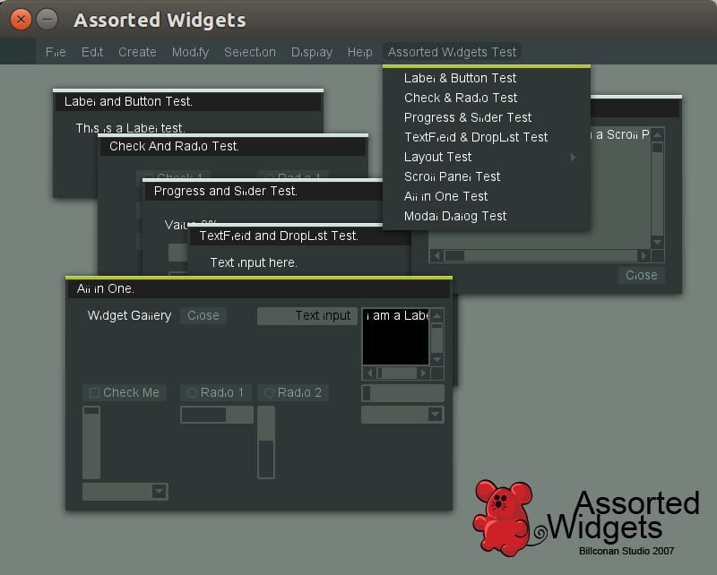

# AssortedWidgets
An OpenGL GUI library



Assorted Widgets is an OpenGL GUI Library I wrote in 2007 while I was still in college. At the time, I cared very much about the look of my 3D modeler Pillow. I spent quite sometime to investigate different GUI options. I have tried MFC, wxWidget, GDK, Qt and many others. What I wanted was a themeable UI system, but many of the options favor os native look and feel. Qt should be the best choice which supports customized look and feel, but it only had GPL license at the time. After knowing Blender3D implements its own UI with OpenGL, I started to do the same.

This repository is mirrored from [my old sourceforge project page](http://sourceforge.net/projects/assortedwidgets/).

For the past 8 years, I totally ignored this project, I can't even remember the email I used for sourceforge registration to recover my password. But I was happy to find out recently that people actually used this project and even ported it to [other languages](http://www.opentk.com/node/2103).

I wanted to give this project some updates if I have time. Here is my current plan:

1. ~~Upgrade to SDL2 from SDL1.2.~~ (DONE)
2. ~~Replace the [C++ delegate code](http://www.codeproject.com/cpp/FastDelegate.asp) with C++11 functional features.~~ (DONE)
3. Or even implement a signal-slot system similar to that of Qt.
4. Modernize the old OpenGL code with OpenGL ES 2.
5. Build it with EMScripten to make it web.
6. Give it a flexible platform plugin system, so that not only SDL is supported, but it can be easily embedded into other OpenGL environments.

How to build:

On Mac:

1. install SDL2 and SDL2Image:
```
brew install sdl2
brew install sdl2_image
```

2. open AssortedWidgets.pro with QtCreator and build

On Linux:
