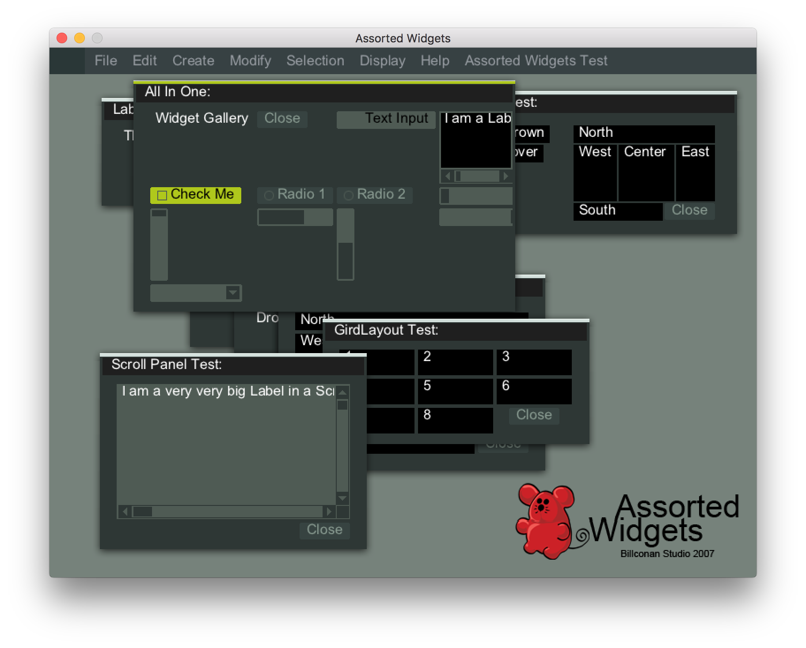

# AssortedWidgets
An OpenGL GUI library



Assorted Widgets is an OpenGL GUI Library I wrote in 2007 while I was still in college. At the time, I cared very much about the look of my [3D modeler Pillow](https://github.com/shi-yan/Pillow). I spent quite sometime to investigate different GUI options. I have tried MFC, wxWidget, GDK, Qt and many others. What I wanted was a themeable UI system, but many of the options favor os native look and feel. Qt should be the best choice which supports customized look and feel, but it only had GPL license at the time. After knowing Blender3D implements its own UI with OpenGL, I started to do the same.

This repository is mirrored from [my old sourceforge project page](http://sourceforge.net/projects/assortedwidgets/).

For the past several years, I totally ignored this project, I can't even remember the email I used for sourceforge registration to recover my password. But I was happy to find out recently that people actually used this project and even ported it to [other languages](http://www.opentk.com/node/2103).

Demo:

I built it into webassembly. You can try it here:

[WebAssembly demo](http://shi-yan.github.io/AssortedWidgets/)

How to build:

On Mac:

1. install SDL2 and SDL2Image:
```
brew install sdl2
brew install sdl2_image
```

2. Under AssortedWidgets folder, run 

```
mkdir build
cd build
cmake ..
make

```

3. Once done, run

```
./AssortedWidgets
```

On Linux:

1. install SDL2 and SDL2Image:

```
sudo apt-get install libsdl2-dev libsdl2-image-dev
```

2. Under AssortedWidgets folder, run 

```
mkdir build
cd build
cmake ..
make

```

3. Once done, run

```
./AssortedWidgets
```

WebAssembly:

1. Install [WebAssembly](http://webassembly.org/)

2. Under the emsdk folder, run

```
source ./emsdk_env.sh
```

3. Under AssortedWidgets folder, run 

```
mkdir build
cd build
# Path to the Emscripton cmake file
# You can find it with your Emscription configured directory
# In my case `/home/sajith/wasm/emsdk/upstream/emscripten/cmake/Modules/Platform/Emscripten.cmake`
cmake .. -DCMAKE_TOOLCHAIN_FILE=~/AssortedWidgets/cmake/Modules/Emscripten.cmake # Change here accodinly your emsdk installation path
make

```

4. Once finished, run the following. You should be able to see AssortedWidgets in browser at http://localhost:8080

```
emrun --no_browser --port 8080 .
```
