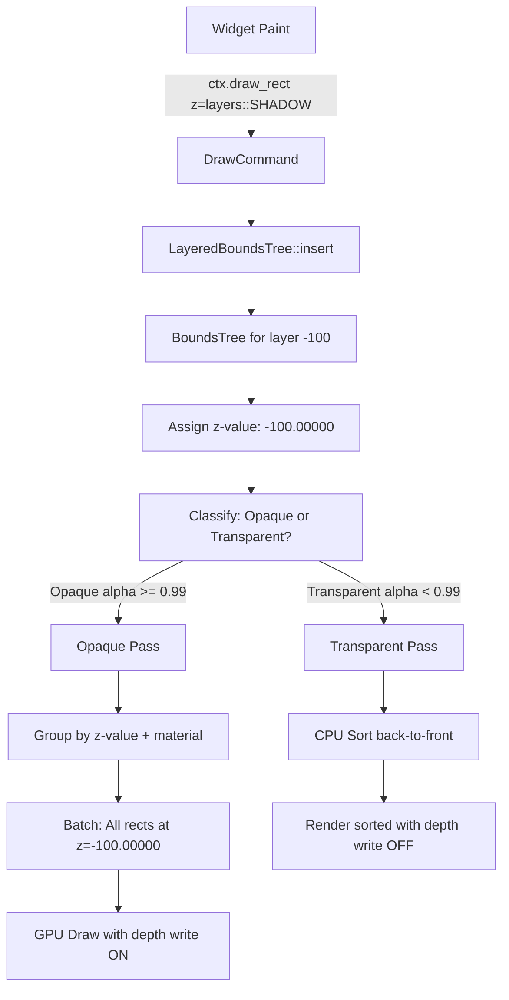

# Z-Order Architecture for AssortedWidgets

> **Status:** Design Phase - Unified Architecture
> **Approach:** Layered BoundsTree + Two-Pass Rendering + Depth Buffer
> **Last Updated:** 2025-12-24

## Table of Contents

1. [Overview](#overview)
2. [Final Architecture](#final-architecture)
3. [Implementation Phases](#implementation-phases)
4. [Design Rationale](#design-rationale)
5. [Performance Analysis](#performance-analysis)

---

## Overview

Z-order (depth ordering) in AssortedWidgets ensures UI elements render and interact in the correct visual layering order. After extensive analysis and expert consultation, we've designed a **hybrid architecture** that combines:

1. **Explicit layer control** (predictable, user-specified)
2. **Automatic batching optimization** (BoundsTree within layers)
3. **GPU depth testing** (hardware-accelerated for opaque elements)
4. **Correct transparency** (two-pass rendering)

### Design Goals

1. **Predictable Layering**: Shadows always behind, tooltips always on top
2. **Automatic Batching**: Non-overlapping elements batch together (minimal draw calls)
3. **Correct Transparency**: Proper alpha blending for semi-transparent UI
4. **3D Integration Ready**: Depth buffer supports embedded 3D content
5. **High Performance**: GPU handles 95% of UI, CPU sorts only 5% (transparent elements)

---

## Final Architecture

### Three-Layer System

```rust
// Layer 1: User API (Explicit Layers)
// =====================================
// Developers specify semantic layers for predictable z-ordering

ctx.draw_rect(bounds, style, layers::SHADOW);   // Layer -100
ctx.draw_rect(bounds, style, layers::NORMAL);   // Layer 0
ctx.draw_rect(bounds, style, layers::OVERLAY);  // Layer 1000

pub mod layers {
    pub const BACKGROUND: i32 = -1000;
    pub const SHADOW: i32 = -100;
    pub const NORMAL: i32 = 0;
    pub const FOREGROUND: i32 = 100;
    pub const OVERLAY: i32 = 1000;
    pub const MODAL: i32 = 10000;
}
```

```rust
// Layer 2: BoundsTree (Automatic Z-Value Assignment)
// ===================================================
// Internal optimization: assigns minimal z-values WITHIN each layer

struct LayeredBoundsTree {
    layers: HashMap<i32, BoundsTree>,  // One BoundsTree per layer
}

impl LayeredBoundsTree {
    fn insert(&mut self, bounds: Rect, layer: i32) -> f32 {
        let tree = self.layers.entry(layer).or_default();
        let offset = tree.insert(bounds);  // Returns 0, 0, 1, 0, 2, etc.

        // Map to final z-value: layer + fine-grained offset
        // Layer -100, offset 0 → z = -100.00000
        // Layer -100, offset 0 → z = -100.00000 (non-overlapping, reused!)
        // Layer -100, offset 1 → z = -100.00001
        layer as f32 + (offset as f32 / 100000.0)
    }
}

// Example batching within layers:
//   Shadow A (50, 50)   → z = -100.00000
//   Shadow B (200, 50)  → z = -100.00000 (no overlap, reused!)
//   Shadow C (60, 60)   → z = -100.00001 (overlaps A)
//
//   Result: Batch [A, B] at z=-100.00000 → Single draw call!
```

```rust
// Layer 3: Two-Pass Rendering (Opaque + Transparent)
// ===================================================
// Separate opaque (depth-tested) from transparent (sorted)

// Pass 1: Opaque Elements (95% of UI)
depth_write: true,
depth_test: Less,
// GPU handles z-ordering automatically via depth buffer
// Render in ANY order (batch by material for performance)

// Pass 2: Transparent Elements (5% of UI)
depth_write: false,  // Don't block what's behind
depth_test: Less,    // Still respect opaque depth
// CPU sort back-to-front (required for correct alpha blending)
```

### Complete Data Flow



### Shader Integration

```wgsl
// Vertex shader: Map z-value to depth
@vertex
fn vs_main(instance: RectInstance) -> VertexOutput {
    var out: VertexOutput;

    // Map z-value to [0.0, 1.0] depth range
    // Higher z-value = lower depth = closer to camera
    let depth = z_value_to_depth(instance.z_value);

    out.clip_position = vec4(world_pos.xy, depth, 1.0);
    out.color = instance.color;
    return out;
}

fn z_value_to_depth(z: f32) -> f32 {
    const MIN_Z: f32 = -10000.0;
    const MAX_Z: f32 = 10000.0;
    1.0 - ((z - MIN_Z) / (MAX_Z - MIN_Z))
}

// Opaque pass fragment shader
@fragment
fn fs_opaque(in: VertexOutput) -> @location(0) vec4<f32> {
    var color = compute_shape_color(in);

    // Alpha testing: discard edge pixels
    // (Rendered in transparent pass instead)
    if color.a < 0.99 {
        discard;
    }

    return color;
}

// Transparent pass fragment shader
@fragment
fn fs_transparent(in: VertexOutput) -> @location(0) vec4<f32> {
    // Render all pixels, including semi-transparent
    return compute_shape_color(in);
}
```

---

## Implementation Phases

### Phase 1: Explicit Layers + CPU Sorting (Foundation)

**Status:** 🎯 Start Here

**Goal:** Get basic layered z-ordering working without complexity.

**Implementation:**
```rust
// Simple approach: User specifies layer, CPU sorts everything
impl PrimitiveBatcher {
    pub fn flush(&mut self, render_pass: &mut RenderPass) {
        // 1. Sort by layer (user-specified z-index)
        self.commands.sort_by_key(|cmd| cmd.z_index());

        // 2. Group by type for batching
        for batch in self.group_by_type() {
            render_batch(batch);
        }
    }
}
```

**Files to Create:**
- `src/paint/types.rs` - Add `z_index: i32` to `DrawCommand`
- `src/paint/layers.rs` - Define layer constants
- Update shaders - No depth buffer yet (2D only)

**Success Criteria:**
- ✅ Shadows render behind buttons (z=-100 < z=0)
- ✅ Tooltips render on top (z=1000 > z=0)
- ✅ Explicit layer control works
- ✅ Basic batching by type

**Limitations:**
- ❌ All CPU sorting (not optimal)
- ❌ No automatic batching optimization
- ❌ No 3D integration support

---

### Phase 2: Add Depth Buffer + Two-Pass Rendering

**Status:** 📅 After Phase 1

**Goal:** Use GPU depth buffer for opaque elements, CPU sort only transparent.

**Implementation:**
```rust
impl PrimitiveBatcher {
    pub fn flush(&mut self, render_pass: &mut RenderPass) {
        // 1. Classify primitives
        let (opaque, transparent) = self.classify_by_alpha();

        // 2. Pass 1: Render opaque (depth write ON)
        render_pass.set_pipeline(&self.opaque_pipeline);
        for batch in self.group_by_material(&opaque) {
            render_batch(batch);  // GPU handles z-order
        }

        // 3. Pass 2: Render transparent (depth write OFF)
        render_pass.set_pipeline(&self.transparent_pipeline);
        transparent.sort_by_key(|cmd| OrderedFloat(cmd.z_value()));
        for batch in self.group_by_type(&transparent) {
            render_batch(batch);
        }
    }
}
```

**Files to Modify:**
- `src/render/context.rs` - Create depth texture (Depth24Plus)
- `shaders/rect.wgsl` - Add depth output to vertex shader
- `src/paint/batcher.rs` - Implement two-pass rendering
- Create separate pipelines for opaque/transparent

**Success Criteria:**
- ✅ Opaque elements render without CPU sorting
- ✅ Transparent elements (shadows, AA edges) blend correctly
- ✅ 10× faster for typical UI (95% opaque)
- ✅ Can embed 3D content with depth buffer

**Limitations:**
- ❌ Still sorting by layer, not optimal batching

---

### Phase 3: Add LayeredBoundsTree (Batching Optimization)

**Status:** 📅 After Phase 2 (Optional - only if profiling shows need)

**Goal:** Reuse z-values for non-overlapping elements → better batching.

**Implementation:**
```rust
struct LayeredBoundsTree {
    layers: HashMap<i32, BoundsTree>,
}

impl PrimitiveBatcher {
    pub fn flush(&mut self, render_pass: &mut RenderPass, bounds_tree: &mut LayeredBoundsTree) {
        // 1. Assign fine-grained z-values using BoundsTree
        for cmd in &mut self.commands {
            let layer = cmd.z_index();  // User layer: -100, 0, 1000, etc.
            let z_value = bounds_tree.insert(cmd.bounds(), layer);
            cmd.set_z_value(z_value);  // Fine-grained: -100.00000, -100.00001, etc.
        }

        // 2. Classify and render (same as Phase 2)
        let (opaque, transparent) = self.classify_by_alpha();

        // 3. Opaque pass: batch by z-value + material
        for batch in self.group_by_z_and_material(&opaque) {
            render_batch(batch);  // Many elements share same z-value!
        }

        // 4. Transparent pass: sort and batch
        transparent.sort_by_key(|cmd| OrderedFloat(cmd.z_value()));
        for batch in self.group_by_z_and_type(&transparent) {
            render_batch(batch);
        }
    }
}
```

**Files to Create:**
- `src/paint/bounds_tree.rs` - Port GPUI's BoundsTree (350 lines)
- `src/paint/layered_bounds_tree.rs` - Wrapper for per-layer trees

**Success Criteria:**
- ✅ Non-overlapping shadows batch together (10 shadows → 1 draw call)
- ✅ Non-overlapping buttons batch together
- ✅ 2-5× fewer draw calls for complex UIs
- ✅ Z-value reuse within layers

**When to Implement:**
- Profile shows > 50 draw calls per frame
- UI has > 1000 elements
- Batching is critical for target performance

---

## Design Rationale

### Why Explicit Layers?

**Chosen:** User specifies layer (SHADOW, NORMAL, OVERLAY)

**Alternatives Rejected:**
1. **Fully automatic (paint order = z-order)**: Fragile, paint order changes break layering
2. **Fully manual (fine-grained z-values)**: Error-prone, hard to maintain

**Benefits:**
- ✅ Predictable: Shadows always at z=-100, tooltips always at z=1000
- ✅ Refactor-safe: Changing paint order doesn't break layering
- ✅ Simple mental model: Matches CSS z-index, Unity layers

### Why BoundsTree Within Layers?

**Chosen:** BoundsTree assigns z-values WITHIN each layer

**Benefits:**
- ✅ Best of both worlds: Explicit layer control + automatic batching
- ✅ Non-overlapping elements batch together
- ✅ Transparent to user API (internal optimization)

**Example:**
```
User code (explicit layers):
  ctx.draw_rect(rect_a, style, layers::SHADOW);  // (50, 50)
  ctx.draw_rect(rect_b, style, layers::SHADOW);  // (200, 50)
  ctx.draw_rect(rect_c, style, layers::SHADOW);  // (60, 60)

Internal (BoundsTree assigns z-values):
  Rect A → z = -100.00000
  Rect B → z = -100.00000 (reused! no overlap)
  Rect C → z = -100.00001 (overlaps A)

GPU batching:
  Batch 1: [A, B] at z=-100.00000 → Single draw call
  Batch 2: [C] at z=-100.00001 → Separate draw call
```

### Why Two-Pass Rendering?

**Problem:** Depth buffer + transparency = conflict

**Solution:** Separate opaque (depth write ON) from transparent (depth write OFF)

**Benefits:**
- ✅ 95% of UI is opaque (solid backgrounds, text, buttons)
- ✅ Opaque pass: No CPU sorting, GPU handles via depth buffer
- ✅ Transparent pass: Only sort ~5% of primitives
- ✅ Correct alpha blending for shadows, AA edges, glass effects

---

## Performance Analysis

### Typical UI Breakdown

```
UI with 1000 primitives:
  - 950 opaque (solid colors, no shadows, alpha = 1.0)
  - 50 transparent (shadows, AA edges, glass effects)
```

### Performance Comparison

| Approach | Opaque (950) | Transparent (50) | Total |
|----------|--------------|------------------|-------|
| **Phase 1: CPU Sort All** | Sort 950 = 0.19ms | Sort 50 (included) | **0.19ms** |
| **Phase 2: Depth Buffer** | GPU (0ms) | Sort 50 = 0.01ms | **0.01ms (19× faster)** |
| **Phase 3: + BoundsTree** | GPU (0ms) | Sort 50 = 0.01ms | **0.01ms + batching** |

### Draw Call Reduction (Phase 3 with BoundsTree)

```
Without BoundsTree:
  10 shadows at different z-values → 10 draw calls
  50 buttons at different z-values → 50 draw calls
  Total: 60 draw calls

With BoundsTree (z-value reuse):
  10 non-overlapping shadows → 1 draw call (same z-value!)
  50 non-overlapping buttons → 1 draw call
  Total: ~5-10 draw calls (5-10× reduction)
```

---

## Implementation Checklist

### Phase 1 Tasks

- [ ] Add `z_index: i32` to all `DrawCommand` variants
- [ ] Create `src/paint/layers.rs` with layer constants
- [ ] Implement `PrimitiveBatcher::flush()` with layer sorting
- [ ] Update all `draw_*()` methods to accept z-index
- [ ] Test: Shadows render behind buttons
- [ ] Test: Tooltips render on top

### Phase 2 Tasks

- [ ] Create depth texture (Depth24Plus) in `RenderContext`
- [ ] Add depth output to vertex shaders
- [ ] Create opaque pipeline (depth write ON)
- [ ] Create transparent pipeline (depth write OFF)
- [ ] Implement `classify_by_alpha()` in batcher
- [ ] Implement two-pass rendering in `flush()`
- [ ] Add alpha testing to opaque fragment shader
- [ ] Test: 3D viewport integration

### Phase 3 Tasks (Optional)

- [ ] Port GPUI's `BoundsTree` (~350 lines)
- [ ] Create `LayeredBoundsTree` wrapper
- [ ] Integrate z-value assignment in `flush()`
- [ ] Update batching to group by z-value + material
- [ ] Profile: Measure draw call reduction
- [ ] Test: Non-overlapping elements batch together

---

## References

### Industry Standards

- **Two-Pass Rendering**: Unity, Unreal, Godot (standard for transparent objects)
- **Depth Buffer**: WebGPU Depth24Plus (24-bit precision, hardware z-test)
- **R-Tree Spatial Index**: GPUI's BoundsTree ([source](https://github.com/zed-industries/zed/blob/main/crates/gpui/src/bounds_tree.rs))

### Related Documents

- `2D_API.md` - User-facing paint API design
- `CLAUDE.md` - Overall architecture
- Phase 2 commits: b39ac1e, 97ae5e7 (CPU sorting implementation)

---

**Next Steps:**
1. 🎯 **Implement Phase 1** (Explicit layers + CPU sorting)
2. 📅 **Then Phase 2** (Depth buffer + two-pass rendering)
3. 📅 **Maybe Phase 3** (BoundsTree optimization - only if profiling shows need)
